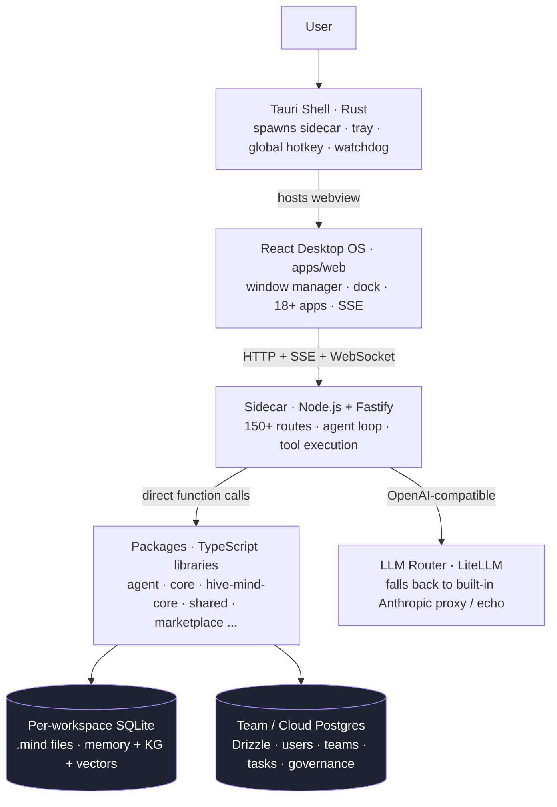
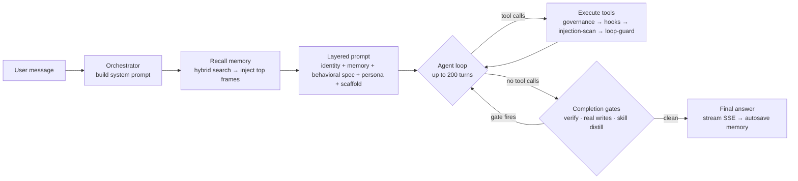

# 00 · Mental Model — Waggle OS for the Frontend Rebuild

**Audience.** You are about to rebuild the Waggle OS frontend in Lovable. Before you touch a
single screen, read this. It is the *concept map* — what the system is, how its layers fit
together, and which two or three ideas everything else hangs off. The detailed wire contracts
(exact types, routes, capability flags) live in the sibling sections under
`docs/backend-map/sections/`; this document is the picture you keep in your head while you read
those. Every claim here is grounded in `CLAUDE.md`, `docs/ARCHITECTURE.md`,
`docs/WAGGLE-SYSTEM-MAP.md`, and the written subsystem sections.

---

## 1. What Waggle OS is (one paragraph)

Waggle OS is a **workspace-native AI agent operating system with persistent memory**. It looks and
behaves like a small desktop OS — a window manager, a dock, and ~18 first-party "apps" (Chat,
Memory, Files, Marketplace, Mission Control, and more) — but every app is a surface onto a stack of
AI agents that *remember*. It ships three ways from one codebase: a **Tauri 2.0 desktop binary**
(Rust shell, ~120 MB) for Windows and macOS, the same React app as a **web bundle**, and a
**Node.js Fastify sidecar** that does all the real work (agent loop, tool execution, memory,
LLM routing). The product thesis is that memory is the moat: the longer you use Waggle, the more it
knows you, and that accumulated memory is what makes the agents progressively more useful — and
expensive to leave behind. Strategically, Waggle is the demand-creation funnel for **KVARK**,
Egzakta Group's sovereign enterprise AI platform.

---

## 2. The layered mental model

Everything a user does flows through the same six layers, top to bottom. There are no hidden
services and no external dependency for core functionality — the whole stack runs locally.

Read it as a request lifecycle:

1. **Shell (Tauri / Rust).** Owns the OS-level concerns only: spawns and supervises the sidecar
   (watchdog restarts it on crash, max 5/10 min), the tray icon, the global toggle hotkey, and the
   webview that loads the web app. The shell holds no business logic — for a Lovable rebuild it is
   effectively invisible; you target the same web app it hosts.
2. **UI (React desktop OS — `apps/web/`).** The window manager, dock, and apps. **This is what you
   are rebuilding.** It is a thin client: it renders state, streams responses, and POSTs user
   intent. It never talks to a database or an LLM directly — it talks only to the sidecar over
   HTTP, Server-Sent Events (streaming chat/events/notifications), and WebSocket (team presence).
3. **Sidecar (Node.js + Fastify, port 3333).** The brain stem. 150+ routes. It resolves the
   workspace session, builds the system prompt, runs the agent loop, executes tools, and streams
   results back as SSE. Every UI action terminates here.
4. **Packages (TypeScript libraries).** The sidecar is thin glue over a monorepo of ~27 workspace
   packages. The ones you will feel through the API: `@waggle/agent` (the loop, personas, tools,
   gates), `@waggle/hive-mind-core` (the memory substrate — mind + harvest), `@waggle/core`
   (config, vault, telemetry, compliance), `@waggle/shared` (the wire types + tier model),
   `@waggle/marketplace`, `@waggle/waggle-dance`.
5. **Dual data stores.** Two databases that never share a foreign key — see §3.
6. **LLM router (LiteLLM).** The agent loop POSTs to an OpenAI-compatible `/chat/completions`
   endpoint. In practice that is LiteLLM (`litellm-config.yaml`), which routes/normalizes model
   names; it falls back to a built-in Anthropic proxy, and to a deterministic echo provider when no
   keys are present. The frontend never sees this — it only ever sees SSE tokens.

The single rule to internalize: **the frontend is a presentation + streaming client. All
intelligence, persistence, and secret handling lives in the sidecar and below.** If you find
yourself wanting to put logic in the UI, it almost certainly already exists behind a route.

---

## 3. Dual persistence — and why both exist

Waggle has **two** stores, deliberately. Confusing them is the most common architectural mistake.

| | Per-workspace **SQLite "mind"** | Team / Cloud **Postgres** |
|---|---|---|
| Engine | SQLite (`better-sqlite3` + `sqlite-vec`) | PostgreSQL via Drizzle ORM |
| Scope | **One workspace's private memory** | Teams, users, agents, tasks, jobs, governance |
| Holds | Memory frames, knowledge graph, embeddings, identity, awareness | Multi-user, multi-tenant relational data |
| Location | A local file per workspace (`mind_path`) | Cloud / server (`DATABASE_URL`) |
| Defined in | `packages/hive-mind-core/src/mind/` | `packages/server/src/db/schema.ts` (20 tables) |

**Why two?** They answer two different questions.

- The **mind** answers *"what does this agent know and remember here?"* It is the moat. It is
  local-first, private, per-workspace, and runs synchronously with zero network. Memory is written
  as **frames** (I-frame = foundational identity, P-frame = incremental update, B-frame = bridge),
  searched by a **hybrid** pipeline (FTS5 keyword + sqlite-vec vector, fused by reciprocal-rank),
  and grown into a knowledge graph by the Cognify pipeline. Each workspace is its own `.mind` file,
  so workspace isolation is a filesystem fact, not a query filter.
- **Postgres** answers *"who are the people, teams, and tasks, and what are they allowed to do?"*
  It is the shared, governed, collaborative substrate — only meaningful in TEAMS/cloud mode. It
  carries no memory frames.

The **only bridge** between them is one nullable column: `users.mind_path`, a text pointer from a
cloud user row to where that user's local SQLite mind lives. There are **no cross-database foreign
keys** and no cascades — the two layers are joined only in application code. For the frontend, this
means: memory-related screens read from mind-backed routes; team/admin/governance screens read from
Postgres-backed routes; never assume one knows about the other.

---

## 4. The moat (and therefore the upgrade trigger)

This is the business model encoded into the architecture — and it dictates what the UI should and
should not nag the user about.

- **Memory + Harvest are free forever.** Harvest ingests the user's existing AI history (ChatGPT,
  Claude, Claude Code, Gemini, Perplexity, and more) and memory accumulates from every
  conversation. This is the lock-in moat: the longer they stay, the more Waggle knows them, the
  costlier it is to leave. It is never paywalled.
- **Agents are free.** Spawning agents is enabled on *every* tier (`spawnAgents: true` everywhere).
  Agents are free precisely *because they generate memory* — they feed the moat. Gating them would
  be self-defeating.
- **Skills + Connectors + Team features are the upgrade trigger.** FREE blocks custom skills, caps
  connectors at 5 and workspaces at 5, and limits export formats. PRO ($19/mo) unlocks unlimited
  connectors/workspaces, custom skills, and full export — but stays solo. TEAMS unlocks shared
  workspaces, the team skill library, governance, and cloud sync.

**Frontend consequence:** put friction on *skills, connectors, and team collaboration*, never on
*memory or agents*. Upgrade CTAs belong on locked skill/connector/team surfaces. (And there is a
distinct, more aggressive CTA reserved for the KVARK enterprise path — see §6.)

---

## 5. The agent runtime (what `POST /api/chat` actually does)

When the user sends a message, the sidecar turns it into one agent turn. Conceptually it is a
**persona-driven, memory-aware, tool-calling loop with completion gates.**

The pieces a frontend should understand:

- **Persona-driven.** Every turn runs under one of the built-in personas (22 in data;
  general-purpose / planner / verifier / coordinator among them). The persona supplies the system
  prompt slant, model preference, and — critically — its **tool allowlist/denylist**. Read-only
  personas (e.g. verifier, planner) cannot be handed write tools. This is why the UI lets the user
  switch personas: it changes the agent's whole posture and capability set.
- **Gated tools.** Tools are never executed blindly. Each call passes an ordered middleware chain:
  governance (`blockedTools`), pre/post hooks, **injection scanning** of external/connector input,
  and loop-guard (duplicate/oscillation detection). Sensitive tools hit an **approval gate** —
  which surfaces in the UI as an approval card the user must accept. (YOLO/auto-approve is opt-in,
  off by default.)
- **Memory recall + autosave.** Before the loop, the orchestrator recalls relevant frames and
  injects them. After it, important facts/decisions/preferences are auto-saved back to the mind.
  The conversation also persists to a `.jsonl` session file. This recall→answer→save cycle is the
  loop that keeps the moat filling.
- **Self-evolution.** Turns are traced; recurring capability gaps, corrections, and workflow
  patterns are tallied as improvement signals and surfaced to the user as suggestions (max a few at
  a time). The system improves its own prompts/personas over time — a closed loop, not tier-gated.
- **Streaming contract.** The UI never blocks on a full response. It consumes SSE events —
  `token`, `step`, `tool_start`/`tool_end`, `done` — and renders them incrementally. Tool cards,
  approval gates, and the typing stream are all driven off this one stream.

---

## 6. The 5-tier model and the KVARK funnel

Tiers are defined canonically in `packages/shared/src/tiers.ts` and consumed by both sidecar and
UI. There are exactly five.

| Tier | Price | What it is |
|---|---|---|
| **TRIAL** | $0 / 15 days | All features unlocked; **falls back to FREE after 15 days** |
| **FREE** | $0 forever | 5 workspaces, agents, built-in skills only |
| **PRO** | $19/mo | Solo power tier: unlimited workspaces/connectors, custom skills, full export |
| **TEAMS** | $49/mo per seat | Shared workspaces, WaggleDance, governance, cloud sync, KVARK CTA active |
| **ENTERPRISE** | Consultative | **KVARK** sovereign on-prem (www.kvark.ai) — contract-billed |

Two rules the frontend must obey:

1. **Always resolve the effective tier first.** A stored `TRIAL` whose 15 days have elapsed must
   be treated as `FREE`. Run the user's tier through `getEffectiveTier(tier, trialStartedAt)`
   *before* reading any capability flag, or you will render features an expired trial cannot use.
   In `TierCapabilities`, **`-1` means "unlimited"**, not zero.
2. **KVARK is the top of the funnel, not a sixth tier.** ENTERPRISE *is* KVARK: "everything Waggle
   does, on your own infrastructure, inside your perimeter." Waggle's whole job strategically is to
   create qualified demand for KVARK. The tier model exposes this as `kvarkCta` (`none`/`subtle`/
   `active`) — the CTA escalates as the user climbs toward TEAMS. KVARK URLs are hardcoded in
   exactly two places (`kvark-tools.ts` and the `KvarkNudge` component); the `kvark_search` /
   `kvark_ask_document` tools are gated to TEAMS/ENTERPRISE. The frontend surfaces the CTA per the
   tier's `kvarkCta` value — it does not invent its own enterprise pitch.

---

## TL;DR for the rebuild

- The frontend is a **streaming presentation client** over a local Fastify sidecar — no DB, no LLM,
  no secrets in the UI.
- Two stores: **per-workspace SQLite mind** (memory, private, local-first) and **cloud Postgres**
  (teams/governance). Bridged only by `users.mind_path`.
- **Memory + agents are free** (they fill the moat); **skills, connectors, and team features** are
  what you gate and up-sell.
- Chat is a **persona-driven, gated, memory-aware loop** whose output you render as an **SSE
  stream** (tokens, tool cards, approval gates).
- Five tiers; **always `getEffectiveTier` first**; **KVARK is the enterprise funnel**, surfaced via
  the tier's `kvarkCta` flag.

For exact shapes and routes, continue to `docs/backend-map/sections/` (02* = data model & tiers,
03* = API surface, 05* = subsystems).
