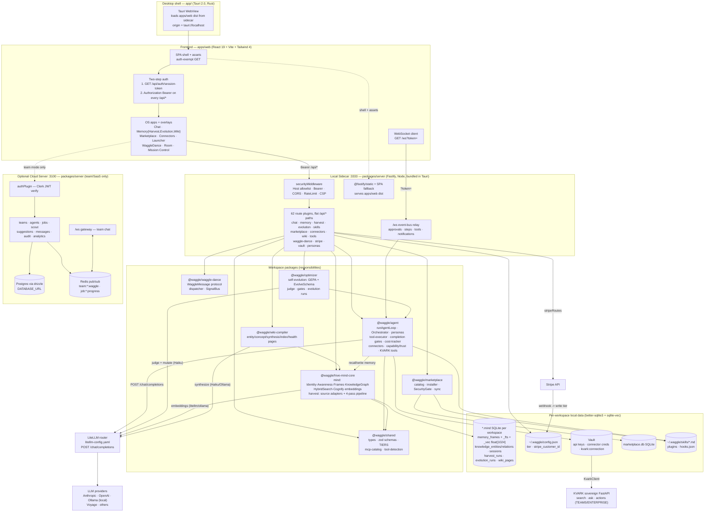
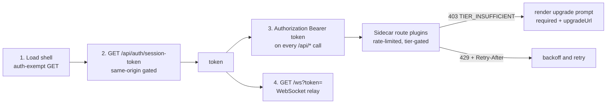
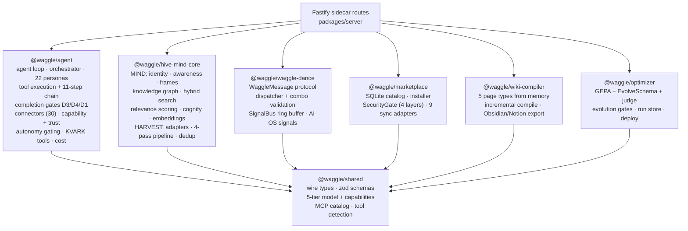

# System Architecture (Layers)

This diagram is the cross-cutting runtime map for a Lovable rebuild of the Waggle OS frontend. It traces one request from the Tauri Rust shell, through the `apps/web` React SPA, into the Fastify **Local Sidecar** (port 3333) that serves the SPA and exposes all `/api/*` routes, down through the workspace packages that own each responsibility, into the data stores (per-workspace SQLite `*.mind` files via better-sqlite3 + sqlite-vec, plus team/cloud Postgres + Redis via the separate Cloud Server on port 3100), and out to the LiteLLM router and the LLM providers. Every node and ownership label is grounded in the section files. Key facts to anchor on: the frontend origin **is** the sidecar (same-origin, two-step Bearer-token auth), the sidecar uses local SQLite while the optional Cloud Server uses Postgres + Clerk + Redis, and the memory substrate (`mind` + `harvest`) lives in `@waggle/hive-mind-core`, not `@waggle/core`.

## Full Runtime Stack

## Request / Auth Path (Local Sidecar)

This is the bootstrap handshake the rebuilt frontend must reproduce. The API root is the page's own origin; there is no separate host to configure.

## Package Ownership Map

Which package owns which responsibility, distilled from the subsystem sections.

