# Master Data Model (two ER diagrams)

Waggle OS keeps data in two physically separate stores. The **per-workspace memory layer** is a single SQLite file (`*.mind`) per workspace — 14 base tables plus 2 virtual search tables — holding one user's private frames, knowledge graph, identity, awareness, and audit. The **team/cloud relational layer** is a shared PostgreSQL database (20 tables, Drizzle ORM) holding users, teams, agents, tasks, jobs, and governance. The two stores share **no cross-database foreign keys**; the only bridge is the `users.mind_path` text column in Postgres, which points at where a given user's local SQLite `*.mind` file lives. The note after the diagrams explains how one workspace mind relates to a user/team row.

---

## Diagram 1 — Per-workspace memory layer (SQLite, one `*.mind` file)

One isolated SQLite file per workspace. Schema version `'1'`. 14 base tables plus `memory_frames_fts` (FTS5 keyword index) and `memory_frames_vec` (vec0, 1024-dim embeddings), both keyed by `rowid = memory_frames.id`. Foreign keys exist only inside this file (frames to sessions, frames self-ref, relations to entities). `ai_interactions` is append-only (DB triggers reject UPDATE/DELETE). The knowledge graph is bitemporal: active rows have `valid_to IS NULL`.

```mermaid
erDiagram
    sessions ||--o{ memory_frames : "gop_id FK"
    memory_frames ||--o{ memory_frames : "base_frame_id self-FK"
    memory_frames ||--|| memory_frames_fts : "rowid=id FTS5"
    memory_frames ||--|| memory_frames_vec : "rowid=id vec0"
    knowledge_entities ||--o{ knowledge_relations : "source_id FK"
    knowledge_entities ||--o{ knowledge_relations : "target_id FK"

    meta {
        TEXT key PK
        TEXT value
    }
    identity {
        INTEGER id PK "CHECK id=1, single row"
        TEXT name
        TEXT role
        TEXT department
        TEXT personality
        TEXT capabilities
        TEXT system_prompt
        TEXT created_at
        TEXT updated_at
    }
    awareness {
        INTEGER id PK
        TEXT category "task action pending flag"
        TEXT content
        INTEGER priority
        TEXT metadata "JSON"
        TEXT created_at
        TEXT expires_at "nullable"
    }
    sessions {
        INTEGER id PK
        TEXT gop_id UK "join key for frames"
        TEXT project_id "nullable"
        TEXT status "active closed archived"
        TEXT started_at
        TEXT ended_at "nullable"
        TEXT summary "nullable"
    }
    memory_frames {
        INTEGER id PK
        TEXT frame_type "I P B"
        TEXT gop_id FK
        INTEGER t "per-gop ordinal"
        INTEGER base_frame_id FK "nullable self"
        TEXT content "JSON for B-frames"
        TEXT importance "critical..deprecated"
        TEXT source "user_stated..system"
        INTEGER access_count
        TEXT created_at
        TEXT last_accessed
    }
    memory_frames_fts {
        TEXT content "FTS5 rowid=id"
    }
    memory_frames_vec {
        FLOAT embedding "float 1024 rowid=id"
    }
    knowledge_entities {
        INTEGER id PK
        TEXT entity_type
        TEXT name
        TEXT properties "JSON"
        TEXT valid_from
        TEXT valid_to "nullable=active"
        TEXT recorded_at
    }
    knowledge_relations {
        INTEGER id PK
        INTEGER source_id FK
        INTEGER target_id FK
        TEXT relation_type
        REAL confidence
        TEXT properties "JSON"
        TEXT valid_from
        TEXT valid_to "nullable=active"
        TEXT recorded_at
    }
    procedures {
        INTEGER id PK
        TEXT name
        TEXT model
        TEXT template
        INTEGER version
        REAL success_rate
        REAL avg_cost
        TEXT created_at
        TEXT updated_at
    }
    improvement_signals {
        INTEGER id PK
        TEXT category "capability_gap..skill_promotion"
        TEXT pattern_key
        TEXT detail
        INTEGER count
        TEXT first_seen
        TEXT last_seen
        INTEGER surfaced "0 or 1"
        TEXT surfaced_at "nullable"
        TEXT metadata "JSON"
    }
    install_audit {
        INTEGER id PK
        TEXT timestamp
        TEXT capability_name
        TEXT capability_type "native..marketplace"
        TEXT source
        TEXT version "nullable"
        TEXT risk_level "low medium high"
        TEXT trust_source
        TEXT approval_class
        TEXT action
        TEXT initiator "agent user system"
        TEXT detail
    }
    ai_interactions {
        INTEGER id PK "APPEND-ONLY"
        TEXT timestamp
        TEXT workspace_id "nullable"
        TEXT session_id "nullable"
        TEXT model
        TEXT provider
        INTEGER input_tokens
        INTEGER output_tokens
        REAL cost_usd
        TEXT tools_called "JSON"
        TEXT human_action "nullable"
        TEXT risk_context "nullable"
        TEXT imported_from "nullable"
        TEXT persona "nullable"
        TEXT input_text "nullable"
        TEXT output_text "nullable"
    }
    execution_traces {
        INTEGER id PK
        TEXT session_id "nullable"
        TEXT persona_id "nullable"
        TEXT workspace_id "nullable"
        TEXT model "nullable"
        TEXT task_shape "nullable"
        TEXT outcome "success..pending"
        TEXT trace_json "JSON"
        REAL cost_usd
        INTEGER duration_ms
        TEXT created_at
        TEXT finalized_at "nullable"
    }
    evolution_runs {
        INTEGER id PK
        TEXT run_uuid UK
        TEXT target_kind
        TEXT target_name "nullable"
        TEXT baseline_text
        TEXT winner_text
        TEXT winner_schema_json "nullable"
        REAL delta_accuracy
        TEXT gate_verdict "pass fail"
        TEXT gate_reasons_json "JSON"
        TEXT status "proposed..failed"
        TEXT artifacts_json "nullable"
        TEXT user_note "nullable"
        TEXT failure_reason "nullable"
        TEXT created_at
        TEXT decided_at "nullable"
        TEXT deployed_at "nullable"
    }
    harvest_sources {
        INTEGER id PK
        TEXT source UK
        TEXT display_name
        TEXT source_path "nullable"
        TEXT last_synced_at "nullable"
        INTEGER items_imported
        INTEGER frames_created
        INTEGER auto_sync "0 or 1"
        INTEGER sync_interval_hours
        TEXT last_content_hash "nullable"
        TEXT created_at
    }
```

> Standalone tables (no DB-level FKs to others): `meta`, `identity`, `awareness`, `procedures`, `improvement_signals`, `install_audit`, `ai_interactions`, `execution_traces`, `evolution_runs`, `harvest_sources`. Their `session_id` / `workspace_id` columns are plain TEXT, not enforced foreign keys. A `kg_entity_frames` link table is referenced by `frames.delete()` but is not defined in `schema.ts`, so it may be absent — omitted here.

---

## Diagram 2 — Team/cloud relational layer (PostgreSQL + Drizzle)

Shared multi-user store. All primary keys are server-generated UUIDs (`gen_random_uuid()`); all timestamps are `timestamp with time zone`. Every foreign key is `ON DELETE no action` — there are **no cascades**, so deleting a parent is blocked while children reference it. Two junction tables use composite PKs (`team_members`, `agent_group_members`). `users.mind_path` is the only pointer out to the SQLite memory layer.

```mermaid
erDiagram
    users ||--o{ teams : "owns owner_id"
    users ||--o{ team_members : "is"
    teams ||--o{ team_members : "has"
    users ||--o{ agents : "owns user_id"
    teams ||--o{ agents : "scopes team_id"
    users ||--o{ agent_groups : "owns"
    agent_groups ||--o{ agent_group_members : "contains"
    agents ||--o{ agent_group_members : "joins"
    teams ||--o{ tasks : "has"
    users ||--o{ tasks : "creates created_by"
    users ||--o{ tasks : "assigned assigned_to"
    teams ||--o{ messages : "channel"
    users ||--o{ messages : "sends sender_id"
    teams ||--o{ team_entities : "owns"
    users ||--o{ team_entities : "shares shared_by"
    teams ||--o{ team_relations : "owns"
    team_entities ||--o{ team_relations : "source_id"
    team_entities ||--o{ team_relations : "target_id"
    teams ||--o{ team_resources : "owns"
    users ||--o{ team_resources : "shares"
    teams ||--o{ team_capability_policies : "governs"
    users ||--o{ team_capability_policies : "updates"
    teams ||--o{ team_capability_overrides : "governs"
    users ||--o{ team_capability_overrides : "decides"
    teams ||--o{ team_capability_requests : "scopes"
    users ||--o{ team_capability_requests : "requests-decides"
    teams ||--o{ agent_jobs : "owns"
    users ||--o{ agent_jobs : "runs"
    teams ||--o{ cron_schedules : "owns"
    users ||--o{ cron_schedules : "creates"
    users ||--o{ scout_findings : "for-user"
    teams ||--o{ scout_findings : "for-team"
    proactive_patterns ||--o{ suggestions_log : "fires"
    users ||--o{ suggestions_log : "receives"
    users ||--o{ agent_audit_log : "acts"
    teams ||--o{ agent_audit_log : "scopes"

    users {
        uuid id PK
        text clerk_id UK
        text display_name
        text email UK
        text avatar_url "nullable"
        text mind_path "nullable to SQLite mind"
        timestamptz created_at
        timestamptz updated_at
    }
    teams {
        uuid id PK
        text name
        text slug UK
        uuid owner_id FK
        timestamptz created_at
    }
    team_members {
        uuid team_id PK_FK
        uuid user_id PK_FK
        text role "default member"
        text role_description "nullable"
        jsonb interests "nullable"
        timestamptz joined_at
    }
    agents {
        uuid id PK
        uuid user_id FK
        uuid team_id FK "nullable"
        text name
        text role "nullable"
        text system_prompt "nullable"
        text model "default claude-haiku-4-5"
        jsonb tools "default empty"
        jsonb config "default empty"
        timestamptz created_at
    }
    agent_groups {
        uuid id PK
        uuid user_id FK
        text name
        text description "nullable"
        text strategy "default parallel"
        timestamptz created_at
    }
    agent_group_members {
        uuid group_id PK_FK
        uuid agent_id PK_FK
        text role_in_group "default worker"
        integer execution_order "default 0"
    }
    tasks {
        uuid id PK
        uuid team_id FK
        text title
        text description "nullable"
        text status "default open"
        text priority "default normal"
        uuid created_by FK
        uuid assigned_to FK "nullable"
        uuid parent_task_id "no FK logical self-ref"
        timestamptz created_at
        timestamptz updated_at
    }
    messages {
        uuid id PK
        uuid team_id FK
        uuid sender_id FK
        text type
        text subtype
        jsonb content
        uuid reference_id "no FK"
        jsonb routing "nullable"
        timestamptz created_at
    }
    team_entities {
        uuid id PK
        uuid team_id FK
        text entity_type
        text name
        jsonb properties "default empty"
        uuid shared_by FK
        timestamptz valid_from
        timestamptz valid_to "nullable open-ended"
        timestamptz created_at
    }
    team_relations {
        uuid id PK
        uuid team_id FK
        uuid source_id FK
        uuid target_id FK
        text relation_type
        real confidence "default 1.0"
        jsonb properties "default empty"
        timestamptz created_at
    }
    team_resources {
        uuid id PK
        uuid team_id FK
        text resource_type
        text name
        text description "nullable"
        jsonb config
        uuid shared_by FK
        real rating "default 0"
        integer use_count "default 0"
        timestamptz created_at
    }
    team_capability_policies {
        uuid id PK
        uuid team_id FK
        text role
        jsonb allowed_sources "default empty"
        jsonb blocked_tools "default empty"
        text approval_threshold "default none"
        uuid updated_by FK "nullable"
        timestamptz created_at
        timestamptz updated_at
    }
    team_capability_overrides {
        uuid id PK
        uuid team_id FK
        text capability_name
        text capability_type
        text decision
        text reason "default empty"
        uuid decided_by FK
        timestamptz created_at
        timestamptz decided_at
    }
    team_capability_requests {
        uuid id PK
        uuid team_id FK
        uuid requested_by FK
        text capability_name
        text capability_type
        text justification
        text status "default pending"
        uuid decided_by FK "nullable"
        text decision_reason "nullable"
        timestamptz created_at
        timestamptz decided_at "nullable"
    }
    agent_jobs {
        uuid id PK
        uuid team_id FK
        uuid user_id FK
        text job_type
        text status "default queued"
        jsonb input
        jsonb output "nullable"
        timestamptz started_at "nullable"
        timestamptz completed_at "nullable"
        timestamptz created_at
    }
    cron_schedules {
        uuid id PK
        uuid team_id FK
        uuid created_by FK
        text name
        text cron_expr
        text job_type
        jsonb job_config "default empty"
        boolean enabled "default true"
        timestamptz last_run_at "nullable"
        timestamptz next_run_at "nullable"
        timestamptz created_at
    }
    scout_findings {
        uuid id PK
        uuid user_id FK "nullable"
        uuid team_id FK "nullable"
        text source
        text category
        text title
        text summary "nullable"
        real relevance_score "default 0"
        text url "nullable"
        text status "default new"
        timestamptz created_at
    }
    proactive_patterns {
        uuid id PK "config-only no FK"
        text name
        jsonb trigger
        text suggestion_type
        text template
        boolean enabled "default true"
    }
    suggestions_log {
        uuid id PK
        uuid user_id FK
        uuid pattern_id FK
        jsonb context
        text status "default pending"
        timestamptz created_at
    }
    agent_audit_log {
        uuid id PK
        uuid user_id FK
        uuid team_id FK "nullable"
        text agent_name
        text action_type
        text description
        jsonb before_state "nullable"
        jsonb after_state "nullable"
        boolean requires_approval "default false"
        boolean approved "nullable tri-state"
        uuid approved_by FK "nullable"
        timestamptz created_at
    }
```

---

## How a workspace mind relates to a user/team row

A **workspace** is, physically, one SQLite `*.mind` file on the local machine (e.g. `personal.mind`). It is self-contained: switching workspace means opening a different file, and nothing inside that file joins across workspaces. There is no `workspace` table in Postgres — workspaces live as files, not relational rows.

The single connection point between the two layers is the **`users.mind_path`** column in Postgres: a nullable `text` pointer to where that user's private SQLite mind file lives. There are **no cross-database foreign keys**; the relationship is resolved only in application code. Concretely:

- A **user** row in Postgres (`users.id`, Clerk-backed via `clerk_id`) owns at most one `mind_path`. Following that path opens the user's personal `*.mind` SQLite file (Diagram 1), whose `identity` table (single CHECK-pinned row) describes that same user from the memory side.
- Inside the mind file, `ai_interactions.workspace_id` and `execution_traces.workspace_id` are plain TEXT labels for the originating workspace — they are **not** foreign keys to anything in Postgres. The same is true of `session_id`: it is a logical label, not an enforced cross-DB reference.
- **Team-shared knowledge** is duplicated in concept but not in storage: each user keeps a private SQLite `knowledge_entities` / `knowledge_relations` graph (Diagram 1), while the team keeps a separate Postgres `team_entities` / `team_relations` graph (Diagram 2). They are distinct tables in distinct engines; promoting a private fact to the team graph is an application-level copy, not a join.
- The relational layer **never stores memory frames**. All `memory_frames`, embeddings, awareness, and harvest tracking stay local in the workspace mind file; Postgres only holds the team/collaboration/governance metadata and the `mind_path` breadcrumb back to each local file.
