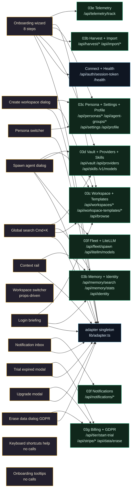

# Feature -> API Map (rebuild blueprint)

This diagram is the rebuild contract for a Lovable reconstruction of the Waggle OS web client. The left column lists every implemented OS app and overlay (windows opened by `appId` plus the modals/rails `Desktop.tsx` renders). The right column lists the backend endpoint GROUPS each one depends on, grouped exactly as the section files split them (03a Chat/Agents, 03b Memory/Knowledge/Wiki/Harvest, 03c Workspace/Team/Persona/Settings/Profile/Pins, 03d Marketplace/Skills/Connectors/Tools/Vault/Providers, 03e Evolution/Governance/Compliance/Costs/Approvals, 03f Realtime/Ops, 03g Billing/Stripe/KVARK). Every app first goes through the single shared `adapter` singleton and `ServiceProvider`; auth and tier-gating are cross-cutting and apply to all calls. Edges are sourced verbatim from section 04 "Feature -> UI Component -> Backend Endpoints" (and §3 endpoint reference). Apps with no backend calls (Voice, Team Governance, Keyboard Shortcuts) are shown wired only to the shared layer.

## 1. Apps and overlays mapped to endpoint groups

```mermaid
flowchart LR
  classDef app fill:#1b2330,stroke:#a78bfa,color:#e8e8ef
  classDef ovl fill:#23202e,stroke:#e5a000,color:#f3ead0
  classDef shared fill:#0f1622,stroke:#7dd3fc,color:#dff1ff
  classDef grp fill:#10271b,stroke:#34d399,color:#d7f7e6

  %% Shared layer every feature passes through
  ADAPTER["adapter singleton\nlib/adapter.ts\n127.0.0.1:3333"]:::shared
  SVC["ServiceProvider\nadapter.connect"]:::shared
  AUTH["Auth + Health\nGET /api/auth/session-token\nGET /health"]:::shared
  TIER["Tier gating bus\n403 TIER_INSUFFICIENT\nwaggle:tier-insufficient"]:::shared
  SVC --> ADAPTER
  ADAPTER --> AUTH
  ADAPTER --> TIER

  %% Endpoint GROUPS (right side)
  G_CHAT["03a Chat + Agents\n/api/chat SSE\n/api/history /api/agent/*\n/api/sessions/* /api/jobs/*"]:::grp
  G_MEM["03b Memory + Knowledge\n/api/memory/* /api/identity\n/api/mind/* /api/documents"]:::grp
  G_WIKI["03b Wiki + Harvest + Import\n/api/wiki/* /api/harvest/*\n/api/import/*"]:::grp
  G_WS["03c Workspace + Templates\n/api/workspaces/* /api/files/*\n/api/workspace-templates/* /api/browse"]:::grp
  G_TEAM["03c Team + Persona + Settings + Profile + Pins\n/api/personas/* /api/agent-groups/*\n/api/team/* /api/settings/* /api/profile/* /api/pins"]:::grp
  G_MKT["03d Marketplace + Skills + Capabilities\n/api/marketplace/* /api/skills/*\n/api/capabilities/status"]:::grp
  G_CONN["03d Connectors + Vault\n/api/connectors/* /api/vault/*"]:::grp
  G_TOOLS["03d AI-OS Tool Launcher\n/api/tools/detect|launch|processes|kill|hooks"]:::grp
  G_EVO["03e Evolution + Compliance + Costs + Feedback + Approvals\n/api/evolution/* /api/compliance/*\n/api/cost*|/api/costs /api/feedback /api/approval/*"]:::grp
  G_RT["03f Realtime + Ops\n/api/events* SSE /api/notifications/*\n/api/cron/* /api/fleet/* /api/litellm/* /api/local-inference/* /api/backup|restore"]:::grp
  G_WD["03f WaggleDance signals\n/api/waggle/signals\n/api/waggle/stream SSE"]:::grp
  G_BILL["03g Billing + Tier + GDPR\n/api/tier /api/tier/start-trial\n/api/stripe/* /api/data/erase"]:::grp
  G_TEL["03e Telemetry\n/api/telemetry/*"]:::grp

  %% ---- Dock apps (left) ----
  A_CHAT["Chat"]:::app
  A_DASH["Dashboard / Home"]:::app
  A_MEM["Memory\nframes/KG/harvest/wiki/evolution"]:::app
  A_EVT["Events and Logs"]:::app
  A_CAP["Skills and Apps"]:::app
  A_CONN["Connectors"]:::app
  A_COCK["Cockpit / Command Center"]:::app
  A_MC["Mission Control"]:::app
  A_WD["Waggle Dance"]:::app
  A_AGT["Personas / Agents"]:::app
  A_FILE["Files"]:::app
  A_CRON["Scheduled Jobs"]:::app
  A_MKT["Marketplace"]:::app
  A_LAUN["AI Tools / Launcher"]:::app
  A_VOICE["Voice\nstatic placeholder"]:::app
  A_ROOM["Room\nsub-agent canvas"]:::app
  A_APPR["Approvals"]:::app
  A_TL["Timeline"]:::app
  A_BAK["Backup and Restore"]:::app
  A_TEL["Usage and Telemetry"]:::app
  A_GOV["Team Governance\nTEAMS tier"]:::app
  A_SET["Settings"]:::app
  A_VAULT["Vault"]:::app
  A_PROF["My Profile"]:::app

  %% All apps go through the shared adapter
  A_CHAT & A_DASH & A_MEM & A_EVT & A_CAP & A_CONN & A_COCK & A_MC & A_WD & A_AGT & A_FILE & A_CRON & A_MKT & A_LAUN & A_VOICE & A_ROOM & A_APPR & A_TL & A_BAK & A_TEL & A_GOV & A_SET & A_VAULT & A_PROF --> ADAPTER

  %% Chat
  A_CHAT --> G_CHAT
  A_CHAT --> G_MEM
  A_CHAT --> G_TEAM
  A_CHAT --> G_WIKI

  %% Dashboard
  A_DASH --> G_MEM
  A_DASH --> G_CHAT

  %% Memory app
  A_MEM --> G_MEM
  A_MEM --> G_WIKI
  A_MEM --> G_EVO
  A_MEM --> G_RT

  %% Events
  A_EVT --> G_RT

  %% Skills and Apps
  A_CAP --> G_MKT

  %% Connectors
  A_CONN --> G_CONN

  %% Cockpit + Compliance
  A_COCK --> G_RT
  A_COCK --> G_EVO
  A_COCK --> G_CONN
  A_COCK --> G_MKT
  A_COCK --> G_WIKI

  %% Mission Control
  A_MC --> G_RT
  A_MC --> G_TEAM
  A_MC --> G_TOOLS

  %% Waggle Dance
  A_WD --> G_WD

  %% Personas / Agents
  A_AGT --> G_TEAM
  A_AGT --> G_CHAT
  A_AGT --> G_MKT

  %% Files
  A_FILE --> G_WS

  %% Scheduled Jobs
  A_CRON --> G_RT

  %% Marketplace
  A_MKT --> G_MKT

  %% Launcher
  A_LAUN --> G_TOOLS

  %% Room
  A_ROOM --> G_RT

  %% Approvals
  A_APPR --> G_EVO

  %% Timeline
  A_TL --> G_RT

  %% Backup
  A_BAK --> G_RT

  %% Telemetry
  A_TEL --> G_EVO
  A_TEL --> G_TEL

  %% Settings
  A_SET --> G_TEAM
  A_SET --> G_TEL
  A_SET --> G_RT

  %% Vault
  A_VAULT --> G_CONN

  %% Profile
  A_PROF --> G_TEAM
```

## 2. Overlays mapped to endpoint groups

