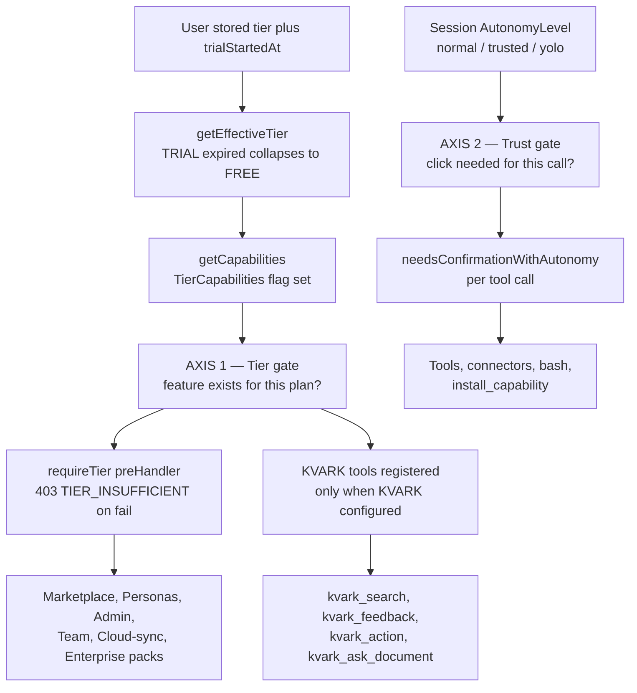
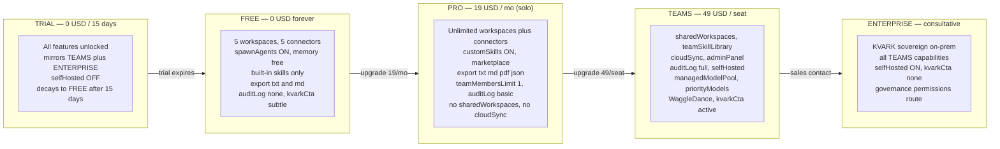
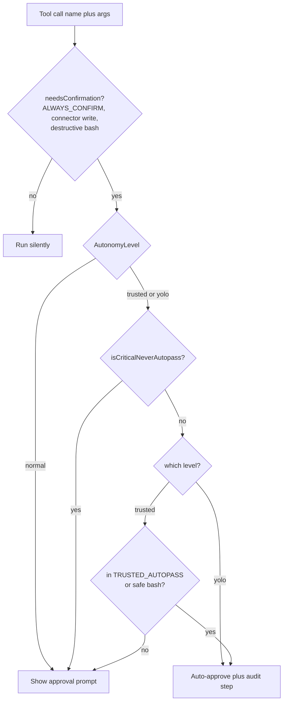
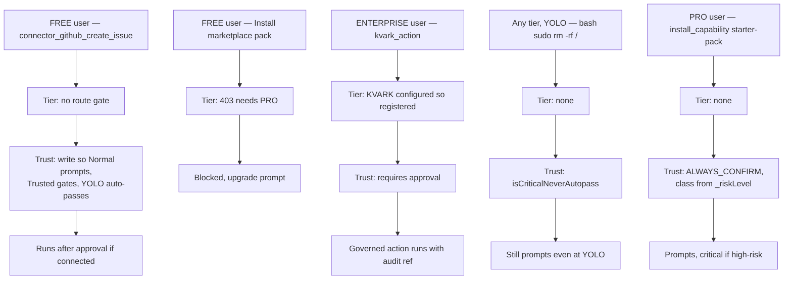

# Tier + Trust Gating

Waggle gates every action on **two orthogonal axes**. The **subscription tier** (TRIAL / FREE / PRO / TEAMS / ENTERPRISE) decides whether a feature exists for this user at all — enforced on HTTP routes via `requireTier()` returning `403 TIER_INSUFFICIENT`, and on tool registration (KVARK tools only exist when KVARK is configured). The **autonomy / trust level** (Normal / Trusted / YOLO) decides, per tool call, whether the UI must show an approval prompt — a pure runtime UX lever with a hardcoded critical blacklist that always wins, even at YOLO. The rule of thumb: *tier decides whether the door exists; trust decides whether it needs a key turn each time you walk through.* Always run a stored tier through `getEffectiveTier(tier, trialStartedAt)` before gating, because an expired TRIAL collapses to FREE.

---

## 1. The two gating axes (overview)

---

## 2. The 5 tiers and what each unlocks

---

## 3. Tier x Capability matrix (verbatim from `TIER_CAPABILITIES`)

`-1` means **unlimited**. Values quoted from `packages/shared/src/tiers.ts`.

| Capability | TRIAL | FREE | PRO | TEAMS | ENTERPRISE |
|---|---|---|---|---|---|
| `connectorLimit` | -1 | **5** | -1 | -1 | -1 |
| `workspaceLimit` | -1 | **5** | -1 | -1 | -1 |
| `embeddingProviders` | all 6 | inprocess, mock, ollama | + voyage, openai | all 6 | all 6 |
| `embeddingQuotaPerMonth` | -1 | -1 | -1 | -1 | -1 |
| `messageHistoryLimit` | -1 | -1 | -1 | -1 | -1 |
| `spawnAgents` | yes | yes | yes | yes | yes |
| `customSkills` | yes | **no** | yes | yes | yes |
| `teamSkillLibrary` | yes | **no** | **no** | yes | yes |
| `cloudSync` | yes | **no** | **no** | yes | yes |
| `exportFormats` | txt md pdf json | **txt md** | txt md pdf json | txt md pdf json | txt md pdf json |
| `teamMembersLimit` | -1 | **1** | **1** | -1 | -1 |
| `sharedWorkspaces` | yes | **no** | **no** | yes | yes |
| `adminPanel` | yes | **no** | **no** | yes | yes |
| `auditLog` | full | **none** | **basic** | full | full |
| `selfHosted` | **no** | **no** | **no** | yes | yes |
| `managedModelPool` | yes | **no** | **no** | yes | yes |
| `priorityModels` | yes | **no** | **no** | yes | yes |
| `kvarkCta` | subtle | subtle | subtle | **active** | **none** |
| `stripePriceId` | null | null | `STRIPE_PRICE_PRO` | `STRIPE_PRICE_TEAMS` | null |

`all 6` embedding providers = `inprocess, mock, ollama, voyage, openai, litellm`. Tier ordering (`TIER_ORDER`): `FREE 0, PRO 1, TEAMS 2, ENTERPRISE 3, TRIAL 3` — TRIAL ties ENTERPRISE because it has max capabilities, but is time-limited.

---

## 4. Tier-gated HTTP routes (Axis 1)

The frontend must catch `403 TIER_INSUFFICIENT` and show an upgrade prompt using `required` and `upgradeUrl`.

| Method | Path | Min tier |
|---|---|---|
| POST | `/api/marketplace/install` | PRO |
| POST | `/api/marketplace/publish` | PRO |
| GET | `/api/marketplace/enterprise-packs` | ENTERPRISE (plus KVARK configured) |
| POST | `/api/personas` | PRO |
| POST | `/api/personas/generate` | PRO |
| GET | `/api/cost/by-workspace` | TEAMS |
| POST | `/api/cloud-sync/toggle` | TEAMS |
| GET | `/api/admin/overview` | TEAMS |
| POST | `/api/admin/audit-export` | TEAMS |
| POST | `/api/team/connect` | TEAMS |
| GET | `/api/team/governance/permissions` | ENTERPRISE |

KVARK tools (`kvark_search`, `kvark_feedback`, `kvark_action`, `kvark_ask_document`) are registered only when `getKvarkConfig(vault)` returns a connection — 4 tools when configured, 0 otherwise.

---

## 5. The Normal / Trusted / YOLO autonomy gate (Axis 2)

**Level behavior:**

| Level | Behavior |
|---|---|
| `normal` | Gate everything `needsConfirmation` flags (writes, connector writes, git, install, destructive bash). |
| `trusted` | Auto-pass `TRUSTED_AUTOPASS` (`write_file, edit_file, generate_docx, read_other_workspace, read_other_workspace_file`) and non-critical bash. Still gate git push/commit/pr/merge, `install_capability`, connector writes, cross-workspace writes. |
| `yolo` | Auto-pass everything **except** `isCriticalNeverAutopass`. |

**`isCriticalNeverAutopass` (never auto-passes, even at YOLO):** `rm -rf /` or `~` or `$HOME` or `/*`, any `sudo`, `format C:`, `mkfs`, `reg delete`, `dd if=… of=/dev`, forced `git push --force` to main/master/production, fork bomb; `install_capability` with `_riskLevel === 'high'`.

Autonomy override travels in the chat request body `{ "autonomy": { "level": "trusted"|"yolo", "expiresAt": <ms epoch> } }`; if `expiresAt` is absent or past, the server falls back to `normal`.

---

## 6. How tier + trust combine (worked examples)

| Scenario | Tier check | Trust check | Net result |
|---|---|---|---|
| FREE — `connector_github_create_issue` | none (not a `requireTier` route) | write → Normal prompts; Trusted gates; YOLO auto-passes | Runs after approval if connected |
| FREE — install marketplace pack | `403 TIER_INSUFFICIENT` (needs PRO) | n/a (blocked first) | Blocked → upgrade prompt |
| ENTERPRISE — `kvark_action` (KVARK configured) | tools registered | requires approval | Governed action runs with audit ref |
| Any tier, YOLO — `bash sudo rm -rf /` | none | `isCriticalNeverAutopass` | Still prompts even at YOLO |
| PRO — `install_capability` (starter-pack) | none | in `ALWAYS_CONFIRM` | Prompts (critical if high-risk) |
