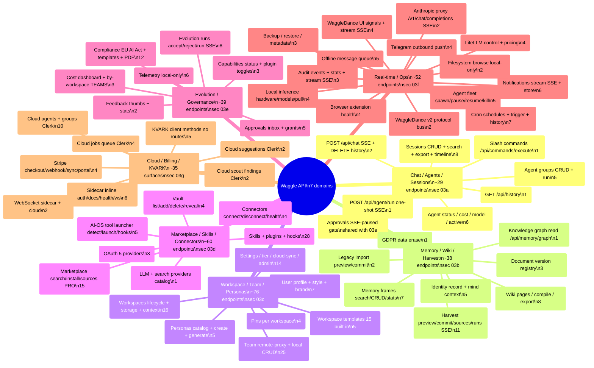
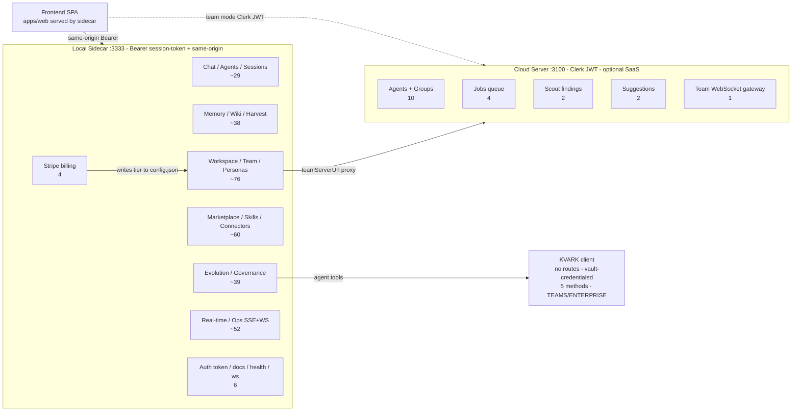

# API Domain Overview

This is the cross-cutting map of every HTTP/SSE/WebSocket surface a Lovable rebuild of the Waggle frontend must talk to. Almost everything lives in the **Local Fastify Sidecar** (default loopback `:3333`, flat `/api/*` paths, Bearer session-token + same-origin guards); a smaller set of Clerk-authenticated routes live in the separate **Cloud Server** (`:3100`, used only in SaaS/team-server deployments). Each domain node below is annotated with its endpoint count (counts are derived from the route tables in sections `03a`-`03g`; the approvals group is shared between the chat and governance sections, so it is shown once and noted). KVARK has no Fastify routes — it is reached only through the in-process `KvarkClient` (its method count is shown for completeness). Use this as the index; drill into the matching `03*` section for exact request/response shapes.

## Domains as a graph (server split + auth model)

The same domains, grouped by which server hosts them and what auth each requires. The sidecar serves the SPA and almost every domain; the cloud server is Clerk-gated and optional.

