# 02a · Data Model — Per-Workspace Memory Layer (`*.mind`)

## Purpose

This section documents the **per-workspace memory database** — the persistent "mind" of Waggle OS. Every workspace gets **one isolated SQLite file** (the `*.mind` file, e.g. `personal.mind`); there is **no shared/global memory database**. All schema below comes from `packages/hive-mind-core/src/mind/schema.ts` (the `SCHEMA_SQL` + `VEC_TABLE_SQL` constants), with column semantics cross-read from `frames.ts`, `knowledge.ts`, `identity.ts`, `awareness.ts`, and `sessions.ts`. For the frontend rebuild, treat this as the **canonical shape of everything the memory APIs return** — the server routes (documented in the API sections) read and write exactly these rows.

> **Schema version:** `SCHEMA_VERSION = '1'` (constant exported from `schema.ts`). Stored in the `meta` table under `key = 'schema_version'`.
> **One DB per workspace.** Each workspace is a separate `*.mind` SQLite file. Switching workspace = opening a different file. Nothing in this schema joins across workspaces.

---

## Layer overview

The mind is organized into numbered "layers" (the comments in `schema.ts` label them). They are NOT separate databases — just a conceptual grouping of tables inside the one `*.mind` file:

| Layer | Table(s) | Role |
|---|---|---|
| — | `meta` | Schema versioning + key/value flags |
| 0 | `identity` | Who this mind belongs to (single row) |
| 1 | `awareness` | Active working state (≤10 live items) |
| — | `sessions` | Maps GOPs (groups-of-prompts) to projects |
| 2 | `memory_frames` (+ `memory_frames_fts`, `memory_frames_vec`) | The actual memories (I/P/B frames) + full-text + vector search |
| 3 | `knowledge_entities`, `knowledge_relations` | Knowledge graph (entities + edges) |
| 4 | `procedures` | GEPA-optimized prompt templates |
| 5 | `improvement_signals` | Recurring patterns that should change behavior |
| 6 | `install_audit` | Capability-install trust trail |
| 7 | `ai_interactions` | EU AI Act Art. 12 audit log (append-only) |
| 8 | `harvest_sources` | Memory-harvest sync tracking |
| 9 | `execution_traces` | Agent run history (self-evolution input) |
| 10 | `evolution_runs` | Proposed/accepted self-evolution runs |

**14 base tables** + 2 virtual tables (`memory_frames_fts` FTS5, `memory_frames_vec` vec0). A `kg_entity_frames` link table is referenced by `frames.delete()` (`packages/hive-mind-core/src/mind/frames.ts:330`) but is **NOT defined in `schema.ts`** — it is created elsewhere (knowledge-graph wiring) and its DELETE is wrapped in try/catch, so it may be absent.

---

## Tables (every column)

### `meta` — schema versioning / key-value flags
Primary key: `key`. No indexes beyond the PK.

| Column | SQLite type | Null? | Default | Meaning |
|---|---|---|---|---|
| `key` | TEXT | NO | — | **PK.** Flag name (e.g. `schema_version`). |
| `value` | TEXT | NO | — | String value for that key. |

---

### `identity` — Layer 0 (single row, `<500` tokens)
Primary key: `id`, hard-pinned to `1` via `CHECK (id = 1)` — there is **exactly one identity row per mind**. Backed by `IdentityLayer` (`identity.ts`).

| Column | SQLite type | Null? | Default | Meaning |
|---|---|---|---|---|
| `id` | INTEGER | NO | — | **PK.** Always `1` (CHECK enforced). |
| `name` | TEXT | NO | — | Display name of the mind's owner/agent. |
| `role` | TEXT | NO | `''` | Job/role. |
| `department` | TEXT | NO | `''` | Department / org unit. |
| `personality` | TEXT | NO | `''` | Personality description. |
| `capabilities` | TEXT | NO | `''` | Free-text capability summary. |
| `system_prompt` | TEXT | NO | `''` | Base system prompt fragment for this identity. |
| `created_at` | TEXT | NO | `datetime('now')` | Created timestamp (SQLite UTC string). |
| `updated_at` | TEXT | NO | `datetime('now')` | Last-update timestamp; bumped on every `update()`. |

`IdentityLayer.toContext()` flattens these into the prompt. Empty-string fields are skipped in that rendering.

---

### `awareness` — Layer 1 (active working state, capped at 10)
Primary key: `id` (AUTOINCREMENT). Backed by `AwarenessLayer` (`awareness.ts`). Reads cap results to `MAX_ITEMS = 10` and filter out expired rows.

| Column | SQLite type | Null? | Default | Meaning |
|---|---|---|---|---|
| `id` | INTEGER | NO | autoincrement | **PK.** |
| `category` | TEXT | NO | — | **CHECK IN** `('task','action','pending','flag')`. UI labels: task→"Active Tasks", action→"Recent Actions", pending→"Pending Items", flag→"Context Flags". |
| `content` | TEXT | NO | — | The awareness item text. |
| `priority` | INTEGER | NO | `0` | Higher = surfaced first (`ORDER BY priority DESC`). |
| `metadata` | TEXT | NO | `'{}'` | JSON blob. Known keys (`AwarenessMetadata`): `context`, `status`, `result`, `priority` (+ arbitrary). Added via runtime `ALTER TABLE` migration if missing. |
| `created_at` | TEXT | NO | `datetime('now')` | Created timestamp. |
| `expires_at` | TEXT | YES | NULL | Optional expiry; rows past `expires_at` are filtered out of all read queries. |

---

### `sessions` — maps GOPs to projects
Primary key: `id` (AUTOINCREMENT). **`gop_id` is UNIQUE** and is the logical join key for `memory_frames`. Backed by `SessionStore` (`sessions.ts`). Index: `idx_sessions_project (project_id, started_at)`.

| Column | SQLite type | Null? | Default | Meaning |
|---|---|---|---|---|
| `id` | INTEGER | NO | autoincrement | **PK.** |
| `gop_id` | TEXT | NO | — | **UNIQUE.** "Group Of Prompts" id. Generated as `session:<ISO timestamp>:<rand6>`, or a stable id like `harvest` for long-lived logical sessions. Referenced by `memory_frames.gop_id`. |
| `project_id` | TEXT | YES | NULL | Optional project grouping. |
| `status` | TEXT | NO | `'active'` | **CHECK IN** `('active','closed','archived')`. |
| `started_at` | TEXT | NO | `datetime('now')` | Session start. |
| `ended_at` | TEXT | YES | NULL | Set on `close()`. |
| `summary` | TEXT | YES | NULL | Optional close-time summary. |

---

### `memory_frames` — Layer 2 (the actual memories: I/P/B)
Primary key: `id` (AUTOINCREMENT). The core of the mind. Backed by `FrameStore` (`frames.ts`). Frames use an **I/P/B model** organized per-GOP with a monotonic `t` ordinal.

| Column | SQLite type | Null? | Default | Meaning |
|---|---|---|---|---|
| `id` | INTEGER | NO | autoincrement | **PK.** Also the rowid linking `memory_frames_fts` and `memory_frames_vec`. |
| `frame_type` | TEXT | NO | — | **CHECK IN** `('I','P','B')`. **I** = Initial/state frame; **P** = Progress/delta frame (has `base_frame_id`); **B** = Bundle/cross-reference frame (content is JSON `{description, references:[ids]}`). |
| `gop_id` | TEXT | NO | — | **FK → `sessions(gop_id)`.** Groups frames into a session. |
| `t` | INTEGER | NO | `0` | Per-GOP monotonic ordinal (`MAX(t)+1` within the gop). Defines frame order. |
| `base_frame_id` | INTEGER | YES | NULL | **Self-FK → `memory_frames(id)`.** The I-frame a P/B frame builds on. Nulled on delete of the base. |
| `content` | TEXT | NO | — | Frame body. For B-frames this is JSON. May carry a `[hm …]` provenance prefix that dedup strips before hashing. |
| `importance` | TEXT | NO | `'normal'` | **CHECK IN** `('critical','important','normal','temporary','deprecated')`. Drives a retrieval multiplier (critical 2.0 / important 1.5 / normal 1.0 / temporary 0.7 / deprecated 0.3) and compaction (temporary pruned >30d, deprecated pruned >90d). |
| `source` | TEXT | NO | `'user_stated'` | **CHECK IN** `('user_stated','tool_verified','agent_inferred','import','system')`. ⚠️ The TS `FrameSource` type in `frames.ts` ALSO lists `'personal'`, `'workspace'`, `'team_sync'` — these are **not** in the DB CHECK constraint, so writing them would fail at the DB level. Treat the 5 CHECK values as authoritative for persisted rows. |
| `access_count` | INTEGER | NO | `0` | Incremented by `touch()` on every read/dedup hit. |
| `created_at` | TEXT | NO | `datetime('now')` | Created timestamp. Harvest can override with the original source timestamp if it passes strict ISO-8601 validation. |
| `last_accessed` | TEXT | NO | `datetime('now')` | Updated by `touch()`. |

**Indexes:** `idx_frames_gop_t (gop_id, t)`, `idx_frames_type (frame_type, gop_id)`, `idx_frames_base (base_frame_id)`.

**Dedup behavior (important for the frontend):** Inserting content identical (SHA-256 of `[hm …]`-stripped + trimmed body) to one of the **last 500 frames** does NOT create a new row — it increments `access_count` on the existing frame and returns it. So a "save" can be a silent no-op-with-bump.

---

### `memory_frames_fts` — FTS5 virtual table (keyword search)
```sql
CREATE VIRTUAL TABLE memory_frames_fts USING fts5(
  content, content_rowid='id', tokenize='porter unicode61'
);
```
Mirrors `memory_frames.content`, keyed by `rowid = memory_frames.id`. Kept in sync on insert/update/delete by `FrameStore`. Powers keyword/hybrid search. Not directly queried by the frontend — it's an internal index.

---

### `memory_frames_vec` — vec0 virtual table (vector search)
Defined in the separate `VEC_TABLE_SQL` constant (created only when `sqlite-vec` is available):
```sql
CREATE VIRTUAL TABLE memory_frames_vec USING vec0(
  embedding float[1024]
);
```
**1024-dim** float embeddings, keyed by `rowid = memory_frames.id`. All writes are wrapped in try/catch in `FrameStore` because the vec extension may be absent at runtime. Powers semantic search half of HybridSearch.

---

### `knowledge_entities` — Layer 3 (graph nodes)
Primary key: `id` (AUTOINCREMENT). Backed by `KnowledgeGraph` (`knowledge.ts`). **Bitemporal**: rows are versioned via `valid_from`/`valid_to` rather than hard-deleted — "active" = `valid_to IS NULL`.

| Column | SQLite type | Null? | Default | Meaning |
|---|---|---|---|---|
| `id` | INTEGER | NO | autoincrement | **PK.** |
| `entity_type` | TEXT | NO | — | Entity category (free-text; e.g. person/project/tool). |
| `name` | TEXT | NO | — | Entity name. Searched via `LIKE` (escaped). |
| `properties` | TEXT | NO | `'{}'` | JSON property bag. |
| `valid_from` | TEXT | NO | `datetime('now')` | Start of validity window. |
| `valid_to` | TEXT | YES | NULL | End of validity. **NULL = currently active.** `retireEntity()` sets this instead of deleting. |
| `recorded_at` | TEXT | NO | `datetime('now')` | When the row was written/last updated. |

**Indexes:** `idx_entities_type (entity_type)`, `idx_entities_name (name)`.

---

### `knowledge_relations` — Layer 3 (graph edges)
Primary key: `id` (AUTOINCREMENT). Directed edges between entities. Same bitemporal model.

| Column | SQLite type | Null? | Default | Meaning |
|---|---|---|---|---|
| `id` | INTEGER | NO | autoincrement | **PK.** |
| `source_id` | INTEGER | NO | — | **FK → `knowledge_entities(id)`.** Edge tail. |
| `target_id` | INTEGER | NO | — | **FK → `knowledge_entities(id)`.** Edge head. |
| `relation_type` | TEXT | NO | — | Edge label (free-text; e.g. `works_on`, `knows`). |
| `confidence` | REAL | NO | `1.0` | Edge confidence 0–1. |
| `properties` | TEXT | NO | `'{}'` | JSON property bag. |
| `valid_from` | TEXT | NO | `datetime('now')` | Validity start. |
| `valid_to` | TEXT | YES | NULL | NULL = active; `retireRelation()` sets it. |
| `recorded_at` | TEXT | NO | `datetime('now')` | Write timestamp. |

**Indexes:** `idx_relations_source (source_id, relation_type)`, `idx_relations_target (target_id, relation_type)`.

---

### `improvement_signals` — Layer 5 (behavior-change patterns)
Primary key: `id` (AUTOINCREMENT). Counts recurring patterns; surfaced to the user when frequent.

| Column | SQLite type | Null? | Default | Meaning |
|---|---|---|---|---|
| `id` | INTEGER | NO | autoincrement | **PK.** |
| `category` | TEXT | NO | — | **CHECK IN** `('capability_gap','correction','workflow_pattern','skill_promotion')`. |
| `pattern_key` | TEXT | NO | — | Stable dedup key (unique within category). |
| `detail` | TEXT | NO | `''` | Human-readable detail. |
| `count` | INTEGER | NO | `1` | Times observed; incremented on repeat. |
| `first_seen` | TEXT | NO | `datetime('now')` | First observation. |
| `last_seen` | TEXT | NO | `datetime('now')` | Most recent observation. |
| `surfaced` | INTEGER | NO | `0` | Boolean (0/1): has this been shown to the user. |
| `surfaced_at` | TEXT | YES | NULL | When surfaced. |
| `metadata` | TEXT | NO | `'{}'` | JSON. |

**Indexes:** `idx_signals_category_key (category, pattern_key)` **UNIQUE** (one row per category+key), `idx_signals_category (category, count DESC)`.

---

### `install_audit` — Layer 6 (capability install trust trail)
Primary key: `id` (AUTOINCREMENT). Records every capability-install decision. The CHECK lists must stay in sync with `packages/core/src/install-audit.ts` (a documented drift once crashed `acquire_capability`).

| Column | SQLite type | Null? | Default | Meaning |
|---|---|---|---|---|
| `id` | INTEGER | NO | autoincrement | **PK.** |
| `timestamp` | TEXT | NO | `datetime('now')` | When the event occurred. |
| `capability_name` | TEXT | NO | — | Capability identifier. |
| `capability_type` | TEXT | NO | — | **CHECK IN** `('native','skill','plugin','mcp','connector','marketplace')`. |
| `source` | TEXT | NO | — | Origin (registry/url/etc). |
| `version` | TEXT | YES | NULL | Capability version. |
| `risk_level` | TEXT | NO | — | **CHECK IN** `('low','medium','high')`. |
| `trust_source` | TEXT | NO | — | Where trust derives from. |
| `approval_class` | TEXT | NO | — | **CHECK IN** `('standard','elevated','critical','blocked')`. |
| `action` | TEXT | NO | — | **CHECK IN** `('proposed','approved','installed','rejected','failed','blocked')`. |
| `initiator` | TEXT | NO | — | **CHECK IN** `('agent','user','system')`. |
| `detail` | TEXT | NO | `''` | Free-text detail. |

**Indexes:** `idx_audit_capability (capability_name, action)`, `idx_audit_timestamp (timestamp DESC)`.

---

### `procedures` — Layer 4 (GEPA-optimized prompt templates)
Primary key: `id` (AUTOINCREMENT). Versioned prompt templates with measured performance.

| Column | SQLite type | Null? | Default | Meaning |
|---|---|---|---|---|
| `id` | INTEGER | NO | autoincrement | **PK.** |
| `name` | TEXT | NO | — | Procedure/template name. |
| `model` | TEXT | NO | — | Model the template targets. |
| `template` | TEXT | NO | — | The prompt template text. |
| `version` | INTEGER | NO | `1` | Template version. |
| `success_rate` | REAL | NO | `0.0` | Measured success rate. |
| `avg_cost` | REAL | NO | `0.0` | Measured average cost (USD). |
| `created_at` | TEXT | NO | `datetime('now')` | Created. |
| `updated_at` | TEXT | NO | `datetime('now')` | Updated. |

**Index:** `idx_procedures_name_model (name, model)`.

---

### `ai_interactions` — Layer 7 (EU AI Act Art. 12 audit log)
Primary key: `id` (AUTOINCREMENT). **APPEND-ONLY** — two triggers (`ai_interactions_no_delete`, `ai_interactions_no_update`) `RAISE(ABORT, …)` on any UPDATE or DELETE. The frontend can only INSERT and SELECT these rows; never edit or remove.

| Column | SQLite type | Null? | Default | Meaning |
|---|---|---|---|---|
| `id` | INTEGER | NO | autoincrement | **PK.** |
| `timestamp` | TEXT | NO | `datetime('now')` | Event time. |
| `workspace_id` | TEXT | YES | NULL | Originating workspace. |
| `session_id` | TEXT | YES | NULL | Originating session. |
| `model` | TEXT | NO | — | Model used. |
| `provider` | TEXT | NO | — | LLM provider. |
| `input_tokens` | INTEGER | NO | `0` | Prompt tokens. |
| `output_tokens` | INTEGER | NO | `0` | Completion tokens. |
| `cost_usd` | REAL | NO | `0` | Cost in USD. |
| `tools_called` | TEXT | NO | `'[]'` | JSON array of tool names. |
| `human_action` | TEXT | YES | NULL | **CHECK IN** `('approved','denied','modified','none')` (nullable). |
| `risk_context` | TEXT | YES | NULL | Risk annotation. |
| `imported_from` | TEXT | YES | NULL | Source if imported. |
| `persona` | TEXT | YES | NULL | Persona that ran. |
| `input_text` | TEXT | YES | NULL | Actual input (Art. 12.1(a); added 2026-04-15 via migration). |
| `output_text` | TEXT | YES | NULL | Actual output (Art. 12.1(a)). |

**Indexes:** `idx_interactions_workspace (workspace_id, timestamp)`, `idx_interactions_timestamp (timestamp DESC)`, `idx_interactions_model (model)`.

---

### `execution_traces` — Layer 9 (agent run history)
Primary key: `id` (AUTOINCREMENT). Raw agent-run records; the dataset that feeds self-evolution.

| Column | SQLite type | Null? | Default | Meaning |
|---|---|---|---|---|
| `id` | INTEGER | NO | autoincrement | **PK.** |
| `session_id` | TEXT | YES | NULL | Session id. |
| `persona_id` | TEXT | YES | NULL | Persona that ran. |
| `workspace_id` | TEXT | YES | NULL | Workspace. |
| `model` | TEXT | YES | NULL | Model used. |
| `task_shape` | TEXT | YES | NULL | Coarse task category. |
| `outcome` | TEXT | NO | `'pending'` | **CHECK IN** `('success','corrected','abandoned','verified','pending')`. |
| `trace_json` | TEXT | NO | `'{}'` | JSON of the full trace. |
| `cost_usd` | REAL | NO | `0` | Run cost. |
| `duration_ms` | INTEGER | NO | `0` | Run duration (ms). |
| `created_at` | TEXT | NO | `datetime('now')` | Start. |
| `finalized_at` | TEXT | YES | NULL | When outcome was finalized. |

**Indexes:** `idx_traces_session (session_id, created_at)`, `idx_traces_persona (persona_id, outcome)`, `idx_traces_outcome (outcome, created_at DESC)`, `idx_traces_workspace (workspace_id, created_at DESC)`.

---

### `evolution_runs` — Layer 10 (self-evolution proposals)
Primary key: `id` (AUTOINCREMENT). **`run_uuid` is UNIQUE.** Each row is a proposed prompt/schema mutation with a gate verdict and lifecycle status.

| Column | SQLite type | Null? | Default | Meaning |
|---|---|---|---|---|
| `id` | INTEGER | NO | autoincrement | **PK.** |
| `run_uuid` | TEXT | NO | — | **UNIQUE.** Stable run identifier. |
| `target_kind` | TEXT | NO | — | What's being evolved (e.g. persona / behavioral-spec). |
| `target_name` | TEXT | YES | NULL | Specific target name. |
| `baseline_text` | TEXT | NO | — | Original text before mutation. |
| `winner_text` | TEXT | NO | — | Winning mutated text. |
| `winner_schema_json` | TEXT | YES | NULL | Winning schema (JSON), if schema-evolution. |
| `delta_accuracy` | REAL | NO | `0` | Accuracy gain vs baseline. |
| `gate_verdict` | TEXT | NO | `'pass'` | **CHECK IN** `('pass','fail')`. |
| `gate_reasons_json` | TEXT | NO | `'[]'` | JSON array of gate reasons. |
| `status` | TEXT | NO | `'proposed'` | **CHECK IN** `('proposed','accepted','rejected','deployed','failed')`. |
| `artifacts_json` | TEXT | YES | NULL | JSON artifacts. |
| `user_note` | TEXT | YES | NULL | User decision note. |
| `failure_reason` | TEXT | YES | NULL | Why it failed (if `failed`). |
| `created_at` | TEXT | NO | `datetime('now')` | Proposed at. |
| `decided_at` | TEXT | YES | NULL | Accept/reject time. |
| `deployed_at` | TEXT | YES | NULL | Deploy time. |

**Indexes:** `idx_evo_runs_status (status, created_at DESC)`, `idx_evo_runs_target (target_kind, target_name, created_at DESC)`, `idx_evo_runs_created (created_at DESC)`.

---

### `harvest_sources` — Layer 8 (Memory Harvest sync tracking)
Primary key: `id` (AUTOINCREMENT). **`source` is UNIQUE** — one row per import source (chatgpt/claude/gemini/etc).

| Column | SQLite type | Null? | Default | Meaning |
|---|---|---|---|---|
| `id` | INTEGER | NO | autoincrement | **PK.** |
| `source` | TEXT | NO | — | **UNIQUE.** Source key (e.g. `claude`, `chatgpt`). |
| `display_name` | TEXT | NO | — | Human label for the source. |
| `source_path` | TEXT | YES | NULL | Filesystem path / location of the export. |
| `last_synced_at` | TEXT | YES | NULL | Last successful sync. |
| `items_imported` | INTEGER | NO | `0` | Items pulled from source. |
| `frames_created` | INTEGER | NO | `0` | `memory_frames` rows produced. |
| `auto_sync` | INTEGER | NO | `0` | Boolean (0/1): auto-resync enabled. |
| `sync_interval_hours` | INTEGER | NO | `24` | Auto-sync interval. |
| `last_content_hash` | TEXT | YES | NULL | Hash of last-imported content (skip-if-unchanged). |
| `created_at` | TEXT | NO | `datetime('now')` | Created. |

No explicit secondary indexes (UNIQUE on `source` provides the lookup index).

---

## Key relationships (FKs and logical joins)

- `memory_frames.gop_id` → `sessions.gop_id` (**FK**). Frames belong to a session/GOP.
- `memory_frames.base_frame_id` → `memory_frames.id` (**self-FK**). P/B frames reference their base I-frame.
- `memory_frames_fts.rowid` = `memory_frames.id` (logical, FTS5 `content_rowid`).
- `memory_frames_vec.rowid` = `memory_frames.id` (logical, vec0).
- `knowledge_relations.source_id` → `knowledge_entities.id` (**FK**).
- `knowledge_relations.target_id` → `knowledge_entities.id` (**FK**).
- `kg_entity_frames.frame_id` → `memory_frames.id` (**referenced in `frames.delete()` but table not in `schema.ts`** — created by KG wiring elsewhere; may be absent).
- The remaining tables (`identity`, `awareness`, `procedures`, `improvement_signals`, `install_audit`, `ai_interactions`, `execution_traces`, `evolution_runs`, `harvest_sources`, `meta`) are **standalone** — no DB-level FKs between them. `ai_interactions.session_id` / `execution_traces.session_id` are plain TEXT, not FK-constrained to `sessions`.

---

## ER diagram

```mermaid
erDiagram
    sessions ||--o{ memory_frames : "gop_id"
    memory_frames ||--o{ memory_frames : "base_frame_id (self)"
    memory_frames ||--|| memory_frames_fts : "rowid=id (FTS5)"
    memory_frames ||--|| memory_frames_vec : "rowid=id (vec0)"
    knowledge_entities ||--o{ knowledge_relations : "source_id"
    knowledge_entities ||--o{ knowledge_relations : "target_id"
    memory_frames }o..o{ kg_entity_frames : "frame_id (table not in schema.ts)"

    meta {
        TEXT key PK
        TEXT value
    }
    identity {
        INTEGER id PK "CHECK id=1"
        TEXT name
        TEXT role
        TEXT department
        TEXT personality
        TEXT capabilities
        TEXT system_prompt
        TEXT created_at
        TEXT updated_at
    }
    awareness {
        INTEGER id PK
        TEXT category "task|action|pending|flag"
        TEXT content
        INTEGER priority
        TEXT metadata "JSON"
        TEXT created_at
        TEXT expires_at "nullable"
    }
    sessions {
        INTEGER id PK
        TEXT gop_id UK
        TEXT project_id "nullable"
        TEXT status "active|closed|archived"
        TEXT started_at
        TEXT ended_at "nullable"
        TEXT summary "nullable"
    }
    memory_frames {
        INTEGER id PK
        TEXT frame_type "I|P|B"
        TEXT gop_id FK
        INTEGER t
        INTEGER base_frame_id FK "nullable self"
        TEXT content
        TEXT importance "critical..deprecated"
        TEXT source "user_stated..system"
        INTEGER access_count
        TEXT created_at
        TEXT last_accessed
    }
    memory_frames_fts {
        TEXT content "FTS5 rowid=id"
    }
    memory_frames_vec {
        FLOAT embedding "float[1024] rowid=id"
    }
    knowledge_entities {
        INTEGER id PK
        TEXT entity_type
        TEXT name
        TEXT properties "JSON"
        TEXT valid_from
        TEXT valid_to "nullable=active"
        TEXT recorded_at
    }
    knowledge_relations {
        INTEGER id PK
        INTEGER source_id FK
        INTEGER target_id FK
        TEXT relation_type
        REAL confidence
        TEXT properties "JSON"
        TEXT valid_from
        TEXT valid_to "nullable=active"
        TEXT recorded_at
    }
    improvement_signals {
        INTEGER id PK
        TEXT category
        TEXT pattern_key
        TEXT detail
        INTEGER count
        TEXT first_seen
        TEXT last_seen
        INTEGER surfaced
        TEXT surfaced_at "nullable"
        TEXT metadata "JSON"
    }
    install_audit {
        INTEGER id PK
        TEXT timestamp
        TEXT capability_name
        TEXT capability_type
        TEXT source
        TEXT version "nullable"
        TEXT risk_level "low|medium|high"
        TEXT trust_source
        TEXT approval_class
        TEXT action
        TEXT initiator
        TEXT detail
    }
    procedures {
        INTEGER id PK
        TEXT name
        TEXT model
        TEXT template
        INTEGER version
        REAL success_rate
        REAL avg_cost
        TEXT created_at
        TEXT updated_at
    }
    ai_interactions {
        INTEGER id PK
        TEXT timestamp
        TEXT workspace_id "nullable"
        TEXT session_id "nullable"
        TEXT model
        TEXT provider
        INTEGER input_tokens
        INTEGER output_tokens
        REAL cost_usd
        TEXT tools_called "JSON"
        TEXT human_action "nullable"
        TEXT risk_context "nullable"
        TEXT imported_from "nullable"
        TEXT persona "nullable"
        TEXT input_text "nullable"
        TEXT output_text "nullable"
    }
    execution_traces {
        INTEGER id PK
        TEXT session_id "nullable"
        TEXT persona_id "nullable"
        TEXT workspace_id "nullable"
        TEXT model "nullable"
        TEXT task_shape "nullable"
        TEXT outcome "success..pending"
        TEXT trace_json "JSON"
        REAL cost_usd
        INTEGER duration_ms
        TEXT created_at
        TEXT finalized_at "nullable"
    }
    evolution_runs {
        INTEGER id PK
        TEXT run_uuid UK
        TEXT target_kind
        TEXT target_name "nullable"
        TEXT baseline_text
        TEXT winner_text
        TEXT winner_schema_json "nullable"
        REAL delta_accuracy
        TEXT gate_verdict "pass|fail"
        TEXT gate_reasons_json "JSON"
        TEXT status "proposed..failed"
        TEXT artifacts_json "nullable"
        TEXT user_note "nullable"
        TEXT failure_reason "nullable"
        TEXT created_at
        TEXT decided_at "nullable"
        TEXT deployed_at "nullable"
    }
    harvest_sources {
        INTEGER id PK
        TEXT source UK
        TEXT display_name
        TEXT source_path "nullable"
        TEXT last_synced_at "nullable"
        INTEGER items_imported
        INTEGER frames_created
        INTEGER auto_sync
        INTEGER sync_interval_hours
        TEXT last_content_hash "nullable"
        TEXT created_at
    }
```



---

## Frontend-relevant gotchas

- **Timestamps are SQLite strings**, not epoch numbers — `datetime('now')` yields `'YYYY-MM-DD HH:MM:SS'` (UTC, space separator). Harvest-overridden frame timestamps may instead be strict ISO-8601 with `T` + tz. Parse defensively.
- **Booleans are INTEGER 0/1** (`awareness`… none; `improvement_signals.surfaced`, `harvest_sources.auto_sync`). No real boolean type.
- **JSON-in-TEXT columns** must be parsed client-side: `awareness.metadata`, `*.properties`, `improvement_signals.metadata`, `ai_interactions.tools_called`, `execution_traces.trace_json`, `evolution_runs.*_json`, and B-frame `memory_frames.content`.
- **`ai_interactions` is immutable** — the UI must not offer edit/delete on audit rows; the DB triggers will reject the write.
- **Knowledge graph is bitemporal** — "current" entities/relations are those with `valid_to IS NULL`; "deletes" are retirements (set `valid_to`), so a hidden node may still exist with a closed validity window.
