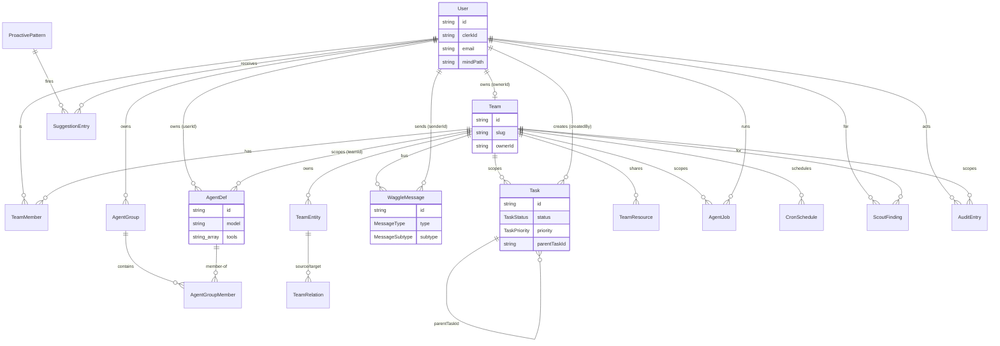
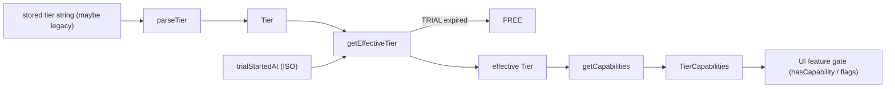

# 02c · Shared Types, Zod Schemas & the 5-Tier Model (`@waggle/shared`)

**Purpose.** This section is the **wire contract** for the Waggle OS frontend. Every interface, enum, Zod request schema, and tier-capability flag documented here lives in `packages/shared/src/` and is consumed by both the Node.js sidecar (Fastify) and the web bundle. If you are rebuilding the frontend in Lovable, these are the **exact shapes you receive from and send to the backend** — the field names, types, and allowed enum values are quoted verbatim from source. Nothing here is invented; every claim is grounded in the four files read.

**Source files (all present, none empty):**

| File | What it holds |
|---|---|
| `packages/shared/src/types.ts` | Domain interfaces + string-literal union types (the wire shapes) |
| `packages/shared/src/schemas.ts` | Zod schemas validating inbound API request bodies |
| `packages/shared/src/constants.ts` | Canonical enum arrays + a few tuning constants |
| `packages/shared/src/tiers.ts` | `TIERS`, `TierCapabilities`, `TIER_CAPABILITIES`, tier helper functions |

> The barrel `packages/shared/src/index.ts` re-exports these four plus `mcp-catalog.js`, `connector-recommendations.js`, and `tool-detection.js` (out of scope for this section). Import everything below from `@waggle/shared`.

---

## 1. Conventions you must know before reading the tables

- **`Date` fields are serialized as ISO 8601 strings over the wire.** The TypeScript interfaces declare `createdAt: Date`, etc. — but JSON has no `Date`, so on the frontend you receive strings (e.g. `"2026-06-06T12:00:00.000Z"`) and must parse them. The `tiers.ts` helpers (`isTrialExpired`, `trialDaysRemaining`) explicitly take **ISO date strings**, confirming this serialization boundary.
- **`Record<string, unknown>` = arbitrary JSON object.** Many fields (`config`, `content`, `properties`, `input`, `output`, `jobConfig`, `context`, `trigger`, `beforeState`, `afterState`) are open-ended JSON blobs. The backend does not constrain their inner shape at the type level.
- **`| null` vs `?` (optional).** Interfaces use `| null` for fields that are **always present in the row but may be empty** (e.g. `avatarUrl: string | null`). Zod schemas use `.optional()` for fields that **may be absent from the request body**. These are different — respect both.
- **`-1` means "unlimited"** throughout `TierCapabilities` (e.g. `connectorLimit: -1`). This is enforced in `hasCapability()` where `cap === -1` short-circuits to `true`.

---

## 2. Auth & Users

### `User` (`types.ts`)
| Field | Type | Notes |
|---|---|---|
| `id` | `string` | Internal Waggle user id |
| `clerkId` | `string` | Clerk auth provider id (auth is Clerk-backed) |
| `displayName` | `string` | |
| `email` | `string` | |
| `avatarUrl` | `string \| null` | |
| `mindPath` | `string \| null` | Filesystem path to the user's personal `.mind` memory DB |
| `createdAt` | `Date` | ISO string on the wire |
| `updatedAt` | `Date` | ISO string on the wire |

---

## 3. Teams

### `Team` (`types.ts`)
| Field | Type | Notes |
|---|---|---|
| `id` | `string` | |
| `name` | `string` | |
| `slug` | `string` | URL-safe; used as the WebSocket room key (`teamSlug`) |
| `ownerId` | `string` | FK → `User.id` |
| `createdAt` | `Date` | |

### `TeamRole` (`types.ts`)
```ts
type TeamRole = 'owner' | 'admin' | 'member';
```
Canonical array in `constants.ts`: `TEAM_ROLES = ['owner', 'admin', 'member']`.

### `TeamMember` (`types.ts`)
| Field | Type | Notes |
|---|---|---|
| `teamId` | `string` | |
| `userId` | `string` | |
| `role` | `TeamRole` | `'owner' \| 'admin' \| 'member'` |
| `roleDescription` | `string \| null` | Free-text role blurb |
| `interests` | `string[] \| null` | Used for WaggleDance routing/matching |
| `joinedAt` | `Date` | |

---

## 4. Agents & Agent Groups

### `AgentDef` (`types.ts`)
| Field | Type | Notes |
|---|---|---|
| `id` | `string` | |
| `userId` | `string` | Owner |
| `teamId` | `string \| null` | Null = personal agent |
| `name` | `string` | |
| `role` | `string \| null` | |
| `systemPrompt` | `string \| null` | |
| `model` | `string` | e.g. `"claude-haiku-4-5"` |
| `tools` | `string[]` | Tool ids the agent may call |
| `config` | `Record<string, unknown>` | Open JSON |
| `createdAt` | `Date` | |

### `AgentGroupStrategy` (`types.ts`)
```ts
type AgentGroupStrategy = 'parallel' | 'sequential' | 'coordinator';
```
Canonical array: `AGENT_GROUP_STRATEGIES = ['parallel', 'sequential', 'coordinator']`.

### `AgentGroup` (`types.ts`)
| Field | Type |
|---|---|
| `id` | `string` |
| `userId` | `string` |
| `name` | `string` |
| `description` | `string \| null` |
| `strategy` | `AgentGroupStrategy` |
| `createdAt` | `Date` |

### `AgentGroupMember` (`types.ts`)
| Field | Type | Notes |
|---|---|---|
| `groupId` | `string` | |
| `agentId` | `string` | |
| `roleInGroup` | `'lead' \| 'worker'` | |
| `executionOrder` | `number` | Ordering within `sequential` strategy |

---

## 5. Tasks

### Enums (`types.ts` + `constants.ts`)
```ts
type TaskStatus   = 'open' | 'claimed' | 'in_progress' | 'done' | 'cancelled';
type TaskPriority = 'critical' | 'high' | 'normal' | 'low';
```
Arrays: `TASK_STATUSES`, `TASK_PRIORITIES`.

### `Task` (`types.ts`)
| Field | Type | Notes |
|---|---|---|
| `id` | `string` | |
| `teamId` | `string` | Tasks are team-scoped |
| `title` | `string` | |
| `description` | `string \| null` | |
| `status` | `TaskStatus` | |
| `priority` | `TaskPriority` | |
| `createdBy` | `string` | FK → `User.id` |
| `assignedTo` | `string \| null` | |
| `parentTaskId` | `string \| null` | Subtask tree |
| `createdAt` | `Date` | |
| `updatedAt` | `Date` | |

---

## 6. WaggleDance Messages (multi-agent coordination bus)

### Enums (`types.ts` + `constants.ts`)
```ts
type MessageType    = 'broadcast' | 'request' | 'response';
type MessageSubtype =
  | 'knowledge_check' | 'task_delegation' | 'skill_request'
  | 'model_recommendation' | 'knowledge_match' | 'task_claim'
  | 'discovery' | 'routed_share' | 'skill_share' | 'model_recipe';
```
`constants.ts` only exports `MESSAGE_TYPES = ['broadcast','request','response']` — the **10 subtypes are NOT in `constants.ts`**; their canonical list is the `sendMessageSchema` enum in `schemas.ts` (and the `MessageSubtype` union).

### `WaggleMessage` (`types.ts`)
| Field | Type | Notes |
|---|---|---|
| `id` | `string` | |
| `teamId` | `string` | |
| `senderId` | `string` | |
| `type` | `MessageType` | |
| `subtype` | `MessageSubtype` | |
| `content` | `Record<string, unknown>` | Subtype-specific payload (open JSON) |
| `referenceId` | `string \| null` | Links a `response` to its `request` |
| `routing` | `Array<{ userId: string; reason: string }> \| null` | Targeted-share recipients + reasons |
| `createdAt` | `Date` | |

---

## 7. Team Knowledge Graph

### `TeamEntity` (`types.ts`)
| Field | Type | Notes |
|---|---|---|
| `id` | `string` | |
| `teamId` | `string` | |
| `entityType` | `string` | Free-form type label |
| `name` | `string` | |
| `properties` | `Record<string, unknown>` | |
| `sharedBy` | `string` | FK → `User.id` |
| `validFrom` | `Date` | Bitemporal validity start |
| `validTo` | `Date \| null` | Null = still valid |
| `createdAt` | `Date` | |

### `TeamRelation` (`types.ts`)
| Field | Type | Notes |
|---|---|---|
| `id` | `string` | |
| `teamId` | `string` | |
| `sourceId` | `string` | FK → `TeamEntity.id` |
| `targetId` | `string` | FK → `TeamEntity.id` |
| `relationType` | `string` | |
| `confidence` | `number` | `0.0`–`1.0` (default `1.0` in schema) |
| `properties` | `Record<string, unknown>` | |
| `createdAt` | `Date` | |

---

## 8. Team Resources (shared model recipes / skills / configs)

### `ResourceType` (`types.ts` + `constants.ts`)
```ts
type ResourceType = 'model_recipe' | 'skill' | 'tool_config' | 'prompt_template';
```
Array: `RESOURCE_TYPES`.

### `TeamResource` (`types.ts`)
| Field | Type | Notes |
|---|---|---|
| `id` | `string` | |
| `teamId` | `string` | |
| `resourceType` | `ResourceType` | |
| `name` | `string` | |
| `description` | `string \| null` | |
| `config` | `Record<string, unknown>` | |
| `sharedBy` | `string` | |
| `rating` | `number` | |
| `useCount` | `number` | |
| `createdAt` | `Date` | |

---

## 9. Jobs & Cron

### Enums (`types.ts` + `constants.ts`)
```ts
type JobType   = 'chat' | 'task' | 'cron' | 'waggle';
type JobStatus = 'queued' | 'running' | 'completed' | 'failed';
```
Arrays: `JOB_TYPES`, `JOB_STATUSES`.

### `AgentJob` (`types.ts`)
| Field | Type | Notes |
|---|---|---|
| `id` | `string` | |
| `teamId` | `string` | |
| `userId` | `string` | |
| `jobType` | `JobType` | |
| `status` | `JobStatus` | |
| `input` | `Record<string, unknown>` | |
| `output` | `Record<string, unknown> \| null` | Null until complete |
| `startedAt` | `Date \| null` | |
| `completedAt` | `Date \| null` | |
| `createdAt` | `Date` | |

### `CronSchedule` (`types.ts`)
| Field | Type | Notes |
|---|---|---|
| `id` | `string` | |
| `teamId` | `string` | |
| `createdBy` | `string` | |
| `name` | `string` | |
| `cronExpr` | `string` | Standard cron expression |
| `jobType` | `string` | Free-form (note: NOT the `JobType` union here) |
| `jobConfig` | `Record<string, unknown>` | |
| `enabled` | `boolean` | |
| `lastRunAt` | `Date \| null` | |
| `nextRunAt` | `Date \| null` | |
| `createdAt` | `Date` | |

> Default cron for the hive-mind compile job: `HIVE_MIND_CRON = '0 9 * * 1'` (weekly, Monday 9am) — from `constants.ts`.

---

## 10. Intelligence: Scout Findings & Proactive Suggestions

### Enums (`types.ts`)
```ts
type ScoutSource     = 'marketplace' | 'mcp_registry' | 'model_provider' | 'team';
type ScoutCategory   = 'skill' | 'mcp' | 'model' | 'feature' | 'practice';
type FindingStatus   = 'new' | 'presented' | 'adopted' | 'dismissed';
type SuggestionType   = 'dashboard' | 'cron' | 'share' | 'skill' | 'upgrade';
type SuggestionStatus = 'pending' | 'accepted' | 'dismissed' | 'snoozed';
```
`SUGGESTION_TYPES` array is in `constants.ts`. (`ScoutSource`/`ScoutCategory`/`FindingStatus`/`SuggestionStatus` have no array constants — the union types are canonical.)

### `ScoutFinding` (`types.ts`)
| Field | Type | Notes |
|---|---|---|
| `id` | `string` | |
| `userId` | `string \| null` | |
| `teamId` | `string \| null` | At least one of user/team scopes it |
| `source` | `ScoutSource` | |
| `category` | `ScoutCategory` | |
| `title` | `string` | |
| `summary` | `string \| null` | |
| `relevanceScore` | `number` | |
| `url` | `string \| null` | |
| `status` | `FindingStatus` | |
| `createdAt` | `Date` | |

### `ProactivePattern` (`types.ts`)
| Field | Type |
|---|---|
| `id` | `string` |
| `name` | `string` |
| `trigger` | `Record<string, unknown>` |
| `suggestionType` | `SuggestionType` |
| `template` | `string` |
| `enabled` | `boolean` |

### `SuggestionEntry` (`types.ts`)
| Field | Type | Notes |
|---|---|---|
| `id` | `string` | |
| `userId` | `string` | |
| `patternId` | `string` | FK → `ProactivePattern.id` |
| `context` | `Record<string, unknown>` | |
| `status` | `SuggestionStatus` | |
| `createdAt` | `Date` | |

> Tuning constants (`constants.ts`): `MAX_SUGGESTIONS_PER_INTERACTION = 1`, `SCOUT_DEFAULT_INTERVAL_MS = 86_400_000` (daily), `SUBCONSCIOUS_INTERACTION_THRESHOLD = 10` (reflect every 10 tasks).

---

## 11. Audit

### `AuditEntry` (`types.ts`)
| Field | Type | Notes |
|---|---|---|
| `id` | `string` | |
| `userId` | `string` | |
| `teamId` | `string \| null` | |
| `agentName` | `string` | |
| `actionType` | `string` | |
| `description` | `string` | |
| `beforeState` | `Record<string, unknown> \| null` | |
| `afterState` | `Record<string, unknown> \| null` | |
| `requiresApproval` | `boolean` | Drives the approvals-inbox UI |
| `approved` | `boolean \| null` | Null = pending decision |
| `approvedBy` | `string \| null` | |
| `createdAt` | `Date` | |

---

## 12. WebSocket Event Contract

These discriminated unions (`types.ts`) define the **real-time channel** the frontend opens. Discriminate on the `type` field.

### Client → Server: `WsClientEvent`
| `type` | Payload fields |
|---|---|
| `'authenticate'` | `token: string` |
| `'join_team'` | `teamSlug: string` |
| `'send_message'` | `teamSlug: string`, `messageType: MessageType`, `subtype: MessageSubtype`, `content: Record<string, unknown>` |

### Server → Client: `WsServerEvent`
| `type` | Payload fields |
|---|---|
| `'waggle_message'` | `message: WaggleMessage` |
| `'task_update'` | `task: Task` |
| `'agent_status'` | `userId: string`, `status: 'running' \| 'idle' \| 'completed'` |
| `'suggestion'` | `suggestion: SuggestionEntry` |
| `'scout_finding'` | `finding: ScoutFinding` |
| `'job_progress'` | `jobId: string`, `progress: Record<string, unknown>` |

> Note: WebSocket `agent_status` uses `'running' \| 'idle' \| 'completed'` — a **different** set than `JobStatus`. Do not conflate them.

---

## 13. Connectors

### `ConnectorCredential` (`types.ts`) — stored in vault, not normally sent to UI
| Field | Type | Notes |
|---|---|---|
| `type` | `'api_key' \| 'oauth2' \| 'bearer' \| 'basic'` | |
| `accessToken?` | `string` | oauth2 |
| `refreshToken?` | `string` | oauth2 |
| `expiresAt?` | `string` | ISO timestamp |
| `scopes?` | `string[]` | oauth2 |
| `apiKey?` | `string` | api_key/bearer |
| `username?` | `string` | basic |

### `ConnectorStatus` (`types.ts`)
```ts
type ConnectorStatus = 'connected' | 'disconnected' | 'expired' | 'error';
```

### `ConnectorActionMeta` (`types.ts`)
| Field | Type |
|---|---|
| `name` | `string` |
| `description` | `string` |
| `riskLevel` | `'low' \| 'medium' \| 'high'` |

### `ConnectorDefinition` (`types.ts`) — **the connector card the user sees**
| Field | Type | Notes |
|---|---|---|
| `id` | `string` | |
| `name` | `string` | |
| `description` | `string` | |
| `service` | `string` | Which external service |
| `authType` | `'api_key' \| 'oauth2' \| 'bearer' \| 'basic'` | |
| `status` | `ConnectorStatus` | Whether creds exist in vault |
| `capabilities` | `('read' \| 'write' \| 'search')[]` | |
| `substrate` | `'waggle' \| 'kvark'` | Which substrate manages it |
| `tools` | `string[]` | Agent tools unlocked when connected |
| `config?` | `Record<string, unknown>` | |
| `actions?` | `ConnectorActionMeta[]` | Present only when SDK connector loaded |
| `logoUrl?` | `string` | CDN SVG logo |
| `category?` | `'productivity' \| 'development' \| 'crm' \| 'data' \| 'communication' \| 'storage' \| 'integration'` | |
| `setupGuide?` | `string` | 1–2 sentences: what credential + where to get it |

### `ConnectorHealth` (`types.ts`) — cockpit health row
| Field | Type |
|---|---|
| `id` | `string` |
| `name` | `string` |
| `status` | `ConnectorStatus` |
| `lastChecked` | `string` (ISO) |
| `error?` | `string` |
| `tokenExpiresAt?` | `string` (ISO) |

---

## 14. Zod Request Schemas (`schemas.ts`)

These validate **inbound request bodies**. The frontend should construct payloads that satisfy them; the backend `.parse()`s them and returns a 400 on failure. Columns: required vs optional, constraints, and defaults the server fills if you omit a field.

| Schema | Field | Type / Enum | Required? | Constraints / Default |
|---|---|---|---|---|
| `createTeamSchema` | `name` | string | required | 1–100 chars |
| | `slug` | string | required | 1–50 chars, regex `^[a-z0-9-]+$` |
| `inviteMemberSchema` | `email` | string | required | valid email |
| | `role` | enum | required | `'admin' \| 'member'` (NOT `'owner'`) |
| `updateMemberSchema` | `role` | enum | optional | `'admin' \| 'member'` |
| | `roleDescription` | string | optional | max 500 |
| | `interests` | string[] | optional | |
| `createTaskSchema` | `title` | string | required | 1–200 |
| | `description` | string | optional | max 5000 |
| | `priority` | enum | optional | `critical\|high\|normal\|low`, **default `'normal'`** |
| | `parentTaskId` | string | optional | UUID |
| `updateTaskSchema` | `title` | string | optional | 1–200 |
| | `description` | string | optional | max 5000 |
| | `status` | enum | optional | `open\|claimed\|in_progress\|done\|cancelled` |
| | `priority` | enum | optional | `critical\|high\|normal\|low` |
| | `assignedTo` | string \| null | optional | UUID or null |
| `sendMessageSchema` | `type` | enum | required | `broadcast\|request\|response` |
| | `subtype` | enum | required | all 10 `MessageSubtype` values |
| | `content` | record | required | arbitrary JSON object |
| | `referenceId` | string | optional | UUID |
| | `routing` | array | optional | `{ userId: uuid, reason: string }[]` |
| `createAgentSchema` | `name` | string | required | 1–100 |
| | `role` | string | optional | max 500 |
| | `systemPrompt` | string | optional | max 10000 |
| | `model` | string | optional | min 1, **default `'claude-haiku-4-5'`** |
| | `tools` | string[] | optional | **default `[]`** |
| | `config` | record | optional | **default `{}`** |
| | `teamId` | string | optional | UUID |
| `createAgentGroupSchema` | `name` | string | required | 1–100 |
| | `description` | string | optional | max 500 |
| | `strategy` | enum | required | `parallel\|sequential\|coordinator` |
| | `members` | array | required | `{ agentId: uuid, roleInGroup: 'lead'\|'worker' (def 'worker'), executionOrder: int≥0 (def 0) }[]` |
| `createEntitySchema` | `entityType` | string | required | 1–100 |
| | `name` | string | required | 1–200 |
| | `properties` | record | optional | **default `{}`** |
| | `validFrom` | string | optional | ISO datetime |
| | `validTo` | string | optional | ISO datetime |
| `createRelationSchema` | `sourceId` | string | required | UUID |
| | `targetId` | string | required | UUID |
| | `relationType` | string | required | 1–100 |
| | `confidence` | number | optional | 0–1, **default `1.0`** |
| | `properties` | record | optional | **default `{}`** |
| `createResourceSchema` | `resourceType` | enum | required | `model_recipe\|skill\|tool_config\|prompt_template` |
| | `name` | string | required | 1–200 |
| | `description` | string | optional | max 1000 |
| | `config` | record | required | arbitrary JSON object |
| `createCronSchema` | `name` | string | required | 1–200 |
| | `cronExpr` | string | required | min 1 |
| | `jobType` | string | required | min 1 (free-form string) |
| | `jobConfig` | record | optional | **default `{}`** |
| `queueJobSchema` | `jobType` | enum | required | `chat\|task\|cron\|waggle` |
| | `input` | record | required | arbitrary JSON object |
| | `teamId` | string | optional | UUID |

**Frontend takeaways from the schemas:**
- Invites can only set `'admin'` or `'member'` — there is no API path to invite an `'owner'`.
- Omitting `priority` on task create yields `'normal'`; omitting `model` on agent create yields `'claude-haiku-4-5'`.
- `createCronSchema.jobType` is a free string, whereas `queueJobSchema.jobType` is the strict 4-value enum.

---

## 15. The 5-Tier Model (`tiers.ts`)

```ts
export const TIERS = ['TRIAL', 'FREE', 'PRO', 'TEAMS', 'ENTERPRISE'] as const;
export type Tier = typeof TIERS[number];
export const TRIAL_DURATION_DAYS = 15;
```

**Pricing (from the file header comment, "confirmed April 12, 2026"):**

| Tier | Price | One-liner |
|---|---|---|
| TRIAL | $0 / 15 days | All features unlocked; falls back to FREE after 15 days |
| FREE | $0 forever | 5 workspaces, agents, built-in skills only |
| PRO | $19/mo | Unlimited, marketplace, all connectors |
| TEAMS | $49/mo per seat | Shared workspaces, WaggleDance, governance |
| ENTERPRISE | Consultative | KVARK sovereign on-prem |

### 15.1 `TierCapabilities` interface — every flag the UI can gate on

| Capability | Type | Meaning for the UI |
|---|---|---|
| `connectorLimit` | `number` | Max connectors; `-1` = unlimited |
| `workspaceLimit` | `number` | Max workspaces; `-1` = unlimited |
| `embeddingProviders` | `EmbeddingProviderType[]` | Allowed embedders (`'inprocess'\|'ollama'\|'voyage'\|'openai'\|'litellm'\|'mock'`) |
| `embeddingQuotaPerMonth` | `number` | `-1` = unlimited everywhere |
| `messageHistoryLimit` | `number` | `-1` = unlimited everywhere |
| `spawnAgents` | `boolean` | Can spawn agents (true in ALL tiers — agents are free) |
| `customSkills` | `boolean` | Author custom skills |
| `teamSkillLibrary` | `boolean` | Shared team skill library |
| `cloudSync` | `boolean` | Cloud sync of memory |
| `exportFormats` | `ExportFormat[]` | Allowed exports (`'txt'\|'md'\|'pdf'\|'json'`) |
| `teamMembersLimit` | `number` | Seats; `-1` = unlimited, `1` = solo |
| `sharedWorkspaces` | `boolean` | Team-shared workspaces |
| `adminPanel` | `boolean` | Show admin panel |
| `auditLog` | `'none' \| 'basic' \| 'full'` | Audit log depth |
| `selfHosted` | `boolean` | On-prem / sovereign |
| `managedModelPool` | `boolean` | Access managed model pool |
| `priorityModels` | `boolean` | Priority (premium) models |
| `kvarkCta` | `'none' \| 'subtle' \| 'active'` | How aggressively to show the KVARK upgrade CTA |
| `stripePriceId` | `string \| null` | Stripe price id (from env at runtime) |

### 15.2 Tier × Capability matrix (verbatim from `TIER_CAPABILITIES`)

| Capability | TRIAL | FREE | PRO | TEAMS | ENTERPRISE |
|---|---|---|---|---|---|
| `connectorLimit` | -1 | **5** | -1 | -1 | -1 |
| `workspaceLimit` | -1 | **5** | -1 | -1 | -1 |
| `embeddingProviders` | all 6 | inprocess, mock, ollama | inprocess, mock, ollama, voyage, openai | all 6 | all 6 |
| `embeddingQuotaPerMonth` | -1 | -1 | -1 | -1 | -1 |
| `messageHistoryLimit` | -1 | -1 | -1 | -1 | -1 |
| `spawnAgents` | ✅ | ✅ | ✅ | ✅ | ✅ |
| `customSkills` | ✅ | ❌ | ✅ | ✅ | ✅ |
| `teamSkillLibrary` | ✅ | ❌ | ❌ | ✅ | ✅ |
| `cloudSync` | ✅ | ❌ | ❌ | ✅ | ✅ |
| `exportFormats` | txt,md,pdf,json | **txt,md** | txt,md,pdf,json | txt,md,pdf,json | txt,md,pdf,json |
| `teamMembersLimit` | -1 | **1** | **1** | -1 | -1 |
| `sharedWorkspaces` | ✅ | ❌ | ❌ | ✅ | ✅ |
| `adminPanel` | ✅ | ❌ | ❌ | ✅ | ✅ |
| `auditLog` | full | **none** | **basic** | full | full |
| `selfHosted` | ❌ | ❌ | ❌ | ✅ | ✅ |
| `managedModelPool` | ✅ | ❌ | ❌ | ✅ | ✅ |
| `priorityModels` | ✅ | ❌ | ❌ | ✅ | ✅ |
| `kvarkCta` | subtle | subtle | subtle | **active** | **none** |
| `stripePriceId` | null | null | `env STRIPE_PRICE_PRO` | `env STRIPE_PRICE_TEAMS` | null |

`embeddingProviders` "all 6" = `['inprocess','mock','ollama','voyage','openai','litellm']`.

**Key UI gating consequences (read directly off the matrix):**
- **The upgrade trigger is Skills + Connectors + Team features**, not agents/memory. FREE blocks `customSkills`, caps `connectorLimit` at 5, caps `workspaceLimit` at 5, and gives `exportFormats` only `txt,md`. `spawnAgents` is `true` everywhere.
- **PRO is a solo power tier**: unlimited connectors/workspaces, `customSkills` on, full export — but `teamMembersLimit: 1`, no `sharedWorkspaces`, no `teamSkillLibrary`, no `cloudSync`, `auditLog: 'basic'`.
- **TEAMS unlocks collaboration + governance**: `sharedWorkspaces`, `teamSkillLibrary`, `cloudSync`, `adminPanel`, `auditLog: 'full'`, `selfHosted`, `managedModelPool`, `priorityModels`, and `kvarkCta: 'active'`.
- **TRIAL mirrors TEAMS/ENTERPRISE capabilities** (max unlock) but `selfHosted: false` and is time-limited to 15 days, after which the effective tier becomes FREE.
- **`stripePriceId` is resolved from env at module load** via `readEnv()` — only PRO and TEAMS carry one; TRIAL/FREE/ENTERPRISE are `null` (ENTERPRISE is consultative/contract-billed).

### 15.3 Tier ordering & helper functions (`tiers.ts`)

Ordering (`TIER_ORDER`, higher = more capable): `FREE:0, PRO:1, TEAMS:2, ENTERPRISE:3, TRIAL:3`. **TRIAL ties ENTERPRISE at rank 3** because TRIAL has max capabilities (but is time-limited).

| Export | Signature | What the frontend uses it for |
|---|---|---|
| `TIERS` | `readonly Tier[]` | Iterate tiers in pricing UI |
| `TRIAL_DURATION_DAYS` | `15` | Trial countdown |
| `parseTier(raw)` | `(string) => Tier \| null` | Normalize a tier string; maps **legacy names** `solo→FREE, basic→PRO, business→TEAMS, enterprise→ENTERPRISE, trial→TRIAL` |
| `isTrialExpired(trialStartedAt)` | `(string\|null) => boolean` | Gate trial UI (takes ISO date string; null ⇒ expired) |
| `getEffectiveTier(tier, trialStartedAt?)` | `(Tier, string?) => Tier` | **Downgrades TRIAL→FREE when expired** — call this before gating features |
| `trialDaysRemaining(trialStartedAt)` | `(string\|null) => number` | Trial banner countdown (0 if expired/none) |
| `tierSatisfies(actual, required)` | `(Tier, Tier) => boolean` | Boolean gate using `TIER_ORDER` |
| `assertTierCapability(actual, required)` | throws `TierError` | Backend enforcement; throws `TierError(required, actual)` |
| `getCapabilities(tier)` | `(Tier) => TierCapabilities` | Fetch the whole flag set |
| `hasCapability(tier, cap, min?)` | generic `=> boolean` | Single-flag gate; `-1` numeric caps short-circuit to `true`; with a `min` value, numeric caps pass if `cap === -1 \|\| cap >= min` |
| `TierError` | `class extends Error` | Carries `.required` and `.actual` tiers; `.name = 'TierError'` |

**Critical for the frontend:** always run the user's stored tier through `getEffectiveTier(tier, trialStartedAt)` **before** reading capabilities, so an expired trial correctly collapses to FREE gating.

---

## 16. Relationship diagram




