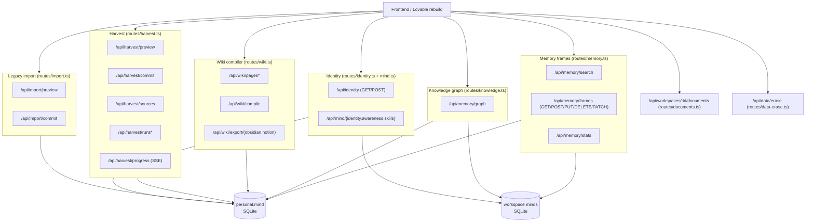
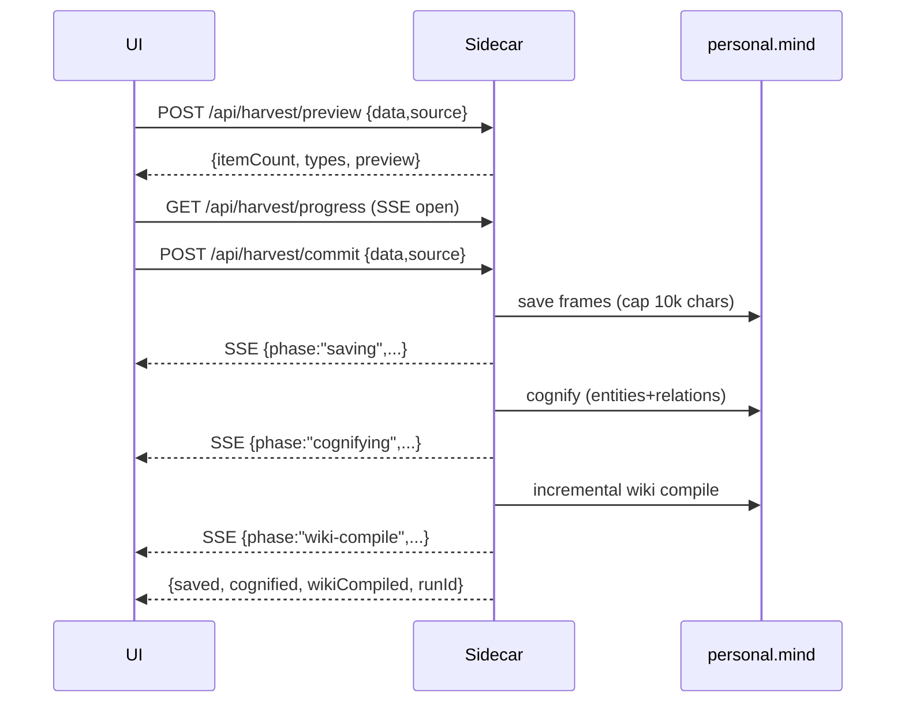

# 03b — Memory / Knowledge / Wiki / Harvest / Import / Identity API

## Purpose

This section is the frontend rebuild contract for Waggle OS's **memory subsystem** HTTP API: recalling and saving memory frames, browsing the knowledge graph, compiling and reading the personal wiki, harvesting external AI exports (ChatGPT / Claude / Gemini / Claude Code) into memory, importing conversation exports, reading/writing the agent identity record, tracking document versions, and the GDPR "right to erasure" flow. Every endpoint below is grounded in actual route files under `packages/server/src/local/routes/`. All routes are served by the **local sidecar** (Fastify), registered in `packages/server/src/local/index.ts`.

> **Scope note.** The recall/save/search/CRUD endpoints under `/api/memory/frames` and `/api/memory/search` live in `routes/memory.ts` (a sibling of the assigned files). They are the "recall/save memory" surface the rebuild needs, so they are documented here. The knowledge-graph read (`/api/memory/graph`) is in `routes/knowledge.ts`. Where a route lives in a specific file, the file is named in the per-section heading.

---

## Mental model



**Two memory scopes everywhere.** Almost every read/write accepts an optional workspace selector. The canonical query/body param is **`workspace`**, but **`workspaceId` is also accepted** as an alias (do not rely on only one). Omitting it (or passing `personal`) targets the **personal mind**. Workspace minds are separate SQLite DBs resolved via `server.agentState.getWorkspaceMindDb(id)`.

**Frame field naming.** SQLite stores `snake_case` (`created_at`, `frame_type`, `gop_id`, `access_count`). The memory routes run results through `normalizeFrame()` which emits a **camelCase UI shape** (see below). The knowledge-graph and wiki routes return **raw DB rows** (snake_case), not normalized.

---

## 1. Memory frames — recall & save (`routes/memory.ts`)

Base entity is a **memory frame**. The UI-normalized frame shape returned by search/list/edit endpoints:

| Field (UI) | Type | Source DB column | Notes |
|---|---|---|---|
| `id` | number | `id` | |
| `content` | string | `content` | |
| `source` | string | `source` | provenance: `user_stated` \| `tool_verified` \| `agent_inferred` \| `import` \| `system` |
| `source_mind` | string | (computed) | `personal` \| `workspace` — which mind it came from |
| `mind` | string | (computed) | legacy alias of `source_mind` |
| `frameType` | string | `frame_type` | `'I'` (independent) or `'P'` (predicate); defaults `'I'` |
| `importance` | string | `importance` | `critical` \| `important` \| `normal` \| `temporary` \| `deprecated` |
| `timestamp` | string (ISO) | `created_at` | |
| `score` | number? | `score` | present on search results |
| `gop` | string | `gop_id` | session/group id |
| `accessCount` | number | `access_count` | |
| `authorId` / `authorName` | string? | `author_id` / `author_name` | only on team-synced frames |
| `workspaceName` | string? | `_workspace_name` | only on global cross-workspace search |

### Endpoints

| Method | Path | Purpose |
|---|---|---|
| GET | `/api/memory/search` | Full-text search frames across personal + workspace minds |
| GET | `/api/memory/frames` | List recent frames (no query) for Memory tab initial load |
| POST | `/api/memory/frames` | Direct memory **write** (save a frame); optional entity extraction |
| PUT | `/api/memory/frames/:id` | Edit a frame's content and/or importance |
| PATCH | `/api/memory/frames/:id/access` | Atomically increment `access_count` |
| DELETE | `/api/memory/frames/:id` | Delete a frame by id |
| GET | `/api/memory/stats` | Frame/entity/relation counts (personal + optional workspace + totals) |

**`GET /api/memory/search`** — query params: `q` (required; 400 if missing), `scope` (`personal` \| `workspace` \| `all` \| `global`, default `all`), `limit` (default 20), `workspace`/`workspaceId`, `since`/`until` (ISO date strings for temporal filtering). Response: `{ results: Frame[], count: number }`. `scope=global` searches personal + every workspace mind and adds `workspaceName` to each result.

**`GET /api/memory/frames`** — params: `workspace`/`workspaceId`, `limit` (default 50), `since`/`until`. Returns `{ results: Frame[], count: number }` sorted newest-first.

**`POST /api/memory/frames`** — body `{ content (required), workspace?, importance?, source? }`, query `?extract=true|false` (default true; runs entity extraction + co-occurrence relations after save). `content` is XSS-sanitized server-side. Validates `importance` (default `normal`) and `source` (default `import`; 400 on invalid). Dedupes identical content. Response on success: `{ saved: true, frameId, mind, importance, source, extraction?: { entitiesExtracted, relationsCreated } }`. On duplicate: `{ saved: false, duplicate: true, frameId, mind, message }`. Emits a `memory_write` audit event.

**`PUT /api/memory/frames/:id`** — body `{ content (required), importance? }`, query `workspace?`. 400 on missing content / invalid importance, 404 if frame not found. Returns the normalized frame plus `updated: true`.

**`PATCH /api/memory/frames/:id/access`** — query `workspace?`. Returns `{ frameId, accessed: true, accessCount, mind }`; 404 if not found.

**`DELETE /api/memory/frames/:id`** — query `workspace?`. Returns `{ deleted: true, frameId }`; 404 if not found. Emits `memory_delete` audit event.

**`GET /api/memory/stats`** — query `workspace?`. Returns:
```json
{
  "personal":  { "frameCount": 0, "entityCount": 0, "relationCount": 0 },
  "workspace": { "frameCount": 0, "entityCount": 0, "relationCount": 0 } /* or null */,
  "total":     { "frameCount": 0, "entityCount": 0, "relationCount": 0 }
}
```

---

## 2. Knowledge graph read (`routes/knowledge.ts`)

| Method | Path | Purpose |
|---|---|---|
| GET | `/api/memory/graph` | Read entities + relations from a mind (or merged across all minds) |

**Query params:** `workspace`/`workspaceId`, `scope` (`all` \| `personal` \| `current`).

- `scope=personal` (also the default when no workspace + no scope): returns the personal mind's graph.
- `scope=all`: merges the **personal mind plus every workspace mind**, tagging each row with a `_source` field (`'personal'` or the workspace name) and re-offsetting ids/relation endpoints to avoid collisions.
- With a `workspace` id (and not `scope=all`): returns that workspace's graph; **404** `{ error: 'Workspace not found' }` if the mind can't be resolved. The workspace id is validated via `assertSafeSegment`.

**Response shape:** `{ entities: KGRow[], relations: KGRow[] }`. Rows are **raw DB rows** from the live (non-expired) graph:

```sql
SELECT * FROM knowledge_entities WHERE valid_to IS NULL ORDER BY name
SELECT * FROM knowledge_relations WHERE valid_to IS NULL ORDER BY id
```

Known `KGRow` fields (other columns pass through untyped): entities have `id`, `name`, `type`; relations have `id`, `source_id`, `target_id`, `type`. With `scope=all`, each row also carries `_source`.

> **No write/CRUD endpoints for entities/relations exist in these route files.** Entity/relation creation happens implicitly: (a) inside `POST /api/memory/frames?extract=true` (entity upsert + `co_occurs_with` relations), and (b) during the harvest **cognify** step (see §4). For direct graph mutation the rebuild would use the MCP tools (`save_entity`, `create_relation`) not an HTTP route. `KnowledgeGraph` is imported but no `POST /api/memory/graph` is registered.

---

## 3. Wiki compiler (`routes/wiki.ts`)

All wiki routes operate on the **personal mind only** (`server.multiMind.personal`). Pages are persisted in the `wiki_pages` SQLite table; metadata/state is managed by `CompilationState` from `@waggle/wiki-compiler`.

| Method | Path | Purpose |
|---|---|---|
| GET | `/api/wiki/pages` | List all compiled page metadata |
| GET | `/api/wiki/pages/:slug` | Get a single page's metadata (404 if missing) |
| GET | `/api/wiki/pages/:slug/content` | Get full markdown content of a page |
| POST | `/api/wiki/compile` | Trigger wiki compilation (incremental or full) |
| GET | `/api/wiki/health` | Compilation health report (gaps / data quality) |
| GET | `/api/wiki/watermark` | Current compilation watermark/state |
| POST | `/api/wiki/export/obsidian` | Write all pages to a local dir (Obsidian-vault layout) |
| POST | `/api/wiki/export/notion` | Push pages as child pages under a Notion root |

**`GET /api/wiki/pages`** → array of page metadata objects (`state.getAllPages()`).
**`GET /api/wiki/pages/:slug`** → single metadata object, or 404 `{ error: 'Page not found' }`.
**`GET /api/wiki/pages/:slug/content`** → `{ slug, markdown }`, or 404. Reads `SELECT markdown FROM wiki_pages WHERE slug = ?`.

**`POST /api/wiki/compile`** — body `{ mode?: 'incremental' | 'full', concepts?: string[] }` (default `incremental`). Response merges the compiler result with `{ llmProvider, llmModel }`.
**Critical degraded state:** if there is **no real embedding provider** (`server.embeddingProvider` absent or active provider is `'mock'`), returns **503** `{ error, skippedReason: 'no_real_embedder' }`. The UI must surface an "add a Voyage/OpenAI key (or Ollama embedding model)" prompt rather than treating this as a normal failure. The same 503 guard applies to `GET /api/wiki/health`.

**`GET /api/wiki/watermark`** → current `CompilationState` watermark.

**`POST /api/wiki/export/obsidian`** — body `{ outDir }`. Validation: `outDir` required (400) and **must be an absolute path** (400). 409 if there are no compiled pages yet ("Run compile first"). 500 on write failure. Output layout: `{outDir}/{pageType}/{slug}.md` plus a top-level `_index.md`.

**`POST /api/wiki/export/notion`** — body `{ rootPageUrl }` (a notion.so URL or raw page id). 400 if missing or unparseable. Requires a Vault secret named **`notion-wiki-token`** — **503** with setup instructions if absent. 409 if no compiled pages. Returns the Notion writer stats. Delta-tracking (Notion page ids per slug, content hashes) is delegated to `CompilationState`.

---

## 4. Harvest — external AI export ingestion (`routes/harvest.ts`)

Harvest ingests AI tool exports into the **personal mind**, then runs **cognify** (entity/relation extraction) and an incremental **wiki recompile**. Supported `source` values (`ImportSourceType`): `chatgpt`, `claude`, `claude-desktop`, `claude-code`, `gemini`, `google-ai-studio`, and anything else falls through to a `UniversalAdapter`.

| Method | Path | Purpose |
|---|---|---|
| POST | `/api/harvest/preview` | Parse an export and show what would be imported (no save) |
| POST | `/api/harvest/commit` | Run full pipeline: save frames → cognify → wiki recompile |
| GET | `/api/harvest/sources` | List registered harvest sources |
| POST | `/api/harvest/sources` | Register or update a source |
| DELETE | `/api/harvest/sources/:source` | Remove a registered source |
| PATCH | `/api/harvest/sources/:source` | Toggle auto-sync / interval for a source |
| GET | `/api/harvest/progress` | **SSE** stream of import progress events |
| GET | `/api/harvest/runs` | List recent harvest runs (debug/history) |
| GET | `/api/harvest/runs/latest-interrupted` | Latest resumable run (drives "Resume?" banner) |
| POST | `/api/harvest/runs/:id/abandon` | Discard an interrupted run + its cached input |
| POST | `/api/harvest/extract-identity` | LLM-extract identity facts from recent harvest frames |
| POST | `/api/harvest/scan-claude-code` | Scan local `~/.claude` dir for Claude Code history |

**`POST /api/harvest/preview`** — body `{ data, source }` (400 if either missing). Response:
```json
{
  "source": "claude",
  "itemCount": 42,
  "types": { "conversation": 40, "decision": 2 },
  "preview": [ { "id": "...", "title": "...", "type": "...", "source": "..." } ]  /* first 10 */
}
```

**`POST /api/harvest/commit`** — body `{ data?, source?, resumeFromRun? }`. Two entry modes:
- **Fresh run:** `data` + `source` required (400 otherwise). To trigger a **local filesystem scan** (Claude Code), send `data: { scanLocal: true }` with `source: 'claude-code'` — the adapter scans `~/.claude`. 400 if the source has no filesystem adapter or no default dir.
- **Resume:** `resumeFromRun: <runId>` replays a prior interrupted run's cached input. 404 if run not found; 409 if already `completed`/`abandoned`; 410 if its cached input is gone/corrupt.

Behavior: caps each item's content at **10,000 chars**, preserves the original `item.timestamp` (strict ISO-8601 validation; falls back to ingest wall-clock with a logged warning otherwise), skips work if the content hash matches the last sync (`skipped: true`), then runs cognify and an incremental wiki compile (both fail-soft and both skip with a reason if there's no real embedder). Success response:
```json
{
  "source": "claude",
  "itemCount": 42,
  "saved": 42,
  "cognified": 42,
  "cognifySkippedReason": null,            /* or "no_real_embedder" */
  "entitiesExtracted": 18,
  "relationsCreated": 7,
  "wikiCompiled": { "pagesCreated": 3, "pagesUpdated": 1, "pagesUnchanged": 12 },
  "wikiSkippedReason": null,               /* or "no_real_embedder" */
  "runId": 17,
  "message": "Imported 42 items from claude, cognified 42 frames, wiki 4 pages updated"
}
```
Other commit responses: nothing found → `{ saved: 0, message }`; unchanged since last sync → `{ saved: 0, skipped: true, message }`; personal mind unavailable → **503**.

**`GET /api/harvest/sources`** → `{ sources: HarvestSource[] }`. A source row carries (from `HarvestSourceStore`) `source`, display name, `sourcePath`, sync tracking incl. `lastContentHash`, and auto-sync config.
**`POST /api/harvest/sources`** — body `{ source, displayName (both required → 400), sourcePath?, autoSync?, syncIntervalHours? }`. → `{ source: HarvestSource }`.
**`DELETE /api/harvest/sources/:source`** → `{ ok: true }`.
**`PATCH /api/harvest/sources/:source`** — body `{ autoSync?, syncIntervalHours? }` → `{ source: HarvestSource }`.

**`GET /api/harvest/progress`** — Server-Sent Events. Each event is `data: <json>` where json is `{ phase, current, total, source }`. Phases observed: `saving`, `cognifying`, `wiki-compile`. The UI subscribes on mount.

**`GET /api/harvest/runs`** — query `limit` (default 50, max 500) → `{ runs: HarvestRun[] }`.
**`GET /api/harvest/runs/latest-interrupted`** → `{ run: HarvestRun | null }` (null if no resumable run or its cache file no longer exists). Run states: `running`, `failed`, `completed`, `abandoned`.
**`POST /api/harvest/runs/:id/abandon`** — 400 invalid id, 404 not found; returns the (now abandoned) run.

**`POST /api/harvest/extract-identity`** — scans the most recent 50 `harvest` frames, sandboxes them, and calls the internal Haiku proxy (`claude-haiku-4-5`) to extract `{ name, role, company, industry, bio }` suggestions. Server-side gate: only fields with `confidence >= 0.5` survive (`MIN_SUGGESTION_CONFIDENCE`). Persists to `profile.identitySuggestions`. Response: `{ suggestions: IdentitySuggestion[] }` (with `note: 'no_anthropic_key'` if no Anthropic key in Vault). 503 if personal mind unavailable. `IdentitySuggestion = { field, value, confidence, sourceHint, extractedAt }`.

**`POST /api/harvest/scan-claude-code`** — scans `~/.claude`. Response `{ found, path, itemCount, types?, preview? }` (`preview` = first 20 items with `id`, `title`, `type`, `metadata`).

---

## 5. Legacy import (`routes/import.ts`)

A simpler, older import path for **ChatGPT and Claude only** (`ImportSource = 'chatgpt' | 'claude'`). Distinct from harvest: no run-store, no cognify, no wiki recompile, no SSE.

| Method | Path | Purpose |
|---|---|---|
| POST | `/api/import/preview` | Parse a ChatGPT/Claude export, show extraction (no save) |
| POST | `/api/import/commit` | Parse + extract + save knowledge items to personal memory |

Both take body `{ data, source }`. 400 if missing, or if `source` is not exactly `"chatgpt"` or `"claude"`. Both return the `ImportResult` shape:

```json
{
  "source": "chatgpt",
  "conversationsFound": 10,
  "conversationsParsed": 10,
  "knowledgeExtracted": [
    { "type": "decision|fact|preference|topic",
      "content": "...",
      "source": "chatgpt|claude",
      "conversationTitle": "...",
      "importance": "important|normal" }
  ],
  "errors": []
}
```

`/api/import/commit` additionally writes each extracted item as an `import`-source frame and adds `{ saved: <n>, message }`. If nothing was extracted: `{ ...result, saved: 0, message: 'No knowledge items found to import' }`. 503 if personal mind unavailable; 500 on save failure.

---

## 6. Identity (`routes/identity.ts`) + Mind context (`routes/mind.ts`)

### Identity record (`routes/identity.ts`)

Single-row-per-mind identity table (id = 1), so create + update collapse into upsert. Defaults to the personal mind; `?workspace=<id>` selects a workspace-scoped identity (each mind owns its own identity row).

| Method | Path | Purpose |
|---|---|---|
| GET | `/api/identity` | Read the identity record (placeholder shape if unconfigured) |
| POST | `/api/identity` | Create or update the identity record (upsert) |

**`GET /api/identity?workspace=<id>`** always returns 200 with the same `IdentityResponseShape`:
```json
{
  "configured": true,
  "name": null, "role": null, "department": null,
  "personality": null, "capabilities": null, "system_prompt": null,
  "created_at": null, "updated_at": null,
  "_note": "identity not configured for this mind"   /* present only on placeholder */
}
```
When unconfigured/uninitialized, `configured: false` and all fields `null` with a `_note` explaining why. The UI sees **one consistent shape** regardless of state.

**`POST /api/identity`** — body `{ workspace?, name?, role?, department?, personality?, capabilities?, system_prompt? }` (all optional, default to empty string). Returns the saved `IdentityResponseShape` (`configured: true` + populated `created_at`/`updated_at`). 503 if multi-mind not initialized; 500 on write failure.

### Mind context (`routes/mind.ts`)

Read-only context the CLI also accesses directly via the Orchestrator.

| Method | Path | Purpose |
|---|---|---|
| GET | `/api/mind/identity` | Agent identity **context string** → `{ identity }` |
| GET | `/api/mind/awareness` | Current awareness state context → `{ awareness }` |
| GET | `/api/mind/skills` | Loaded skills list → `{ skills: [{ name, length }], count }` |

> Note: `/api/mind/identity` returns the orchestrator's rendered identity **context** (`identity.toContext()`), not the structured record — that structured record is `/api/identity`.

---

## 7. Document version registry (`routes/documents.ts`)

Tracks document **versions** per workspace. Stored as JSON on disk at `~/.waggle/workspaces/{id}/documents.json` — **not** in SQLite. Part of Wave 7. All path segments validated via `assertSafeSegment`.

| Method | Path | Purpose |
|---|---|---|
| GET | `/api/workspaces/:id/documents` | List tracked documents (name + version count + latest) |
| POST | `/api/workspaces/:id/documents` | Register a new document version (auto-increments version) |
| GET | `/api/workspaces/:id/documents/:name/versions` | List all versions of one document |

**`GET .../documents`** → `{ documents: [{ name, versionCount, latestVersion: DocumentVersion | null }] }`.
**`POST .../documents`** — body `{ name (required), path (required), sizeBytes? }`. 400 if name/path missing. Auto-assigns `version` = lastVersion+1 (starts at 1). Returns **201** `{ document: <name>, version: DocumentVersion }`.
**`GET .../:name/versions`** → `{ name, versions: DocumentVersion[] }`; 404 if document not found.

`DocumentVersion = { version: number, path: string, createdAt: string (ISO), sizeBytes: number }`.

---

## 8. GDPR data erasure (`routes/data-erase.ts`)

Right-to-erasure (GDPR Art. 17). **The route does NOT delete anything** — it validates, snapshots, and writes a marker file. The destructive wipe runs at next service startup, before any DB is opened.

| Method | Path | Purpose |
|---|---|---|
| POST | `/api/data/erase` | Schedule full erasure of this install's data dir at next startup |

**Double confirmation gate (both required):**
1. HTTP header **`X-Confirm-Erase: yes`** (exact, case-sensitive).
2. Body field **`{ "confirmation": "I UNDERSTAND THIS IS PERMANENT" }`** (exact phrase).

Failure responses:
- Missing/wrong confirmation → **400** `{ error: 'ERASE_NOT_CONFIRMED', message, requirements: { header, bodyField } }` (the `requirements` object literally tells the UI the exact header value and body phrase needed).
- Data dir doesn't look like a Waggle dir → **400** `{ error: 'ERASE_REFUSED_UNSAFE_PATH', message }`.
- Marker write fails → **500** `{ error: 'ERASE_MARKER_WRITE_FAILED', message }`.

Success → **200**:
```json
{
  "requestedAt": "2026-06-06T...Z",
  "markerPath": "...",
  "dataDirSnapshot": { "fileCount": 0, "totalBytes": 0, "topLevelEntries": [] },
  "instruction": "Quit Waggle and relaunch — erasure completes during startup. ..."
}
```
Emits a `data_erase_requested` audit event **before** writing the marker (audit survives even if the marker write fails).

---

## Frontend rebuild cheat-sheet

- **Workspace param:** send `workspace=<id>` (alias `workspaceId` also works). Omit / `personal` → personal mind.
- **Frame shape differs by route:** memory routes return **camelCase normalized** frames; knowledge-graph + wiki routes return **raw snake_case** rows.
- **No real embedder = 503 with `skippedReason: 'no_real_embedder'`** on `/api/wiki/compile` and `/api/wiki/health`, and `*SkippedReason` flags inside the harvest commit response. Build UI affordances to prompt for an embedding key.
- **Harvest vs Import:** harvest (`/api/harvest/*`) is the rich, resumable, multi-source pipeline with SSE + cognify + wiki recompile; import (`/api/import/*`) is the legacy ChatGPT/Claude-only path. Prefer harvest.
- **Two identity surfaces:** `/api/identity` = structured editable record (GET/POST upsert, always one shape); `/api/mind/identity` = read-only rendered context string. Don't confuse them.
- **Erasure needs both** the `X-Confirm-Erase: yes` header **and** the exact body phrase — and the 400 response hands you the exact requirements.
- **Personal-mind-not-available → 503** is a common guard across harvest/import/identity write routes; handle it as a transient backend-not-ready state.


---

## File Ingestion (`ingest.ts`) — `POST /api/ingest`

> Added to close audit gap #1. This is the endpoint the UI's file-upload / drag-drop surface calls to turn user files into LLM-ready text and (optionally) memory frames. Distinct from `/api/harvest/*` (conversation exports) and `/api/import` (memory import).

| Method | Path | Request body | Response | Streaming? |
|---|---|---|---|---|
| `POST` | `/api/ingest` | `{ files: { name: string, content: string }[], workspaceId?: string }` — `content` is **base64**. Route `bodyLimit` = **15 MB** (allows base64 overhead) | `{ files: IngestFileResult[] }` | No |

**`IngestFileResult`** = `{ name: string; type: FileType; summary: string; content?: string }`
where `type` ∈ `image | document | spreadsheet | csv | text | archive | unsupported`.
- For **images**, `content` is a `data:<mime>;base64,...` data URI (passed straight to a vision model).
- For everything else, `content` is the **extracted plain text** (omitted for `unsupported` / failed extraction).

**Validation & error codes** (per-file, fail-fast):
| Condition | Code |
|---|---|
| `files` missing / not an array / empty | `400 { error: "files array is required" }` |
| file entry missing `name` or non-string `content` | `400 { error: "Invalid file entry: <name>" }` |
| `content` not well-formed base64 (`/^[A-Za-z0-9+/]*={0,2}$/`) | `400 { error: "Invalid base64 content for file: <name>" }` |
| decoded size > **10 MB** (`MAX_FILE_SIZE`, est. `content.length * 0.75`) | `413 { error: "File <name> exceeds 10 MB limit" }` |
| `workspaceId` fails `assertSafeSegment` (path-traversal guard) | throws (4xx) before any fs touch |

**Supported extraction** (extension → handler):
- **Images** png/jpg/jpeg/gif/webp/svg/bmp/ico/tiff → data URI.
- **Documents** pdf (`pdf-parse`), docx (`mammoth`), pptx (`adm-zip`, reads `ppt/slides/slideN.xml`). Missing optional dep or scanned/encrypted file → graceful `summary` with no `content`.
- **Spreadsheets** xlsx/xls (`exceljs`, each sheet → CSV-ish text).
- **csv** (RFC-4180 line parse, reports columns/rows).
- **Text/code** ~50 extensions (md/txt/json/yaml/ts/js/py/rs/go/sql/dockerfile/...).
- **Archives** zip → lists up to 50 entry names (no extraction).
- Unknown extension → `type: "unsupported"`, skipped from side effects.

**Side effects** (only when `workspaceId` is set and ≠ `"default"`, both non-blocking — ingest still 200s if they fail):
1. Appends each non-unsupported result to the workspace **file registry** `workspaces/<id>/files.jsonl` (`{ name, type, summary, sizeBytes, ingestedAt }` — this is what `GET /api/files` reads, see 04-feature-map).
2. Saves a **memory frame** per file via `orchestrator.autoSaveFromExchange("User uploaded file: <name>", "File ingested: ... + 500-char preview")` so uploads persist across sessions.
