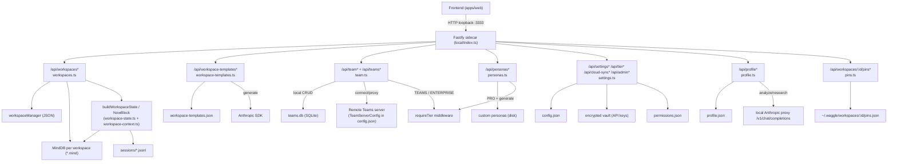

# 03c · Workspace, Team, Persona, Settings, Profile & Pins API

## Purpose

This section is the contract for the management-plane of Waggle OS: how the frontend creates and inspects **workspaces** (and their pre-configured **templates**), manages **teams** and members, lists/creates **personas**, reads/writes **settings** (models, budgets, autonomy, tiers), maintains the **user profile** (identity, writing-style, brand), and pins/favorites chat messages. Every endpoint below is served by the **local Fastify sidecar** (the Node process bundled into the Tauri app, default loopback port `3333`); the frontend talks to it over HTTP with **no auth header** (loopback-trust model). All persistence is local — SQLite (`teams.db`, per-workspace `*.mind`) or JSON files under the data dir (`~/.waggle` by default).

> Source files read for this section:
> `packages/server/src/local/routes/{workspaces.ts, workspace-templates.ts, team.ts, personas.ts, settings.ts, profile.ts, pins.ts}` and the prompt-builder helpers `packages/server/src/local/{workspace-sessions.ts, workspace-state.ts}` plus `packages/server/src/local/routes/workspace-context.ts`.
>
> **Important framing for the rebuild:** `workspace-context.ts` and `workspace-state.ts` are **NOT HTTP routes**. They are internal prompt-builder modules (`buildWorkspaceNowBlock`, `buildWorkspaceState`, `formatWorkspaceNowPrompt`) consumed by `chat.ts`, `commands.ts`, and `workspaces.ts` to assemble the agent's system prompt. Their output reaches the frontend only as a sub-object on `GET /api/workspaces/:id/context` (the `workspaceState` field) — see [Workspace "Now"/state model](#the-workspace-now--state-model-internal). The frontend never calls them directly.

---

## 1. Endpoint Reference (every route)

All paths are relative to the sidecar base URL (e.g. `http://127.0.0.1:3333`). Responses are JSON unless noted. Tier gating uses the `requireTier(...)` preHandler from `middleware/assert-tier.ts`.

### 1.1 Workspaces — lifecycle (`workspaces.ts`)

| Method | Path | Purpose |
|---|---|---|
| GET | `/api/workspaces` | List all workspaces. Optional `?group=` and `?teamId=` filters. Returns a bare array. |
| POST | `/api/workspaces` | Create a workspace (enforces tier `workspaceLimit`). Returns the created workspace (201). |
| GET | `/api/workspaces/:id` | Get one workspace by id (404 if missing). |
| GET | `/api/workspaces/:id/context` | **The "Workspace Now" catch-up block** — summary, recent threads, suggested prompts, stats, greeting, structured state. Used when opening a workspace. |
| GET | `/api/workspaces/:id/files` | List ingested/registered files for the workspace (newest first). |
| PUT | `/api/workspaces/:id` | Update workspace (full-ish). `personaId: null` is ignored on PUT (kept). Validates `model`. |
| PATCH | `/api/workspaces/:id` | Partial update. `personaId: null` **clears** the persona on PATCH. |
| DELETE | `/api/workspaces/:id` | Delete workspace + its mind DB (204). |
| GET | `/api/workspaces/:id/export` | Export workspace. `?format=briefing` → markdown; default → JSON dump (memories, pins, sessions). |
| GET | `/api/workspaces/:id/cost` | Per-workspace spend vs budget, status (`ok`/`warning`/`exceeded`), 7-day history. |
| GET | `/api/workspaces/:id/storage` | Virtual/linked storage stats for the workspace. |
| GET | `/api/workspaces/:id/storage/files` | List files in workspace storage (optional `?dir=`). |
| GET | `/api/workspaces/:id/storage/read` | Read a file. `?path=` required; `?raw=true` returns raw bytes, else a JSON wrapper. |
| POST | `/api/workspaces/:id/storage/write` | Write a file. `?path=` required, body `{ content }`. Returns 201. |
| DELETE | `/api/workspaces/:id/storage/delete` | Delete a file. `?path=` required. Returns 204. |

> **Persona switching** is done through these workspace update routes: set `personaId` on the workspace (PUT/PATCH). There is no dedicated `/api/personas/active` endpoint. A per-request persona override is also accepted by the chat route (`persona` field in the chat body, out of scope here). The workspace's `personaId` is the persistent default.

### 1.2 Workspace Templates (`workspace-templates.ts`)

| Method | Path | Purpose |
|---|---|---|
| GET | `/api/workspace-templates` | List all templates: 15 built-in + user-created. Returns `{ templates, count }`. |
| POST | `/api/workspace-templates` | Create a custom template (validated). Returns the template (with generated `id`). |
| PUT | `/api/workspace-templates/:id` | Update a custom template. 403 if `id` is built-in, 404 if not found. |
| DELETE | `/api/workspace-templates/:id` | Delete a custom template. 403 if built-in, 404 if not found. Returns `{ ok: true }`. |
| POST | `/api/workspace-templates/generate` | AI-generate a template config from a prompt (needs Anthropic key in `settings.json`). |

### 1.3 Team (`team.ts`)

Two sub-families: **team-server connection** (proxy to a remote Teams server) and **local team CRUD** (works solo with a local user id, stored in `teams.db`).

| Method | Path | Purpose |
|---|---|---|
| POST | `/api/team/connect` | Connect to a remote team server (validate token via its `/health`). **Tier-gated: `TEAMS`.** Stores config; never echoes token. |
| POST | `/api/team/disconnect` | Clear stored team-server config. Returns `{ disconnected: true }`. |
| GET | `/api/team/status` | Current connection status `{ connected, serverUrl?, userId?, displayName? }`. |
| GET | `/api/team/teams` | List teams from the remote server (proxied). 401 if not connected. |
| GET | `/api/team/members` | List members from remote server, or local fallback `[{ id:'local', name:'You', status:'online' }]`. |
| GET | `/api/team/presence` | Presence (`?workspaceId=`). Remote proxy, else self-as-online fallback. Emits `presence_update` on the event bus. |
| GET | `/api/team/activity` | Recent activity (`?workspaceId=&limit=`, max 50). Maps remote `memory_frame` entities to activity items. Empty if disconnected. |
| GET | `/api/team/messages` | Recent WaggleDance messages (`?workspaceId=&limit=`, max 50). Emits a `message` notification if any. |
| GET | `/api/team/governance/permissions` | Effective capability permissions (`?workspaceId=`). **Tier-gated: `ENTERPRISE`.** 5-min in-memory cache; returns stale on fetch failure. |
| GET | `/api/team/memory/search` | Search team memory frames (`?q=&limit=`, max 50). 400 if not connected or `q` missing. Client-side keyword filter. |
| POST | `/api/teams` | Create a local team. Body `{ name, description? }`. Auto-adds creator as `owner`. Returns 201 with members. |
| GET | `/api/teams` | List teams the local user belongs to `{ teams: [...] }`. |
| GET | `/api/teams/:id` | Team detail + members + linked workspaces. 404 if missing. |
| PUT | `/api/teams/:id` | Update team name/description. Requires `owner` or `admin`. |
| DELETE | `/api/teams/:id` | Delete team (owner only). Unlinks workspaces. Returns 204. |
| POST | `/api/teams/:id/members` | Add/invite member. Body `{ userId?, email?, displayName?, role? }`. Requires owner/admin. 409 if already member. |
| PUT | `/api/teams/:id/members/:userId` | Change member role. **Owner only.** |
| PATCH | `/api/teams/:id/members/:userId` | Change member role (alias for PUT). **Owner or admin.** |
| DELETE | `/api/teams/:id/members/:userId` | Remove member. Owner/admin can remove anyone; a member can remove self. Cannot remove the owner. |
| GET | `/api/teams/:id/activity` | Aggregated audit events across the team's workspaces (`?limit=` max 200, `?from=` ISO; defaults to last 7 days). |

> Note: a **second, different** `teamRoutes` exists at `packages/server/src/routes/teams.ts` registered by the *non-local* server `index.ts`. This section documents the **local** sidecar version (`local/routes/team.ts`), which is what the desktop frontend hits.

### 1.4 Personas (`personas.ts`)

| Method | Path | Purpose |
|---|---|---|
| GET | `/api/personas` | List persona catalog (no system prompts). Returns `{ personas: [...] }`. |
| POST | `/api/personas` | Create a custom persona. **Tier-gated: `PRO`.** Requires `name` + `systemPrompt`. 409 if id collides with built-in. Returns 201. |
| PATCH | `/api/personas/:id` | Update a custom persona (merge). 403 for built-ins, 404 if custom not found. |
| POST | `/api/personas/generate` | AI-generate a persona from a prompt. **Tier-gated: `PRO`.** 503 if LLM unavailable. |
| DELETE | `/api/personas/:id` | Delete a custom persona. 403 for built-ins, 404 if not found. Returns `{ deleted: true, id }`. |

### 1.5 Settings, Tier, Budget, Cloud Sync, Admin (`settings.ts`)

| Method | Path | Purpose |
|---|---|---|
| GET | `/api/settings` | Read config: models, budgets, providers (API keys **masked**), `mindPath`, `dataDir`, `litellmUrl`, `onboardingCompleted`. |
| PUT | `/api/settings` | Update models/budgets/providers. Secrets go to the encrypted vault; non-secrets to `config.json`. |
| PATCH | `/api/settings` | Partial merge for non-provider settings (e.g. `onboardingCompleted`). |
| POST | `/api/settings/test-key` | Validate an API key's **format** (no network call). Body `{ provider, apiKey }`. |
| GET | `/api/settings/permissions` | Read `{ defaultAutonomy, externalGates, workspaceOverrides }`. |
| PUT | `/api/settings/permissions` | Save permission settings. Accepts new `defaultAutonomy` enum or legacy `yoloMode` boolean. |
| GET | `/api/tier` | **Authoritative tier source** for the frontend (effective tier, trial days, capabilities, usage, legacy `limits`). |
| PATCH | `/api/tier` | Dev/test tier override. **403 unless `WAGGLE_ALLOW_TIER_OVERRIDE=1`** (fail-closed). |
| POST | `/api/tier/start-trial` | Atomically start the 15-day TRIAL. **409 if already started** (idempotent — one trial per install). |
| GET | `/api/cloud-sync` | Cloud-sync availability/enabled/connected status. |
| POST | `/api/cloud-sync/toggle` | Enable/disable cloud sync. **Tier-gated: `TEAMS`.** Body `{ enabled }`. |
| GET | `/api/admin/overview` | Admin dashboard data (usage, workspaces, plugins). **Tier-gated: `TEAMS`.** |
| GET | `/api/admin/audit-export` | Export audit log. **Tier-gated: `TEAMS`.** `?format=json|csv`, `?from=&to=` ISO. |

### 1.6 User Profile (`profile.ts`)

| Method | Path | Purpose |
|---|---|---|
| GET | `/api/profile` | Full profile (identity, writingStyle, brand, interests, meta). |
| PUT | `/api/profile` | Partial-merge update. Also mirrors identity into personal memory frames. |
| POST | `/api/profile/analyze-style` | LLM-analyze a writing sample (min 50 chars) → fills `writingStyle`. |
| POST | `/api/profile/analyze-brand` | LLM-extract brand colors/fonts from a description → fills `brand`. |
| GET | `/api/profile/style` | Writing-style summary (for agent injection). |
| GET | `/api/profile/brand` | Brand profile (for document-generation tools). |
| POST | `/api/profile/research` | LLM-research the user/company → writes a bio. 400 if no name/company set. |

### 1.7 Pins (`pins.ts`)

| Method | Path | Purpose |
|---|---|---|
| GET | `/api/workspaces/:id/pins` | List pinned messages for a workspace `{ pins }`. |
| POST | `/api/workspaces/:id/pins` | Add a pin. Body `{ messageContent, messageRole, label? }`. Returns 201 `{ pin }`. |
| PATCH | `/api/workspaces/:id/pins/:pinId` | Update a pin's `status` (`draft`/`final`) or `label`. 404 if not found. |
| DELETE | `/api/workspaces/:id/pins/:pinId` | Remove a pin. 404 if not found. Returns `{ ok: true }`. |

---

## 2. Data Shapes (real field names & types)

### 2.1 Workspace object (returned by GET/POST/PUT `/api/workspaces`)

The workspace object is produced by `server.workspaceManager`. Observed/used fields:

| Field | Type | Notes |
|---|---|---|
| `id` | string | Workspace id. Used as a path segment (validated by `assertSafeSegment`). |
| `name` | string | Required on create. |
| `group` | string | Required on create. Filterable via `?group=`. |
| `icon` | string? | |
| `model` | string? | Validated against `/^[a-zA-Z0-9][\w./-]*$/`. |
| `personaId` | string? | The workspace's default persona. `PATCH ... { personaId: null }` clears it. |
| `agentGroupId` | string? | |
| `directory` | string? | Linked local filesystem dir (if any). |
| `tone` | `'professional'\|'casual'\|'technical'\|'legal'\|'marketing'`? | |
| `templateId` | string? | Set from `template`/`templateId` on create. |
| `storageType` | `'virtual'\|'local'\|'team'`? | |
| `storagePath` / `storageConfig` | string? / object? | For local/team storage. |
| `teamId` / `team` | string? | Link to a team (`team` is a legacy alias; both are checked). |
| `teamServerUrl` / `teamRole` / `teamUserId` | string? / role? / string? | Team-server linkage. |
| `budget` | number? | Per-workspace dollar budget (used by `/cost`). |
| `created` | string (ISO) | |

**POST `/api/workspaces` request body** accepts all of: `name`(req), `group`(req), `icon`, `model`, `personaId`, `directory`, `template`, `templateId`, `tone`, `storageType`, `storagePath`, `storageConfig`, `teamId`, `teamServerUrl`, `teamRole`, `teamUserId`.

**Create side effects (frontend should expect these to "just happen"):** auto-create file dir structure; auto-install starter skills (first time); seed `template.starterMemory` as visible memory frames (unless `blank`); install a template capability-pack (best-effort); register on team server if `teamId`+`teamServerUrl`; emit `workspace_create` audit event + telemetry.

### 2.2 `GET /api/workspaces/:id/context` response (the catch-up block)

```jsonc
{
  "workspace": { "id", "name", "group", "model", "directory", "templateId", "personaId" },
  "summary": "string",                  // narrative; falls back to a generic line for empty ws
  "recentThreads": [ { "id", "title", "lastActive" } ],   // top 5 by mtime
  "recentDecisions": [ { "content", "date" } ],           // up to 5
  "suggestedPrompts": ["string"],       // contextual; onboarding prompts if brand-new
  "recentMemories": [ { "content", "importance", "date" } ],
  "progressItems": [ { "type", "content", ... } ],        // up to 10
  "stats": { "memoryCount", "sessionCount", "fileCount" },
  "lastActive": "ISO",
  "greeting": "string",                 // time-aware + inactivity-aware
  "pendingTasks": ["string"],           // up to 5 (tasks + blockers)
  "upcomingSchedules": ["string"],      // next 3 cron schedules, "name at <time>"
  "welcomeMessage": "string|undefined", // template-specific first-time copy
  "teamContext": { "isTeam", "teamId", "tasks": [...] } | undefined,
  "workspaceState": { /* WorkspaceState — see §4 */ } | null,
  "crossWorkspaceHints": undefined      // intentionally disabled (privacy); always absent
}
```

### 2.3 `WorkspaceTemplate` (`workspace-templates.ts`)

```ts
type TemplateCategory = 'sales'|'research'|'engineering'|'marketing'|'operations'|'legal'|'design'|'custom';

interface WorkspaceTemplate {
  id: string;
  name: string;
  description: string;
  persona: string;            // persona id, e.g. 'sales-rep'
  connectors: string[];       // e.g. ['github','email','slack']
  suggestedCommands: string[];// e.g. ['/research','/draft']
  starterMemory: string[];    // seeded into the new workspace's mind
  builtIn: boolean;           // true = cannot edit/delete
  category?: TemplateCategory;
}
```

**The 15 built-in template ids** (frontend can rely on these): `sales-pipeline`, `research-project`, `code-review`, `marketing-campaign`, `product-launch`, `legal-review`, `agency-consulting`, `customer-support`, `finance-accounting`, `hr-people`, `operations-center`, `data-analytics`, `recruiting-pipeline`, `design-studio`, `blank`.

POST/PUT validation requires: `name`, `description`, `persona` (all non-empty strings) and `connectors`, `suggestedCommands`, `starterMemory` (all arrays). Custom ids are generated as `custom-<timestamp>-<rand>`.

`POST /api/workspace-templates/generate` body: `{ prompt, availableConnectors, availableCommands, availablePersonas }` → returns `{ name, description, persona, connectors, suggestedCommands, starterMemory }`. Requires an Anthropic `apiKey` in `settings.json` (400 if absent), uses model `claude-sonnet-4-6` by default.

### 2.4 Team & Member (local CRUD — `teams.db`)

`teams.db` schema (created on first use):

```sql
teams(id TEXT PK, name, description DEFAULT '', owner_id, created, updated)
team_members(team_id, user_id, role CHECK(role IN ('owner','admin','member','viewer')) DEFAULT 'member',
             display_name DEFAULT '', email, joined,
             PRIMARY KEY(team_id,user_id), FOREIGN KEY(team_id)->teams(id) ON DELETE CASCADE)
```

Normalized API shapes (camelCase):

| Team field | From row | | Member field | From row |
|---|---|---|---|---|
| `id` | `id` | | `userId` | `user_id` |
| `name` | `name` | | `role` | `role` (`owner`/`admin`/`member`/`viewer`) |
| `description` | `description` | | `displayName` | `display_name` |
| `ownerId` | `owner_id` | | `email` | `email` (nullable) |
| `created` | `created` | | `joined` | `joined` |
| `updated` | `updated` | | | |

`GET /api/teams/:id` also returns `members: Member[]` and `workspaces: Workspace[]` (those whose `teamId`/`team` matches).

**Role enforcement matrix (local CRUD):**
- Update team → owner or admin
- Delete team → owner only
- Add member → owner or admin
- Change role → owner only (`PUT`) / owner or admin (`PATCH`)
- Remove member → owner/admin (anyone) or self; **never the owner**

### 2.5 Team-server connection config (`TeamServerConfig`, in `@waggle/core`)

```ts
interface TeamServerConfig { url: string; token?: string; userId?: string; displayName?: string; }
```
Stored via `WaggleConfig.setTeamServer/clearTeamServer/getTeamServer`. Tokens are **never** returned to the client (`/connect` echoes `token: '***'`).

### 2.6 Persona (catalog item from `GET /api/personas`)

System prompts and `failurePatterns` are **intentionally omitted** from GET (large/sensitive). The catalog item is:

| Field | Type | Notes |
|---|---|---|
| `id` | string | |
| `name` | string | |
| `description` | string | |
| `icon` | string | emoji |
| `workspaceAffinity` | string[] | which workspace types it fits |
| `suggestedCommands` | string[] | |
| `tagline` | string? | powers PersonaSwitcher hover card |
| `bestFor` | string[]? | hover card |
| `wontDo` | string? | hover card hard-boundary |
| `isReadOnly` | boolean? | true = no write tools ever |

Full `AgentPersona` (used by POST/PATCH) adds: `systemPrompt` (required on create), `modelPreference` (default `claude-sonnet-4-6`), `tools: string[]`, `defaultWorkflow`. Generated personas (`/generate`) return `{ name, description, icon, systemPrompt, tools }`.

### 2.7 Settings response (`GET /api/settings`)

```jsonc
{
  "defaultModel": "string",
  "fallbackModel": "string|null",
  "budgetModel": "string|null",
  "budgetThreshold": 0.8,             // 0..1 fraction
  "providers": {                      // keyed by provider name
    "<name>": { "apiKey": "sk-xxx...yyyy" /* MASKED */, "models": ["..."], "baseUrl": "..." }
  },
  "mindPath": "string",
  "dataDir": "string",
  "litellmUrl": "string",
  "dailyBudget": 0,                   // dollars; null = no limit
  "budgetHardCap": false,             // true = block, false = warn
  "onboardingCompleted": false
}
```
`PUT /api/settings` accepts `{ defaultModel?, providers?, dailyBudget?, budgetHardCap?, fallbackModel?, budgetModel?, budgetThreshold? }`. API keys in `providers` are written to the **encrypted vault**; non-secret fields also mirrored to `config.json`. Keys are always masked on the way out via `maskApiKey` (`first7 + '...' + last4`).

### 2.8 Permissions (`GET/PUT /api/settings/permissions`)

```ts
type AutonomyLevel = 'normal' | 'trusted' | 'yolo';
interface PermissionsData {
  defaultAutonomy: AutonomyLevel;     // normal=gate writes; trusted=auto writes; yolo=auto all but blacklist
  externalGates: string[];
  workspaceOverrides: Record<string, string[]>;
}
```
Legacy `yoloMode: boolean` is accepted on PUT and migrated (`true`→`yolo`, else `normal`). Invalid `defaultAutonomy` → 400.

### 2.9 Tier response (`GET /api/tier`) — authoritative

```jsonc
{
  "tier": "FREE|PRO|TEAMS|ENTERPRISE|TRIAL",   // EFFECTIVE tier (trial expiry applied)
  "rawTier": "TRIAL",                          // stored tier before expiry resolution
  "trialStartedAt": "ISO|null",
  "trialDaysRemaining": 0,
  "trialExpired": false,                        // rawTier==='TRIAL' && effective==='FREE'
  "capabilities": { /* TierCapabilities from @waggle/shared */ },
  "teamsServerUrl": "http://127.0.0.1:3101|null",
  "teamsServerAvailable": false,
  "usage": { "workspaceCount": 0 },
  "limits": {                                   // LEGACY shape — kept for compat
    "maxWorkspaces": -1, "maxSessions": 3, "maxMembers": -1,
    "features": { "teams", "marketplace", "budgetControls", "kvark", "governance", "customModels" }
  }
}
```
Tier defaults to `FREE` if `config.json` has none. `parseTier` auto-migrates legacy lowercase names. Capabilities (`workspaceLimit`, `teamMembersLimit`, `sharedWorkspaces`, `adminPanel`, `cloudSync`, etc.) come from `@waggle/shared`.

### 2.10 UserProfile (`profile.json`)

```ts
interface UserProfile {
  // Identity
  name; role; company; industry; bio; avatarUrl: string;
  identitySuggestions: IdentitySuggestion[];   // harvest-extracted, awaiting review
  // Writing Style
  writingStyle: { tone; sentenceLength; vocabulary; structure: string; samples: string[]; analyzed: boolean };
  // Brand & Visual Identity
  brand: {
    companyName; primaryColor; secondaryColor; accentColor; fontHeading; fontBody; logoDescription: string;
    styles: {
      docx: { margins; headerStyle; notes };
      pptx: { layout; colorScheme; notes };
      pdf:  { coverPage; reportStyle; notes };
      xlsx: { headerFormat; chartColors; notes };
    };
    analyzed: boolean;
  };
  // Prefs & Meta
  interests: string[]; communicationStyle; language; timezone: string;
  questionnaireCompleted: boolean; createdAt; updatedAt: string;
}

interface IdentitySuggestion {
  field: 'name'|'role'|'company'|'industry'|'bio';
  value: string; confidence: number /*0..1*/; sourceHint: string; extractedAt: string;
}
```
Defaults seed `brand.primaryColor='#D4A84B'`, fonts `Inter`, `language='en'`, `timezone` from the runtime, `writingStyle.tone='professional'`. PUT does a deep merge (nested `writingStyle` / `brand.styles` merged, not replaced). Analyze/research endpoints call the local Anthropic proxy (`/v1/chat/completions`) with `claude-haiku-4-5`; they 503 if no `anthropic` key in the vault.

### 2.11 PinnedItem (`pins.json`)

```ts
interface PinnedItem {
  id: string;                     // crypto.randomUUID()
  workspaceId: string;
  messageContent: string;
  messageRole: 'assistant' | 'user';
  pinnedAt: string;               // ISO
  label?: string;
  status?: 'draft' | 'final';     // W7.4
}
```
Stored at `~/.waggle/workspaces/{id}/pins.json` (note: pins use `os.homedir()/.waggle`, not the configurable `dataDir`).

---

## 3. Persistence map (where each thing lives)

| Subsystem | Storage | Path |
|---|---|---|
| Workspaces (list/meta) | `server.workspaceManager` (JSON) | under data dir |
| Per-workspace memory | SQLite `MindDB` | `getMindPath(id)` (`*.mind`) |
| Workspace sessions | JSONL files | `{dataDir}/workspaces/{id}/sessions/*.jsonl` |
| User templates | JSON | `{dataDir}/workspace-templates.json` |
| Teams + members | SQLite | `{dataDir}/teams.db` |
| Team-server connection | `config.json` (`teamServer`) | via `WaggleConfig` |
| Custom personas | JSON (via `@waggle/agent`) | data dir |
| Settings / models / budgets / tier | `config.json` | data dir |
| API keys (secrets) | encrypted **vault** | `server.vault` |
| Permissions | JSON | `{dataDir}/permissions.json` |
| Profile | JSON | `{dataDir}/profile.json` |
| Pins | JSON | `~/.waggle/workspaces/{id}/pins.json` |

---

## 4. The Workspace "Now" / state model (internal)

These are prompt builders, surfaced to the frontend only inside `GET /api/workspaces/:id/context` → `workspaceState`.

`buildWorkspaceState()` (`workspace-state.ts`) assembles a `WorkspaceState` from three sources (memory frames, session JSONL, awareness layer), each item classified by **freshness** (computed from timestamps, not item type):

```ts
type Freshness = 'fresh'|'aging'|'stale';   // <2d / <7d / >=7d
type StateSource = 'memory'|'session'|'awareness';
interface StateItem { content; freshness; source; sourceId?; dateLastTouched: string; }
interface WorkspaceState {
  active; openQuestions; pending; blocked; completed; stale; recentDecisions: StateItem[];
  nextActions: string[];   // priority cascade: blockers → questions → pending → stale → fallback
}
```

`buildWorkspaceNowBlock()` (`workspace-context.ts`) wraps that into a `WorkspaceNowBlock` (used by chat/commands for system-prompt injection) and adds a `greeting` via `buildTimeAwareGreeting()`:
1. **Fresh-state** (`frameCount===0`) → "Welcome — anything you discuss here will be remembered."
2. **Inactivity** (>24h) → "You've been away N days. Here's what happened:"
3. **Time-of-day** fallback (morning/afternoon/evening/late-night).

`WorkspaceSessionManager` (`workspace-sessions.ts`) is the in-memory runtime registry — `Map<workspaceId, WorkspaceSession>` with a per-session orchestrator, mind DB, tools, abort controller, persona id, and token counter. Concurrency cap defaults to **3** (tier-raised: Solo 3 / Basic 5 / Teams 10 / Enterprise unbounded). It is purely server-side; the frontend never touches it directly but its cap is why "max concurrent sessions reached" errors can surface from the chat path.

---

## 5. Cross-cutting rules the frontend must know

- **No auth header.** Loopback-trust. The dangerous `PATCH /api/tier` is fail-closed behind `WAGGLE_ALLOW_TIER_OVERRIDE=1` precisely because anything local could otherwise self-upgrade.
- **`/api/tier` is the single source of truth** for gating UI. Use its `capabilities` (and the legacy `limits`) — don't infer tier locally.
- **Tier-gated endpoints return the middleware's rejection** when below tier: `team/connect` & `cloud-sync/toggle` & `admin/*` need `TEAMS`; custom/generated personas need `PRO`; governance permissions need `ENTERPRISE`.
- **API keys are always masked** on read. To set a key, PUT it inside `providers`; it lands in the vault.
- **Built-ins are immutable.** Built-in templates (15) and built-in personas reject edit/delete with 403.
- **Persona switching = workspace update.** PUT/PATCH `personaId` on the workspace. `PATCH ...{personaId:null}` clears; `PUT ...{personaId:null}` is ignored.
- **`crossWorkspaceHints` is permanently empty** in `/context` (disabled for privacy) — don't build UI expecting it.
- **Team endpoints are dual-mode.** `/api/teams*` (local CRUD, always works) vs `/api/team/*` (remote-server proxy, returns local fallbacks when disconnected). Don't conflate the two prefixes.

---

## 6. Diagram — request → storage routing


