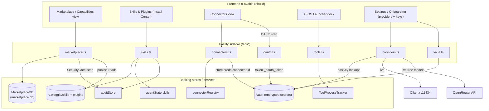

# 03d · API — Marketplace, Skills, Connectors, Tools, OAuth, Vault & Providers

## Purpose

This subsystem is the **capability layer** of the Waggle OS sidecar: how the frontend
browses/installs marketplace packages, manages local **Skills** and **Plugins**, connects to
third-party **Connectors**, launches external **AI tools** (AI-OS), runs **OAuth** flows, stores
secrets in the **Vault**, and reads the canonical **LLM/search provider** catalog. Every route
here is served by the local Fastify sidecar (loopback-bound, base path `/api/...`). This document
is the contract: exact paths, request/response shapes, and the real identifiers from the code.

All routes live in `packages/server/src/local/routes/` in the files named per section. Names,
field keys, and paths below are quoted verbatim from source — do not rename them.

---

## 1. Marketplace (`marketplace.ts` — production `/api/marketplace/*`)

The marketplace is backed by `MarketplaceDB` (from `@waggle/marketplace`), decorated onto Fastify
as `fastify.marketplace`. If that decoration is missing, **every route returns `503`** with
`{ error: 'Marketplace not available', hint: 'marketplace.db was not found or failed to load' }`.
The frontend must handle 503 as "marketplace disabled" everywhere.

### 1.1 Endpoints

| Method | Path | Tier gate | Purpose |
|---|---|---|---|
| GET | `/api/marketplace/search` | — | FTS5 + faceted catalog search; annotates each pkg with `installed` + scan status |
| GET | `/api/marketplace/packs` | — | List all capability packs |
| GET | `/api/marketplace/packs/:slug` | — | Pack detail + its packages (`404` if slug unknown) |
| GET | `/api/marketplace/enterprise-packs` | **ENTERPRISE** | KVARK-gated enterprise packs (empty unless KVARK configured) |
| POST | `/api/marketplace/install` | **PRO** | Install a package; runs `SecurityGate` pre-scan with severity gating |
| POST | `/api/marketplace/uninstall` | — | Uninstall an installed package |
| GET | `/api/marketplace/installed` | — | List installed packages |
| POST | `/api/marketplace/security-check` | — | Scan a package by ID **without** installing |
| GET | `/api/marketplace/sources` | — | List marketplace sources with package counts |
| POST | `/api/marketplace/sources` | — | Add a user source + immediate sync (`201`) |
| DELETE | `/api/marketplace/sources/:id` | — | Remove a **user-added** source (`403` for built-in) |
| GET | `/api/marketplace/categories` | — | Category taxonomy (`PACKAGE_CATEGORIES`) |
| POST | `/api/marketplace/sync` | — | Manual sync from configured sources |
| GET | `/api/marketplace/security-status` | — | Cisco scanner availability + aggregate scan counts |
| POST | `/api/marketplace/publish` | **PRO** | Publish a local skill from `~/.waggle/skills/` to the catalog (`201`) |

### 1.2 `GET /api/marketplace/search`

**Query params** (all optional, all strings): `query`, `type`, `category`, `pack`, `source`,
`sort`, `limit` (default `20`), `offset` (default `0`).
`sort` must be one of `relevance | popular | recent | name` (invalid → `undefined`).

**Response**: spreads the `db.search()` result and overrides `packages` + adds `categories`:

```jsonc
{
  "total": 123,
  "packages": [
    {
      // ...all MarketplacePackage fields (id, name, display_name, description,
      //    author, package_type, waggle_install_type, version, category,
      //    downloads, stars, rating, rating_count, platforms, dependencies, packs ...)
      "installed": true,          // db.isInstalled(pkg.id)
      "scanStatus": "passed",     // 'passed' | 'failed' | 'not_scanned' | 'unavailable'
      "scanScore": 80             // number, omitted when null/negative
    }
  ],
  "categories": [ /* PACKAGE_CATEGORIES */ ]
}
```

**`scanStatus` derivation** (from DB `security_status` column): `clean`/`low`/`medium` → `passed`;
`critical`/`high` → `failed`; `unscanned`/null → `not_scanned`.

### 1.3 `POST /api/marketplace/install` (tier: PRO)

**Body**: `{ packageId: number, installPath?: string, settings?: Record<string,string>,
force?: boolean, forceInsecure?: boolean }`. `packageId` required (`400` if missing); `404` if the
package ID is not found.

**SecurityGate gating** (heuristics-only; Cisco/GenTrust/MCP-Guardian disabled):

| Severity | Behavior |
|---|---|
| `CRITICAL` (score 0) | **`403`** always blocked — `{ blocked:true, severity, score, findings, message }` |
| `HIGH` (score 25) | **`403`** unless `force:true`. With `force:true`, override is audit-logged and install proceeds |
| `MEDIUM` | Install proceeds; `findings` returned as `warnings` |
| `LOW` | Install proceeds; logged to audit trail |
| `CLEAN` | Install proceeds immediately |

**Success response** (`200` on success, `422` on installer failure): the installer result spread,
plus a `security` block:

```jsonc
{
  "success": true,
  /* ...MarketplaceInstaller result fields... */
  "security": {
    "severity": "MEDIUM",
    "score": 60,
    "findingsCount": 2,
    "findings": [ /* ScanFinding[] */ ],
    "warnings": ["[medium] <finding title>", ...]   // only present when MEDIUM
  }
}
```

After a successful install the DB `packages.security_status` / `security_score` columns are updated.

### 1.4 Other marketplace shapes

- **`POST /api/marketplace/uninstall`** — Body `{ packageId: number }`; `200`/`422` with installer result.
- **`POST /api/marketplace/security-check`** — Body `{ packageId: number }`. Returns
  `{ packageId, severity, score, blocked, enginesUsed, findingsCount, findings, durationMs, contentHash }`.
- **`GET /api/marketplace/installed`** — `{ installations: [...], total }`.
- **`GET /api/marketplace/sources`** — `{ sources: [...], total }` (each source includes a package count).
- **`POST /api/marketplace/sources`** — Body `{ name, url, displayName? }`. `400` if name/url missing
  or URL invalid; `409` if name exists. `source_type` auto-detected: `github.com` URL → `community_repo`,
  else `aggregator`. Returns `201 { source, syncResult }`.
- **`DELETE /api/marketplace/sources/:id`** — `400` invalid id; `404` not found; **`403`** if
  `!source.is_custom` (built-in sources can't be deleted). Success: `{ deleted:true, sourceId, name }`.
- **`GET /api/marketplace/categories`** — `{ categories: PACKAGE_CATEGORIES, total }`.
- **`POST /api/marketplace/sync`** — Body `{ sources?: string[] }`. Returns
  `{ sourcesChecked, packagesAdded, packagesUpdated, errors: string[], details: [...] }`.
  Emits a notification (`category:'agent'`, `actionUrl:'/capabilities'`) when new packages appear.
- **`GET /api/marketplace/security-status`** — `{ ciscoScannerAvailable, jsSecurityGateVersion:'1.0',
  totalScanned, totalPassed, totalFailed, hint? }`. `hint` suggests
  `pip install cisco-ai-skill-scanner` when the Cisco scanner is missing.
- **`POST /api/marketplace/publish`** (PRO) — Body `{ skillName: string }`. Reads
  `~/.waggle/skills/<skillName>.md`, validates frontmatter via `validateSkillMd` (`422` on failure),
  runs `SecurityGate` (`403` if `blocked`), upserts into a `user-published` source. Returns
  `201 { success:true, packageId, skillName, metadata, security }`. Path-traversal in `skillName`
  → `400`.

### 1.5 Marketplace dev routes (`marketplace-dev.ts`)

**Gated behind env `WAGGLE_DEV_MARKETPLACE=1`** — these routes do **not** register otherwise and are
NOT a production contract. Prefixed `/_dev/marketplace/`. The frontend should not depend on them.

| Method | Path | Purpose |
|---|---|---|
| GET | `/_dev/marketplace/search` | Catalog seam probe (returns `_dev:true` envelope) |
| GET | `/_dev/marketplace/security-check` | SecurityGate seam probe on a sample skill |
| GET | `/_dev/marketplace/packs` | Pack reconciliation seam |
| GET | `/_dev/marketplace/health` | DB seed verification: `{ status, dbPath, dbExists, dbSizeBytes, packageCount, sourceCount, packCount }` |

---

## 2. Skills, Capability Packs, Plugins & Hooks (`skills.ts`)

Skills are **markdown files** in `~/.waggle/skills/` that extend the system prompt. Plugins are
structured packages in `~/.waggle/plugins/` with a `plugin.json` manifest. On first run, starter
skills auto-install (when the skills dir is empty and `.starter-installed` marker is absent). Every
mutation reloads `server.agentState.skills` and (where relevant) records an audit-trail entry and a
content hash via `server.skillHashStore`. **Skill content written through the API is passed through
`redactSkillContent()`** (strips secrets + user paths).

### 2.1 Endpoints

| Method | Path | Purpose |
|---|---|---|
| POST | `/api/skills/starter-pack` | Install all starter skills; reloads agent state |
| GET | `/api/skills/starter-pack/catalog` | Browse starter skills with per-skill `state` + families |
| POST | `/api/skills/starter-pack/:id` | Install ONE starter skill (`409` if installed, `404` if unknown) |
| GET | `/api/skills/capability-packs/catalog` | List packs with per-skill states + `packState` |
| POST | `/api/skills/capability-packs/:id` | Install all skills in a pack |
| GET | `/api/skills` | List installed skills (name, length, 200-char preview) |
| GET | `/api/skills/suggestions` | Contextual recommendations (`?context=...&topN=3`) |
| GET | `/api/skills/:name` | Full skill content `{ name, content }` |
| POST | `/api/skills` | Create skill from raw `{ name, content }` |
| POST | `/api/skills/create` | Create skill from structured template `{ name, description, steps[], tools?, category? }` |
| PUT | `/api/skills/:name` | Update skill content (`404` if missing) |
| DELETE | `/api/skills/:name` | Delete skill |
| GET | `/api/skills/hash-status` | Which skills changed on disk vs. recorded hash |
| POST | `/api/skills/test` | Sandbox/dry-run: shows what a skill would inject into the prompt |
| GET | `/api/audit/installs` | Recent install audit trail (`?limit=`, max 100) |
| GET | `/api/plugins` | List installed plugins |
| POST | `/api/plugins/install` | Install a plugin from a local dir (`{ sourceDir }` or `{ path }`) |
| DELETE | `/api/plugins/:name` | Uninstall a plugin |
| GET | `/api/plugins/:name/tools` | List a plugin's declared tools + impl status |
| GET | `/api/plugins/:name/tools/:toolName` | Get one tool's impl file (returns template if absent) |
| PUT | `/api/plugins/:name/tools/:toolName` | Write a tool impl file (must export `execute()`) |
| DELETE | `/api/plugins/:name/tools/:toolName` | Delete a tool impl file |
| POST | `/api/plugins/:name/tools` | Declare a new tool in the plugin manifest |
| GET | `/api/hooks` | List `pre:tool` deny rules |
| POST | `/api/hooks` | Add a deny rule `{ type:'deny', tools:string[], pattern }` |
| DELETE | `/api/hooks/:index` | Remove a rule by index |

> **Path-traversal guard everywhere**: any `name`/`id` containing `..`, `/`, or `\` (and for
> `POST /api/skills` also a space) → `400 Invalid …`.

### 2.2 Skill `state` model (used by catalog endpoints)

A skill is in one of three states, computed against on-disk files and loaded `agentState.skills`:

| state | meaning |
|---|---|
| `active` | loaded in `agentState.skills` (in effect now) |
| `installed` | file exists on disk but not loaded |
| `available` | exists only in the starter pack, not installed |

`GET /api/skills/starter-pack/catalog` returns:

```jsonc
{
  "skills": [
    {
      "id": "draft-memo",
      "name": "Draft Memo",
      "description": "...",
      "family": "writing",
      "familyLabel": "Writing & Docs",
      "state": "available",      // active | installed | available
      "isWorkflow": false        // true for research-team / review-pair / plan-execute
    }
  ],
  "families": [ { "id": "writing", "label": "Writing & Docs" }, ... ]
}
```

**Skill families** (`SKILL_FAMILIES` map, ordered): `writing`, `research`, `decision`, `planning`,
`communication`, `code`, `creative`. **Workflow skills** (`WORKFLOW_SKILLS`): `research-team`,
`review-pair`, `plan-execute`.

### 2.3 Capability packs

`GET /api/skills/capability-packs/catalog` returns `{ packs: [...] }`; each pack entry spreads the
pack manifest and adds `skillStates` (`{ id, state }[]`), `packState`
(`available | complete | incomplete`), `installedCount`, `totalCount`.
`POST /api/skills/capability-packs/:id` returns
`{ ok, pack:{id,name}, installed:string[], skipped:string[], errors? }`.

### 2.4 Skill creation responses

- **`POST /api/skills`** (raw) → `{ ok:true, name, path }`.
- **`POST /api/skills/create`** (structured) → name is kebab-cased; generates SKILL.md via
  `generateSkillMarkdown`. Returns `{ success:true, path, registered:true, skill:{ name, description,
  steps, tools, category } }`. Requires `name`, `description`, and non-empty `steps[]` (`400` otherwise).
- **`POST /api/skills/test`** (sandbox) → `{ skill:{ name, displayName, description, permissions[],
  family, familyLabel, isWorkflow, contentLength }, wouldInject, wouldInjectLength, testPreview? }`.
  `testPreview` only appears when `testInput` is supplied.

### 2.5 Audit trail (`GET /api/audit/installs`)

```jsonc
{ "entries": [ {
  "id", "timestamp", "capabilityName", "capabilityType", "source",
  "riskLevel", "trustSource", "approvalClass", "action", "initiator", "detail"
} ] }
```

### 2.6 Plugin tool files

`GET /api/plugins/:name/tools` →
`{ pluginName, tools:[{ name, description, parameters, hasImplementation, implPath, content }], toolsDir }`.
`PUT .../tools/:toolName` requires the body `content` to include both `export` and `execute`
(`400` otherwise) and hot-reloads the plugin runtime. `POST .../tools` declares a tool in
`plugin.json` (`409` if the tool name already exists; name must match `^[a-zA-Z0-9_-]+$`).

---

## 3. Connectors (`connectors.ts` — `/api/connectors/*`)

Connectors are backed by `fastify.connectorRegistry`. Credentials live in the **Vault** under
`connector:<id>` (plus sub-keys like `connector:<id>:email`).

| Method | Path | Purpose |
|---|---|---|
| GET | `/api/connectors` | List all connector definitions (`registry.getDefinitions()`) |
| GET | `/api/connectors/:id/health` | Live health probe (`404` unknown, `502` on probe throw) |
| POST | `/api/connectors/:id/connect` | Store credentials in vault + re-init the connector |
| POST | `/api/connectors/:id/disconnect` | Remove credential + all sub-keys |

- **`GET /api/connectors`** → `{ connectors: ConnectorDefinition[] }` (or `{ connectors: [] }` if no
  registry). A `ConnectorDefinition` (from `@waggle/shared`) has: `id, name, description, service,
  authType ('api_key'|'oauth2'|'bearer'|'basic'), status, capabilities (('read'|'write'|'search')[]),
  substrate ('waggle'|'kvark'), tools:string[], config?, actions?, logoUrl?, category?, setupGuide?`.
- **`GET /api/connectors/:id/health`** → `ConnectorHealth` =
  `{ id, name, status, lastChecked, error?, tokenExpiresAt? }`. On a thrown probe the error is
  sanitized to `error:'Health check failed'` (never leaks raw detail) and returned with `502`.
- **`POST /api/connectors/:id/connect`** — Body `{ token?, apiKey?, refreshToken?, expiresAt?,
  scopes?, email? }`. `value = token ?? apiKey` (`400` if neither). `404` if the connector is unknown.
  `503` if vault unavailable. `authType` defaults to the connector's own or `'bearer'`. Returns
  `{ connected:true, connectorId }`.
- **`POST /api/connectors/:id/disconnect`** → `{ disconnected, connectorId, cleanedKeys }`.

---

## 4. AI-OS Tool Launcher (`tools.ts` — `/api/tools/*`)

These routes detect external AI tools on the user's machine, launch them with workspace-context env
injection, manage hive-mind hook installation, and track spawned processes. Tool IDs are validated
against `SUPPORTED_TOOLS` from `@waggle/shared`:
**`claude-code`, `claude-desktop`, `cursor`, `codex`, `codex-desktop`, `hermes`, `openclaw`**.
Note: `launchTool()` only actually launches the **launch cohort** (claude-code, cursor,
claude-desktop) — others return `ok:false` with a reason.

| Method | Path | Status | Purpose |
|---|---|---|---|
| GET | `/api/tools/detect` | 200/500 | Scan machine for supported AI tools |
| POST | `/api/tools/launch` | 202/400 | Spawn a tool detached w/ workspace env; registers PID |
| GET | `/api/tools/processes` | 200 | List tracked running processes |
| POST | `/api/tools/kill` | 200/404/500 | Kill a **tracked** PID (SIGTERM → SIGKILL after 3s) |
| POST | `/api/tools/hooks` | 200/400/500 | Run `npx @waggle/hive-mind-hooks-<id> <action>` |

### 4.1 `GET /api/tools/detect`

Returns `ToolDetectionResult`:

```jsonc
{
  "platform": "win32",
  "detectedAt": "2026-06-06T...Z",
  "tools": [
    {
      "id": "claude-code",
      "displayName": "Claude Code",
      "installed": true,
      "installedPath": "/abs/path/to/binary",   // or null
      "version": "1.2.3",                        // or null
      "hooksInstalled": false,
      "hookPointerPath": null,
      "diagnostic": "optional reason string"
    }
    // ... one DetectedTool per SUPPORTED_TOOLS entry
  ]
}
```

### 4.2 `POST /api/tools/launch`

**Body (Zod-validated)**: `{ id: ToolId, installedPath: string(1..1024), workspaceId?: string,
cwd?: string, args?: string[]≤50 }`. Validation failure → `400 { error:'Validation failed', details }`.

**Response** = `LaunchResult` `{ ok, pid: number|null, executed:{ binary, args, cwd? }, error? }`.
On `ok:false` → `400`; on success → **`202`** and the PID is registered in the tracker.

### 4.3 `GET /api/tools/processes` & `POST /api/tools/kill`

- `processes` → `{ processes: TrackedProcess[], total }` where
  `TrackedProcess = { pid, toolId, startedAt, workspaceId? }`. **In-memory only — PID state does NOT
  survive a sidecar restart.**
- `kill` → Body `{ pid: number }` (positive int). Only previously-tracked PIDs can be killed
  (`not-tracked` → `404`; SIGTERM→SIGKILL failure → `500`).

### 4.4 `POST /api/tools/hooks`

**Body**: `{ id: ToolId, action: 'install'|'verify'|'uninstall', cliPath?: string }`. Returns
`HookCommandResult { ok, action, packageName, stdout, stderr, exitCode, ... }`. `ok:false` → `400`.

---

## 5. OAuth (`oauth.ts` — `/api/oauth/*`)

Browser-redirect OAuth flows for 5 providers. App credentials (`client_id` / `client_secret`) must
already be in the Vault under provider-specific keys; the callback stores the resulting token as
`<provider>_oauth_token` (and `<provider>_oauth_refresh_token` if present). CSRF is protected via an
in-memory `state` map (10-min expiry).

### 5.1 Configured providers (`OAUTH_PROVIDERS`)

| provider | clientIdKey | clientSecretKey | scopes |
|---|---|---|---|
| `github` | `GITHUB_OAUTH_CLIENT_ID` | `GITHUB_OAUTH_CLIENT_SECRET` | `repo`, `user`, `read:org` |
| `slack` | `SLACK_OAUTH_CLIENT_ID` | `SLACK_OAUTH_CLIENT_SECRET` | `chat:write`, `channels:read`, `users:read` |
| `google` | `GOOGLE_OAUTH_CLIENT_ID` | `GOOGLE_OAUTH_CLIENT_SECRET` | calendar + drive.readonly |
| `notion` | `NOTION_OAUTH_CLIENT_ID` | `NOTION_OAUTH_CLIENT_SECRET` | (none; Basic-auth token exchange) |
| `jira` | `JIRA_OAUTH_CLIENT_ID` | `JIRA_OAUTH_CLIENT_SECRET` | `read:jira-work`, `write:jira-work`, `read:jira-user` |

### 5.2 Endpoints

| Method | Path | Purpose |
|---|---|---|
| GET | `/api/oauth/providers` | List providers + credential/token status |
| GET | `/api/oauth/:provider/authorize` | Build OAuth URL and **redirect** to provider |
| GET | `/api/oauth/:provider/callback` | Exchange code → token, store in vault, return HTML page |

- **`GET /api/oauth/providers`** → `{ providers: [{ provider, hasCredentials, clientIdKey,
  clientSecretKey, scopes, hasToken }] }`. The frontend uses `hasCredentials` to know whether the
  "Connect" button can start the flow, and `hasToken` to show "connected".
- **`GET /api/oauth/:provider/authorize`** — `400` if provider unknown (returns
  `availableProviders`) or credentials missing; `503` if vault unavailable. On success → HTTP
  **redirect** to the provider's authorize URL. The callback URI is
  `http://127.0.0.1:<port>/api/oauth/<provider>/callback`. Google adds `access_type=offline` +
  `prompt=consent`; Jira adds `audience` + `prompt=consent`; Notion adds `owner=user`.
- **`GET /api/oauth/:provider/callback`** — returns an **HTML page** (not JSON) for success/error;
  the success page auto-closes the tab after 2s. Token stored as `<provider>_oauth_token`
  (`credentialType:'oauth2'`).

---

## 6. Vault (`vault.ts` — `/api/vault/*`)

Encrypted secret storage (`fastify.vault`). All routes return `503` if the vault is unavailable.
**Listing never returns values** — only `/reveal` does, and it is **same-origin-enforced**.

| Method | Path | Purpose |
|---|---|---|
| GET | `/api/vault` | List secrets (names, types, dates — NO values) + suggestions |
| POST | `/api/vault` | Add or update a secret |
| DELETE | `/api/vault/:name` | Delete a secret (`404` if not found) |
| POST | `/api/vault/:name/reveal` | Decrypt + return full value (**`403`** if external origin) |

- **`GET /api/vault`** →
  `{ secrets: [{ name, type, updatedAt, isCommon }], suggestedKeys: string[], suggestedSecrets:
  [{ category, items: [{ name, type, label }] }] }`. `suggestedKeys`/`suggestedSecrets` exclude
  already-stored keys. The suggestion catalog (`SUGGESTED_SECRETS`) groups well-known keys by
  category: **LLM Providers** (`anthropic`, `openai`, `google`, `mistral`, `deepseek`, `xai`,
  `alibaba`, `minimax`, `zhipu`, `openrouter`), **Embedding Providers** (`voyage-api-key`),
  **Search & Tools** (`perplexity`, `moonshot`, `TAVILY_API_KEY`, `BRAVE_API_KEY`,
  `COMPOSIO_API_KEY`), **Code & DevOps** (`GITHUB_TOKEN`, `GITLAB_TOKEN`, `BITBUCKET_TOKEN`),
  **Communication**, **Productivity**, **CRM & Sales**, **Cloud & Storage**, **User Credentials**.
- **`POST /api/vault`** — Body `{ name, value, type? }` (name + value required, `400` otherwise).
  Returns `{ success:true, name }`.
- **`POST /api/vault/:name/reveal`** — Rejects non-local requests with `403`
  (`isLocalRequest` guard). Returns `{ name, value, type }`.

> **Frontend note:** the LLM provider key naming convention is the **bare provider id** for native
> providers (`anthropic`, `openai`, `google`, ...) — this is the same key `GET /api/providers`
> checks (`vault.get(p.id)`). Connector creds use `connector:<id>`; OAuth uses `<provider>_oauth_token`.

---

## 7. LLM & Search Providers (`providers.ts` — `/api/providers`)

Single source of truth for the model/provider picker (Settings, Onboarding, workspace selector,
Spawn dialog, Agents). One route.

| Method | Path | Purpose |
|---|---|---|
| GET | `/api/providers` | All LLM providers + models + key status, search providers, active search |

**Response**:

```jsonc
{
  "providers": [
    {
      "id": "anthropic", "name": "Anthropic",
      "keyPrefix": "sk-ant-", "keyUrl": "https://...", "badge": null,
      "requiresKey": true, "hasKey": true,
      "models": [
        { "id": "claude-opus-4-7", "name": "Claude Opus 4.7", "cost": "$$$", "speed": "slow" }
      ]
    }
  ],
  "search": [
    { "id": "perplexity", "name": "Perplexity", "vaultKey": "perplexity",
      "priority": 1, "requiresKey": true, "hasKey": false }
  ],
  "activeSearch": "duckduckgo"     // highest-priority search provider that has a key
}
```

- **`cost`** is one of `$ | $$ | $$$`; **`speed`** is `fast | medium | slow`.
- `hasKey` is computed from the vault: native providers check `vault.get(provider.id)`; Ollama is
  always keyless (`requiresKey:false`).
- **Static LLM providers** (`LLM_PROVIDERS`): `anthropic`, `openai`, `google`, `deepseek`, `xai`,
  `mistral`, `alibaba` (Qwen), `minimax`, `zhipu` (GLM), `moonshot` (Kimi), `perplexity`,
  `openrouter`, `ollama`.
- **Live enrichment**: `ollama` is enriched from `http://localhost:11434/api/tags` (or `OLLAMA_HOST`)
  — model ids get an `ollama/` prefix, `source:'local'|'cloud'`, optional `sizeMB`; `badge` becomes
  `"N installed"` / `"Running"` / `"Not running"`. `openrouter` (only when its key is present) is
  enriched with up to 20 free models from `https://openrouter.ai/api/v1/models` (1h cache),
  `source:'cloud'`.
- **Search providers** (`SEARCH_PROVIDERS`, priority order): `perplexity` (1), `tavily` (2,
  `TAVILY_API_KEY`), `brave` (3, `BRAVE_API_KEY`), `duckduckgo` (4, keyless fallback).

---

## 8. How the pieces connect



### Cross-cutting facts the frontend must internalize

1. **Vault is the credential hub.** LLM keys = bare provider id; connectors = `connector:<id>`;
   OAuth tokens = `<provider>_oauth_token`. Provider/connector "connected" status is derived from
   vault presence, never sent as a value except via `/api/vault/:name/reveal` (local-origin only).
2. **Tier gates return `403 TIER_INSUFFICIENT`** with `{ error, message, required, actual, upgradeUrl }`.
   Marketplace install + publish require **PRO**; enterprise-packs require **ENTERPRISE**.
3. **Marketplace 503** means `fastify.marketplace` (the DB) is absent — treat as "marketplace off".
4. **Security gating** can hard-block installs (`403` for CRITICAL/HIGH) — surface `findings` and the
   `force` override path (HIGH only) in the UI.
5. **Skill mutations reload agent state** and redact secrets; skill `state` is
   `active | installed | available`.
6. **Tool launch returns `202` + a PID** that is tracked in-memory only (lost on sidecar restart);
   only tracked PIDs can be killed.
