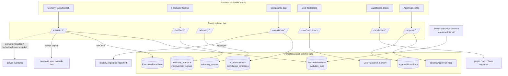

# 03e — Evolution & Governance API

**Purpose.** This subsystem groups the Waggle OS sidecar's "machine-improves-itself + you-stay-in-control" surfaces: self-evolution runs (propose/accept/reject/run prompt mutations), user feedback capture, local-only telemetry, EU AI Act compliance reporting, agent cost tracking, capability/plugin status, and the approvals inbox (pending tool approvals + persistent grants). Every endpoint is served by the local Fastify sidecar under `/api/...` and returns JSON unless noted (one route returns a PDF binary, one streams SSE). For a frontend rebuild, treat the tables below as the literal contract — paths, methods, request bodies, and response shapes are quoted from the route source.

> Source files: `packages/server/src/local/routes/{evolution,feedback,telemetry,compliance,cost,capabilities,approval,validate}.ts` and `packages/server/src/local/services/{evolution-service,optimizer-service}.ts`. Data shapes are grounded in `packages/hive-mind-core/src/mind/evolution-runs.ts`, `packages/core/src/compliance/types.ts`, and `packages/core/src/telemetry.ts`.

---

## 1. Endpoint Index (every route in this subsystem)

| Method | Path | Purpose |
|---|---|---|
| GET | `/api/evolution/runs` | List evolution proposals/runs (newest first; filterable) |
| GET | `/api/evolution/runs/:uuid` | Single run detail with parsed JSON blobs |
| POST | `/api/evolution/runs/:uuid/accept` | Accept + deploy a proposed run |
| POST | `/api/evolution/runs/:uuid/reject` | Reject a proposed run |
| GET | `/api/evolution/targets` | Enumerate evolvable targets (personas + spec sections) |
| GET | `/api/evolution/baseline` | Fetch current baseline text for a target |
| POST | `/api/evolution/run` | Trigger a real evolution run (JSON or SSE stream) |
| GET | `/api/evolution/status` | Aggregate status counts for the dashboard |
| POST | `/api/feedback` | Record thumbs up/down feedback on an agent message |
| GET | `/api/feedback/stats` | Improvement stats + trend |
| GET | `/api/telemetry/summary` | Local telemetry summary object |
| GET | `/api/telemetry/events` | Query telemetry events (filterable) |
| DELETE | `/api/telemetry/events` | Clear all telemetry events (right to delete) |
| GET | `/api/telemetry/status` | Telemetry enabled flag + total event count |
| POST | `/api/telemetry/toggle` | Enable/disable telemetry |
| POST | `/api/telemetry/track` | Record a single telemetry event (frontend) |
| GET | `/api/compliance/status` | EU AI Act compliance status (per-article) |
| POST | `/api/compliance/export` | Generate audit report (JSON) |
| POST | `/api/compliance/export-pdf` | Generate audit report as a PDF binary |
| GET | `/api/compliance/interactions` | List recorded AI interactions |
| POST | `/api/compliance/interactions` | Record an AI interaction |
| GET | `/api/compliance/models` | Model inventory for a date range |
| GET | `/api/compliance/templates` | List saved compliance report templates |
| GET | `/api/compliance/templates/:id` | Get one template by numeric id |
| POST | `/api/compliance/templates` | Create a compliance template |
| PATCH | `/api/compliance/templates/:id` | Update a compliance template |
| DELETE | `/api/compliance/templates/:id` | Delete a compliance template |
| GET | `/api/cost/summary` | Cost dashboard: today/week/all-time + daily breakdown + budget |
| GET | `/api/cost/by-workspace` | Per-workspace cost breakdown (TEAMS tier gated) |
| GET | `/api/costs` | Alias → `/api/cost/summary` (internal re-route, 200) |
| GET | `/api/capabilities/status` | Plugins/MCP/skills/tools/commands/hooks/workflows status |
| POST | `/api/capabilities/plugins/:name/enable` | Enable a plugin |
| POST | `/api/capabilities/plugins/:name/disable` | Disable a plugin |
| POST | `/api/approval/:requestId` | Approve/deny a pending tool execution |
| GET | `/api/approval/pending` | List pending approvals (for reconnection) |
| GET | `/api/approval/grants` | List all persistent approval grants |
| DELETE | `/api/approval/grants/:id` | Revoke a single grant |
| POST | `/api/approval/grants/clear` | Wipe all grants |

> `validate.ts` exposes **no routes** — it is a helper module (`isSafeSegment`, `assertSafeSegment`) for rejecting path-traversal in route params. `optimizer-service.ts` is an internal service (prompt classify/expand via Haiku) consumed by the chat loop, **not** an HTTP route.

---

## 2. Evolution (self-improvement loop)

The evolution loop proposes mutations to either a **persona system prompt** or a **behavioral-spec section**, gates them, and stores `proposed` runs. The user reviews and accepts/rejects from the Memory → Evolution UI. Accepting deploys the new text to disk and fires a cache-invalidation event; the loop **never auto-deploys**.

### 2.1 The `EvolutionRun` entity (full shape)

Returned by list/detail/accept/reject. From `packages/hive-mind-core/src/mind/evolution-runs.ts`:

| Field | Type | Notes |
|---|---|---|
| `id` | number | Autoincrement row id |
| `run_uuid` | string | Stable id used in all `:uuid` routes |
| `target_kind` | `'persona-system-prompt' \| 'behavioral-spec-section' \| 'tool-description' \| 'skill-body' \| 'generic'` | Only the first two can currently be **deployed** |
| `target_name` | string \| null | Persona id (e.g. `coder`) or spec section id |
| `baseline_text` | string | The pre-evolution instruction text |
| `winner_text` | string | The evolved/winning instruction text |
| `winner_schema_json` | string \| null | JSON-encoded `Schema` (DSPy signature) when structure evolved |
| `delta_accuracy` | number | Score improvement over baseline |
| `gate_verdict` | `'pass' \| 'fail'` | Constraint-gate verdict |
| `gate_reasons_json` | string | JSON array of `{gate, verdict, reason}` |
| `status` | `'proposed' \| 'accepted' \| 'rejected' \| 'deployed' \| 'failed'` | Lifecycle state |
| `artifacts_json` | string \| null | Per-generation history / scores / Pareto front |
| `user_note` | string \| null | Note attached on accept |
| `failure_reason` | string \| null | Set when status is `failed` |
| `created_at` | string | ISO timestamp |
| `decided_at` | string \| null | Set on accept/reject |
| `deployed_at` | string \| null | Set on successful deploy |

### 2.2 `GET /api/evolution/runs`

List runs, newest first. All query params optional.

| Query param | Type | Meaning |
|---|---|---|
| `status` | string or string[] (repeatable) | Filter by one or more statuses |
| `targetKind` | string | Filter by target kind |
| `targetName` | string | Filter by target name (e.g. `coder`) |
| `since` | ISO string | Only runs after this time |
| `limit` | string→int | Default 50, clamped to `1..500` |

**Response:** `{ runs: EvolutionRun[], count: number }`.

### 2.3 `GET /api/evolution/runs/:uuid`

Single run. **404** `{ error: 'Run not found' }` if missing. On success returns the full `EvolutionRun` **plus** parsed convenience fields:

```jsonc
{
  ...EvolutionRun,
  "winnerSchema": object | null,   // parsed from winner_schema_json
  "artifacts": object | null,      // parsed from artifacts_json
  "gateReasons": Array<{gate, verdict, reason}>  // parsed from gate_reasons_json, defaults []
}
```

### 2.4 `POST /api/evolution/runs/:uuid/accept`

- **Body:** `{ note?: string }`
- **Guards:** 404 if not found; **409** if `status !== 'proposed'` (`error: 'Run is in status "<x>" — only proposed runs can be accepted'`).
- **Effect:** marks accepted → runs the deploy dispatcher → moves to `deployed` (success) or `failed` (throw). Deploy is only implemented for `persona-system-prompt` (writes a persona override) and `behavioral-spec-section` (writes a spec-section override); `tool-description`/`skill-body`/`generic` throw "not yet implemented" and end as `failed`.
- **Side effect:** emits `persona:reloaded` or `behavioral-spec:reloaded` on the server event bus so the chat route drops its cached system prompt.
- **Response:** the updated `EvolutionRun` (200). 500 if accept returned no record.

### 2.5 `POST /api/evolution/runs/:uuid/reject`

- **Body:** `{ reason?: string }`
- **Guards:** 404 if not found; **409** if not `proposed`.
- **Response:** the updated `EvolutionRun` (200).

### 2.6 `GET /api/evolution/targets`

Populates the "Run" form dropdowns. **Response:**

```jsonc
{
  "personas": Array<{ id, name, description, icon }>,  // from listPersonas()
  "sections": string[],                                 // BEHAVIORAL_SPEC_SECTIONS
  "defaultSchema": Schema                               // generic default DSPy signature
}
```

### 2.7 `GET /api/evolution/baseline?kind=X&name=Y`

Returns the current live baseline for one target so the Run form can pre-fill it.

- **400** if `kind` or `name` missing, or `kind` not one of the two supported.
- **404** for unknown persona / unknown section.
- `kind=persona-system-prompt` → returns the persona's live `systemPrompt`.
- `kind=behavioral-spec-section` → returns the **active** section text (deployed overrides applied, falling back to compile-time `BEHAVIORAL_SPEC`).
- **Response:** `{ baseline: string, schemaBaseline: Schema }`.

### 2.8 `POST /api/evolution/run` (trigger a real run — JSON or SSE)

Synchronously runs a GEPA + EvolveSchema composition using the vault's Anthropic key (Haiku-backed judge/mutate/execute). Persists a `proposed` run if one wins.

**Body:**

| Field | Type | Notes |
|---|---|---|
| `targetKind` | EvolutionTarget | Required; must be in the 5-value union |
| `targetName` | string | Required; non-empty |
| `baseline` | string | Required; non-empty current instruction text |
| `schemaBaseline` | `Schema` | Required object `{ name: string, fields: array, version }` |
| `minDelta` | number | Optional; default 0.02 |
| `gepa` | object | `{ populationSize?, generations?, miniEvalSize?, anchorEvalSize?, seed?, concurrency? }` (concurrency default 4) |
| `schema` | object | `{ populationSize?, generations?, evalSize?, anchorEvalSize?, seed? }` |
| `gateOptions` | `GateOptions` | Optional constraint-gate config |

**Status codes:** `200` ran (see `body.outcome`), `400` validation error, `422` no Anthropic key in vault (`'No Anthropic API key configured. Add one in Settings → Vault.'`), `503` `@ax-llm/ax` unavailable, `500` run threw.

**JSON response payload:**

```jsonc
{
  "outcome": string,        // e.g. "proposed" / "skipped-*"
  "reason": string,
  "run": EvolutionRun | null,
  "gateResults": ...,
  "composeSummary": {
    "combinedDelta", "fullyImproved",
    "schemaImproved", "schemaDelta",
    "instructionImproved", "instructionDelta",
    "winnerId"
  } | null
}
```

**SSE mode (frontend should prefer this):** send header `Accept: text/event-stream`. The route streams `event:` frames — `open` (`{targetKind, targetName}`), repeated `progress` (the `GEPAProgress` object: `{phase, generation, populationSize, best, message?}`), then either `done` (the JSON payload above) or `error` (`{error}`). The run completes server-side even if the client disconnects (it does not cancel in-flight LLM spend).

### 2.9 `GET /api/evolution/status`

- **Query:** `targetKind?`, `targetName?`, `since?`
- **Response:** `{ counts: Record<EvolutionRunStatus, number>, pendingCount: number }` where `pendingCount === counts.proposed`.

### 2.10 Background autonomy (no HTTP surface)

`EvolutionService` (in `services/evolution-service.ts`) is an **opt-in** `setInterval` daemon (env `WAGGLE_EVOLUTION_AUTO_ENABLED=1`, default off; tick interval 6h, min 60s). Each tick picks one target whose new-trace count clears `minTracesPerTarget` (default 20; eligible outcomes `success`/`corrected`/`verified`) and produces a `proposed` run via the same orchestrator as `/api/evolution/run`. It **never auto-accepts** — proposals still flow through the manual accept/reject routes above. The frontend does not call this directly; it just sees new `proposed` runs appear.

---

## 3. Feedback

Feedback writes to a `feedback_entries` table in the personal `.mind` DB (auto-created). Negative feedback with a reason is cross-recorded as a `correction` improvement signal feeding the self-improvement loop.

### 3.1 `POST /api/feedback`

**Body (`FeedbackBody`):**

| Field | Type | Required | Notes |
|---|---|---|---|
| `sessionId` | string | yes | 400 if missing/non-string |
| `messageIndex` | number | yes | Must be ≥ 0 |
| `rating` | `'up' \| 'down'` | yes | 400 if not in set |
| `reason` | `'wrong_answer' \| 'too_verbose' \| 'wrong_tool' \| 'too_slow' \| 'other'` | no | Validated if present |
| `detail` | string | no | Free text, defaults `''` |

**Response:** `{ ok: true }`. 500 on DB failure.

### 3.2 `GET /api/feedback/stats`

**Response:**

```jsonc
{
  "totalFeedback": number,
  "positiveRate": number,        // 0..1, 2 decimals
  "topIssues": string[],         // up to 5 negative-feedback reasons by frequency
  "correctionsThisWeek": number, // from improvement_signals (last 7d)
  "improvementTrend": string     // e.g. "+12%" / "-5%" / "0%"
}
```

---

## 4. Telemetry (local-only — no cloud reporting)

`TelemetryEvent = { id, event, properties: Record<string, unknown>, created_at }`. `TelemetrySummary = { enabled, totalEvents, firstEvent, lastEvent, onboardingCompleted, totalSessions, embeddingProvider, templatesUsed, ... }`.

| Endpoint | Request | Response |
|---|---|---|
| `GET /api/telemetry/summary` | — | `TelemetrySummary` |
| `GET /api/telemetry/events` | query `event?, since?, until?, limit?` (limit default 100) | `TelemetryEvent[]` |
| `DELETE /api/telemetry/events` | — | result of `telemetry.clear()` (right-to-delete) |
| `GET /api/telemetry/status` | — | `{ enabled: boolean, totalEvents: number }` |
| `POST /api/telemetry/toggle` | `{ enabled: boolean }` | `{ enabled }` (also persists to `WaggleConfig`) |
| `POST /api/telemetry/track` | `{ event: string, properties?: object }` | `{ ok: true }`; 400 if `event` missing |

---

## 5. Compliance (EU AI Act)

All compliance routes require the personal mind; they return **503** `{ error: 'Personal mind not available' }` if it isn't ready. Interactions live in the `ai_interactions` table; templates in their own table on the same personal DB.

### 5.1 `GET /api/compliance/status?workspaceId=`

Returns the per-article `ComplianceStatus`:

| Field | Shape |
|---|---|
| `overall` | `'compliant' \| 'warning' \| 'non-compliant'` |
| `art12Logging` | `ArticleStatus & { totalInteractions }` |
| `art14Oversight` | `ArticleStatus & { humanActions, approvalRate }` |
| `art19Retention` | `ArticleStatus & { oldestLogDate, retentionDays }` |
| `art26Monitoring` | `ArticleStatus & { activeMonitors: string[] }` |
| `art50Transparency` | `ArticleStatus & { modelsDisclosed: boolean }` |

`ArticleStatus = { status: 'compliant'|'warning'|'non-compliant', detail: string }`.

### 5.2 `POST /api/compliance/export` and `POST /api/compliance/export-pdf`

Both take the same `AuditReportRequest` body:

```jsonc
{
  "workspaceId": string?,
  "from": string,   // required ISO date — 400 if missing
  "to": string,     // required ISO date
  "format": "json" | "pdf" | "both",
  "include": {
    "interactions": boolean, "oversight": boolean, "models": boolean,
    "provenance": boolean, "riskAssessment": boolean, "fria": boolean
  }
}
```

- `/export` returns the `AuditReport` JSON object: `{ report:{version,generatedAt,period,generatedBy}, workspace:{id,name,riskLevel,riskClassifiedAt}|null, complianceStatus, modelInventory[], humanOversightLog[], harvestProvenance[], interactionCount }`.
- `/export-pdf` returns **`application/pdf`** binary with `Content-Disposition: attachment; filename="ai-act-compliance-<from>-to-<to>.pdf"`. It additionally accepts three optional template-override fields on the body: `templateOrgName`, `templateFooterText`, `templateRiskClassification` (an `AIActRiskLevel`). 500 on PDF render failure.

### 5.3 `GET /api/compliance/interactions` and `POST`

- **GET** query `limit?` (default 20, max 100), `workspaceId?`. Response `{ interactions: AIInteraction[] }` (by workspace if `workspaceId` given, else recent N).
- **POST** body `RecordInteractionInput` (requires `model` + `provider`, else 400). Returns the stored `AIInteraction`.

`AIInteraction` fields: `id, timestamp, workspaceId, sessionId, model, provider, inputTokens, outputTokens, costUsd, toolsCalled[], humanAction('approved'|'denied'|'modified'|'none'), riskContext, importedFrom, persona, inputText, outputText`.

### 5.4 `GET /api/compliance/models?from=&to=&workspaceId=`

Returns `{ models: ModelInventoryEntry[] }`, each `{ model, provider, calls, inputTokens, outputTokens, costUsd }`.

### 5.5 Compliance templates (M-03 CRUD)

`ComplianceTemplate = { id, name, description, sections: ComplianceTemplateSections, riskClassification: AIActRiskLevel|null, orgName, footerText, createdAt, updatedAt }`, where `sections` mirrors the six `include` booleans.

| Endpoint | Body | Notes |
|---|---|---|
| `GET /api/compliance/templates` | — | `{ templates: ComplianceTemplate[] }` |
| `GET /api/compliance/templates/:id` | — | 400 invalid id, 404 not found, else `{ template }` |
| `POST /api/compliance/templates` | Zod-validated `CreateComplianceTemplateInput` | 201 `{ template }`; 400 on invalid body (`detail` = Zod issues) |
| `PATCH /api/compliance/templates/:id` | Zod-validated `UpdateComplianceTemplateInput` | 404 if not found |
| `DELETE /api/compliance/templates/:id` | — | `{ deleted: true }`; 404 if not found |

Zod schemas: `sections` is all six booleans required; `riskClassification` ∈ `{minimal, limited, high-risk, unacceptable}`. Sections **merge (union)** with the runtime `include` flags in the UI before POSTing to `/export` — the export routes stay template-agnostic.

---

## 6. Cost dashboard

Data source is the **in-memory** `CostTracker` (populated by the chat route per agent turn). All costs are estimates from published model pricing; fallback pricing is Sonnet (`$0.003`/1K in, `$0.015`/1K out).

### 6.1 `GET /api/cost/summary?days=`

`days` default 7, max 90. **Response:**

```jsonc
{
  "today":   { inputTokens, outputTokens, estimatedCost, turns },
  "allTime": { inputTokens, outputTokens, estimatedCost, turns, byModel },
  "week":    { inputTokens, outputTokens, estimatedCost, turns },
  "daily":   [ { date, inputTokens, outputTokens, cost, turns } ],   // one per day in range
  "budget":  { dailyBudget: number|null, todayCost, budgetStatus: 'ok'|'warning'|'exceeded', budgetPercent }
}
```

`budget.dailyBudget` is read from `/api/settings`; `budgetStatus` is `warning` at ≥80% and `exceeded` at ≥100% of `dailyBudget`.

### 6.2 `GET /api/cost/by-workspace` (TEAMS-gated)

Guarded by `requireTier('TEAMS')`. Returns `{ workspaces: Array<{ workspaceId, workspaceName, inputTokens, outputTokens, estimatedCost, turns, percentOfTotal }>, totalCost }`, sorted by cost descending.

### 6.3 `GET /api/costs`

Discoverability alias. Internally re-routes to `/api/cost/summary` (passing `days` through) and returns the same 200 body. Free for all tiers (usage info is not gated).

---

## 7. Capabilities (read-only status + plugin toggles)

### 7.1 `GET /api/capabilities/status`

One aggregated snapshot (500 with `{error}` on failure):

```jsonc
{
  "plugins":    [ { name, state, tools, skills } ],
  "mcpServers": [ { name, state, healthy, tools } ],
  "skills":     [ { name, length } ],
  "tools":      { count, native, plugin, mcp },
  "commands":   [ { name, description, usage } ],
  "hooks":      { registered: 10, recentActivity: [ { event, timestamp, cancelled, reason } ] },
  "workflows":  [ { name, description, steps } ]
}
```

### 7.2 Plugin toggles

| Endpoint | Effect | Response |
|---|---|---|
| `POST /api/capabilities/plugins/:name/enable` | `pluginRuntimeManager.enable(name)` | `{ ok: true, name, state: 'active' }`; 503 if no runtime; 400 on error |
| `POST /api/capabilities/plugins/:name/disable` | `pluginRuntimeManager.disable(name)` | `{ ok: true, name, state: 'disabled' }`; 503/400 as above |

---

## 8. Approvals inbox + grants

The agent loop registers a **pending approval** when a tool needs human sign-off; the request hangs on a promise until the user resolves it via the API. "Always allow" persists a **grant** so future identical `(toolName, input, sourceWorkspaceId)` requests resolve silently.

| Endpoint | Body / Params | Behavior |
|---|---|---|
| `POST /api/approval/:requestId` | `{ approved: boolean, always?: boolean, reason?: string, sourceWorkspaceId?: string\|null }` | 404 if no pending request; if `approved && always` persists a grant first; resolves the pending promise and removes it. Returns `{ ok, requestId, approved, always }` |
| `GET /api/approval/pending` | — | `{ pending: Array<{ requestId, toolName, input, timestamp }>, count }` |
| `GET /api/approval/grants` | — | `{ grants: [...], count }` |
| `DELETE /api/approval/grants/:id` | param `id` | `{ ok: true, id }`; 404 if grant not found |
| `POST /api/approval/grants/clear` | — | `{ ok: true }` — wipes every grant |

For the frontend: poll `GET /api/approval/pending` on reconnect to rebuild the inbox; the live push of new approval requests arrives via the chat/SSE stream (out of scope here).

---

## 9. Cross-cutting notes for the rebuild

- **No auth headers documented here** — these are local sidecar routes. Only `/api/cost/by-workspace` is tier-gated (`requireTier('TEAMS')` preHandler).
- **Compliance routes degrade with 503** when the personal mind isn't loaded — handle that as an empty/loading state, not an error toast.
- **Two non-JSON responses:** `/api/compliance/export-pdf` (PDF binary, trigger a download) and `/api/evolution/run` with `Accept: text/event-stream` (SSE; render a progress bar from `GEPAProgress`).
- **State machine:** evolution runs only leave `proposed` via accept/reject; the UI must disable accept/reject buttons for any non-`proposed` run (the server returns 409 otherwise).
- **Numeric template ids:** compliance template routes use a numeric `:id` and 400 on non-finite values; everything else keyed by string `uuid`/`requestId`/grant `id`/plugin `name`.

---

## 10. Subsystem map



---

## Workflow Templates CRUD (`workflows.ts`) — `/api/workflows`

> Added to close audit gap #2. These manage **multi-step agent workflow templates** (sequences of agent steps with an aggregation strategy). Built-in templates from `WORKFLOW_TEMPLATES` are read-only; custom ones are persisted as JSON under `~/.waggle/workflows/` (the sidecar `dataDir`). Execution of a workflow happens through the agent-run surface (see 03a / 05e); these endpoints only manage the template definitions.

| Method | Path | Request body | Response | Notes |
|---|---|---|---|---|
| `GET` | `/api/workflows` | — | `{ workflows: (WorkflowTemplate & { builtIn: boolean })[], builtInCount: number, customCount: number }` | Returns built-ins first, then custom (`builtIn:false`) |
| `POST` | `/api/workflows` | `Partial<WorkflowTemplate>` — **requires** `name` + non-empty `steps[]` | `201 WorkflowTemplate` | `description` defaults `""`, `aggregation` defaults `"concatenate"`; `400 { error }` if `name`/`steps` missing |
| `DELETE` | `/api/workflows/:name` | — | `{ deleted: true, name }` | `404 { error: "Workflow not found" }` if the custom workflow doesn't exist (built-ins can't be deleted) |

**`WorkflowTemplate`** = `{ name: string; description: string; steps: WorkflowStep[]; aggregation: 'concatenate' | ... }` (from `@waggle/agent`). The frontend's workflow-composer UI reads `GET` to populate the template list and `POST`/`DELETE` to manage user-authored ones.
