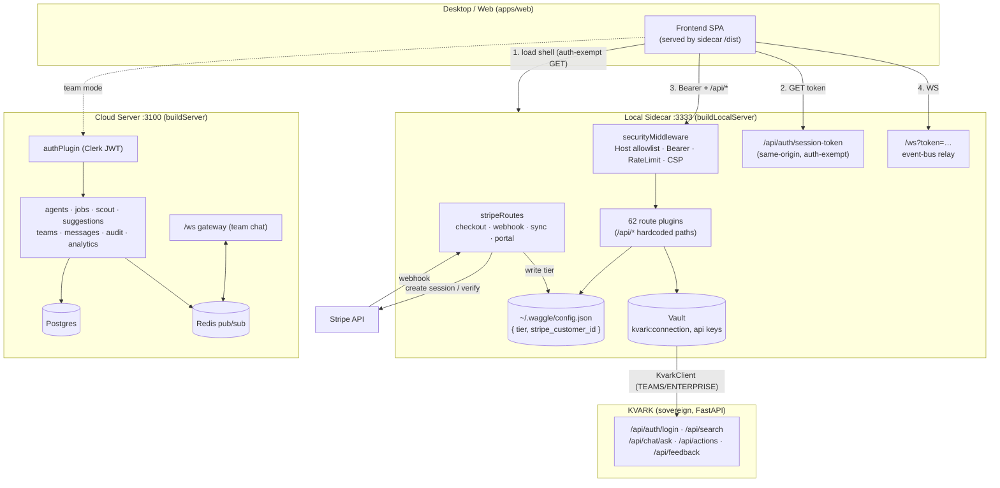

# 03g — API: Cloud / Multi-Tenant Routes, Stripe Billing, KVARK, WebSockets

## Purpose

This section documents the **two distinct HTTP surfaces** the Waggle backend exposes, the **Stripe billing flow** (checkout → webhook/sync → tier resolution), the **KVARK enterprise client** (tier-gated, vault-credentialed), and the **WebSocket** real-time channels. Crucially, it nails down **how the frontend discovers the API root** and what auth/origin guards every request must satisfy. For a Lovable rebuild, treat the endpoint tables below as the binding contract.

---

## 1. Two Servers — Know Which One You Are Talking To

Waggle ships **two separate Fastify servers**. They do NOT share a port, an auth model, or a database. The frontend you are rebuilding almost always talks to the **Local Sidecar**, not the Cloud server.

| | **Local Sidecar** | **Cloud / Multi-Tenant Server** |
|---|---|---|
| Entry file | `packages/server/src/local/index.ts` → `buildLocalServer()` | `packages/server/src/index.ts` → `buildServer()` |
| Started by | `packages/server/src/local/start.ts` → `service.ts:startService()` | run `index.ts` directly |
| Default port | **3333** (`WAGGLE_PORT`, const `DEFAULT_PORT = 3333`) | **3100** (`PORT`) |
| Default host | loopback (`resolveBindHost()`) | `0.0.0.0` (`HOST`) |
| Database | SQLite `.mind` files in `~/.waggle` (better-sqlite3) | Postgres (`DATABASE_URL`) + Redis (`REDIS_URL`) |
| Auth model | **Session-token Bearer** (generated at boot) + same-origin/host guards | **Clerk JWT** Bearer (`fastify.authenticate`) |
| Tier source | `~/.waggle/config.json` `{ tier }` (read by `requireTier`) | Clerk-provisioned user rows |
| Serves frontend | **Yes** — `@fastify/static` from `dist/` with SPA fallback | No |
| WebSocket | `/ws` (token in query param, event-bus relay) | `/ws` (Clerk-auth message, team chat + Redis) |
| Stripe routes | **Yes** (`stripeRoutes` registered) | No |
| KVARK client | Used by agent tools via vault config | No |

> The desktop binary loads `apps/web` from the sidecar's static handler, so the **frontend origin IS the sidecar** (`http://localhost:3333` or `tauri://localhost`). API calls are same-origin to the sidecar. The cloud server (3100) is only used in SaaS/team-server deployments and is referenced by the sidecar's `team` routes via `teamServerUrl`.

---

## 2. How the Frontend Discovers the API Root (Local Sidecar)

The frontend is served by the sidecar itself, so the API root is **same-origin** (the page's own origin). The bootstrap handshake:

1. **Static shell loads token-free.** Non-API `GET` requests (the SPA shell + `/assets/*`) are auth-exempt, so the webview can load app code before it has a token (`security-middleware.ts`, `isNonApiGet`).
2. **Fetch the session token.** The app calls `GET /api/auth/session-token` once on connect. This endpoint is **auth-exempt but same-origin-gated** (`isLocalRequest`). It returns `{ token }` = `server.agentState.wsSessionToken` (a random token generated at boot).
3. **Send Bearer on everything else.** Every `/api/*` route (and any non-GET) requires `Authorization: Bearer <token>`. Missing → `401 MISSING_TOKEN`; wrong → `401 INVALID_TOKEN`.
4. **WebSocket** connects to `GET /ws?token=<sessionToken>` (token in query param, not header). Wrong token → socket closed with code `4001`.

### Request guards the frontend must satisfy (Local Sidecar, every request)

| Guard | Source | Rule | Failure |
|---|---|---|---|
| Security headers | `securityMiddleware` `onRequest` | CSP, `X-Frame-Options: DENY`, `nosniff`, etc. set on every reply | n/a (response only) |
| Host allowlist (anti-DNS-rebind) | `hostHeaderAllowed()` | When loopback-bound: `Host` (port stripped) ∈ `{127.0.0.1, localhost, ::1}` + `WAGGLE_ALLOWED_HOSTS`. **Empty Host fails closed.** | `403 BAD_HOST` |
| Bearer token | `securityMiddleware` | All non-exempt routes need `Authorization: Bearer <sessionToken>`. Exempt: `OPTIONS`, `/health`, `/api/auth/session-token`, non-API GETs. `WAGGLE_TRUST_LOCALHOST=1` restores legacy loopback trust. | `401 MISSING_TOKEN` / `401 INVALID_TOKEN` |
| CORS | `corsOriginAllowed()` | **Exact-match** allowlist (`cors-config.ts`); missing origin allowed. Includes `tauri://localhost`, `https://tauri.localhost`, `localhost:1420/3333/8080/8081/8082/5173`. | CORS error |
| Same-origin gate (sensitive routes) | `isLocalRequest()` | URL-parsed origin/referer must be local (`tauri:`, `https://tauri.localhost`, or local host). No origin+referer ⇒ treated local. | `403 Forbidden: external origin` |
| Rate limit | `RateLimiter` | Sliding window, default **100 req/min** per `clientIP:method route`. Overrides: `/api/chat` 120, `/api/vault/*/reveal` 5, `/api/backup` 2, `/api/restore` 2, `/api/browse/local/mkdir` 10. | `429` + `Retry-After` |
| Session timeout (team mode only) | `SessionTimeoutTracker` | Only active when `CLERK_SECRET_KEY` set. 30 min inactivity (`WAGGLE_SESSION_TIMEOUT_MS`). Exempt: `/health`, `/api/vault`. | `401 SESSION_TIMEOUT` |

---

## 3. Local Sidecar — Full Route-Plugin Registration

`buildLocalServer()` registers **62 route plugins** plus inline endpoints. **None are mounted with a base prefix** — each route file hardcodes its own `/api/...` paths. Registration order (from `local/index.ts` lines 1974–2031):

```
workspaceRoutes        chatRoutes            memoryRoutes          settingsRoutes
sessionRoutes          knowledgeRoutes       litellmRoutes         ingestRoutes
mindRoutes             agentRoutes           skillRoutes           approvalRoutes
anthropicProxyRoutes   teamRoutes            taskRoutes            capabilitiesRoutes
toolsRoutes            waggleDanceRoutes     commandRoutes         cronRoutes
notificationRoutes     marketplaceDevRoutes  marketplaceRoutes     connectorRoutes
fleetRoutes            importRoutes          vaultRoutes           personaRoutes
feedbackRoutes         workspaceTemplateRoutes  evolutionRoutes    exportRoutes
dataEraseRoutes        costRoutes            backupRoutes          offlineRoutes
weaverRoutes           eventRoutes           workflowRoutes        pinRoutes
documentRoutes         fileRoutes            waggleSignalRoutes    providerRoutes
profileRoutes          oauthRoutes           browseRoutes          browserExtRoutes
telegramRoutes         telemetryRoutes       agentGroupRoutes      stripeRoutes
harvestRoutes          wikiRoutes            identityRoutes        agentRunRoutes
localInferenceRoutes   complianceRoutes
```

Plus inline endpoints on the sidecar root:

| Method | Path | Purpose | Guard |
|---|---|---|---|
| GET | `/health` | Health probe (used by `/api/debug/logs`) | none |
| GET | `/api/auth/session-token` | Bootstrap session token for the webview | same-origin (`isLocalRequest`), auth-exempt |
| GET | `/api/debug/logs` | Support bundle (health + 50 audit rows) | same-origin |
| GET | `/api/docs` | Auto-generated route/OpenAPI listing | bearer |
| GET | `/ws` | WebSocket event-bus relay (approvals, agent steps, notifications) | `?token=<sessionToken>` |
| GET | `/*` (SPA fallback) | `setNotFoundHandler` serves `index.html` for non-API/non-asset routes | auth-exempt GET |

> Static frontend dir is resolved from `WAGGLE_FRONTEND_DIR` or probed (`<root>/dist`, then legacy `app/dist`). SPA fallback explicitly does NOT intercept `/api/`, `/v1/`, `/assets/`, `/health`, `/ws`.

---

## 4. Local Sidecar — Route Files Mapped (the four requested + key contracts)

All paths below are **bearer-gated** (`Authorization: Bearer <sessionToken>`) at the middleware layer unless noted. These route files (`agents.ts`, `jobs.ts`, `scout.ts`, `suggestions.ts`) live in the **Cloud** server (`packages/server/src/routes/`) and use **Clerk** `fastify.authenticate` — they are NOT in the sidecar. The sidecar's agent surface is `routes/agent.ts` + `routes/agent-groups.ts` + `routes/agent-run.ts`. Both are documented here because the prompt named the cloud files.

### 4a. Cloud `routes/agents.ts` — sub-agent definitions & groups (Clerk-auth)

| Method | Path | Purpose | Notes |
|---|---|---|---|
| POST | `/api/agents` | Create sub-agent definition | body `createAgentSchema`; 201 |
| GET | `/api/agents` | List user's agents | scoped to `request.userId` |
| PATCH | `/api/agents/:id` | Update agent config | 403 if not owner |
| DELETE | `/api/agents/:id` | Delete agent | 403 if not owner; 204 |
| POST | `/api/agent-groups` | Create group w/ members | body `createAgentGroupSchema`; 201 |
| GET | `/api/agent-groups` | List groups | |
| GET | `/api/agent-groups/:id` | Get group + members | 404 if not found |
| PATCH | `/api/agent-groups/:id` | Update name/description/strategy/members | |
| DELETE | `/api/agent-groups/:id` | Delete group + members | 204 |
| POST | `/api/agent-groups/:id/run` | Execute group on a `{ task, teamId? }` | builds workflow; returns `202 { jobId?, workflow{name,steps,strategy,aggregation}, message }` |

### 4b. Cloud `routes/jobs.ts` — async job queue (Clerk-auth, Redis-backed)

| Method | Path | Purpose | Notes |
|---|---|---|---|
| GET | `/api/jobs?teamSlug=&limit=` | List jobs for a team | 400 if no `teamSlug`; 403 if not a member; default limit 50 |
| POST | `/api/jobs` | Queue a job | body `queueJobSchema` `{ teamId?, jobType, input }`; returns `202 { jobId, status }` |
| POST | `/api/jobs/:id/cancel` | Cancel queued/running job | 409 if status not queued/running; `{ cancelled, jobId }` |
| GET | `/api/jobs/:id` | Get job status | 404 if not found |

### 4c. Cloud `routes/scout.ts` — proactive findings (Clerk-auth)

| Method | Path | Purpose | Notes |
|---|---|---|---|
| GET | `/api/scout/findings` | List findings for user | via `ScoutAgent.listFindings` |
| PATCH | `/api/scout/findings/:id` | Adopt or dismiss | body `{ status: 'adopted' \| 'dismissed' }`; 400 otherwise; 404 if not found |

### 4d. Cloud `routes/suggestions.ts` — proactive suggestions (Clerk-auth)

| Method | Path | Purpose | Notes |
|---|---|---|---|
| GET | `/api/suggestions` | List pending suggestions | via `ProactiveService.listPending` |
| PATCH | `/api/suggestions/:id` | Accept/dismiss/snooze | body `{ status: 'accepted' \| 'dismissed' \| 'snoozed' }`; 400 otherwise; 404 if not found |

---

## 5. Stripe Billing (Local Sidecar — `stripeRoutes`)

All Stripe routes are gated behind `STRIPE_SECRET_KEY`. When unset, every route returns **`503 STRIPE_NOT_CONFIGURED`**. The Stripe SDK is lazily, dynamically required (`getStripe()`, apiVersion `2025-03-31.basil`) so `stripe` is not a hard dependency.

### Endpoints

| Method | Path | Body | Returns | Guard / Notes |
|---|---|---|---|---|
| POST | `/api/stripe/create-checkout-session` | `{ tier: 'PRO'\|'TEAMS', billingPeriod?: 'monthly'\|'annual' }` | `{ url }` | 400 `INVALID_TIER` if not PRO/TEAMS; 400 `NO_PRICE_CONFIGURED` if no price env; 502 `STRIPE_ERROR`. `mode: 'subscription'`, `allow_promotion_codes: true`, metadata carries `tier`+`billingPeriod`. success → `{origin}/payment-success?session_id={CHECKOUT_SESSION_ID}`, cancel → `{origin}/payment-cancelled`. |
| POST | `/api/stripe/webhook` | raw Stripe event (buffer) | `{ received: true }` or `{ received, duplicate: true }` | Validates `stripe-signature` (needs `STRIPE_WEBHOOK_SECRET`). 400 `MISSING_SIGNATURE`/`INVALID_SIGNATURE`. Idempotent (last 500 event IDs), serialized critical section. Uses **raw-body content-type parser**. |
| POST | `/api/stripe/sync` | `{ sessionId }` | `{ tier, customerId }` | Poll fallback for NAT'd desktop apps. 402 `PAYMENT_NOT_COMPLETED` if unpaid; 400 `TIER_NOT_RESOLVED`; 502 `STRIPE_ERROR`. |
| POST | `/api/stripe/create-portal-session` | — | `{ url }` | **`preHandler: requireTier('PRO')`**. Reads `stripe_customer_id` from `config.json`; 400 `NO_STRIPE_CUSTOMER` if none. return → `{origin}/settings`. |

### Tier ↔ Price resolution (`stripe/index.ts`)

`tierFromPriceId(priceId): Tier | null` — synchronous, **offline** (no Stripe round-trip). Resolves a price ID to a tier by matching env vars, **new 4-var contract checked first, legacy fallbacks after**:

| Tier | Env vars checked (in order) |
|---|---|
| `PRO` | `STRIPE_PRICE_PRO_MONTHLY`, `STRIPE_PRICE_PRO_ANNUAL`, `STRIPE_PRICE_PRO`, `STRIPE_PRICE_BASIC` |
| `TEAMS` | `STRIPE_PRICE_TEAMS_MONTHLY`, `STRIPE_PRICE_TEAMS_ANNUAL`, `STRIPE_PRICE_TEAMS` |

`priceIdForTier(tier, billingPeriod='monthly')` — the inverse, used by checkout. Prefers the period-specific 4-var, falls back to legacy single-var, then `TIER_CAPABILITIES[tier].stripePriceId`.

### Webhook event handling → writes `config.json` `{ tier, stripe_customer_id }`

| Stripe event | Action |
|---|---|
| `checkout.session.completed` | Grant tier from `metadata.tier` **only if `payment_status ∈ {paid, no_payment_required}`** |
| `customer.subscription.updated` | Resolve tier via `tierFromPriceId(items[0].price.id)`, update |
| `customer.subscription.deleted` | Downgrade to `FREE` |

Tier writes use `atomicWriteJson` (temp + rename) and a module-scoped promise queue (`serializeWebhook`) to prevent TOCTOU double-processing on Stripe retries. The same `config.json` is read by `requireTier`/`readTierFromRequest` and the portal route. For the frontend: after a checkout redirect, **call `POST /api/stripe/sync` with the `session_id`** to confirm payment locally (webhooks are unreliable behind NAT).

---

## 6. KVARK Client (`packages/server/src/kvark/*`) — Enterprise, Tier-Gated

KVARK is Egzakta's sovereign enterprise platform. Waggle never calls KVARK directly — **everything flows through `KvarkClient`**, which is the single boundary. KVARK tools are registered only when KVARK is configured (TEAMS/ENTERPRISE tiers, per `kvark-tools.ts`). There are **no Fastify routes** for KVARK; it is consumed internally by agent tools.

### Config & auth

- **Credentials live in the vault** as `kvark:connection` → JSON `{ baseUrl, identifier, password, timeoutMs? }` (`getKvarkConfig(vault)`; returns `null` if unset/invalid).
- **`KvarkAuth`** manages the JWT lifecycle: `POST {baseUrl}/api/auth/login` with `{ identifier, password }`, caches the Bearer token in memory, auto-relogins on 401. `KvarkLoginResponse = { success, access_token, token_type, user, error }`.

### `KvarkClient` public methods → KVARK API (FastAPI backend)

| Method | KVARK endpoint | Returns | Notes |
|---|---|---|---|
| `search(query, {limit?, offset?})` | `GET /api/search?q=&limit=&offset=` | `KvarkSearchResponse { results[], total, query }` | Waggle never re-ranks results |
| `askDocument(documentId, question)` | `POST /api/chat/ask` | `KvarkAskResponse { answer, sources[] }` | KVARK side currently stubbed 501; handled gracefully |
| `feedback(documentId, query, useful, reason?)` | `POST /api/feedback` | `KvarkFeedbackResponse { ok, data{stored, feedbackId?}, error }` | fire-and-ack |
| `action(actionType, target, payload, reason, approvalReference?, workspaceId?)` | `POST /api/actions` | `KvarkActionResponse { ok, data{status,actionId?,auditRef?,result?}, error }` | governed; requires `userApproved` |
| `ping()` | `GET /api/auth/me` | `KvarkUser` | connectivity/auth check |

### KVARK resilience contract (`kvark-client.ts request()`)

- **401** → invalidate token, re-login once, retry; second 401 → `KvarkAuthError`.
- **429** → exponential backoff (honors numeric retry hint), up to `MAX_RETRIES = 3`, then `KvarkServerError(429)`.
- **5xx** (except 501) → backoff retry up to 3 (when `retryOnServerError`, default true).
- Typed errors: `KvarkAuthError`, `KvarkNotFoundError` (404), `KvarkNotImplementedError` (501), `KvarkServerError` (403/429/5xx, carries `statusCode`), `KvarkUnavailableError` (network/timeout, default 30s).

### Key KVARK DTO shapes (the Waggle↔KVARK contract)

| Type | Fields |
|---|---|
| `KvarkUser` | `id:number, identifier, first_name\|null, last_name\|null, admin:boolean, developer:boolean, status\|null, created_at\|null` |
| `KvarkSearchResult` | `document_id:number, title, snippet, score:number, document_type\|null` |
| `KvarkChatEvent` (SSE) | discriminated union: `status \| token \| tool_call \| tool_result \| thought \| done \| error` |
| `KvarkTokenUsage` | `input_tokens, output_tokens, latency_ms` |

---

## 7. WebSocket Channels

There are **two different `/ws` implementations** — one per server.

### 7a. Local Sidecar `/ws` (`local/index.ts`) — event-bus relay

- **Auth:** `?token=<sessionToken>` query param; wrong → close code `4001`.
- **Server → client** (forwarded from the in-process `eventBus`): events `approval_required`, `step`, `tool`, `done`, `error`, `presence_update`, `notification`. Frame shape: `{ event, data }`.
- **Client → server:** `{ type: 'approve'|'deny', requestId }` resolves a `pendingApprovals` entry (the human-in-the-loop tool-gate).
- Listeners are per-connection (clean removal on close — one client disconnecting does not kill others).

### 7b. Cloud `/ws` (`ws/gateway.ts`) — team chat (Clerk + Redis)

- **Auth:** client sends `{ type: 'authenticate', token }`. Token must be **JWT-structured** (`isJwtStructure`) and verified via Clerk `verifyToken` (or test override). In **production with no Clerk key, the gateway refuses to start**; in dev/desktop it warns and rejects connections. Maps Clerk `sub` → internal user; replies `{ type: 'authenticated', userId }`.
- **Client events:** `authenticate`, `join_team` (`{ teamSlug }` → subscribes Redis channel `team:<id>:waggle`, replies `joined_team`), `send_message` (`{ messageType, subtype, content }` → persists to `messages` table + publishes to Redis).
- **Fan-out:** `ConnectionManager` (`ws/connection-manager.ts`) maps `teamId → userId → WebSocket`. Methods: `add`, `remove`, `broadcast(teamId, event, excludeUserId?)`, `sendTo`, `getConnectedUsers`, `getTeamCount`.
- **Redis bridge:** subscribes `team:*:waggle` (→ `waggle_message` broadcast) and pattern `job:*:progress` (→ `job_progress` broadcast routed by `parsed.teamId`). This is how multi-process job progress reaches clients.

---

## 8. Cloud Server Route Registration (`packages/server/src/index.ts`)

`buildServer()` registers (no prefixes; each route file hardcodes `/api/...`), in order: `cors` (origin from `CORS_ORIGIN` env, fail-closed in prod), `websocket`, `redisPlugin`, **`authPlugin`** (decorates `fastify.authenticate` = Clerk verify + auto-provision user from JWT), then route plugins: `webhookRoutes`, `teamRoutes`, `agentRoutes`, `taskRoutes`, `messageRoutes`, `knowledgeRoutes`, `resourceRoutes`, `jobRoutes`, `cronRoutes`, `suggestionRoutes`, `scoutRoutes`, `auditRoutes`, `capabilityGovernanceRoutes`, `analyticsRoutes`, `wsGateway`. Plus inline `GET /health`. Decorators: `config`, `db`, `jobService`.

`authPlugin` self-heals: on a valid Clerk JWT for an unknown user it calls `clerk.users.getUser` and `upsertFromClerk` (works even if the Clerk webhook was missed). Sets `request.userId` (internal UUID) + `request.clerkId`.

---

## 9. Connection Diagram



---

## 10. Frontend Rebuild Checklist (must-knows)

- **API root = the page's own origin** (sidecar 3333 / `tauri://localhost`). No separate host to configure.
- **Two-step auth:** fetch `/api/auth/session-token` once, then send `Authorization: Bearer <token>` on every `/api/*` call and `/ws?token=`.
- **All `/api/*` paths are flat** — no plugin prefix; the path written in each route file IS the path.
- **After Stripe checkout redirect, call `POST /api/stripe/sync { sessionId }`** — do not rely on the webhook for desktop.
- **Tier-gated UI:** PRO+ features may return `403 TIER_INSUFFICIENT` with `{ required, actual, upgradeUrl }`; KVARK features only exist on TEAMS/ENTERPRISE.
- **Stripe unconfigured** → `503 STRIPE_NOT_CONFIGURED`; render upgrade UI defensively.
- **Rate limits** are real (chat 120/min, vault reveal 5/min, backup/restore 2/min) — handle `429` + `Retry-After`.
