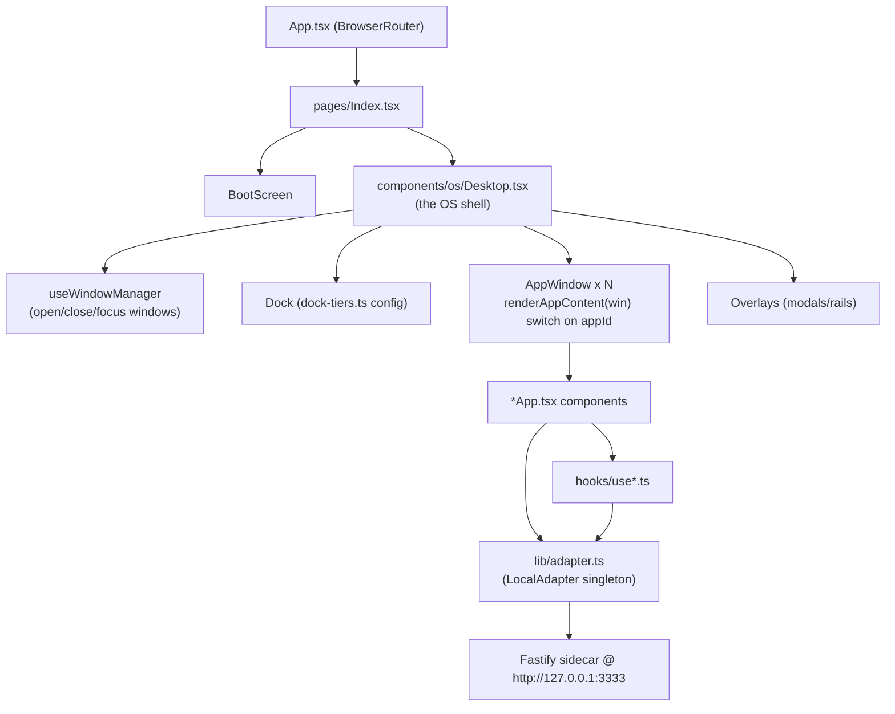

# 04 — Frontend Feature → API Map

**Purpose.** This section is the contract a Lovable rebuild must reproduce. It enumerates every OS app, overlay, and page in the Waggle web client (`apps/web/src/`), the single HTTP/SSE/WS client (`adapter`) they all share, the global providers/state, and — for each feature — the exact backend endpoints it calls. Everything below is grounded in the actual code; identifiers, paths, and field names are quoted verbatim from source.

---

## 1. Mental Model

Waggle's web UI is a **single-page "desktop OS"**, not a multi-page app. React Router (`apps/web/src/App.tsx`) defines only two routes:

| Path | Element | File |
|---|---|---|
| `/` | `<Index />` | `apps/web/src/pages/Index.tsx` |
| `*` | `<NotFound />` | `apps/web/src/pages/NotFound.tsx` |

`Index.tsx` renders a `BootScreen` (gated by `localStorage["waggle-booted"]`) and then `<Desktop />` (`apps/web/src/components/os/Desktop.tsx`). **`Desktop.tsx` is the real shell**: it owns the window manager, the dock, all app windows, and all overlays. There is no per-app routing — apps are opened as draggable windows by `appId`.

Two things every Lovable rebuild MUST recreate first:

1. **The `adapter` singleton** (`apps/web/src/lib/adapter.ts`) — one `LocalAdapter` instance exported as `export const adapter = new LocalAdapter()`. Every component and hook imports this same instance. It is the only thing that talks to the backend.
2. **`ServiceProvider`** (`apps/web/src/providers/ServiceProvider.tsx`) — the only React context provider. It calls `adapter.connect()` once on mount and exposes `{ adapter, connected, connecting, error, reconnect }` via `useService()`.

---

## 2. API Client Contract (`lib/adapter.ts`)

### 2.1 Base URL & connection

| Concern | Behavior (from code) |
|---|---|
| Default server | `const DEFAULT_SERVER = 'http://127.0.0.1:3333'` |
| Base URL resolution | constructor: `serverUrl ?? localStorage.getItem('waggle:server-url') ?? DEFAULT_SERVER` |
| Change server | `adapter.setServerUrl(url)` — persists to `localStorage["waggle:server-url"]`, resets connected flags |
| Connect | `adapter.connect()` → `healthProbe()` (GET `/health`) then `fetchSessionToken()`; sets `_connected = true` |
| Auto-rediscovery | `healthProbe()` falls back to `DEFAULT_SERVER` once if the stored URL fails, and persists the working URL |
| Connection getters | `adapter.isConnected`, `adapter.hasAttemptedConnect`, `adapter.getServerUrl()` |

### 2.2 Auth / header pattern

Auth is a **bearer token fetched from a same-origin bootstrap**, not a login form:

- On `connect()`, `fetchSessionToken()` does GET `/api/auth/session-token` → `{ token }`, stored in `this.authToken`.
- Every request goes through `adapter.fetch(path, init)` which:
  - Adds `Content-Type: application/json` **only when a body is present** and no content-type was supplied (a deliberate fix — bodyless POSTs must not send JSON content-type).
  - Adds `Authorization: Bearer <token>` when `authToken` is set.
  - On HTTP **403** with body `{ error: 'TIER_INSUFFICIENT' }`, dispatches a global `window` event `waggle:tier-insufficient` with `{ required, actual, message }` (this drives the `UpgradeModal`).
- All requests use `fetchWithTimeout` (`lib/fetch-utils.ts`, default 10s; uploads/ingest use 30s) which throws `TimeoutError` / `NetworkError`.

### 2.3 Streaming patterns

| Pattern | Method(s) | Transport |
|---|---|---|
| Chat token stream | `async *sendMessage(...)` | `POST /api/chat` returning an SSE-formatted body, parsed manually (`event:` / `data:` lines) into `StreamEvent` |
| Server-Sent Events (named/default) | `private subscribeSSE(path, onData)` | `EventSource`; used by `subscribeEvents`, `subscribeNotifications`, `subscribeWaggleDance` |
| Named SSE event | `subscribeSubagentStatus(...)` | `EventSource.addEventListener('subagent_status', ...)` on `/api/notifications/stream` |
| Harvest progress | `subscribeHarvestProgress(...)` | `EventSource` on `/api/harvest/progress`; returns `{ ready: Promise, close }` |
| WebSocket | `connectWebSocket(onMessage)` | `new WebSocket(baseUrl→ws + /ws?token=<authToken>)` |

The chat SSE event names are normalized inside `sendMessage`: `token→token`, `tool→tool_start`, `tool_result→tool_end`, `done`, `error`, `step`, `approval_request`. `useChat` additionally handles `approval_required` and `model_switch`.

### 2.4 Response normalization helpers (rebuild must mirror these)

The backend and the frontend contract disagree on several field names; the adapter normalizes on read. A Lovable rebuild that talks to the same backend must reproduce these mappings or it will crash on `undefined`:

| Helper | Maps |
|---|---|
| `unwrapArray<T>(data)` | accepts raw array OR `{ results: [...] }` / `{ key: [...] }` envelopes |
| `normalizeFrame(raw)` | `frameType` codes `I/F/E/D/T/N` → `insight/fact/event/decision/task/entity`; `importance` string `low/normal/high/critical` ↔ number `1-4` |
| `normalizeCronJob(raw)` | server `cronExpr/lastRunAt/nextRunAt` → client `schedule/lastRun/nextRun` |
| `getFleet()` | server `durationMs/tokensUsed` → client `duration/tokenUsage` |
| `getModelPricing()` | server `inputPer1k/outputPer1k` → client `inputCostPer1k/outputCostPer1k` |
| `getMemoryStats()` | server `frameCount/entityCount/relationCount` → client `frames/entities/relations`; tolerates `workspace: null` |
| `getModel()` | accepts raw string OR `{ model }` |

### 2.5 Tauri dual-path

Several memory methods branch on `isTauri()` (`lib/tauri-bindings.ts`) and use Rust IPC instead of HTTP when running inside the desktop binary: `addMemoryFrame`, `searchMemory`, `getKnowledgeGraph`, `getIdentity`. A web-only Lovable rebuild uses the HTTP path exclusively (the `else` branch of each).

---

## 3. Complete Endpoint Reference

Every adapter method below maps to a backend route. Method = HTTP verb the adapter issues. "Stream" = SSE/WS. Request/response shapes are the adapter's declared TS types (verbatim).

### 3.1 Auth / Health / System

| Method | Path | Request | Response | Stream |
|---|---|---|---|---|
| GET | `/health` | — | `SystemHealth { status, uptime, services[] }` | no |
| GET | `/api/auth/session-token` | — | `{ token? }` | no |
| GET | `/api/agent/status` | — | `AgentStatus { model, tokensUsed, costUsd, isActive }` | no |
| GET | `/api/agent/cost` | — | `{ totalCost, totalTokens }` | no |
| GET | `/api/agent/model` | — | `string \| { model }` | no |
| PUT | `/api/agent/model` | `{ model }` | — | no |
| POST | `/api/agent/abort` | `{ workspaceId }` | — | no |

### 3.2 Workspaces & Templates

| Method | Path | Request | Response |
|---|---|---|---|
| GET | `/api/workspaces` | — | `Workspace[]` (normalizes `personaId`→`persona`) |
| POST | `/api/workspaces` | `{ name, group, persona?/personaId?, agentGroupId?, templateId?, shared?, model? }` | `Workspace` |
| PUT | `/api/workspaces/:id` | `Partial<Workspace>` | `Workspace` |
| PATCH | `/api/workspaces/:id` | `Partial<{persona, agentGroupId, templateId, name, group, model}>` | `Workspace` |
| DELETE | `/api/workspaces/:id` | — | — |
| GET | `/api/workspaces/:id/context` | — | `WorkspaceContext` |
| GET | `/api/workspaces/:id/files` | — | `unknown[]` |
| GET | `/api/workspace-templates` | — | `{ templates: WorkspaceTemplate[], count }` |
| POST | `/api/workspace-templates` | `Omit<WorkspaceTemplate,'id'\|'builtIn'>` | `WorkspaceTemplate` |
| POST | `/api/workspace-templates/generate` | `{ prompt, availableConnectors[], availableCommands[], availablePersonas[] }` | template |
| PUT | `/api/workspace-templates/:id` | template | `WorkspaceTemplate` |
| DELETE | `/api/workspace-templates/:id` | — | — |
| GET | `/api/browse/local?path=` | — | `{ entries[{name,path,type}], current }` |
| POST | `/api/browse/local/mkdir` | `{ path }` | `{ name, path, type }` |

### 3.3 Files

| Method | Path | Request | Response |
|---|---|---|---|
| GET | `/api/workspaces/:id/files/list?path=` | — | `FileEntry[]` |
| POST | `/api/workspaces/:id/files/upload` | `FormData(file, path)` (30s timeout) | `FileEntry` |
| GET | `/api/workspaces/:id/files/download?path=` | — | `Blob` |
| POST | `/api/workspaces/:id/files/mkdir` | `{ path }` | `FileEntry` |
| POST | `/api/workspaces/:id/files/delete` | `{ path }` | — |
| POST | `/api/workspaces/:id/files/move` | `{ from, to }` | `FileEntry` |
| POST | `/api/workspaces/:id/files/copy` | `{ from, to }` | `FileEntry` |
| GET | `/api/workspaces/:id/documents` | — | `{ documents[{name, versions[]}] }` |
| GET | `/api/workspaces/:id/documents/:name/versions` | — | `{ versions[] }` |

### 3.4 Chat / Sessions / Pins / History / Feedback

| Method | Path | Request | Response | Stream |
|---|---|---|---|---|
| POST | `/api/chat` | `{ workspaceId, message, sessionId?, persona?, autonomy?, shape }` | SSE body of `StreamEvent`s | **yes (SSE)** |
| DELETE | `/api/chat/history?session=` | — | — | no |
| GET | `/api/history?workspace=&session=` | — | `ChatMessage[]` | no |
| GET | `/api/workspaces/:id/sessions` | — | `Session[]` | no |
| POST | `/api/workspaces/:id/sessions` | — | `Session` | no |
| PATCH | `/api/sessions/:id?workspace=` | `{ title }` | — | no |
| DELETE | `/api/sessions/:id?workspace=` | — | — | no |
| GET | `/api/workspaces/:id/sessions/search?q=` | — | `Session[]` | no |
| GET | `/api/workspaces/:id/sessions/:sid/export` | — | `string` | no |
| GET | `/api/workspaces/:id/pins` | — | `{ pins[] }` | no |
| POST | `/api/workspaces/:id/pins` | `{ messageContent, messageRole, label? }` | pin | no |
| DELETE | `/api/workspaces/:id/pins/:pinId` | — | — | no |
| POST | `/api/feedback` | `{ sessionId, messageIndex, rating, reason?, detail? }` | — (fire-and-forget) | no |

### 3.5 Memory / Knowledge Graph / Identity

| Method | Path | Request | Response |
|---|---|---|---|
| GET | `/api/memory/frames?limit=&workspace=` | — | `MemoryFrame[]` (normalized) |
| POST | `/api/memory/frames` | `Omit<MemoryFrame,'id'>` | `MemoryFrame` |
| PUT | `/api/memory/frames/:id` | `Partial<MemoryFrame>` | `MemoryFrame` |
| DELETE | `/api/memory/frames/:id` | — | — |
| PATCH | `/api/memory/frames/:id/access?workspace=` | — | `{ accessCount }` |
| GET | `/api/memory/search?q=&scope=` | — | `MemoryFrame[]` |
| GET | `/api/memory/graph?workspace=` / `?scope=all\|personal` | — | `{ nodes: KGNode[], edges: KGEdge[] }` |
| GET | `/api/memory/stats` | — | `{ personal, workspace, total }` each `{frames,entities,relations}` |
| GET | `/api/identity` | — | `IdentityResponse { configured, name, ... }` |
| GET | `/api/team/memory/search?q=&limit=` | — | `{ results[] }` |
| GET | `/api/mind/identity` · `/api/mind/awareness` · `/api/mind/skills` | — | `unknown` |

### 3.6 Local Inference (Ollama)

| Method | Path | Response |
|---|---|---|
| GET | `/api/local-inference/hardware` | `{ hardware, source }` |
| GET | `/api/local-inference/models?useCase=` | `{ models[], source }` |
| GET | `/api/local-inference/status` | `{ servers[], ollamaInstalled, totalLocalModels }` |
| POST | `/api/local-inference/pull` | `{ ok }` (body `{ model }`) |

### 3.7 Events / Timeline / Stats

| Method | Path | Response | Stream |
|---|---|---|---|
| GET | `/api/events?workspaceId=` | `AgentStep[]` | no |
| GET | `/api/events?workspaceId=&limit=&from=` | `TimelineEvent[]` | no |
| GET | `/api/events/stats` | `{ byType, total, dailyBreakdown? }` | no |
| — | `/api/events/stream` | `AgentStep` | **yes (SSE)** |

### 3.8 Skills / Capabilities / Marketplace

| Method | Path | Request | Response |
|---|---|---|---|
| GET | `/api/skills` | — | `SkillPack[]` (forced `installed:true`) |
| POST | `/api/skills/create` | `{ name, description }` | — |
| GET | `/api/skills/starter-pack/catalog` | — | `SkillPack[]` (maps `family`→category) |
| POST | `/api/skills/starter-pack/:skillId` | `{}` | — (throws with status/body on !ok) |
| GET | `/api/skills/capability-packs/catalog` | — | `SkillPack[]` |
| GET | `/api/skills/test` | — | (raw `adapter.fetch`, CapabilitiesApp) |
| GET | `/api/capabilities/status` | — | `unknown` |
| GET | `/api/marketplace/packs` | — | `SkillPack[]` |
| GET | `/api/marketplace/search?query=&limit=` | — | raw `Response` |
| GET | `/api/marketplace/installed` | — | raw `Response` |
| POST | `/api/marketplace/install` | `{ packageId }` | raw `Response` |
| POST | `/api/marketplace/uninstall` | `{ packageId }` | raw `Response` |

> Note: marketplace search/installed/install/uninstall return the raw `Response` so callers can do status-aware handling (403 → `UpgradeModal`). All four go through authenticated `adapter.fetch` (a raw `fetch` 401s before the session token bootstraps).

### 3.9 Fleet / Agents / Agent Groups / Jobs

| Method | Path | Request | Response |
|---|---|---|---|
| GET | `/api/fleet` | — | `FleetSession[]` (normalized) |
| POST | `/api/fleet/:workspaceId/(pause\|resume\|kill)` | — | — (`stop`→`kill`) |
| POST | `/api/fleet/spawn` | `{ task, persona?, model?, parentWorkspaceId? }` | `FleetSession` (throws on !ok) |
| GET | `/api/personas` | — | `Persona[]` |
| POST | `/api/personas` | `{ name, description, icon?, systemPrompt, tools? }` | `Persona` |
| PATCH | `/api/personas/:id` | persona patch | `unknown` |
| DELETE | `/api/personas/:id` | — | — |
| POST | `/api/personas/generate` | `{ prompt }` | `{ name, description, systemPrompt, tools[] }` |
| GET | `/api/agent-groups` | — | `unknown[]` |
| POST | `/api/agent-groups` | `{ name, description, strategy, members[] }` | `unknown` |
| PATCH | `/api/agent-groups/:id` | group patch | `unknown` |
| DELETE | `/api/agent-groups/:id` | — | — |
| POST | `/api/agent-groups/:id/run` | `{ task, teamId:'default' }` | `unknown` |
| GET | `/api/jobs/:jobId` | — | `{ status, startedAt?, completedAt?, output? } \| null` |
| POST | `/api/jobs/:jobId/cancel` | — | — |

### 3.10 Cron / Scheduled Jobs

| Method | Path | Request | Response |
|---|---|---|---|
| GET | `/api/cron` | — | `CronJob[]` (normalized) |
| POST | `/api/cron` | `{ name, cronExpr, jobType, jobConfig?, workspaceId?, enabled? }` | `CronJob` |
| PUT | `/api/cron/:id` | `Partial<CronJob>` | `CronJob` |
| DELETE | `/api/cron/:id` | — | — |
| POST | `/api/cron/:id/trigger` | — | `{ triggered, autoEnabled?, schedule? }` |

### 3.11 Notifications / Approvals

| Method | Path | Request | Response | Stream |
|---|---|---|---|---|
| — | `/api/notifications/stream` | — | `Notification` / `subagent_status` event | **yes (SSE)** |
| GET | `/api/notifications/history` | — | `Notification[]` | no |
| PATCH | `/api/notifications/:id/read` | — | — | no |
| POST | `/api/notifications/read-all` | — | — | no |
| GET | `/api/approval/pending` | — | `{ pending[{requestId,toolName,input,timestamp}], count }` | no |
| POST | `/api/approval/:requestId` | `{ approved, always, sourceWorkspaceId }` | — | no |
| GET | `/api/approval/grants` | — | `{ grants[], count }` | no |
| DELETE | `/api/approval/grants/:id` | — | — | no |
| POST | `/api/approval/grants/clear` | — | — | no |

### 3.12 Settings / Permissions / Providers / LiteLLM

| Method | Path | Request | Response |
|---|---|---|---|
| GET | `/api/settings` | — | `Settings` |
| PUT | `/api/settings` | `Partial<Settings>` | — |
| GET | `/api/settings/permissions` | — | `{ defaultAutonomy, externalGates[], workspaceOverrides }` |
| PUT | `/api/settings/permissions` | partial | — |
| POST | `/api/settings/test-key` | `{ provider, apiKey }` | `{ valid }` |
| GET | `/api/providers` | — | `{ providers[], search[], activeSearch }` |
| GET | `/api/litellm/models` | — | `string[]` |
| GET | `/api/litellm/status` | — | `unknown` |
| GET | `/api/litellm/pricing` | — | `ModelPricing[]` (normalized) |
| GET | `/api/debug/logs` | — | (raw, SettingsApp) |
| GET | `/api/export` · POST `/api/backup` · POST `/api/restore` | — | (raw, SettingsApp/BackupApp) |

### 3.13 Connectors / Vault / Profile

| Method | Path | Request | Response |
|---|---|---|---|
| GET | `/api/connectors` | — | `Connector[]` |
| GET | `/api/connectors/:id/health` | — | `unknown` |
| POST | `/api/connectors/:id/connect` | — | — |
| POST | `/api/connectors/:id/disconnect` | — | — |
| GET | `/api/vault` | — | `unknown` |
| POST | `/api/vault` | `{ name, value, type? }` | — |
| DELETE | `/api/vault/:id` | — | — |
| GET | `/api/profile` | — | profile |
| PUT | `/api/profile` | `Record<string,unknown>` | profile |
| POST | `/api/profile/analyze-style` | `{ text }` | analysis |
| POST | `/api/profile/analyze-brand` | `{ description }` | analysis |
| POST | `/api/profile/research` | `{}` | research |

### 3.14 Costs / Telemetry / Team / Weaver / Audit

| Method | Path | Response |
|---|---|---|
| GET | `/api/costs` · `/api/cost/by-workspace` · `/api/cost/summary` | cost objects |
| GET | `/api/telemetry/status` | `{ enabled, totalEvents }` |
| POST | `/api/telemetry/toggle` | — (`{ enabled }`) |
| DELETE | `/api/telemetry/events` | `{ deleted }` |
| POST | `/api/telemetry/track` | — (`{ event, properties }`, fire-and-forget) |
| POST | `/api/team/connect` | — (`{ serverUrl, token }`) |
| POST | `/api/team/disconnect` | — |
| GET | `/api/team/status` | `{ connected, teamName? }` |
| GET | `/api/team/members` · `/api/team/activity` · `/api/team/messages?workspaceId=` | arrays |
| GET | `/api/weaver/status` | `{ lastConsolidation?, status }` |
| POST | `/api/weaver/trigger` | — (WeaverPanel, raw) |
| GET | `/api/audit/installs` | `unknown[]` |

### 3.15 Waggle Dance (multi-agent signals)

| Method | Path | Request | Response | Stream |
|---|---|---|---|---|
| GET | `/api/waggle/signals` | — | `WaggleSignal[]` | no |
| POST | `/api/waggle/signals` | `Omit<WaggleSignal,'id'\|'timestamp'>` | `WaggleSignal` | no |
| PATCH | `/api/waggle/signals/:id/ack` | — | — | no |
| — | `/api/waggle/stream` | — | `WaggleSignal` | **yes (SSE)** |

### 3.16 AI-OS Tool Launcher

| Method | Path | Request | Response |
|---|---|---|---|
| GET | `/api/tools/detect` | — | `{ platform, detectedAt, tools[{id,displayName,installed,installedPath,version,hooksInstalled,...}] }` |
| POST | `/api/tools/launch` | `{ id, installedPath, workspaceId?, args?, cwd? }` | `{ ok, pid, error? }` |
| GET | `/api/tools/processes` | — | `{ processes[{pid,toolId,startedAt,workspaceId?}], total }` |
| POST | `/api/tools/kill` | `{ pid }` | `{ ok, pid, reason, error? }` |
| POST | `/api/tools/hooks` | `{ id, action:'install'\|'verify'\|'uninstall', cliPath? }` | `{ ok, action, stdout, stderr, code, error? }` |

### 3.17 Billing / Tier / GDPR Erase / Trial

| Method | Path | Request | Response |
|---|---|---|---|
| GET | `/api/tier` | — | `{ tier, trialDaysRemaining?, trialExpired?, capabilities, usage }` |
| POST | `/api/tier/start-trial` | — | `{ tier, rawTier, trialStartedAt, trialDaysRemaining, trialExpired, capabilities }` (409 if started) |
| POST | `/api/stripe/sync` | `{ sessionId }` | `{ tier, customerId }` |
| POST | `/api/stripe/create-checkout-session` | `{ tier:'PRO'\|'TEAMS' }` | `{ url }` |
| POST | `/api/stripe/create-portal-session` | — | `{ url }` |
| POST | `/api/data/erase` | header `X-Confirm-Erase: yes` + `{ confirmation:'I UNDERSTAND THIS IS PERMANENT' }` | `{ requestedAt, markerPath, dataDirSnapshot, instruction }` |

### 3.18 Import / Harvest

| Method | Path | Request | Response | Stream |
|---|---|---|---|---|
| POST | `/api/import/preview` | `{ data, source }` | `{ knowledgeExtracted[] }` | no |
| POST | `/api/import/commit` | `{ data, source }` | — | no |
| POST | `/api/harvest/preview` | `{ data, source }` | preview | no |
| POST | `/api/harvest/commit` | `{ data, source }` / `{ resumeFromRun }` | result | no |
| GET | `/api/harvest/sources` | — | `{ sources[] }` | no |
| DELETE | `/api/harvest/sources/:source` | — | — | no |
| PATCH | `/api/harvest/sources/:source` | `{ autoSync }` | source | no |
| POST | `/api/harvest/scan-claude-code` | (bodyless) | scan | no |
| POST | `/api/harvest/extract-identity` | — | `{ suggestions[], note? }` | no |
| GET | `/api/harvest/runs/latest-interrupted` | — | `{ run \| null }` | no |
| POST | `/api/harvest/runs/:id/abandon` | — | — | no |
| — | `/api/harvest/progress` | — | `{ phase, current, total, source }` | **yes (SSE)** |

### 3.19 Wiki / Compliance

| Method | Path | Request | Response |
|---|---|---|---|
| GET | `/api/wiki/pages` · `/api/wiki/pages/:slug` · `/api/wiki/pages/:slug/content` | — | page(s) |
| POST | `/api/wiki/compile` | `{ mode:'incremental'\|'full', concepts? }` | result |
| GET | `/api/wiki/health` · `/api/wiki/watermark` | — | objects |
| POST | `/api/wiki/export/obsidian` | `{ outDir }` | `{ outDir, filesWritten, indexPath, byType }` |
| POST | `/api/wiki/export/notion` | `{ rootPageUrl }` | `{ pagesCreated, pagesUpdated, pagesUnchanged, pagesFailed, byType, errors[] }` |
| GET | `/api/compliance/status?workspaceId=` | — | status |
| POST | `/api/compliance/export` | request | json |
| POST | `/api/compliance/export-pdf` | request | `Blob` |
| GET | `/api/compliance/interactions?limit=` · `/api/compliance/models` | — | data |
| GET | `/api/compliance/templates` | — | `{ templates[] }` |
| POST | `/api/compliance/templates` | input | `{ template }` |
| PATCH | `/api/compliance/templates/:id` | patch | `{ template }` |
| DELETE | `/api/compliance/templates/:id` | — | — |

### 3.20 Endpoints called via raw `adapter.fetch` (no dedicated method)

These are hit directly inside components, bypassing a named adapter method:

| Path(s) | Caller |
|---|---|
| `/api/audit/installs`, `/api/skills/test` | `CapabilitiesApp.tsx` |
| `/api/backup/metadata`, `/api/backup`, `/api/restore` | `BackupApp.tsx`, `SettingsApp.tsx` |
| `/api/tasks` | `DashboardApp.tsx` |
| `/api/cost/by-workspace`, `/api/events/stats` | `TelemetryApp.tsx` |
| `/api/evolution/{runs,runs/:id,run,targets,baseline,status}` | `memory/EvolutionTab.tsx` |
| `/api/weaver/trigger` | `memory/WeaverPanel.tsx` |
| `/api/settings`, `/api/settings/permissions`, `/api/providers`, `/api/export`, `/api/debug/logs` | `SettingsApp.tsx` |
| `/api/v1/models`, `/api/litellm/models` | onboarding `ModelTierStep.tsx`, `SpawnAgentDialog.tsx` |

---

## 4. Feature → UI Component → Backend Endpoints

### 4.1 Dock Apps (windows opened via `appId`)

App registration lives in two places: the dock config (`lib/dock-tiers.ts`, by `UserTier`) and the window content switch (`Desktop.tsx` `renderAppContent`). The full `AppId` union (`lib/dock-tiers.ts`):
`chat`, `dashboard`, `memory`, `events`, `capabilities`, `connectors`, `cockpit`, `mission-control`, `settings`, `vault`, `profile`, `terminal`, `calculator`, `notes`, `waggle-dance`, `files`, `agents`, `scheduled-jobs`, `marketplace`, `voice`, `room`, `approvals`, `timeline`, `backup`, `telemetry`, `governance`, `launcher`.

| Feature | UI component | Backend endpoints used |
|---|---|---|
| **Chat** (token-streaming conversation, model switch, pins, file ingest, memory recall, feedback, approvals) | `apps/ChatApp.tsx` + `ChatWindowInstance.tsx` + `chat-blocks/*` (via `useChat`) | `POST /api/chat` (SSE), `GET /api/history`, `DELETE /api/chat/history`, `POST /api/approval/:id`, `submitFeedback`, `searchMemory`, pins (`GET/POST/DELETE /api/workspaces/:id/pins`), `ingestFile` (`/api/ingest`), `getModel/setModel` (`/api/agent/model`), `getModels`, `getSettings`, `getTeamMembers`, `patchWorkspace` |
| **Dashboard / Home** | `apps/DashboardApp.tsx` | `getMemoryStats` (`/api/memory/stats`), `GET /api/tasks` (raw), `getServerUrl` |
| **Memory** (tabs: Frames, Knowledge Graph, Harvest, Wiki, Evolution) | `apps/MemoryApp.tsx` → `memory/KnowledgeGraphViewer.tsx`, `HarvestTab.tsx`, `WikiTab.tsx`, `EvolutionTab.tsx`, `WeaverPanel.tsx`, `ImportReminderBanner.tsx` (via `useMemory`, `useKnowledgeGraph`) | frames CRUD (`/api/memory/frames*`), `searchMemory`, `getMemoryStats`, `getKnowledgeGraph`; **Harvest:** `getHarvestSources`, `scanClaudeCode`, `harvestPreview/Commit`, `getLatestInterruptedHarvestRun`, `resume/abandonHarvestRun`, `extractHarvestIdentity`, `subscribeHarvestProgress`, `toggleHarvestAutoSync`, `removeHarvestSource`; **Wiki:** `getWikiPages/PageContent`, `compileWiki`, `getWikiHealth`, `exportWikiToObsidian/Notion`; **Evolution:** `/api/evolution/{runs,run,targets,baseline,status}`; **Weaver:** `getWeaverStatus`, `POST /api/weaver/trigger` |
| **Events & Logs** | `apps/EventsApp.tsx` (via `useEvents`) | `getEvents` (`/api/events`), `subscribeEvents` (`/api/events/stream` SSE) |
| **Skills & Apps** (incl. Marketplace tab) | `apps/CapabilitiesApp.tsx` | `getSkills`, `getStarterPacks`, `getCapabilityPacks`, `getMarketplacePacks`, `installPack`, `installMarketplacePack`, `GET /api/audit/installs` + `/api/skills/test` (raw) |
| **Connectors** | `apps/ConnectorsApp.tsx` + `connectors/{McpCatalog,McpServerCard,BrandTile}.tsx` | `getConnectors`, `connectConnector`, `disconnectConnector`, `addVaultSecret` |
| **Cockpit / Command Center** (incl. Compliance dashboard) | `apps/CockpitApp.tsx` + `cockpit/{ComplianceDashboard,ComplianceTemplateModal}.tsx` | `getSystemHealth`, `getAgentCost`, `getConnectors`, `getCronJobs`, `getVault`, `getCapabilitiesStatus`, `getAuditInstalls`, `getCostSummary`, `getWeaverStatus`, `getEventStats`; **Compliance:** `getComplianceStatus`, `listComplianceTemplates`, `getHarvestSources`, `exportComplianceReport(+Pdf)`, template CRUD (`/api/compliance/templates*`) |
| **Mission Control** | `apps/MissionControlApp.tsx` | `getFleet`, `getTeamMembers`, `getTeamActivity`, `detectTools`, `fleetAction` |
| **Waggle Dance** | `apps/WaggleDanceApp.tsx` (via `useWaggleDance`) | `getWaggleSignals`, `subscribeWaggleDance` (`/api/waggle/stream` SSE), `publishWaggleSignal`, `acknowledgeWaggleSignal` |
| **Personas (Agents)** | `apps/AgentsApp.tsx` + `agents/{AgentCard,AgentDetail,CreateAgentForm,CreateGroupForm,GroupCard,GroupDetail,GroupExecutionPanel}.tsx` | `getPersonas`, `getCapabilityStatus`, `getAgentGroups`, `createPersona`, `updatePersona`, `deletePersona`, `createAgentGroup`, `updateAgentGroup`, `deleteAgentGroup`, `runAgentGroup`, `generatePersona`, `getJobStatus`, `cancelJob` |
| **Files** | `apps/FilesAppTabs.tsx` → `FilesApp.tsx` + `files/{FileTree,FilePreview,FileActions,FileUploadZone,SyntaxPreview,WorkspaceRail}.tsx` | `listFiles`, `uploadFile`, `downloadFile`, `createDirectory`, `deleteFile`, `moveFile`, `copyFile`, `getDocuments`, `getDocumentVersions` |
| **Scheduled Jobs** | `apps/ScheduledJobsApp.tsx` | `getCronJobs`, `createCronJob`, `updateCronJob`, `deleteCronJob`, `triggerCronJob` |
| **Marketplace** | `apps/MarketplaceApp.tsx` | `connect`, `searchMarketplace`, `getMarketplaceInstalled`, `installMarketplacePackage`, `uninstallMarketplacePackage` |
| **AI Tools / Launcher** | `apps/LauncherApp.tsx` | `detectTools`, `launchTool`, `manageHooks`, `getToolProcesses`, `killTool` |
| **Voice** | `apps/VoiceApp.tsx` | **none** — static "Coming Soon" placeholder |
| **Room** (live sub-agent canvas) | `apps/RoomApp.tsx` (via `useRoomState`) | `subscribeSubagentStatus` (`/api/notifications/stream`, named `subagent_status` SSE event) |
| **Approvals** | `apps/ApprovalsApp.tsx` | `getPendingApprovals`, `getApprovalGrants`, `respondApproval`, `revokeApprovalGrant`, `clearApprovalGrants` |
| **Timeline** | `apps/TimelineApp.tsx` | `getTimeline` (`/api/events?...&from=`) |
| **Backup & Restore** | `apps/BackupApp.tsx` | `GET /api/backup/metadata`, `POST /api/backup`, `POST /api/restore` (raw `adapter.fetch`) |
| **Usage & Telemetry** | `apps/TelemetryApp.tsx` | `GET /api/cost/by-workspace`, `GET /api/events/stats` (raw) |
| **Team Governance** (TEAMS tier) | `apps/TeamGovernanceApp.tsx` | **no direct adapter calls** (renders governance UI; sub-components / props supply data) |
| **Settings** | `apps/SettingsApp.tsx` | `getSettings`/`saveSettings`, `getPermissions`/`savePermissions`, `getTeamStatus`, `getTelemetryStatus`/`toggleTelemetry`/`clearTelemetry`, `teamConnect`/`teamDisconnect`, `GET /api/providers`, `/api/export`, `/api/backup`, `/api/restore`, `/api/debug/logs` (raw) |
| **Vault** | `apps/VaultApp.tsx` | `getVault`, `getConnectors`, `addVaultSecret`, `deleteVaultSecret`, `connectConnector`, `disconnectConnector`, `DELETE /api/vault/:id` |
| **My Profile** | `apps/UserProfileApp.tsx` | `getProfile`, `updateProfile`, `analyzeWritingStyle`, `analyzeBrand`, `researchProfile` |

> `terminal`, `calculator`, `notes` appear in the `AppId` union but have no `*App.tsx` component or `renderAppContent` case — they are declared-but-unimplemented placeholders. `voice` is implemented but is a static placeholder.

### 4.2 Overlays (modals, dialogs, rails — rendered directly by `Desktop.tsx`)

| Overlay | UI component | Backend endpoints used |
|---|---|---|
| Onboarding wizard (8 steps) | `overlays/OnboardingWizard.tsx` + `overlays/onboarding/{Welcome,WhyWaggle,Tier,ModelTier,Import,Template,Persona,ApiKey,Ready}Step.tsx` | `connect`, `trackTelemetry`, `getVault`, `getSystemHealth`, `getProviders`, `harvestPreview/Commit`, `scanClaudeCode`, `import/*`, `createPersona`, `addVaultSecret`, `createWorkspace`, `saveSettings`, `/api/v1/models` |
| Login briefing (session-start digest) | `overlays/LoginBriefing.tsx` | `getIdentity`, `getWorkspaces`, `searchMemory`, `getMemoryStats`, `getWorkspaceContext` |
| Global search (Cmd+K) | `overlays/GlobalSearch.tsx` | `getWorkspaces`, `getSessions`, `getSkills`, `searchMemory` |
| Create workspace dialog | `overlays/CreateWorkspaceDialog.tsx` | `browseLocal`, `browseLocalMkdir`, `getWorkspaceTemplates`, `createWorkspaceTemplate`, `updateWorkspaceTemplate`, `deleteWorkspaceTemplate`, `generateTemplateFromPrompt`, `getConnectors`, `getAgentGroups` |
| Persona switcher | `overlays/PersonaSwitcher.tsx` | `getPersonas`, `getAgentGroups` |
| Spawn agent dialog | `overlays/SpawnAgentDialog.tsx` | `getModels`, `getModelPricing`, `getProviders`, `getModel`, `createWorkspace`, `spawnAgent`, `/api/litellm/models` |
| Workspace switcher | `overlays/WorkspaceSwitcher.tsx` | (props-driven; workspaces from `useWorkspaces`) |
| Notification inbox | `overlays/NotificationInbox.tsx` | (props from `useNotifications`) |
| Context rail | `overlays/ContextRail.tsx` | uses `lib/context-rail-fetch.ts` (memory/context lookups) |
| Erase data dialog (GDPR) | `overlays/EraseDataDialog.tsx` | `eraseData` (`POST /api/data/erase`) |
| Upgrade modal | `overlays/UpgradeModal.tsx` | (triggered by `waggle:tier-insufficient` event; actions call `startTrial`, `createCheckoutSession`) |
| Trial expired modal | `overlays/TrialExpiredModal.tsx` | `createCheckoutSession` |
| Keyboard shortcuts help | `overlays/KeyboardShortcutsHelp.tsx` | none |
| Onboarding tooltips / tour | `overlays/OnboardingTooltips.tsx` | none |

---

## 5. Global Providers & State

There is **no Redux / Zustand / React Query**. State is React Context + custom hooks + the singleton `adapter`.

### 5.1 Provider tree (`apps/web/src/App.tsx`)

`App.tsx` wraps the router in `<ServiceProvider>` plus shadcn `<TooltipProvider>` and a `<Toaster>` (toast system in `hooks/use-toast.ts`). The only domain provider is `ServiceProvider`.

| Provider | File | Provides |
|---|---|---|
| `ServiceProvider` / `useService()` | `providers/ServiceProvider.tsx` | `{ adapter, connected, connecting, error, reconnect }`; calls `adapter.connect()` once on mount |

### 5.2 Domain hooks (the de-facto "store")

Each hook wraps adapter calls + local `useState`. `Desktop.tsx` composes them.

| Hook | File | Owns / returns |
|---|---|---|
| `useWorkspaces` | `hooks/useWorkspaces.ts` | workspaces list, active workspace, `selectWorkspace`, `createWorkspace`, `patchWorkspace`, `deleteWorkspace`, `refresh` |
| `useChat` | `hooks/useChat.ts` | `messages`, `isLoading`, `sendMessage`, `clearHistory`, `pendingApproval`, `approveAction`; parses SSE stream into `ContentBlock[]` |
| `useSessions` | `hooks/useSessions.ts` | per-workspace sessions CRUD |
| `useMemory` | `hooks/useMemory.ts` | frames, stats, search, add/update/delete, `incrementFrameAccess` |
| `useKnowledgeGraph` | `hooks/useKnowledgeGraph.ts` | `{ nodes, edges }` via `getKnowledgeGraph` |
| `useEvents` | `hooks/useEvents.ts` | steps + live `subscribeEvents` SSE |
| `useNotifications` | `hooks/useNotifications.ts` | notifications, `unreadCount`, `markRead`, `markAllRead`, live SSE |
| `useRoomState` | `hooks/useRoomState.ts` | live sub-agent map via `subscribeSubagentStatus` |
| `useWaggleDance` | `hooks/useWaggleDance.ts` | signals, filter, `acknowledge`, `publish`, live SSE |
| `useAgentStatus` | `hooks/useAgentStatus.ts` | `getAgentStatus` polling |
| `useBilling` | `hooks/useBilling.ts` | tier, `startCheckout`, `openPortal`, `syncAfterCheckout` (auto-detects `?session_id=`) |
| `useFeatureGate` | `hooks/useFeatureGate.ts` | `{ planTier, isEnabled, gate }` from `lib/feature-gates.ts` |
| `useOnboarding` | `hooks/useOnboarding.ts` | persisted `OnboardingState` in `localStorage["waggle:onboarding"]` (`completed, step, tier, workspaceId, apiKeySet, templateId, personaId, tooltipsDismissed`); supports `?skipOnboarding=true`, `?forceWizard=true` |
| `useOfflineStatus` | `hooks/useOfflineStatus.ts` | polls `getSystemHealth` for the offline pill |
| `useProviders` | `hooks/useProviders.ts` | `getProviders` (`/api/providers`) |
| `useWindowManager` | `hooks/useWindowManager.ts` | window open/close/focus/minimize, per-window persona & autonomy |
| `useOverlayState` | `hooks/useOverlayState.ts` | boolean flags for every overlay |
| `useKeyboardShortcuts` | `hooks/useKeyboardShortcuts.ts` | global hotkeys → overlay/app open |
| `useDeveloperMode`, `useDockNudge`, `useDockLabels` | `hooks/use*.ts` | UI affordances |

### 5.3 Cross-component event bus (`window` CustomEvents)

The UI also coordinates through DOM events (no library). A rebuild must wire these:

| Event | Dispatched by | Consumed by |
|---|---|---|
| `waggle:tier-insufficient` (`{ required, actual, message }`) | `adapter.fetch` on 403 `TIER_INSUFFICIENT` | `UpgradeModal` |
| `waggle:open-app` (`{ appId, tab? }`) | `HarvestTab` and others | `Desktop.tsx` → `wm.openApp(appId)` |

---

## 6. Tier / Billing Gating (drives dock & feature visibility)

- **Dock visibility** is computed by `getDockForTier(tier, billingTier)` (`lib/dock-tiers.ts`). `UserTier` = `'simple' | 'professional' | 'power' | 'admin'` (UI complexity); `BillingTier` = `'TRIAL' | 'FREE' | 'PRO' | 'TEAMS' | 'ENTERPRISE'`. Entries with `minBillingTier` (e.g. `governance` and `approvals` = `TEAMS`) are filtered out below that tier; empty zone-parents are dropped.
- **Feature gating** uses `useFeatureGate()` → `lib/feature-gates.ts` (`isFeatureEnabled`, `getGate`, `dockTierToPlanTier`).
- **Trial / upgrade flow:** `Desktop.tsx` calls `getTier` on mount; `startTrial` → `POST /api/tier/start-trial`; checkout via `createCheckoutSession`; post-checkout sync via `useBilling` detecting `?session_id=` then `POST /api/stripe/sync`.

---

## 7. Rebuild Checklist (what Lovable must recreate, in order)

1. A single `adapter` module pointing at `http://127.0.0.1:3333`, with: server-url override in `localStorage["waggle:server-url"]`, session-token bootstrap (`GET /api/auth/session-token`), `Authorization: Bearer` injection, 403→`waggle:tier-insufficient` event, 10s/30s timeouts, and the read normalizers in §2.4.
2. `ServiceProvider` calling `adapter.connect()` once; expose `useService()`.
3. The window-manager desktop shell (open windows by `AppId`, dock per tier).
4. SSE plumbing for chat (`POST /api/chat`), events, notifications (+ named `subagent_status`), waggle-dance, harvest-progress; WS optional.
5. The 24 implemented apps + 13 overlays, each calling the endpoints in §4.
6. The cross-component `window` event bus (§5.3) and the tier-gating logic (§6).

---

## Counts

- **Endpoints documented:** ~135 distinct backend routes (across §3.1–§3.20).
- **Apps documented:** 24 implemented dock apps (+3 declared-but-unimplemented: `terminal`, `calculator`, `notes`).
- **Overlays documented:** 13.
- **Pages:** 2 (`Index`, `NotFound`).
- **Domain hooks documented:** 19.
- **Providers:** 1 (`ServiceProvider`).
