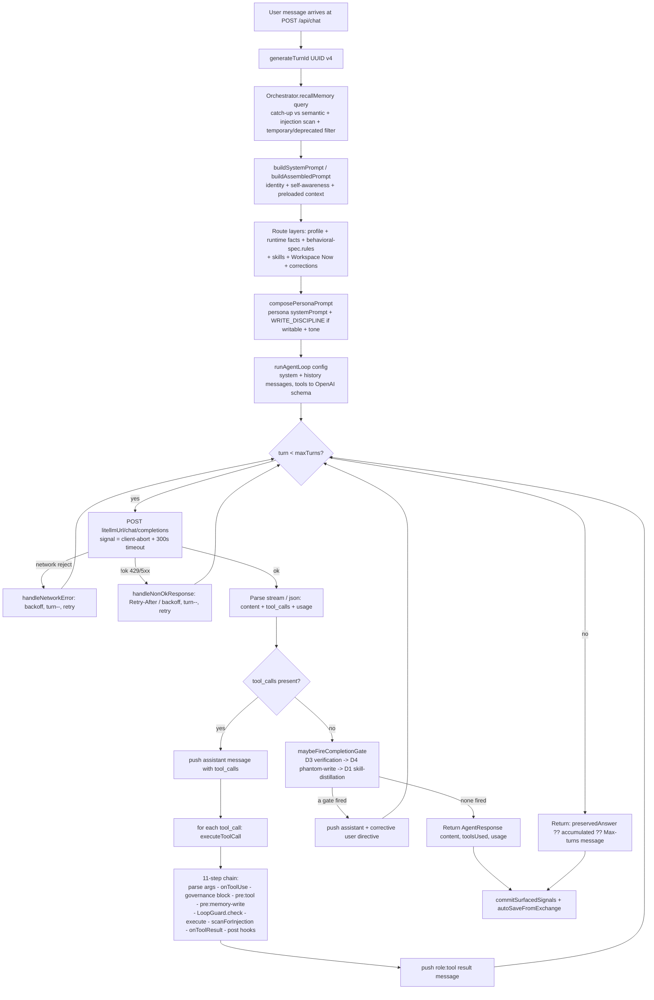

# 05a — Subsystem: Agent Runtime

**Purpose.** The agent runtime is the engine that turns one user message into one agent response. It assembles a layered system prompt (identity + memory + behavioral rules + persona + response scaffold), runs a tool-calling loop against an OpenAI-compatible LLM endpoint (LiteLLM), executes each tool through an explicit middleware chain (governance, hooks, injection-scan, loop-guard), and applies completion-time "gates" that force verification, real file writes, and skill distillation before accepting a final answer. This document is the contract a frontend needs to understand what `POST /api/chat` actually does between request and SSE response — every claim below is grounded in the code under `packages/agent/src/`.

> Scope note: this section documents the **agent runtime** (the loop, prompt, personas, tools, gates, cost). The HTTP surface (`/api/chat`, agent-run routes, SSE event names) is the API subsystem's job; this section only shows where the runtime plugs into `packages/server/src/local/routes/chat.ts` so the wiring is legible.

---

## 1. The mental model in one paragraph

A turn enters at `runAgentLoop(config)` in `agent-loop.ts`. It builds a `messages` array (`[{role:'system', content: systemPrompt}, ...history]`), converts `ToolDefinition[]` to OpenAI `tools` schema, then loops up to `maxTurns` times. Each iteration POSTs to `${litellmUrl}/chat/completions`. If the model returns **no tool calls**, the loop runs the **completion gates** (`maybeFireCompletionGate`) — and if none fire, returns the final `AgentResponse`. If the model returns **tool calls**, each is executed through `executeToolCall` (the middleware chain), results are pushed back as `role:'tool'` messages, and the loop continues. The system prompt itself is built by the `Orchestrator` (`buildSystemPrompt` + `recallMemory`, optionally the tier-adaptive `PromptAssembler`) and decorated by the route with persona, profile, runtime facts, behavioral spec, and workspace context.

---

## 2. Files in this subsystem

| File | Role |
|---|---|
| `packages/agent/src/agent-loop.ts` | `runAgentLoop()` — the core tool-calling loop. Re-exports retrieval-loop entry points. |
| `packages/agent/src/orchestrator.ts` | `Orchestrator` class — `buildSystemPrompt()`, `recallMemory()`, `buildAssembledPrompt()`, `autoSaveFromExchange()`, memory-layer accessors. |
| `packages/agent/src/tool-executor.ts` | `executeToolCall()` — 11-step per-tool middleware chain. |
| `packages/agent/src/loop-gates.ts` | `maybeFireCompletionGate()` + `GateState` — the D3/D4/D1 completion gates. |
| `packages/agent/src/loop-guard.ts` | `LoopGuard` — duplicate/oscillation tool-call detection. |
| `packages/agent/src/retry-policy.ts` | `handleNonOkResponse()` / `handleNetworkError()` — 429 / 5xx / network backoff. |
| `packages/agent/src/verification-gate.ts` | `assertsUnverifiedCompletion()` + `VERIFICATION_GATE_DIRECTIVE` (D3). |
| `packages/agent/src/skill-distillation.ts` | `planSkillDistillation()` / `shouldDistillSkill()` (D1). |
| `packages/agent/src/personas.ts` | `AgentPersona` interface + `composePersonaPrompt()`, `getPersona()`, `listPersonas()`. |
| `packages/agent/src/persona-data.ts` | `PERSONAS` array — 22 built-in personas (pure data). |
| `packages/agent/src/tool-filter.ts` | `filterToolsForContext()`, `filterAvailableTools()`, `filterOfflineTools()`. |
| `packages/agent/src/prompt-assembler.ts` | `PromptAssembler` — sixth-layer tier-adaptive prompt (feature-flagged). |
| `packages/agent/src/context-loader.ts` | `loadRecentContext()` / `loadRecentContextFrames()` + `ContextFrames` type. |
| `packages/agent/src/task-shape.ts` | `detectTaskShape()` — pure heuristic task classifier. |
| `packages/agent/src/model-tier.ts` | `tierForModel()` — maps a model id to `small` / `mid` / `frontier`. |
| `packages/agent/src/behavioral-spec.ts` | `BEHAVIORAL_SPEC` (v3.0) + `buildActiveBehavioralSpec()` + `COMPACTION_PROMPT`. |
| `packages/agent/src/cost-tracker.ts` | `CostTracker` + `DEFAULT_MODEL_PRICING` + `BudgetExceededError`. |
| `packages/agent/src/result-formatter.ts` | `formatCombinedResult()` — renders combined-retrieval results to markdown. |
| `packages/agent/src/turn-context.ts` | `generateTurnId()` / `logTurnEvent()` — per-turn trace correlation (H-AUDIT-1). |

---

## 3. The loop — `runAgentLoop(config)` (`agent-loop.ts`)

### 3.1 Input contract (`AgentLoopConfig`)

| Field | Type | Notes |
|---|---|---|
| `litellmUrl` | `string` | Base URL; loop POSTs to `${litellmUrl}/chat/completions`. |
| `litellmApiKey` | `string` | Sent as `Authorization: Bearer …`. |
| `model` | `string` | Model id (passed through to LiteLLM). |
| `systemPrompt` | `string` | Pre-built (by Orchestrator + route); becomes the first `system` message. |
| `tools` | `ToolDefinition[]` | Converted to OpenAI function-tool schema. |
| `messages` | `Array<{role,content}>` | Conversation history (no system message). |
| `onToken?` | `(token)=>void` | Streaming token callback (also receives retry-notice text). |
| `onToolUse?` | `(name,input)=>void` | Fires before each tool executes. |
| `onToolResult?` | `(name,input,result)=>void` | Fires after each tool, with **sanitized** result. |
| `maxTurns?` | `number` | Default **10**. The chat route sets **200** for persistent agents. |
| `stream?` | `boolean` | Default false. When true, sends `stream:true` + `stream_options.include_usage`. |
| `fetch?` | `typeof fetch` | Injectable for tests. |
| `hooks?` | `HookRegistry` | `pre:tool` / `post:tool` / `pre:memory-write` / `post:memory-write`. |
| `capabilityRouter?` | `CapabilityRouter` | Resolves unknown tool names to alternatives. |
| `pluginTools?` | `PluginToolProvider` | Merges active plugin tools into the toolset. |
| `maxTokenBudget?` | `number` | Loop terminates gracefully when `input+output` exceeds this. |
| `signal?` | `AbortSignal` | Client-disconnect; loop exits between turns and tears down in-flight fetch. |
| `governancePolicies?` | `{blockedTools?, allowedSources?}` | **`blockedTools` IS enforced; `allowedSources` is NOT yet enforced** (logs a warning only — tools lack source-provenance metadata). |
| `traceRecording?` | `{recorder, handle}` | Auto-wires trace callbacks (additive to user callbacks). |
| `turnId?` | `string` | UUID v4 correlation key (H-AUDIT-1). |
| `verificationGate?` | `boolean` | Default **true** (D3). |
| `skillDistillationGate?` | `boolean` | Default **true** (D1). |
| `onSkillDistillationFire?` | `(info)=>void` | AI-OS Phase 3 skill-diffusion observer; fires the moment D1 triggers. Errors swallowed. |

### 3.2 Output contract (`AgentResponse`)

```ts
interface AgentResponse {
  content: string;                                   // final answer
  toolsUsed: string[];                               // names of attempted tools
  usage: { inputTokens: number; outputTokens: number };
}
```

`AgentMessage` is the internal message shape (note `tool_calls` and `tool_call_id` for OpenAI tool-call threading):

```ts
interface AgentMessage {
  role: 'system' | 'user' | 'assistant' | 'tool';
  content: string | null;
  tool_calls?: Array<{ id: string; type: 'function'; function: { name: string; arguments: string } }>;
  tool_call_id?: string;
}
```

### 3.3 Loop steps (per iteration, up to `maxTurns`)

1. **Abort check** — if `signal.aborted`, return `"Agent loop aborted (client disconnected)."`
2. **Build request body** — `{model, messages}`; add `tools` if any; add `stream`/`stream_options` if streaming. Request signal = `AbortSignal.any([clientSignal, AbortSignal.timeout(llmTimeoutMs)])`. Timeout default **300_000 ms** (`WAGGLE_LLM_TIMEOUT_MS`).
3. **POST** to `/chat/completions`.
   - **Network rejection** → `handleNetworkError()`: retry with exponential backoff (cap 30 s, max 3) **without consuming a turn** (`turn--; continue`), unless a genuine client-abort (re-throws).
   - **`!response.ok`** → `handleNonOkResponse()`: 429 honors `Retry-After` (cap 60 s); 502/503/504 exponential backoff (cap 30 s); anything else is fatal. Same `turn--` retry semantics.
4. **Parse response** — streaming via `parseChatCompletionStream` (accumulates tokens into `allStreamedContent`), or non-streaming via `response.json()` (`choices[0].message`). Track per-turn `prompt_tokens` / `completion_tokens`.
5. **Post-read abort check** — return early if aborted mid-read.
6. **Accumulate tokens**; reset retry counters on success.
7. **Token-budget check** — if `maxTokenBudget` exceeded, return (preferring `preservedAnswerForDistillation` if D1 already fired — issue #4).
8. **No tool calls** → run **`maybeFireCompletionGate`** (§5). If a gate fired, `continue`. Otherwise emit content and return `AgentResponse` (final content = `preservedAnswerForDistillation ?? content`).
9. **Has tool calls** → push the assistant message (content coerced to `''` when null, for LiteLLM→Anthropic compatibility), then run **`executeToolCall`** for each call (§4), pushing each result as a `role:'tool'` message. Continue loop.
10. **`maxTurns` reached** → return preserved answer, else accumulated content, else `"Max tool turns reached (...)"`.

> Re-exported from this file (implementation in `retrieval-agent-loop.ts`): `runSoloAgent`, `runRetrievalAgentLoop`, `runRetrievalAgentLoopWithRecovery`, and their config/result types. The structured-action **retrieval** loop is a sibling pattern; `agent-loop.ts` is the canonical entry point for both.

---

## 4. Tool execution — `executeToolCall()` (`tool-executor.ts`)

Each tool call passes through an **ordered 11-step middleware chain**. The order around sanitization (steps 8→9→10→11) is a load-bearing invariant — sanitized output is what flows into both model context AND every observer (audit/telemetry/team-sync/UI).

| Step | Action | Early-return? |
|---|---|---|
| 1 | `JSON.parse` arguments | Yes — invalid JSON → error result, `countedAsUsed:false` |
| 2 | `onToolUse(name, args)` callback | — |
| 3 | **Governance `blockedTools`** check | Yes — fires `onToolResult` with a policy message, `countedAsUsed:false` |
| 4 | `pre:tool` hook | Yes — cancel → `[BLOCKED] reason` |
| 5 | `pre:memory-write` hook (only `save_memory`) | Yes — cancel → `[BLOCKED] Memory write blocked` |
| 6 | **`LoopGuard.check`** | Produces an error result (not early-return) if a loop is detected |
| 7 | **Execute** the tool (or capability-router fallback, or unknown-tool error). Wrapped in try/catch. | — |
| 8 | **`scanForInjection(result, 'tool_output')`** — replaces output with `[SECURITY] … sanitized.` if unsafe | — |
| 9 | `onToolResult(name, args, sanitizedResult)` | — |
| 10 | `post:memory-write` hook (only `save_memory`) | — |
| 11 | `post:tool` hook | — |

`countedAsUsed` is **true** only when the tool was actually attempted (success OR thrown-inside error) — pre-execution rejections (parse error, governance block, hook cancel) do not count toward `toolsUsed`.

**Unknown tool with a `capabilityRouter`:** returns a list of alternative routes (`[source] name: description (available|not wired yet)`) and, if any are `missing` and `acquire_capability` is on offer, appends a tip to use it.

### LoopGuard (`loop-guard.ts`)

- Hashes `sha256(toolName + ':' + JSON.stringify(args))`.
- **Consecutive repeats:** flags after `maxRepeats` (default **3**) identical calls in a row.
- **Oscillation window:** rolling window of `windowSize` (default **10**); flags if the same hash appears `windowThreshold` (default **4**) times. Returns `false` → executor produces a "Loop detected" error instead of running the tool.

---

## 5. Completion gates — `maybeFireCompletionGate()` (`loop-gates.ts`)

Gates run only on the **no-tool-calls** (final-answer) branch. At most **one** fires per call; each is **one-shot** per `runAgentLoop` invocation via `GateState`. When a gate fires, it pushes the assistant content + a corrective `user` directive into `messages` and returns `fired:true`, so the loop continues for one more model turn.

`GateState` flags: `verificationCorrectionUsed`, `writeCorrectionUsed`, `skillDistillationUsed`, and `preservedAnswerForDistillation` (the real user answer captured at D1 fire time, surfaced in the final return instead of the skill-summary turn).

| Gate | Order | Fires when | Directive |
|---|---|---|---|
| **D3 — Verification** | 1st | `assertsUnverifiedCompletion(content, toolsUsed)`: content asserts "tests pass / build succeeds / it works / verified" but **no** verification-class tool (`test\|build\|run\|verif\|lint\|tsc\|pytest\|jest\|vitest\|exec\|bash\|compile\|spec`) was used | `VERIFICATION_GATE_DIRECTIVE` — "run the check now and quote real output, OR label UNVERIFIED" |
| **D4 — Phantom write** | 2nd | `writeToolAvailable` (a `write_file`/`edit_file` tool is on offer) AND `assertsPhantomWrite(content, toolsUsed)`: past-tense "created/wrote/saved the file" with no write-class tool (`write_file`/`edit_file`/`generate_docx`) used | `WRITE_GATE_DIRECTIVE` — "call write_file NOW with the full contents, or say you didn't intend to" |
| **D1 — Skill distillation** | 3rd | `planSkillDistillation(toolsUsed, content)` returns non-null: **≥5** tool calls AND not a self-incapacity/refusal turn (R2 sign-gate) | Directive instructing the model to call `create_skill` next turn (after `search_skills`). Also invokes `onSkillDistillationFire` (errors swallowed). |

`writeToolAvailable` is computed once in the loop: `toolMap.has('write_file') || toolMap.has('edit_file')`.

---

## 6. The Orchestrator — prompt + memory (`orchestrator.ts`)

`Orchestrator` owns the **memory layers** and produces the prompt pieces. Constructed with `{db, embedder, apiKey?, model?, mode?, version?, skills?}`. It instantiates `IdentityLayer`, `AwarenessLayer`, `FrameStore`, `SessionStore`, `HybridSearch`, `KnowledgeGraph`, `ImprovementSignalStore`, a `CognifyPipeline`, and the mind tools (`createMindTools`).

It can hold a **second mind**: `setWorkspaceMind(workspaceDb)` activates workspace-specific frames/search/knowledge/cognify alongside the personal mind. Identity always stays personal. `getMemoryStats()` returns `{frameCount, sessionCount, entityCount}` summed across both.

### 6.1 `buildSystemPrompt(): string`

Joins three sections (filtering empties):

1. **Identity** — cached (`cachedSection`), keyed on the full identity JSON. `# Identity\n` + `identity.toContext()`.
2. **Self-awareness** — uncached (runtime). `buildSelfAwareness(caps)` over `AgentCapabilities` (tools list, skills, model, memory stats, mode, version, actionable awareness). Defers signal marking to `commitSurfacedSignals()`.
3. **Preloaded context** — `loadRecentContext()` → `# Context From Your Memory\n…`.

### 6.2 `recallMemory(query, limit=10, opts?): Promise<{text, count, recalled?}>`

Automatic per-turn memory recall. Key behaviors:

- **Catch-up intent detection** — regexes like `catch me up`, `where are we`, `what's next`, `summariz`, `remind me`. On a hit with an active workspace, fetches **importance-ranked** frames (critical/important or `Decision%`/`%decided%`) by SQL instead of semantic search, deduped by frame id.
- **Authoritative-recall filter** — drops frames whose importance is `temporary` or `deprecated` (R2 sign-gate: self-incapacity frames are stored `temporary` so they don't re-enter as authoritative).
- **Optional `scoreFloor`** (PromptAssembler opt-in) — filters by `finalScore ?? score`.
- **Injection scan** — joins all recall lines and runs `scanForInjection(…, 'tool_output')`; on a hit, **blocks** the entire recall (returns empty) and logs a warning.
- **Provenance-honest framing** — the returned `text` includes strict instructions: attribute saved memory explicitly, never claim continuity ("welcome back") on a first message, never confabulate numbers/dates/names not present verbatim.
- **On error** — returns `"[Memory recall temporarily unavailable. Proceed without prior context.]"` (visible, not silent — silent empties train the model to confabulate).

`RecallOptions`: `{ profile?: ScoringProfile (default 'balanced'), scoreFloor?, tier?, turnId? }`.

### 6.3 `buildAssembledPrompt(query, persona, opts)` (feature-flagged)

Used only when `isEnabled('PROMPT_ASSEMBLER')`. Computes `tierForModel(model)`, calls `buildSystemPrompt()` for the core, loads typed `ContextFrames`, runs raw `HybridSearch` (limit 10, balanced) on personal + workspace, runs ONE injection scan (assembler trusts `scanSafe` and must not re-scan), and hands a `RecalledMemory` to `PromptAssembler.assemble()`.

### 6.4 Post-response write-back

`autoSaveFromExchange(userMsg, assistantMsg)` → `runPatternWriteBack(...)`: regex-driven heuristic save (preferences/corrections/style → personal mind; decisions/work-output → workspace or personal). `commitSurfacedSignals()` marks awareness signals as surfaced **after** a successful model call.

---

## 7. Personas (`personas.ts` + `persona-data.ts`)

### 7.1 `AgentPersona` interface (all fields)

| Field | Type | Meaning |
|---|---|---|
| `id` | `string` | Stable persona id. |
| `name` | `string` | Display name. |
| `description` | `string` | Short role description. |
| `icon` | `string` | Emoji icon. |
| `systemPrompt` | `string` | Role instructions appended **after** the core prompt. |
| `modelPreference` | `string` | Suggested model (user-overridable). All built-ins: `claude-sonnet-4-6`. |
| `tools` | `string[]` | Tool subset the persona uses (allowlist). |
| `workspaceAffinity` | `string[]` | Workspace types this persona suits. |
| `suggestedCommands` | `string[]` | Slash commands to suggest. |
| `defaultWorkflow` | `string \| null` | Auto-invoke workflow template. |
| `disallowedTools?` | `string[]` | Denylist — overrides `tools[]` on conflict. |
| `failurePatterns?` | `string[]` | Documented failure modes (tooltip). |
| `isReadOnly?` | `boolean` | `true` = no write tools ever. Drives whether `WRITE_DISCIPLINE` is appended. |
| `tagline?` | `string` | One-sentence picker-hover line. |
| `bestFor?` | `string[]` | 3 example tasks (user-facing). |
| `wontDo?` | `string` | Hard boundary statement. |
| `suggestedSkills?` | `string[]` | Marketplace skill names. |
| `suggestedConnectors?` | `string[]` | Connector ids. |
| `suggestedMcpServers?` | `string[]` | MCP server names. |

### 7.2 The 22 built-in personas (`PERSONAS` array)

> CLAUDE.md describes "13 + 4". The actual `persona-data.ts` array contains **22** personas: the original 8, the "Mega Test V2" 5, the universal/orchestration 4, and 5 more domain personas. Listed exactly as found:

| # | `id` | `name` | icon | readonly | `disallowedTools` | `defaultWorkflow` |
|---|---|---|---|---|---|---|
| 1 | `researcher` | Researcher | 🔬 | — | — | `research-team` |
| 2 | `writer` | Writer | ✍️ | — | bash, git_commit, git_push, spawn_agent | null |
| 3 | `analyst` | Analyst | 📊 | — | — | null |
| 4 | `coder` | Coder | 💻 | — | `[]` | null |
| 5 | `project-manager` | Project Manager | 📋 | — | git_commit, git_push, bash | `plan-execute` |
| 6 | `executive-assistant` | Executive Assistant | 📧 | — | bash, git_commit, git_push, spawn_agent | null |
| 7 | `sales-rep` | Sales Rep | 🎯 | — | git_commit, git_push, bash, spawn_agent | `research-team` |
| 8 | `marketer` | Marketer | 📢 | — | bash, git_commit, git_push, spawn_agent | null |
| 9 | `product-manager-senior` | Senior PM | 🗺️ | — | bash, git_commit, git_push | `plan-execute` |
| 10 | `hr-manager` | HR Manager | 👥 | — | bash, git_commit, git_push, spawn_agent | null |
| 11 | `legal-professional` | Legal Counsel | ⚖️ | — | bash, git_commit, git_push, spawn_agent | null |
| 12 | `finance-owner` | Business Finance | 💰 | — | bash, git_commit, git_push, spawn_agent | null |
| 13 | `consultant` | Strategy Consultant | 🎯 | — | `[]` | `research-team` |
| 14 | `general-purpose` | General Purpose | 🧠 | `false` | `[]` | null |
| 15 | `planner` | Planner | 🗂️ | **`true`** | write_file, edit_file, git_commit, git_push, git_merge, generate_docx, install_capability, spawn_agent, execute_step, save_memory | null |
| 16 | `verifier` | Verifier | 🔍 | **`true`** | write_file, edit_file, git_commit, git_push, git_merge, generate_docx, save_memory, install_capability, spawn_agent, execute_step | null |
| 17 | `coordinator` | Coordinator | 🎛️ | `false` | read_file, write_file, edit_file, bash, web_search, web_fetch, search_files, search_content, generate_docx, git_* | `coordinator` |
| 18 | `support-agent` | Customer Support | 🎧 | — | — | null |
| 19 | `ops-manager` | Operations Manager | ⚙️ | — | — | `plan-execute` |
| 20 | `data-engineer` | Data Engineer | 📈 | — | — | null |
| 21 | `recruiter` | Recruiter | 🤝 | — | — | null |
| 22 | `creative-director` | Creative Director | 🎨 | — | — | `review-pair` |

The 4 "universal + orchestration tier" personas (#14–17) match CLAUDE.md's "Target (17 personas — add 4)" goal: `general-purpose`, `planner`, `verifier`, `coordinator`. `coordinator` requires `FEATURE_FLAGS.COORDINATOR_MODE` (gates `spawn_agent` at runtime).

### 7.3 `composePersonaPrompt(corePrompt, persona, maxChars=32000, workspaceTone?)`

Builds the final system prompt around the persona:

1. Always appends `DOCX_HINT` to the core prompt.
2. If `workspaceTone` matches a `TONE_INSTRUCTIONS` key (`professional`/`casual`/`technical`/`legal`/`marketing`), appends a `## Communication Tone` section.
3. If `persona` is null → returns base prompt.
4. **Writable personas** (`isReadOnly` falsy) get the **`WRITE_DISCIPLINE`** block appended to their `systemPrompt` — an explicit "you MUST call write_file; text in your reply is NOT a file" directive that counters phantom-write narration. Read-only personas never get it.
5. Combined with `SEPARATOR` (`\n\n---\n\n`); persona prompt truncated to fit `maxChars` (~8000 tokens) if needed.

`getPersona(id)` → built-ins only. `listPersonas()` → built-ins + custom from disk (`loadCustomPersonas(dataDir)` after `setPersonaDataDir`).

---

## 8. Tool filtering (`tool-filter.ts`)

| Function | Behavior |
|---|---|
| `filterToolsForContext(tools, context, config?)` | `config.enabled_tools` (allowlist) wins; else `context` selects `CODE_TOOLS` or `RESEARCH_TOOLS` sets, or all for `'general'`; then `config.disabled_tools` is subtracted. |
| `filterAvailableTools(tools)` | Runs each tool's `checkAvailability()`; excludes those returning false or throwing. Tools without the check are always included. |
| `filterOfflineTools(tools)` / `getOfflineCapableToolNames(tools)` | Keep only `offlineCapable === true` (PM-6, offline mode). |

`ToolContext = 'general' | 'code' | 'research'`. `CODE_TOOLS` = bash, read/write/edit_file, search_files, search_content, git_status/diff/log/commit. `RESEARCH_TOOLS` = web_search, web_fetch, search_memory, get_identity, get_awareness, query_knowledge, read_file, search_files, search_content, find_connector, list_connector_categories.

> Note: persona-level allow/deny (`tools[]` / `disallowedTools[]`) is enforced separately (CLAUDE.md references a planned `assembleToolPool`). `filterToolsForContext` is the **context**-level filter; both can apply.

---

## 9. PromptAssembler — the sixth layer (`prompt-assembler.ts`)

Feature-flagged (`WAGGLE_PROMPT_ASSEMBLER=1`, default **off**). Produces a tier-adaptive, typed, scaffolded prompt. `PromptAssembler.assemble(input, opts): AssembledPrompt`.

```ts
interface AssembledPrompt {
  system: string;
  userPrefix: string;            // currently ''
  responseScaffold: string | null;
  debug: { tier, taskShape, taskShapeConfidence, scaffoldApplied,
           scaffoldStyle, sectionsIncluded, framesUsed, totalChars };
}
```

**Tier drives frame count** (`FRAME_LIMITS`): `small:3`, `mid:6`, `frontier:10`. Frames are deduped by id and sorted by `IMPORTANCE_WEIGHT` (critical:4 → deprecated:0) then recency.

**Sections, in order** (each tagged trimmable or never-trimmed):
Identity (never) → Persona (never) → State / I-frames (trim) → Recent changes / P+B-frames (**trim first**) → Active work (trim) → Personal preferences (never) → Recalled memory (only if `recalled.scanSafe`) → Response format (scaffold, gated). **Truncation order** when over `maxSystemChars` (default 32_000): `Recent changes` → `Active work` → `State`.

**Scaffold gating** (`selectScaffold`): only when `taskShape.confidence ≥ confidenceThreshold` (default 0.3) AND `tier !== 'frontier'`. Two matrices: **`COMPRESSION_SCAFFOLDS`** (v4 default — "say less") and **`EXPANSION_SCAFFOLDS`** (v5 — "say more in named sections", for dense instruction-tuned families like Gemma). `draft` and `mixed` shapes never get a scaffold at any tier; frontier always yields null.

`tierForModel(model)` (`model-tier.ts`): `frontier` = `claude-opus*`; `small` = `gemma-4-`, `qwen3*`, `llama-3`, `llama-4`; `mid` = `claude-sonnet*`, `claude-haiku*`, and **unknown models default to `mid`**.

---

## 10. Behavioral spec (`behavioral-spec.ts`)

`BEHAVIORAL_SPEC` (version **'3.0'**) is the core agent rulebook, split into 5 named sections, with a backward-compatible `.rules` getter that concatenates them:

| Section | Content |
|---|---|
| `coreLoop` | The 5-step internal process: **RECALL → ASSESS → ACT → LEARN → RESPOND**, plus two `=== CRITICAL ===` blocks: **Memory Conflict Protocol** (never blindly accept a contradiction; surface both; update only after confirmation) and **Verification Before Completion** (state a checkable "done" condition, run the check this turn, quote real output). |
| `qualityRules` | Anti-hallucination discipline, structured-output guidance, context grounding, contextual professional disclaimers. |
| `behavioralRules` | Memory-first, tool intelligence, narration heuristics, error recovery, planning for complex tasks. |
| `workPatterns` | Drafting-from-context, decision compression, research-in-context recipes. |
| `intelligenceDefaults` | The `# TOOLS` reference — web, memory (two minds: workspace + personal), system, git, documents, connectors (148+ catalog), skills (incl. capability-acquisition + skill-distillation), sub-agents, planning, workflow composition. |

`buildActiveBehavioralSpec(overrides)` returns the same shape with per-section overrides applied (self-evolution deploy path); the chat route uses `server.activeBehavioralSpec ?? BEHAVIORAL_SPEC`. `COMPACTION_PROMPT` is exported for context-window summarization (8 required sections; text-only, no tool calls).

---

## 11. Cost tracking (`cost-tracker.ts`)

`CostTracker` accumulates `UsageEntry[]` and computes `UsageStats`:

```ts
interface UsageStats {
  totalInputTokens; totalOutputTokens; estimatedCost; turns;
  byModel: Record<string, { input; output; cost }>;
}
```

- `DEFAULT_MODEL_PRICING` (per 1K tokens): `claude-sonnet-4-6` 0.003/0.015, `claude-haiku-3-5` 0.00025/0.00125, `claude-opus-4-6` 0.015/0.075 (+ dated aliases). `calculateCost` falls back to **Sonnet pricing** for unknown models.
- `setBudget(dailyUsd, mode)` with `mode: 'soft' | 'hard'`. `checkBudget()` returns `false` in soft mode when over budget, or **throws `BudgetExceededError`** in hard mode.
- `getDailyTotal()` is the session estimated cost (proxy for daily); `getWorkspaceCost(id)` filters by `workspaceId`.

---

## 12. Turn tracing (`turn-context.ts`)

H-AUDIT-1 contract: a `turnId` (UUID v4) is generated **once** at chat-route turn entry (`generateTurnId()`) and threaded **explicitly** as `turnId?: string` through every stage (agent-loop → orchestrator recall → search → prompt-assembler → cognify → tool calls). No globals/AsyncLocalStorage — propagation is tsc-verifiable. `logTurnEvent(turnId, payload)` is silent when `turnId` is undefined; tests can `startTurnCapture()` / `stopTurnCapture()`.

---

## 13. Production wiring (`packages/server/src/local/routes/chat.ts`)

`POST /api/chat` (SSE) assembles the full prompt stack in this order, then calls `runAgentLoop` (via `server.agentRunner ?? runAgentLoop`):

1. `userSystemPrompt` (highest priority, if set)
2. `assembled?.system ?? orch.buildSystemPrompt()` (identity + self-awareness + preloaded context, or the PromptAssembler output)
3. `# About the User` (profile: name/role/company/industry/writing-style/brand)
4. `# Who You Are` + `## Your Runtime` (date/time/platform/shell/workspace/session facts)
5. `activeSpec.rules` (behavioral spec, with self-evolution overrides)
6. Loaded skills section
7. `Workspace Now` structured state block
8. `# User Corrections` (actionable improvement signals)
9. `composePersonaPrompt(prompt, persona, undefined, workspaceTone)` — wraps everything with the active persona (override > workspace default) + tone
10. `## Response shape` (the assembler's `responseScaffold`, if any)

Per-turn memory recall (`sessionOrch.recallMemory(query)`) is concatenated as `recalledContext`. Persistent agents set `maxTurns: 200`. After the loop, `commitSurfacedSignals()` and `autoSaveFromExchange(message, result.content)` run.

---

## 14. One agent turn, end to end



---

## 15. Frontend rebuild — must-know facts

- The frontend never talks to the agent loop directly — it hits the **HTTP/SSE** surface (`POST /api/chat`, agent-run routes). The runtime returns `{content, toolsUsed, usage:{inputTokens, outputTokens}}`; the route streams tokens via `onToken` and tool events via `onToolUse`/`onToolResult`.
- **Personas are 22, not 13/17.** Build any picker from `listPersonas()` output (id/name/icon/tagline/bestFor/wontDo/failurePatterns). `isReadOnly` personas (`planner`, `verifier`) must surface "read-only" affordances; `coordinator` is feature-gated.
- **Gates change UX:** after a "final" answer the loop may inject ONE more turn (verification re-run, forced file write, or skill authoring). The UI should expect a brief continuation rather than treating the first no-tool answer as terminal.
- **Tool results are sanitized** before the UI ever sees them (`scanForInjection` step 8) — a `[SECURITY] … sanitized.` string means injection was caught, not a backend bug.
- **Cost/usage** comes from `usage` on the response plus `CostTracker` (`DEFAULT_MODEL_PRICING`, soft/hard budget). Surface token/$ estimates from there; unknown models bill at Sonnet rates.
