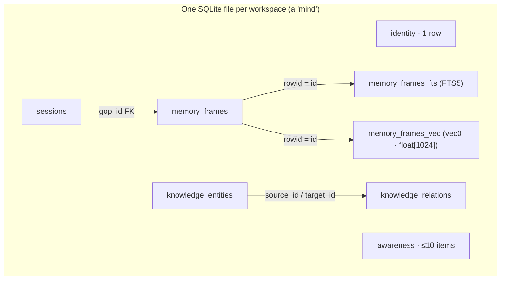
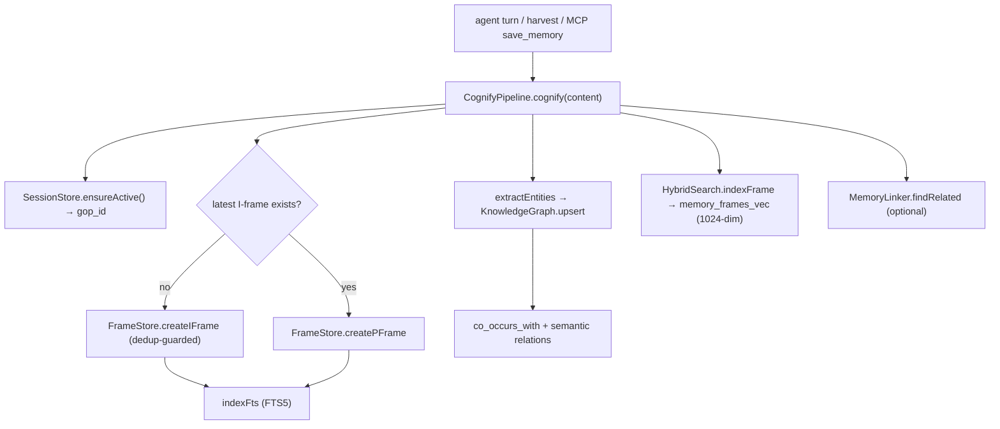
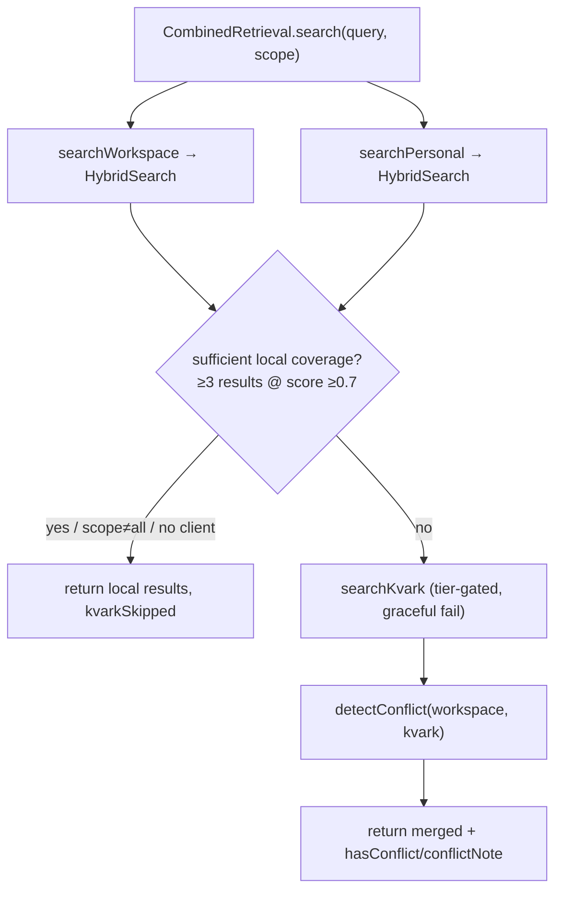

# 05b · Subsystem: Persistent Memory Engine (the MOAT)

**Purpose.** This is Waggle's durable, per-workspace memory substrate — the thing that makes agents remember across sessions. It is a single SQLite database (one file per "mind") layered into Identity → Awareness → Frames → Knowledge Graph, with **hybrid search** (vector + keyword fused), relevance scoring, index reconciliation, and a tiered embedding provider chain. Memory is **WRITTEN** by the `CognifyPipeline` (one frame per turn + entity/relation extraction) and **RECALLED** by `CombinedRetrieval` (workspace + personal + optional KVARK merge). For a frontend rebuild, treat this as a **contract**: you never touch SQLite directly — you call the sidecar HTTP routes that wrap these classes, and you render the typed shapes documented below.

> Grounding: every type, field, table, and constant below is quoted from
> `packages/hive-mind-core/src/mind/*` and `packages/agent/src/{cognify,combined-retrieval,memory-linker}.ts`.
> Where a fact is NOT in those files (e.g. exact HTTP route paths), it is flagged explicitly.

---

## 1. Mental model — five layers in one SQLite file

A "mind" is one `better-sqlite3` database (with the `sqlite-vec` extension loaded for the vector table). The schema (`schema.ts`, `SCHEMA_VERSION = '1'`) defines these layers. Each layer is a TypeScript class wrapping prepared SQL statements — there is **no ORM**.

| Layer | Class (file) | Table(s) | Cardinality | Role |
|---|---|---|---|---|
| 0 — Identity | `IdentityLayer` (`identity.ts`) | `identity` | exactly 1 row (`CHECK (id = 1)`) | Who the agent is: name/role/department/personality/capabilities/system_prompt. `<500 tokens` budget. |
| 1 — Awareness | `AwarenessLayer` (`awareness.ts`) | `awareness` | `MAX_ITEMS = 10` active | Short-term working state: active tasks, recent actions, pending items, context flags. Items can expire. |
| 2 — Frames | `FrameStore` (`frames.ts`) | `memory_frames` (+ `memory_frames_fts`, `memory_frames_vec`) | unbounded | The long-term memory store. I/P/B frame types grouped by session (`gop_id`). |
| 3 — Knowledge Graph | `KnowledgeGraph` (`knowledge.ts`) | `knowledge_entities`, `knowledge_relations` | unbounded | Entities + typed relations with temporal validity (bitemporal). |
| — Sessions | `SessionStore` (`sessions.ts`) | `sessions` | unbounded | Maps `gop_id` (Group-Of-Pictures id) → project. Parent of frames. |

The "GOP" naming (I-frame / P-frame / B-frame, `gop_id`, `t`) is borrowed from video compression: an **I-frame** is a self-contained keyframe (full state), a **P-frame** is a delta/update against its base I-frame, a **B-frame** is a bidirectional cross-reference frame. `t` is a per-session monotonic sequence number (`nextT` = `MAX(t)+1` for that `gop_id`).

---

## 2. Layer 2 — Frames (`FrameStore`)

The heart of the store. A `MemoryFrame` is:

| Field | Type | Notes |
|---|---|---|
| `id` | `number` | PK / rowid; same id used in FTS + vec tables |
| `frame_type` | `'I' \| 'P' \| 'B'` | `FrameType` |
| `gop_id` | `string` | session id this frame belongs to |
| `t` | `number` | per-`gop_id` monotonic sequence (`nextT`) |
| `base_frame_id` | `number \| null` | P/B frames point at their base I-frame |
| `content` | `string` | the actual text |
| `importance` | `'critical' \| 'important' \| 'normal' \| 'temporary' \| 'deprecated'` | `Importance` |
| `source` | `'user_stated' \| 'tool_verified' \| 'agent_inferred' \| 'import' \| 'system' \| 'personal' \| 'workspace' \| 'team_sync'` | `FrameSource` (TS union is wider than the DB `CHECK`, which only allows the first five) |
| `access_count` | `number` | incremented by `touch()` on every recall/dup-hit |
| `created_at` | `string` | ISO; harvest path can override to preserve source timestamp |
| `last_accessed` | `string` | ISO; drives temporal scoring |

### Write methods
- `createIFrame(gopId, content, importance='normal', source='user_stated', createdAt?)` — **dedup-guarded**: calls `findDuplicate(content)` first; if an identical frame exists it `touch()`es it and returns it instead of inserting. `createdAt` is honored only if it passes `isValidIsoTimestamp` (strict ISO-8601 with `T` + timezone) — used by the harvest path so imported frames keep their original timestamp.
- `createPFrame(gopId, content, baseFrameId, …)` — a delta against an I-frame.
- `createBFrame(gopId, content, baseFrameId, referencedFrameIds[])` — stores `{description, references}` as JSON in `content`.

Every create also runs `indexFts(frame)` to mirror content into the FTS5 table. **Vector indexing is NOT done here** — it happens in `HybridSearch.indexFrame()`, called by `CognifyPipeline` (see §6).

### Dedup (`findDuplicate`) — important quirks for the frontend
- Hash = `SHA-256( stripHmPrefix(content).trim() )`.
- `stripHmPrefix` removes a leading `[hm session:… src:… event:…] ` provenance prefix so two captures of the same turn from different sources collapse into one frame.
- **Only the last 500 frames** are scanned (cost bound). Dedup is best-effort beyond the recency window.

### Read / list methods
| Method | Returns |
|---|---|
| `getById(id)` | one frame |
| `getLatestIFrame(gopId)` | newest I-frame in a session |
| `getPFramesSinceLastI(gopId)` | P-frames after the latest I-frame |
| `getGopFrames(gopId)` | all frames in a session, `t ASC` |
| `reconstructState(gopId)` | `{ iframe, pframes }` — current state = latest I + its P-deltas |
| `getRecent(limit=50)` / `list({limit})` | newest frames, `id DESC` |
| `getRecentFiltered(limit, since?, until?)` | F20: date-bounded recent frames |
| `getStats()` | `{ total, byType, byImportance }` |
| `update(id, content, importance?)` | updates main + FTS + clears vec entry |
| `delete(id)` | removes from main + FTS + vec + `kg_entity_frames` and nulls referring `base_frame_id` |

### Compaction (`compact(maxTempAgeDays=30, maxDeprecatedAgeDays=90)`)
Maintenance op: deletes old `temporary` and `deprecated` frames, and for any `gop_id` with >10 P-frames merges all-but-the-5-most-recent P-frames into their I-frame (joined with `\n---\n`). Returns `{ temporaryPruned, deprecatedPruned, pframesMerged }`.

---

## 3. Hybrid Search (`HybridSearch`) — vector + keyword fusion

`search(query, options)` runs **keyword and vector searches in parallel**, fuses with **Reciprocal Rank Fusion (RRF)**, then multiplies by a relevance score.

`SearchOptions`:
| Field | Type | Default |
|---|---|---|
| `limit` | `number` | `20` |
| `gopId` | `string?` | (scope to one session) |
| `profile` | `'balanced' \| 'recent' \| 'important' \| 'connected'` | `'balanced'` |
| `context` | `ScoringContext` | `{}` |
| `since` / `until` | `string?` (ISO) | temporal filter on `created_at` |

`SearchResult`:
| Field | Type | Meaning |
|---|---|---|
| `frame` | `MemoryFrame` | the hit |
| `rrfScore` | `number` | fused rank score |
| `relevanceScore` | `number` | from `computeRelevance` |
| `finalScore` | `number` | `rrfScore * relevanceScore` — the sort key |

### Fusion algorithm (the actual constants)
1. Run `keywordSearch(query, limit*2, gopId)` and `vectorSearch(query, limit*2, gopId)` in parallel; each returns an ordered `number[]` of frame ids.
2. RRF with `RRF_K = 60`: each id accrues `1 / (RRF_K + rank)` from each list.
3. Fetch the union of frame ids (applying `since`/`until` filters here), compute `relevanceScore`, set `finalScore = rrfScore * relevanceScore`, sort desc, slice to `limit`.

### Keyword path (FTS5) — recall tuning
- Query is tokenized, punctuation stripped, a built-in **stop-word list** removed, tokens shorter than 3 chars dropped, then OR-joined (`"foo" OR "bar"`) for recall. FTS5 `ORDER BY rank`.
- On FTS5 parse error it falls back to `likeFallbackSearch` — OR-ed `LIKE … ESCAPE '\'` over `content` (parameterized, metachars escaped). This guarantees a query never returns a false "no memory found" because the user typed an FTS5 operator.

### Vector path (`sqlite-vec` vec0)
- `vectorSearch` embeds the query (`embedder.embed`), converts the `Float32Array` to a blob, and does a `MATCH ? AND k = ?` KNN query on `memory_frames_vec` (`ORDER BY distance`).
- When `gopId` is set it over-fetches (`k = limit*3`) then filters by session.
- The vec table is `float[1024]` — embeddings MUST be 1024-dim (see §7).
- All vec operations are wrapped in `try/catch` returning `[]` — if the `sqlite-vec` extension or table is absent, search silently degrades to keyword-only.

### Indexing (called by cognify, not by FrameStore)
- `indexFrame(frameId, content)` — embed + `INSERT INTO memory_frames_vec`. (rowid is inlined as a SQL literal because vec0 doesn't accept a parameterized rowid.)
- `indexFramesBatch(frames[])` — batch embed + transactional insert.

---

## 4. Relevance scoring (`scoring.ts`)

`computeRelevance(frame, weights, context)` = weighted sum of four sub-scores. Profiles pick the weights:

| Profile | temporal | popularity | contextual | importance |
|---|---|---|---|---|
| `balanced` | 0.4 | 0.2 | 0.2 | 0.2 |
| `recent` | 0.6 | 0.1 | 0.2 | 0.1 |
| `important` | 0.1 | 0.1 | 0.2 | 0.6 |
| `connected` | 0.1 | 0.1 | 0.6 | 0.2 |

Sub-scores:
- **temporal** — `1.0` if `last_accessed` within `RECENCY_BOOST_DAYS = 7`, else exponential decay with `HALF_LIFE_DAYS = 30`.
- **popularity** — `1 + log10(1 + access_count) * 0.1`.
- **contextual** — graph proximity: distance 0→1.0, 1→0.7, 2→0.4, 3→0.2, else 0 (needs `context.graphDistances`, a `Map<frameId, BFS-distance>`).
- **importance** — `critical 2.0 / important 1.5 / normal 1.0 / temporary 0.7 / deprecated 0.3`.

`ScoringContext = { recentEntityIds?: number[]; graphDistances?: Map<number, number> }`.

---

## 5. Knowledge Graph (`KnowledgeGraph`)

Bitemporal entity-relation store. `Entity` and `Relation` both carry `valid_from` / `valid_to` (null = currently valid) plus `recorded_at`.

`Entity`: `{ id, entity_type, name, properties(JSON string), valid_from, valid_to, recorded_at }`
`Relation`: `{ id, source_id, target_id, relation_type, confidence(REAL), properties(JSON), valid_from, valid_to, recorded_at }`

Key methods:
| Method | Purpose |
|---|---|
| `createEntity(type, name, props, temporal?)` | validates against optional schema, inserts |
| `getEntitiesByType(type, limit=500)` / `getEntities(limit, offset)` | active entities (`valid_to IS NULL`) |
| `searchEntities(query, limit=100)` | `name LIKE` (escaped) |
| `getEntityTypeCounts()` / `getEntityCount()` | dashboard counts without full fetch |
| `getEntitiesValidAt(isoTime)` | time-travel: entities valid at a past instant |
| `createRelation(src, tgt, type, confidence=1.0, props)` | validated insert |
| `getRelationsFrom(id, type?)` / `getRelationsTo(id, type?)` | adjacency |
| `retireEntity(id)` / `retireRelation(id)` | sets `valid_to = now` (soft-delete, never hard delete) |
| `traverse(startId, relationType, maxDepth)` | BFS returning reached entities |
| `bfsDistances(startId, maxDepth)` | `Map<entityId, distance>` — feeds the `contextual` score |

Optional `setValidationSchema(ValidationSchema)` enforces required properties per entity-type and an allowed-relations list (throws on violation). Without a schema, all writes pass.

---

## 6. WRITE path — `CognifyPipeline` (`cognify.ts`)

`cognify(content, importance='normal', gopId?, turnId?)` is the canonical "remember this turn" call. Steps:

1. **Ensure session** — `sessions.ensureActive()` (transaction-wrapped to avoid the twin-session race).
2. **Save frame** — if a latest I-frame exists for the session → `createPFrame` (delta), else `createIFrame` (keyframe). Dedup applies inside the FrameStore.
3. **Extract entities** — `extractEntities(content.slice(0, 10_000))` (from `entity-extractor.ts`).
4. **Upsert entities** into the KG (skip if same type+name exists; cached per-type to avoid N queries).
5. **Co-occurrence relations** — `co_occurs_with` (confidence 0.8) between every entity pair found in the same text.
6. **Semantic relations** — `extractRelations` → typed relations (`led_by`, `reports_to`, `depends_on`, …) matched back to KG entities.
7. **Vector index** — `search.indexFrame(frame.id, content)`.
8. **Optional linking** — if `enableLinking`, `MemoryLinker.findRelated(content)` returns related frames (self excluded).

`CognifyResult = { frameId, entitiesExtracted, relationsCreated, relatedFrames? }`.

Other entry points: `cognifyFrame(frameId)` (re-process one imported frame — used post-harvest) and `cognifyBatch(frameIds[])` (sequential, so each frame's new entities can link to the next).

### `MemoryLinker` (`memory-linker.ts`)
Thin wrapper over `HybridSearch.search`. `findRelated(content, limit=5)` returns `MemoryLink[] = { frameId, content, score }`, filtered by a `threshold` (default `0.1` on `finalScore`).

---

## 7. Embeddings — provider chain (`embedding-provider.ts`)

`createEmbeddingProvider(config?)` returns an `EmbeddingProviderInstance` (implements the `Embedder` interface: `embed`, `embedBatch`, `dimensions`). Default `targetDimensions = 1024` — matches the `vec0 float[1024]` table.

**Auto fallback chain** (`provider: 'auto'`): `inprocess → ollama → voyage → openai → mock`. Each is probed with a 1024-dim test embedding; the first that succeeds becomes active.

| Provider (`EmbeddingProviderType`) | Default model | Needs |
|---|---|---|
| `inprocess` | `Xenova/all-MiniLM-L6-v2` (Transformers.js) | nothing — fully local |
| `ollama` | `nomic-embed-text` | local Ollama server |
| `voyage` | `voyage-3-lite` | `voyage.apiKey` (from Vault) |
| `openai` | `text-embedding-3-small` | `openai.apiKey` |
| `litellm` | `text-embedding` | `litellm.url` |
| `mock` | `deterministic-mock` | always available; **semantically meaningless** (last resort) |

**Tier gating**: provider availability is gated by `TIER_CAPABILITIES[tier].embeddingProviders`; `embeddingQuotaPerMonth` is enforced per `user_id` per month in the `embedding_usage` table (`-1` = unlimited). Quota throws `EmbeddingQuotaExceededError` (carries `tier/quota/current/upgradeUrl`); over-tier provider request throws `TierError`. `WAGGLE_EVAL_MODE=1` disables all gating (eval harness only). `getStatus()` / `getQuotaStatus()` / `reprobe()` expose state for a settings UI.

> Frontend note: if the active provider is `mock`, surface a "semantic search degraded" warning — `getStatus().activeProvider === 'mock'` and `lastError` tell you. Mismatched embedder dimensions would break the vec table, so the provider hard-asserts 1024 on probe.

---

## 8. RECALL path — `CombinedRetrieval` (`combined-retrieval.ts`)

The merge engine the agent calls to answer "what do I know about X". Merges **workspace** + **personal** memory and optionally **KVARK** enterprise search. Pure data in / out (no formatting).

`search(query, opts)` → `CombinedRetrievalResult`:
| Field | Type |
|---|---|
| `query` | `string` |
| `workspaceResults` / `personalResults` / `kvarkResults` | `CombinedResult[]` |
| `kvarkAvailable` | `boolean` |
| `kvarkSkipped` | `boolean` (available but coverage was sufficient) |
| `kvarkError?` | `string` |
| `hasConflict` | `boolean` |
| `conflictNote?` | `string` |

`CombinedResult = { content, source: 'workspace'|'personal'|'kvark', attribution, score, metadata }` where `attribution` is a human tag like `[workspace memory]` / `[personal memory]`, and `metadata` carries `frameId/frameType/importance` (memory) or `documentId/documentType` (KVARK).

`CombinedSearchOptions = { limit=10, profile='balanced', scope: 'all'|'personal'|'workspace', turnId? }`.

**KVARK gating logic** (`shouldQueryKvark`): KVARK is queried only when a client exists, `scope==='all'`, AND local coverage is insufficient — `hasSufficientLocalCoverage` = fewer than `LOCAL_COVERAGE_MIN_COUNT = 3` results with `score ≥ LOCAL_COVERAGE_SCORE_THRESHOLD = 0.7`. KVARK failures degrade gracefully (local results preserved, `kvarkError` set).

**Conflict detection** (`detectConflict`): if both workspace and KVARK have strong results (`score ≥ CONFLICT_SCORE_THRESHOLD = 0.6`) and their top-3 texts disagree on status polarity (`POSITIVE_STATUS` words like *approved/selected* vs `NEGATIVE_STATUS` like *rejected/cancelled*), it returns a human-readable `conflictNote` for the UI to surface ("these sources may be out of sync").

---

## 9. Reconciliation & integrity (`reconcile.ts`)

A crash between frame insert and FTS/vec indexing leaves frames that exist but aren't searchable. The reconcile functions repair this (idempotent, cron-friendly):
- `reconcileFtsIndex(db)` — re-index frames missing from FTS5 (no embedder needed).
- `reconcileVecIndex(db, embedder)` — embed + re-index frames missing from the vec table (batches of 50).
- `cleanOrphanFts(db)` / `cleanOrphanVectors(db)` — drop FTS/vec rows whose frame was deleted.
- `reconcileIndexes(db, embedder?)` — runs all of the above; FTS-only if no embedder. Returns `{ ftsFixed, vecFixed }`.

---

## 10. Sessions (`SessionStore`)

`Session = { id, gop_id, project_id, status: 'active'|'closed'|'archived', started_at, ended_at, summary }`. `gop_id` format: `session:<ISO>:<rand6>`.

| Method | Purpose |
|---|---|
| `create(projectId?)` | new timestamped session |
| `ensureActive(projectId?)` | **transaction-wrapped** — returns existing active session or creates one (prevents twin-session race; used by cognify) |
| `ensure(gopId, …)` | idempotent named session (e.g. a stable `harvest` parent) |
| `close(gopId, summary?)` / `archive(gopId)` | lifecycle |
| `getByProject` / `getActive` / `getByGopId` | queries |

---

## 11. Schema reference (DDL, verbatim from `schema.ts`)

`SCHEMA_VERSION = '1'`. Tables relevant to this subsystem:

| Table | Key columns / constraints |
|---|---|
| `identity` | `id CHECK (id = 1)` (single row), name/role/department/personality/capabilities/system_prompt, created_at, updated_at |
| `awareness` | category `CHECK IN ('task','action','pending','flag')`, content, priority, `metadata` (JSON), created_at, expires_at |
| `sessions` | `gop_id UNIQUE`, project_id, status `CHECK IN ('active','closed','archived')`, started_at, ended_at, summary; index `(project_id, started_at)` |
| `memory_frames` | frame_type `CHECK IN ('I','P','B')`, gop_id (FK→sessions), t, base_frame_id (self-FK), content, importance `CHECK IN (critical/important/normal/temporary/deprecated)`, source `CHECK IN (user_stated/tool_verified/agent_inferred/import/system)`, access_count, created_at, last_accessed; indexes on (gop_id,t),(frame_type,gop_id),(base_frame_id) |
| `memory_frames_fts` | `CREATE VIRTUAL TABLE … USING fts5(content, content_rowid='id', tokenize='porter unicode61')` |
| `memory_frames_vec` | `CREATE VIRTUAL TABLE … USING vec0(embedding float[1024])` (separate `VEC_TABLE_SQL`, requires `sqlite-vec`) |
| `knowledge_entities` | entity_type, name, properties(JSON), valid_from, valid_to, recorded_at; indexes on type and name |
| `knowledge_relations` | source_id/target_id (FK→entities), relation_type, confidence(REAL), properties(JSON), valid_from, valid_to, recorded_at; indexes on (source_id,relation_type),(target_id,relation_type) |
| `embedding_usage` | (in `embedding-provider.ts`) user_id, year_month, count, updated_at; `UNIQUE(user_id, year_month)` — monthly quota counter |
| `harvest_sources` | source UNIQUE, display_name, source_path, last_synced_at, items_imported, frames_created, auto_sync, sync_interval_hours, last_content_hash, created_at |

> Note: the TS `FrameSource` union (`frames.ts`) includes `'personal' | 'workspace' | 'team_sync'` which the DB `CHECK` does **not** list — those extra sources are application-level and not written through the constrained column path.

---

## 12. HTTP surface (how the frontend reaches this)

These engine classes are **server-side only**; the frontend talks to the Fastify sidecar and the `hive-mind` MCP server, not to SQLite. The exact route paths are defined in `packages/server/src` (outside this section's read scope) — **do not invent them**. What this subsystem guarantees, and the MCP tool names that wrap it (from the `hive-mind` MCP server, visible in this environment), are:

| MCP tool | Wraps |
|---|---|
| `recall_memory` | `CombinedRetrieval.search` / `HybridSearch.search` |
| `save_memory` | `CognifyPipeline.cognify` |
| `save_entity` / `create_relation` / `search_entities` | `KnowledgeGraph` |
| `get_identity` / `set_identity` | `IdentityLayer` |
| `get_awareness` / `set_awareness` / `clear_awareness` | `AwarenessLayer` |
| `cleanup_frames` / `cleanup_entities` | `FrameStore.compact` / KG retire |
| `create_workspace` / `list_workspaces` | per-mind DB lifecycle |
| `harvest_import` / `harvest_sources` / `ingest_source` | harvest → `cognifyFrame`/`cognifyBatch` |

For the precise sidecar REST routes (method + path), consult the server-routes section of this backend map — they are the authoritative contract the Lovable frontend will call.
