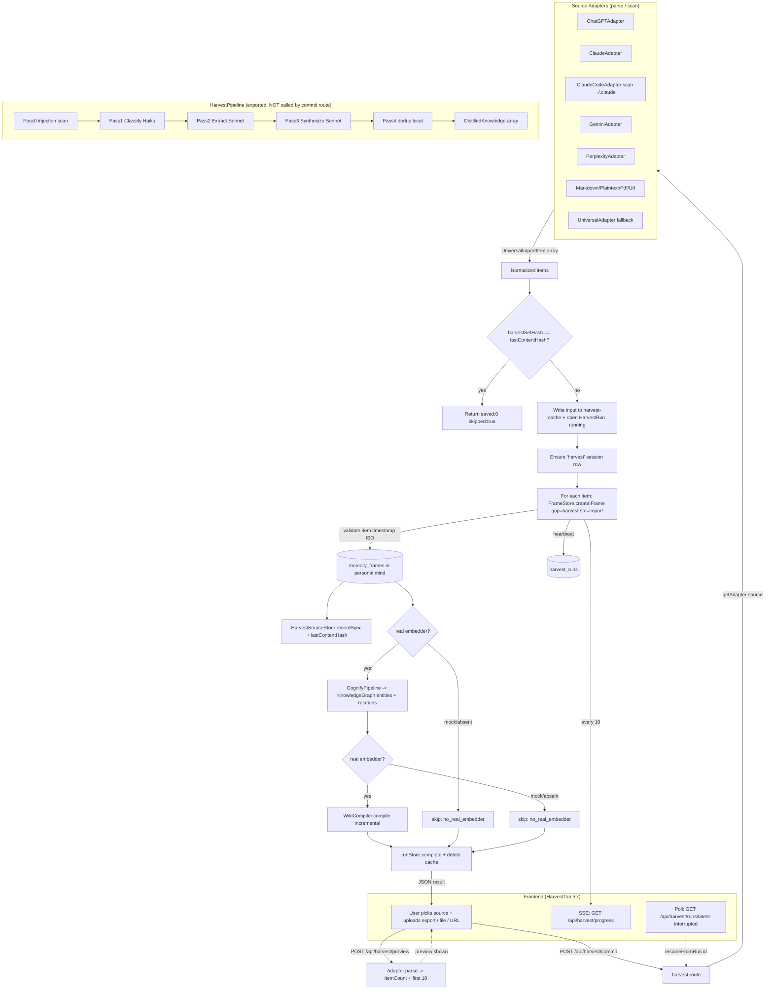

# Subsystem 05c — Harvest (Conversation & File Ingestion Pipeline)

## Purpose

Harvest is the ingestion subsystem that turns external AI-chat exports (ChatGPT, Claude, Gemini, Perplexity) and local files/URLs (Markdown, plain text, PDF, web pages, the Claude Code `~/.claude` directory) into normalized **`UniversalImportItem`** objects, then persists them as memory **frames** in the per-workspace "mind" (SQLite). Source code lives at `packages/hive-mind-core/src/harvest/**`; the HTTP surface that the frontend calls lives at `packages/server/src/local/routes/harvest.ts`. This is the "Memory Harvest" feature surfaced in the Memory app's **HarvestTab** (`apps/web/src/components/os/apps/memory/HarvestTab.tsx`).

> Important architectural note for the rebuild: the *committed* harvest route (`POST /api/harvest/commit`) does **NOT** run the 4-pass LLM distillation pipeline (`HarvestPipeline`). It parses with an adapter and writes the raw normalized items directly to frames, then runs a separate **cognify** + **wiki-compile** post-step. The `HarvestPipeline` class (classify → extract → synthesize → dedup) exists and is exported, but the production commit route bypasses it. Both flows are documented below — build your UI against the route contract, not the pipeline class.

---

## 1. Core Data Shapes

These are the exact TypeScript types the frontend will see across the wire (from `packages/hive-mind-core/src/harvest/types.ts`).

### `UniversalImportItem` — the normalized unit every adapter produces

| Field | Type | Notes |
|---|---|---|
| `id` | `string` | `randomUUID()` generated per item by the adapter |
| `source` | `ImportSourceType` | which source it came from (see union below) |
| `type` | `ImportItemType` | `conversation` \| `memory` \| `instruction` \| `preference` \| `artifact` \| `rule` \| `decision` \| `document` |
| `title` | `string` | human-readable label; `'Untitled'` fallback |
| `content` | `string` | flattened text. For conversations: `messages.map(m => \`${m.role}: ${m.text}\`).join('\n\n')` |
| `messages?` | `ConversationMessage[]` | present only for conversation-type items |
| `timestamp` | `string` | ISO-8601; source-original where available, else `new Date().toISOString()` |
| `metadata` | `Record<string, unknown>` | adapter-specific (conversationId, messageCount, filePath, etc.) |

### `ConversationMessage`

| Field | Type |
|---|---|
| `role` | `'user' \| 'assistant' \| 'system'` |
| `text` | `string` |
| `timestamp?` | `string` |

### `ImportSourceType` (full union)

`chatgpt` · `claude` · `claude-code` · `claude-desktop` · `gemini` · `google-ai-studio` · `perplexity` · `grok` · `cursor` · `copilot` · `manus` · `genspark` · `qwen` · `minimax` · `z-ai` · `openclaw` · `cowork` · `elevenlabs` · `google-flow` · `markdown` · `plaintext` · `pdf` · `url` · `unknown`

> Only `chatgpt`, `claude`/`claude-desktop`, `claude-code`, `gemini`/`google-ai-studio` have dedicated adapters wired in the route's `getAdapter()`; everything else falls through to `UniversalAdapter`.

### `HarvestSource` — the source-tracking row (GET /api/harvest/sources returns these)

| Field | Type | Notes |
|---|---|---|
| `id` | `number` | autoincrement PK |
| `source` | `ImportSourceType` | UNIQUE |
| `displayName` | `string` | e.g. `"ChatGPT"`, `"Claude"` |
| `sourcePath` | `string \| null` | local dir, if filesystem source |
| `lastSyncedAt` | `string \| null` | ISO datetime |
| `itemsImported` | `number` | cumulative |
| `framesCreated` | `number` | cumulative |
| `autoSync` | `boolean` | stored as `0/1` integer in SQLite |
| `syncIntervalHours` | `number` | default `24` |
| `lastContentHash` | `string \| null` | dedup-skip digest (see §5) |
| `createdAt` | `string` | ISO datetime |

### `HarvestRun` — one commit invocation's lifecycle (GET /api/harvest/runs returns these)

| Field | Type | Notes |
|---|---|---|
| `id` | `number` | autoincrement PK |
| `source` | `ImportSourceType` | |
| `status` | `'running' \| 'completed' \| 'failed' \| 'abandoned'` | |
| `totalItems` | `number` | |
| `itemsSaved` | `number` | updated via heartbeat every 10 frames |
| `startedAt` / `updatedAt` / `finishedAt` | `string` / `string` / `string\|null` | ISO datetimes |
| `errorMessage` | `string \| null` | truncated to 2000 chars on failure |
| `inputCachePath` | `string \| null` | path to cached input JSON for resume |

### `DistilledKnowledge` — output of the `HarvestPipeline` (NOT used by the commit route)

| Field | Type | Notes |
|---|---|---|
| `targetLayer` | `'identity' \| 'frame' \| 'kg_entity' \| 'kg_relation' \| 'awareness'` | where the knowledge should land |
| `frameType?` | `'I' \| 'P'` | I = identity-ish, P = procedural |
| `importance` | `'critical' \| 'important' \| 'normal' \| 'temporary'` | |
| `content` | `string` | self-contained memory statement |
| `entities?` / `relations?` | `{name,type}[]` / `{source,target,relation}[]` | KG payload |
| `provenance` | `KnowledgeProvenance` | `{originalSource, importedAt, distillationModel, confidence, pass}` |

---

## 2. Source Adapters

Every adapter implements `SourceAdapter` (`{ sourceType, displayName, parse(input): UniversalImportItem[] }`). Filesystem-scanning adapters additionally implement `FilesystemAdapter` (adds `scan(dirPath)`). All adapters are exported from `packages/hive-mind-core/src/harvest/index.ts` and re-exported via `@waggle/core`.

| Adapter | `sourceType` | `displayName` | Input it expects | What it parses out |
|---|---|---|---|---|
| `ChatGPTAdapter` | `chatgpt` | `ChatGPT` | ChatGPT JSON export — top-level array OR `{conversations:[...]}`. Each conv has a `mapping` object (node-id tree). | Walks `mapping` nodes, filters nodes with `message.content.parts`, sorts by `create_time`, builds messages (skips `system`). Also extracts top-level `user_custom_instructions` (→ `instruction` item) and `memories[]` (→ `memory` items). Per-conv `custom_instructions` folded into metadata. |
| `ClaudeAdapter` | `claude` (also handles `claude-desktop`) | `Claude` | Claude web/desktop JSON export — array OR `{conversations:[...]}`. Messages in `chat_messages` (or `messages`). | Role from `sender==='human'`/`role==='user'`. Text from content blocks (`type:'text'`) or `text`/`content`. Also extracts `projects[].docs[]` → `artifact` items tagged `type:'project_knowledge'`. |
| `ClaudeCodeAdapter` | `claude-code` | `Claude Code` | A **directory path** string (default `~/.claude`). Implements `FilesystemAdapter.scan()`. | Reads disk: `projects/*/memory/*.md` (frontmatter `type`→ImportItemType via MEMORY_TYPE_MAP), `rules/**/*.md` (→`rule`), `plans/*.md` (→`artifact`), `settings.json` (→`preference`), `projects/*/CLAUDE.md` (→`artifact`), `projects/*/.mind/*.md` (→`decision`/`artifact`). Then runs **decision extraction** (regex `DECISION_PATTERNS`) over all items to mint extra `decision` items. |
| `GeminiAdapter` | `gemini` (also handles `google-ai-studio`) | `Gemini` | Google Takeout `{conversations:[...]}`, Gemini API `{history:[...]}`, or bare array. Messages in `messages`/`turns`/`history`. | Role resolved from `role`/`author`/`sender` (`model`/`gemini`→assistant). Text from Gemini `parts:[{text}]` or `text`/`content`. |
| `PerplexityAdapter` | `perplexity` | `Perplexity` | `{threads:[...]}`, `{conversations:[...]}`, `{items:[...]}`, single-thread `{messages:[...]}`, or bare array. | Role from `role`/`author`/`sender`/`type`. **Flattens citations**: per-message `sources`/`citations`/`web_results` appended to text as `"Sources: <url1>, <url2>"`. Sets `metadata.hasCitations`. |
| `MarkdownAdapter` | `markdown` | `Markdown` | A `.md` file path (auto-detected: short, no newline → tries `fs.readFileSync`) OR raw markdown string. | Splits by `#`/`##`/`###` headings (`splitByHeadings`). Each section → one `document` item. Extracts `**bold**` terms as `concept` entities (max 10) into metadata. Caps content at 4000 chars. |
| `PlaintextAdapter` | `plaintext` | `Plain Text` | A `.txt` file path or raw text. | Chunks by paragraphs (`chunkByParagraphs`, ~2000 char chunks) → `document` items titled `"<file> (part N)"`. |
| `PdfAdapter` | `pdf` | `PDF Document` | A PDF **file path** via async `parseFile()` (`parse()` returns `[]`). | Dynamic-imports optional `pdf-parse`; throws a clear "not installed" error if absent. Extracts full text + `getInfo()` (Title/Author/numPages), chunks at ~3000 chars → `document` items with `contentType:'paper'`. |
| `UrlAdapter` | `url` | `Web URL` | Pre-fetched HTML via sync `parse()`, OR a URL via async `fetchAndParse(url)`. | `fetchAndParse` does `fetch()` with 15s timeout + custom User-Agent. `stripHtml` removes script/style/nav/footer/header, converts headings to markdown, strips tags, decodes entities. Short pages → 1 item; long pages split by `#` sections. `contentType:'article'`. |
| `UniversalAdapter` | `unknown` | `Universal (Auto-detect)` | Any string or JSON. **Fallback for all Tier-2 sources** (grok, manus, genspark, qwen, minimax, z-ai, openclaw, cowork, elevenlabs, google-flow). | Heuristic `detectSource()` from content cues. `findConversations()` probes common keys (`conversations`/`chats`/`threads`/`sessions`/`history`/`data`). Text mode splits on headings/`===`/`---`/`Conversation N` and regex-extracts `Speaker: text` turns. Raw JSON with no conversation structure → single `memory` item (capped 50000 chars). |

### Adapter helper notes
- **`raw-types.ts`** provides safe narrowing helpers (`asRecord`, `getString`, `getNumber`, `getArray`, `firstString`) so malformed external JSON degrades to "skip" instead of throwing. All JSON adapters use these — they never cast to `any`.
- **`chunk-utils.ts`** — `chunkByParagraphs(text, maxLen=2000)` splits on blank lines and packs paragraphs up to `maxLen`. Used by plaintext + pdf.
- Adapters always cap `content` at 4000 chars at the item level (route caps again at 10000 — see §4).

---

## 3. The 4-Pass Distillation Pipeline (`HarvestPipeline`)

`packages/hive-mind-core/src/harvest/pipeline.ts`. Accepts `UniversalImportItem[]`, returns `HarvestPipelineResult`. **Not invoked by the production commit route** — provided for callers (MCP tools, CLI, future flows) that want LLM-distilled knowledge instead of raw frames.

| Pass | Name | Model tier | What it does | Prompt |
|---|---|---|---|---|
| 0 | Injection scan | none (local) | Drops any item whose title + first 4KB of content trips `scanForInjection(probe, 'tool_output')`. Logs blocked items into `errors[]`. | — |
| 1 | Classify | `'fast'` (Haiku) | Tags each item `{domain, value, categories}`. `value:'skip'` items are dropped. | `CLASSIFY_PROMPT` |
| 2 | Extract | `'accurate'` (Sonnet) | Pulls `{decisions, preferences, facts, knowledge, entities, relations}` per item. "Only what the USER stated." | `EXTRACT_PROMPT` |
| 3 | Synthesize | `'accurate'` (Sonnet) | Converts extractions into `DistilledKnowledge` frames (`targetLayer`, `frameType`, `importance`, `content`, `confidence`). | `SYNTHESIZE_PROMPT` |
| 4 | Dedup | none (local) | `dedup()` removes duplicates/near-dups vs existing frame contents (see §5). | — |

**Mechanics:** items are batched (`BATCH_SIZE=20`, configurable), run with a tumbling-window concurrency cap (`CONCURRENCY_CAP=3`). `llmCall(prompt, 'fast'|'accurate')` is injected by the caller. `classifyFailureFallback` defaults to `'skip'` (drop the batch) vs legacy `'pass-through-medium'`. Per-item JSON budget in synthesize is `PER_ITEM_BUDGET=1200`. The pipeline does **not** persist anything itself — `framesSaved/entitiesCreated/relationsCreated/costUsd` are returned as `0` for the caller to fill in.

`HarvestPipelineResult` reports: `itemsReceived`, `itemsClassified`, `itemsSkipped`, `itemsExtracted`, `knowledgeDistilled[]`, `duplicatesSkipped`, `identityUpdates`, `errors[]`, `durationMs`.

---

## 4. The Production Commit Flow (what the frontend actually triggers)

`POST /api/harvest/commit` is the real ingest path. It does NOT call `HarvestPipeline`. Sequence:

1. Resolve adapter via `getAdapter(source)`.
2. Parse: `adapter.parse(data)` — OR for `{scanLocal:true}` requests, `adapter.scan(defaultDir)` (only `claude-code` supports this; default dir `~/.claude`).
3. **Content-hash skip**: `harvestSetHash(items)` vs `HarvestSource.lastContentHash`. If unchanged → returns `{saved:0, skipped:true}` immediately.
4. **Resumability**: write input JSON to `dataDir/harvest-cache/<uuid>.json` (atomic tmp+rename) and open a `HarvestRunStore` row (`status:'running'`).
5. Ensure a stable `'harvest'` session row exists (`SessionStore.ensure('harvest', ...)`) — frames FK to sessions.
6. For each item: write a frame via `FrameStore.createIFrame('harvest', \`${label}\n\n${content}\`, 'normal', 'import', <ts>)`.
   - `label` = `[Harvest:<source>] <title>`; content capped at `HARVEST_PREVIEW_CAP_CHARS = 10_000`.
   - **Timestamp preservation**: `item.timestamp` is validated by strict `isIsoTimestamp()` (requires `T` separator + timezone). Valid → passed as the frame's `created_at` override. Invalid/missing → falls back to `datetime('now')` and logs a warning (counts `timestampFallbacks`). This keeps date-scoped retrieval working on real exports.
   - Heartbeat every 10 frames (`runStore.heartbeat`) + emits `harvest-progress` SSE.
7. Update source tracking: `HarvestSourceStore.upsert()` + `recordSync(source, items.length, saved, incomingHash)`.
8. **Post-harvest cognify** (non-fatal, best-effort): if a *real* embedder is active (`fastify.embeddingProvider.getActiveProvider() !== 'mock'`), run `CognifyPipeline.cognifyBatch()` over the just-saved frames to extract entities + relations into the KnowledgeGraph. If embedder is mock/absent → skipped with `cognifySkippedReason:'no_real_embedder'`.
9. **Post-harvest wiki recompile** (non-fatal): same embedder gate; runs `WikiCompiler.compile({incremental:true})`. Skips with `wikiSkippedReason:'no_real_embedder'` if no real embedder.
10. `runStore.complete()` + delete cache. On error: `runStore.fail()`, cache preserved for resume.

`createIFrame` signature (from `mind/frames.ts`): `createIFrame(gopId, content, importance='normal', source='user_stated', createdAt?)`. The harvest route always uses `gopId='harvest'`, `importance='normal'`, `source='import'`.

---

## 5. Dedup Logic (`dedup.ts`)

Two distinct dedup mechanisms exist:

1. **Set-level skip (route)** — `harvestSetHash(items)`: order-independent SHA-256 digest of all items (each item hashed by `id+title+content`, hashes sorted then re-hashed). Stored as `HarvestSource.lastContentHash`. If a re-sync produces the same digest, the entire commit is skipped (cheap "no changes since last sync"). A same-id content edit changes the digest.
2. **Content-level dedup (pipeline Pass 4)** — `dedup(incoming, existingContents, similarityThreshold=0.75)`:
   - `contentHash` = first 16 hex of SHA-256 over normalized (lowercased, whitespace-collapsed) text. Exact hash match → skip.
   - Otherwise trigram cosine similarity (`trigramSimilarity`) vs each existing content. `>= 0.75` → duplicate, skip.
   - `0.4 <= sim < 0.75` AND `importance==='important'` → flagged as a **contradiction** (returned in `contradictions[]`, not auto-resolved).
   - Returns `{ unique, duplicatesSkipped, contradictions }`.

> Note: the commit route relies on (1) the set-hash skip plus `FrameStore.createIFrame`'s own content-dedup (frames dedup on content per the run-store comment), NOT on `dedup()` from Pass 4. `dedup()` only runs inside `HarvestPipeline`.

---

## 6. API Endpoints (`packages/server/src/local/routes/harvest.ts`)

All routes require `fastify.multiMind.personal` (the personal-workspace SQLite handle); they return `503 {error:'Personal mind not available'}` if absent. All operate on the **personal** mind only.

| Method | Path | Purpose |
|---|---|---|
| POST | `/api/harvest/preview` | Parse `{data, source}` with the adapter, return `{itemCount, types, preview[]}` (first 10 items) — no persistence. |
| POST | `/api/harvest/commit` | Run the full ingest flow (parse → frames → cognify → wiki). Body `{data, source}` or `{resumeFromRun}` or `{scanLocal:true}+source`. Returns `{saved, cognified, entitiesExtracted, relationsCreated, wikiCompiled, runId, ...}`. |
| GET | `/api/harvest/sources` | List all registered `HarvestSource` rows. |
| POST | `/api/harvest/sources` | Register/update a source `{source, displayName, sourcePath?, autoSync?, syncIntervalHours?}`. |
| DELETE | `/api/harvest/sources/:source` | Remove a registered source. Returns `{ok:true}`. |
| PATCH | `/api/harvest/sources/:source` | Toggle auto-sync `{autoSync?, syncIntervalHours?}`. |
| GET | `/api/harvest/progress` | **SSE** stream of `{phase, current, total, source}` events during commit (phases: `saving`, `cognifying`, `wiki-compile`). |
| GET | `/api/harvest/runs/latest-interrupted` | Latest `running`/`failed` run with a surviving cache file → `{run}` (or `{run:null}`). UI renders the "Resume?" banner from this. |
| GET | `/api/harvest/runs` | List recent runs (`?limit=`, default 50, max 500). |
| POST | `/api/harvest/runs/:id/abandon` | Discard an interrupted run, delete its cache. |
| POST | `/api/harvest/extract-identity` | LLM-scan last 50 harvest frames (Haiku via internal proxy `/v1/chat/completions`), extract `{name,role,company,industry,bio}` identity suggestions, persist to `profile.identitySuggestions` for user review. Returns `{suggestions}`. |
| POST | `/api/harvest/scan-claude-code` | Scan `~/.claude` via `ClaudeCodeAdapter`, return `{found, path, itemCount, types, preview[]}` (first 20) — no persistence. |

### Frontend wiring notes (from `HarvestTab.tsx`)
- The UI opens an SSE connection to `/api/harvest/progress` and renders live `{phase, current, total}` during a commit.
- Claude Code import is sent as `harvestCommit({ scanLocal: true }, 'claude-code')`.
- On mount the UI polls `/api/harvest/runs/latest-interrupted` to decide whether to show a Resume banner; resume calls commit with `{resumeFromRun: <id>}`.

---

## 7. End-to-End Flow Diagram

---

## 8. Must-Know Facts for the Frontend Rebuild

- **Two-step UX**: call `POST /api/harvest/preview` first to show item counts + a 10-item preview, then `POST /api/harvest/commit` to actually persist. Both take `{data, source}`.
- **Progress is SSE**, not polling: subscribe to `GET /api/harvest/progress` and render `{phase, current, total, source}` where `phase ∈ {saving, cognifying, wiki-compile}`.
- **Resume banner**: on mount, GET `/api/harvest/runs/latest-interrupted`; if it returns a run, offer Resume (`commit {resumeFromRun:id}`) or Abandon (`POST /api/harvest/runs/:id/abandon`).
- **Claude Code is a local filesystem scan**, not a file upload — send `commit {scanLocal:true, source:'claude-code'}`; server reads `~/.claude` itself. Use `/api/harvest/scan-claude-code` for a no-persist dry run.
- **Source registry** (`/api/harvest/sources`) drives a "connected sources" list with `lastSyncedAt`, `itemsImported`, `framesCreated`, `autoSync` — render these as status chips.
- **Cognify/wiki may be skipped** with reason `no_real_embedder` when no embedding API key is configured — the commit response includes `cognifySkippedReason`/`wikiSkippedReason`; surface this so users understand semantic search/wiki won't update without a real embedder.
- **The commit route writes raw frames directly** (no LLM distillation). The 4-pass `HarvestPipeline` is a separate, unused-by-this-route capability — do not assume committed imports are LLM-summarized.
