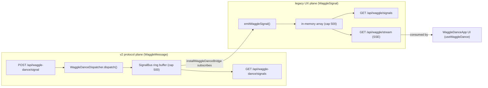
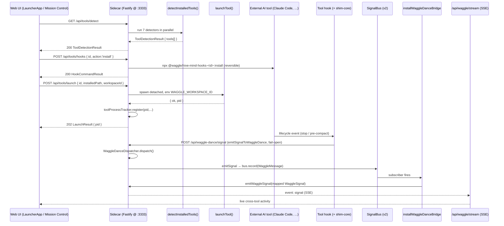

# 05e — Subsystem: WaggleDance + the AI-OS Arc

**Purpose.** This subsystem is Waggle's multi-agent coordination layer. It has two halves that meet at one shared protocol (`WaggleMessage`): (1) **WaggleDance** — a message protocol + dispatcher + in-memory ring buffer (`SignalBus`) that carries "what's happening across agents/tools right now"; and (2) the **AI-OS arc** — the path that detects 7 external AI tools on the user's machine, installs reversible hooks into them, launches them with a workspace-context env var, then lets those tools' hooks emit signals back into Waggle so the UI shows cross-tool activity in real time. There is also a local sub-agent layer (spawn/list/result, orchestrated workflows, cross-workspace messaging) that shares the same vocabulary.

This file is the contract for rebuilding the frontend surfaces that consume these endpoints (the **WaggleDanceApp** activity feed, the **LauncherApp** dock, the **Mission Control** inventory tile, and the **Room** sub-agent tiles). Every identifier and path below is quoted from the source under `packages/waggle-dance/`, `packages/agent/src/`, `packages/hive-mind-shim-core/src/`, `packages/shared/src/`, and `packages/server/src/local/`.

---

## 1. Mental model — two signal planes

There are **two distinct signal shapes** in this subsystem, and a **bridge** that converts one into the other. Do not confuse them.

| Plane | Shape | Subtypes | Where it lives | Who consumes it |
|---|---|---|---|---|
| **v2 protocol bus** (WaggleDance) | `WaggleMessage` | 10 protocol subtypes (`discovery`, `task_delegation`, …) | `SignalBus` ring buffer (`packages/server/src/local/signal-bus.ts`) | `GET /api/waggle-dance/signals`; the bridge |
| **Legacy UX stream** | `WaggleSignal` | 5 UX categories (`discovery`/`handoff`/`insight`/`alert`/`coordination`) | in-memory array in `waggle-signals.ts` | `GET /api/waggle/signals` + `GET /api/waggle/stream` (SSE); the **WaggleDanceApp UI** |

The **bridge** (`installWaggleDanceBridge`, `waggle-dance-bridge.ts`) subscribes to the v2 bus and re-emits every v2 message as a legacy UX signal, so the existing UI surfaces cross-tool activity with **zero frontend changes**. A frontend rebuild can target *either* plane; the legacy stream is the one the current UI already speaks and is SSE-streamed.



---

## 2. The WaggleDance protocol (`packages/waggle-dance` + `packages/shared/src/types.ts`)

### 2.1 `WaggleMessage` — canonical protocol envelope

Defined in `packages/shared/src/types.ts`. This is the v2 signal shape.

| Field | Type | Nullable | Meaning |
|---|---|---|---|
| `id` | `string` | no | UUID; server-assigned (`randomUUID()`) on POST |
| `teamId` | `string` | no | Team id; defaults to `personal::<senderId>` when omitted (the personal-tier moat) |
| `senderId` | `string` | no | Logical sender (`'claude-code-hook'`, `'cursor-hook'`, `'local'`, `agent-loop:<persona>`) |
| `type` | `MessageType` | no | One of `'broadcast' \| 'request' \| 'response'` |
| `subtype` | `MessageSubtype` | no | One of 10 subtypes (see 2.2) |
| `content` | `Record<string, unknown>` | no | Free-form structured payload; preserved verbatim |
| `referenceId` | `string \| null` | yes | For `response` types: correlates back to a prior request |
| `routing` | `Array<{ userId: string; reason: string }> \| null` | yes | For `routed_share`: directed recipients + rationale |
| `createdAt` | `Date` | no | Server-assigned timestamp |

### 2.2 `MessageType` × `MessageSubtype` and valid combinations

`MessageType = 'broadcast' | 'request' | 'response'`

`MessageSubtype` (10 values):
`knowledge_check`, `task_delegation`, `skill_request`, `model_recommendation`, `knowledge_match`, `task_claim`, `discovery`, `routed_share`, `skill_share`, `model_recipe`.

Valid combos are enforced by `validateMessageTypeCombo(type, subtype)` in `packages/waggle-dance/src/protocol.ts` against `VALID_COMBINATIONS`:

| `type` | Allowed `subtype`s |
|---|---|
| `request` | `knowledge_check`, `task_delegation`, `skill_request`, `model_recommendation` |
| `response` | `knowledge_match`, `task_claim` |
| `broadcast` | `discovery`, `routed_share`, `skill_share`, `model_recipe` |

`isRoutedMessage(subtype)` returns true only for `routed_share`. An invalid combo at the route returns HTTP 400.

### 2.3 The dispatcher — `WaggleDanceDispatcher` (`dispatcher.ts`)

`dispatch(message: WaggleMessage): Promise<DispatchResult>` validates the combo, then branches on `subtype`. `DispatchResult = { handled: boolean; response?: string; error?: string }`.

Dependencies injected via `DispatchDeps` — **v1** (team-internal) deps are required; **v2** (cross-tool bus) deps are all optional, so the route layer can wire them incrementally and unwired branches still return `handled: true`:

| Dep | Signature | Used by subtypes |
|---|---|---|
| `searchMemory` | `(query) => Promise<string>` | `knowledge_check` |
| `resolveCapability` | `(query) => Array<{source,name,description,available}>` | `skill_request` |
| `spawnWorker` | `(task, role, context?) => Promise<string>` | `task_delegation` |
| `emitSignal?` | `(msg) => Promise<void>` | `discovery`, `routed_share`, `model_recipe` (broadcasts) |
| `recordResponse?` | `(msg) => Promise<void>` | `knowledge_match`, `task_claim` (responses) |
| `recommendModel?` | `(query, context) => Promise<string \| null>` | `model_recommendation` |

**Per-subtype dispatch behavior (the 6 v2 branches the prompt asks about plus the 4 v1):**

| Subtype | Handler | Behavior | Required `content` fields |
|---|---|---|---|
| `task_delegation` (v1) | `handleTaskDelegation` | Calls `spawnWorker(task, role, context)` | `content.task` (required); `content.role` (default `'analyst'`), `content.context` |
| `knowledge_check` (v1) | `handleKnowledgeCheck` | Calls `searchMemory(query)` | `content.query` or `content.topic` |
| `skill_request` (v1) | `handleSkillRequest` | Calls `resolveCapability(query)`, returns a formatted route list | `content.skill` or `content.query` |
| `skill_share` (v1) | `handleSkillShare` | Returns JSON `{action:'install_shared_skill', skillName, skillContent, sharedBy}` | `content.name`/`content.skill` + `content.content` |
| `discovery` (v2) | `handleBroadcastSignal` | If `emitSignal` set → emit to bus; else accept | none enforced |
| `routed_share` (v2) | `handleBroadcastSignal` | Same; UI shows as a directed handoff | `routing` carries recipients |
| `model_recipe` (v2) | `handleBroadcastSignal` | Same; shares a model+prompt recipe | none enforced |
| `knowledge_match` (v2) | `handleResponseRelay` | If `recordResponse` set → record; correlated via `referenceId` | none enforced |
| `task_claim` (v2) | `handleResponseRelay` | Same; a worker claiming a delegated task | none enforced |
| `model_recommendation` (v2) | `handleModelRecommendation` | Calls `recommendModel(query, restOfContent)`; friendly fallback if unwired | `content.query` (required) |

`hive-query.ts` defines `HiveQuery { topic; scope? }` and `HiveQueryResult { entities[]; relatedTasks[]; relatedMessages[] }` — DB-backed hive queries are executed by the server's `MessageService`, not in this package (the package is types + dispatcher only). `packages/waggle-dance/src/index.ts` barrel-exports `protocol.js`, `hive-query.js`, `dispatcher.js`.

---

## 3. `SignalBus` — the v2 ring buffer (`packages/server/src/local/signal-bus.ts`)

In-memory ring buffer of `WaggleMessage`. Created once per server, decorated as `server.signalBus`. **Not durable** — survives until sidecar restart or rollover.

- `DEFAULT_BUFFER_SIZE = 500`. On overflow the **oldest** is dropped (`shift()`).
- `record(signal)` → appends, drops oldest if over capacity, notifies all subscribers synchronously (subscriber errors are swallowed so one bad subscriber can't poison the bus), returns the signal.
- `query(filter)` → snapshot, **newest first**. `SignalFilter`:

| Filter field | Type | Effect |
|---|---|---|
| `subtype` | `MessageSubtype` | exact match |
| `tool` | `string` | matches `content.tool` |
| `teamId` | `string` | exact match |
| `since` | ISO string | `createdAt > since` |
| `limit` | number | cap result count |

- `subscribe(sub)` → returns an unsubscribe fn (this is how the bridge attaches).
- `size` getter; `clear()` (tests).

---

## 4. The two streaming UX endpoints (legacy plane) — `waggle-signals.ts`

`WaggleSignal` (the legacy/UX shape the current UI renders):

| Field | Type | Nullable | Meaning |
|---|---|---|---|
| `id` | `string` | no | `sig-<ts>-<rand>` |
| `type` | `string` | no | e.g. `agent:started`, `tool:called`, `memory:saved`, `agent:completed`, or bridged `waggle-dance:<category>` |
| `workspaceId` | `string` | no | Defaults to `'global'` |
| `content` | `string` | no | Human-readable primary text |
| `metadata` | `Record<string,unknown>` | yes | Provenance (bridge fills `subtype`/`senderId`/`tool`/`teamId`/`referenceId`/`routing`/`priority`/`protocolMessage`) |
| `timestamp` | `string` (ISO) | no | Emit time |
| `acknowledged` | `boolean` | no | Ack state |

Store is a capped in-memory array (`MAX_SIGNALS = 500`, newest-first via `unshift`). `emitWaggleSignal(...)` is the exported publish fn used by the chat loop **and** the bridge.

---

## 5. The bridge — v2 → legacy (`waggle-dance-bridge.ts`)

`installWaggleDanceBridge(bus: SignalBus): () => void` subscribes to the v2 bus and re-emits each `WaggleMessage` via `emitWaggleSignal`. It is auto-installed the first time `server.signalBus` is created (inside `waggle-dance.ts`).

**Subtype → UX category mapping** (`categorizeSubtype`, exported for tests):

| v2 `subtype` | UX category | Legacy `type` emitted |
|---|---|---|
| `discovery`, `knowledge_check`, `skill_request` | `discovery` | `waggle-dance:discovery` |
| `task_delegation`, `skill_share`, `routed_share` | `handoff` | `waggle-dance:handoff` |
| `knowledge_match` | `insight` | `waggle-dance:insight` |
| `task_claim`, `model_recipe`, `model_recommendation` | `coordination` | `waggle-dance:coordination` |
| *(any subtype)* with `priority === 'critical'` | `alert` (override) | `waggle-dance:alert` |

Priority is resolved by `inferPriority`: `content.priority` (`low/normal/high/critical`) wins; else `content.importance` (`high`→high, `critical`→critical); else `normal`. `buildLegacyContent` builds the display string as `"<subtype>: <topic>"` where topic falls back through `content.topic → title → query → task → skill`, then to a key summary. Full provenance (including the verbatim `protocolMessage`) is carried in `metadata`.

---

## 6. AI-OS Phase 0 — tool detection (`packages/shared/src/tool-detection.ts` + `packages/agent/src/tool-detection.ts`)

### 6.1 The 7 supported tools

`SUPPORTED_TOOLS` (`@waggle/shared`), with display names from `TOOL_DISPLAY_NAMES`:

| `ToolId` | Display name | Detection strategy | Linux/macOS/Win paths |
|---|---|---|---|
| `claude-code` | Claude Code | PATH lookup (`claude`) | `which`/`where.exe` |
| `claude-desktop` | Claude Desktop | candidate paths | `/Applications/Claude.app/...`, `%LOCALAPPDATA%\AnthropicClaude\Claude.exe` |
| `cursor` | Cursor | candidate paths | `/Applications/Cursor.app/...`, `…\Programs\cursor\Cursor.exe` |
| `codex` | Codex CLI | PATH lookup (`codex`) | `which`/`where.exe` |
| `codex-desktop` | Codex Desktop | candidate paths (unreleased; speculative vendor paths) | `/Applications/Codex.app/...` |
| `hermes` | Hermes Agent | PATH lookup (`hermes`) | `which`/`where.exe` |
| `openclaw` | OpenClaw | PATH lookup (`openclaw`) | `which`/`where.exe` |

`LAUNCH_COHORT` = all 7. (The launcher's runtime guard message still says "claude-code, cursor, claude-desktop" — a stale Phase-2 string — but the actual array includes all 7.)

### 6.2 `DetectedTool` (per-tool result)

| Field | Type | Meaning |
|---|---|---|
| `id` | `ToolId` | tool id |
| `displayName` | `string` | from `TOOL_DISPLAY_NAMES` |
| `installed` | `boolean` | true iff binary found at a known path |
| `installedPath` | `string \| null` | absolute path to binary |
| `version` | `string \| null` | best-effort (`--version`); null if exec failed |
| `hooksInstalled` | `boolean` | true iff hook pointer file exists **and** its referenced `backup` file still exists (partial rollback → false) |
| `hookPointerPath` | `string \| null` | the pointer file probed (`~/<config-dir>/hive-mind-install.json`) |
| `diagnostic?` | `string` | optional human reason for a partial failure (e.g. `'--version exec failed'`) |

### 6.3 `ToolDetectionResult` (envelope) — returned by `GET /api/tools/detect`

| Field | Type | Meaning |
|---|---|---|
| `platform` | `NodeJS.Platform \| 'other'` | platform detection ran on |
| `detectedAt` | `string` (ISO) | completion timestamp |
| `tools` | `DetectedTool[]` | per-tool results, **in `SUPPORTED_TOOLS` order** (stable for the UI) |

Implementation notes: `detectInstalledTools(opts?)` runs every detector in parallel (`Promise.all`) but preserves `SUPPORTED_TOOLS` order in the output. All fs/exec/PATH calls are injectable (`ToolDetectionDeps`) for hermetic tests. Hook-pointer config dirs are in `HOOK_POINTER_BY_TOOL` (e.g. `claude-code` → `.claude/hive-mind-install.json`, `cursor` → `.cursor/...`, `codex`/`codex-desktop` → `.codex/...`).

---

## 7. AI-OS Phase 2 — launcher + hook installer (`packages/agent/src/tool-launcher.ts` + `tool-process-tracker.ts`)

### 7.1 `launchTool(opts) → LaunchResult`

Spawns the tool **detached** (`detached: true`, `stdio: 'ignore'`, `unref()` so it outlives the sidecar). Injects `WAGGLE_WORKSPACE_ID` into the child env when `workspaceId` is given — this is the single env var the tool's hooks pick up (via shim-core `workspace-resolver`) to tag captured memory.

`LaunchOptions`: `{ id: ToolId; installedPath: string (required); workspaceId?; cwd? (default = dirname of binary); args?; deps? }`.
`LaunchResult`: `{ ok: boolean; pid: number | null; executed: { binary; args; cwd? }; error? }`.

Guards: `id` must be in `LAUNCH_COHORT` (all 7); `installedPath` required (caller passes it from a fresh detect).

### 7.2 `runHookCommand(opts) → HookCommandResult` (reversible hooks)

Runs `npx --yes @waggle/hive-mind-hooks-<id> <install|verify|uninstall>` (adds `--cli-path <path>` only on `install`). Captures stdout/stderr/exit-code.

- `HookAction = 'install' | 'verify' | 'uninstall'`.
- **`HOOKS_COHORT`** = `['claude-code', 'codex', 'codex-desktop', 'cursor', 'hermes', 'openclaw']` (6 tools — every tool with a real `bin`). `claude-desktop` is excluded (binless stub). Hook actions gate on `HOOKS_COHORT`, **not** `LAUNCH_COHORT`, so the UI never offers a hook action npx can't fulfil.
- `hookPackageFor(id)` → `@waggle/hive-mind-hooks-${id}`.
- `HookCommandResult`: `{ ok; action; packageName; stdout; stderr; code; error? }`.

Reversibility: install writes a pointer file `~/<config>/hive-mind-install.json` whose `backup` field points at the original config; uninstall restores it; detection's `hooksInstalled` flips false if the backup is gone (partial rollback is honestly reported).

### 7.3 `ToolProcessTracker` — the 'Running' badge backend

In-memory map of `TrackedProcess { pid; toolId; startedAt; workspaceId? }`. **Not durable** (dropped on restart — losing attribution is preferred over reporting stale liveness).

| Method | Behavior |
|---|---|
| `register(pid, toolId, workspaceId?)` | record a freshly spawned pid (idempotent on pid) |
| `list()` | GC dead pids (`process.kill(pid,0)` liveness), return alive ones |
| `forget(pid)` | drop a pid |
| `kill(pid, gracefulTimeoutMs=3000)` | refuses untracked pids; SIGTERM → wait → SIGKILL escalation; returns `{ ok; pid; reason }` where reason ∈ `not-tracked` / `already-dead` / `sigterm-ok` / `sigkill-ok` / `sigterm-failed-sigkill-failed` |

---

## 8. AI-OS Phase 1D — the shim-core emitter (`packages/hive-mind-shim-core/src/signal-emitter.ts`)

This is the library a tool's hook calls to push a signal back into Waggle. **Fail-open by design**: any error (ENOTFOUND, ECONNREFUSED, non-2xx, parse) returns `null` and logs one stderr warning — the host AI tool's hook chain never sees a failure. Uses only Node 20 built-in `fetch`, 2-second default timeout.

URL resolution: `options.url > env.WAGGLE_SIDECAR_URL > http://127.0.0.1:3333`.

- `emitSignalToWaggleDance(opts: EmitSignalOptions): Promise<EmittedSignal | null>` — POSTs to `<url>/api/waggle-dance/signal`.
  - `EmitSignalOptions`: `{ type: SignalType; subtype: SignalSubtype; content: Record<string,unknown>; senderId? (default 'hook'); teamId?; referenceId?; routing?; url?; timeoutMs? (2000); fetchImpl?; onWarn? }`.
  - `SignalType` / `SignalSubtype` mirror the protocol enums exactly.
  - `EmittedSignal` is the server-persisted message echoed back: `{ id; teamId; senderId; type; subtype; content; referenceId; routing; createdAt }`.
- `maybeEmitDiscovery(eventType, importance, payload, opts)` — convenience policy: emit a `broadcast`/`discovery` only when `importance` is `'high'|'critical'` **and** `eventType` is `'stop'|'pre-compact'`. Phase 1E wires the claude-code Stop hook to this (opt-in via `WAGGLE_SIGNAL_EMIT`).

Hook event vocabulary (`hook-event-types.ts`): `EventType` = `session-start | session-end | user-prompt-submit | pre-compact | stop | pre-tool-use | post-tool-use`; `ShimSource` = `claude-code | cursor | hermes | codex | opencode | openclaw`.

---

## 9. The end-to-end AI-OS flow: detect → launch → signal → UI



Rollback anchor for the whole arc: git tag `checkpoint/pre-ai-os-2026-05-20`.

---

## 10. Local sub-agent + cross-workspace layer (same vocabulary, different transport)

These are **agent tools** (callable by the LLM), not HTTP routes, but the frontend sees their effects through the notifications/Room stream and they share the coordination theme.

### 10.1 Sub-agent spawning — `createSubAgentTools(deps)` (`subagent-tools.ts`)

Exposes **3 tools** to the main agent. Sub-agents run in-process via the shared `runLoop`. In-memory registries: `activeAgents` + `agentResults` (capped at `MAX_AGENT_RESULTS = 100`, stale eviction at `STALE_THRESHOLD_MS = 30 min`).

| Tool | Inputs | Output |
|---|---|---|
| `spawn_agent` | `name`, `role`, `task` (required); `context?`, `tools?` (role=`custom` only), `model?`, `max_turns?` (50) | Markdown sub-agent result (role, duration, tools used, tokens, content) |
| `list_agents` | none | Active + completed agents with previews |
| `get_agent_result` | `agent_id` (or name) | Full stored result |

`ROLE_TOOL_PRESETS` maps role → tool allowlist: `researcher`, `writer`, `coder`, `analyst`, `reviewer`, `planner` (default fallback = `analyst`). Lifecycle is surfaced to the UI via `onSubAgentStatus` (`running`/`done`/`error`) which the server wires to `emitSubagentStatus` → the Room canvas. `onSubAgentComplete` persists results to the active mind (best-effort, never throws).

`SubAgentResult`: `{ agentId; agentName; role; response; usage{inputTokens,outputTokens}; toolsUsed[]; duration; completedAt }`. `SubAgentStatusEvent`: `{ agentId; name; role; status; task; toolsUsed[]; startedAt; completedAt? }`.

### 10.2 Workflow orchestration — `SubagentOrchestrator` (`subagent-orchestrator.ts`)

Supervisor/worker pattern over `spawn_agent`. `runWorkflow(template)` executes steps in **dependency order** (topological, sequential), injects upstream results as context, then aggregates. Emits `worker:status` events (an `EventEmitter`).

- `WorkflowStep`: `{ name; role; task; tools?; dependsOn?; contextFrom?; maxTurns? }`.
- `WorkflowTemplate`: `{ name; description; steps[]; aggregation: 'concatenate' | 'last' | 'synthesize' }`.
- `WorkerState`: `{ id; name; role; status: 'pending'|'running'|'done'|'failed'; task; startedAt?; completedAt?; result?; error?; toolsUsed[]; usage }`.
- Adds `synthesizer` + `summarizer` to the role presets. Circular dependency → remaining steps marked `failed` with a clear error.

### 10.3 Cross-workspace messaging — `AgentMessageBus` + `createAgentCommsTools`

`AgentMessageBus` (`agent-message-bus.ts`) is an **in-memory, per-machine** bus for concurrent agent sessions in different workspaces (distinct from team/PostgreSQL messaging). `AgentMessage`: `{ id; from (workspaceId); to (workspaceId); content; correlationId?; timestamp; ttlMs }`. Default TTL = 5 min; `receive()` is one-shot (drains + filters expired); `peek()` is non-destructive; `cleanup()` GCs expired.

`createAgentCommsTools(bus, currentWorkspaceId, isSessionActive?)` exposes **2 tools**:

| Tool | Inputs | Notes |
|---|---|---|
| `send_agent_message` | `workspace`, `message`, `correlationId?` | Rejects self-send; rejects target whose session isn't active |
| `check_agent_messages` | none | Consumes pending messages for the current workspace |

---

## 11. API reference — every route

All routes are served by the **local sidecar** (Fastify, loopback `:3333`). Registration in `packages/server/src/local/index.ts`: `toolsRoutes` (1990), `waggleDanceRoutes` (1991), `waggleSignalRoutes` (2016). The `signalBus` and `toolProcessTracker` decorations propagate to the parent instance via `fastify-plugin`.

| Method | Full path | Request shape | Response shape | Streaming? |
|---|---|---|---|---|
| POST | `/api/waggle-dance/signal` | `{ type, subtype, content, senderId?, teamId?, referenceId?, routing? }` (Zod `signalRequestSchema`) | `201 { dispatched:true, response, message: WaggleMessage }` · `400 { error, details? }` | No |
| GET | `/api/waggle-dance/signals` | query `{ subtype?, tool?, teamId?, limit?(≤1000), since? }` | `200 { signals: WaggleMessage[], total }` (newest-first) · `400` | No |
| GET | `/api/waggle/signals` | query `{ limit?(≤200, default 50), unacked?('1') }` | `{ signals: WaggleSignal[], total }` | No |
| POST | `/api/waggle/signals` | `{ type, content, workspaceId?, metadata? }` | `201 WaggleSignal` · `400 { error }` | No |
| PATCH | `/api/waggle/signals/:id/ack` | path `:id` | `{ acknowledged:true, id }` | No |
| GET | `/api/waggle/stream` | — (SSE; Origin echoed only if allow-listed) | `event: signal` frames of `WaggleSignal`; `:heartbeat` every 30s | **Yes (SSE)** |
| GET | `/api/tools/detect` | — | `200 ToolDetectionResult` · `500 { error, message }` | No |
| POST | `/api/tools/launch` | `{ id, installedPath, workspaceId?, cwd?, args? }` (Zod) | `202 LaunchResult` · `400 LaunchResult`/validation | No |
| GET | `/api/tools/processes` | — | `200 { processes: TrackedProcess[], total }` | No |
| POST | `/api/tools/kill` | `{ pid }` | `200 { ok, pid, reason }` · `404 not-tracked` · `500` | No |
| POST | `/api/tools/hooks` | `{ id, action:'install'\|'verify'\|'uninstall', cliPath? }` | `200 HookCommandResult` · `400` · `500 { error, message }` | No |

**Server-side defaulting on POST `/api/waggle-dance/signal`:** `id`=`randomUUID()`, `createdAt`=now, `senderId`=`'local'` if omitted, `teamId`=`personal::<senderId>` if omitted, `referenceId`/`routing`=`null`. The route wires real v2 deps (`emitSignal`→`bus.record`, `recordResponse`→`bus.record`, `recommendModel`→`null` stub). v1 deps are local stubs (the team-internal paths run through the cloud team workspace, not this loopback route).

---

## 12. Phase 3 — skill diffusion (closed-loop → bus)

When the agent's D1 closed learning loop fires (`onSkillDistillationFire`, wired in `chat.ts`), the server records a `skill_share` broadcast directly onto `server.signalBus`:

```
{ type:'broadcast', subtype:'skill_share',
  teamId:'personal::<workspace>', senderId:'agent-loop:<persona>',
  content:{ tool:'waggle-agent', patternKey, toolsUsed[], directive, sessionId, workspaceId } }
```

Via the bridge this surfaces in the UI as a `waggle-dance:handoff` signal, so MCP-consuming external tools can adopt the soon-to-be-authored skill. The whole emission is best-effort and gated on `server.signalBus` existing.

---

## 13. Frontend rebuild checklist

- **Activity feed (WaggleDanceApp):** consume `GET /api/waggle/stream` (SSE) for live signals and `GET /api/waggle/signals` for backfill; render by the 5 UX categories; ack via `PATCH /api/waggle/signals/:id/ack`. Drill-down detail is in `metadata.protocolMessage` (the raw `WaggleMessage`). If you want the raw protocol plane instead, poll `GET /api/waggle-dance/signals`.
- **Launcher dock (LauncherApp):** `GET /api/tools/detect` to list the 7 tools (installed/version/hooksInstalled); `POST /api/tools/hooks` for install/verify/uninstall (only enable for the 6 `HOOKS_COHORT` tools; `claude-desktop` has no hook action); `POST /api/tools/launch` (pass `installedPath` from the detect result + the current `workspaceId`); poll `GET /api/tools/processes` for the 'Running' badge; `POST /api/tools/kill` for stop.
- **Mission Control inventory tile:** the same `ToolDetectionResult` (count installed, count hooked).
- **Room sub-agent tiles:** driven by the notifications stream (`subagent_status`), fed by `onSubAgentStatus`/`emitSubagentStatus`; the underlying tools are `spawn_agent`/`list_agents`/`get_agent_result`.

---

## 14. Source map

| Concern | File |
|---|---|
| Protocol types | `packages/shared/src/types.ts` (`WaggleMessage`, `MessageType`, `MessageSubtype`) |
| Combo validation | `packages/waggle-dance/src/protocol.ts` |
| Dispatcher | `packages/waggle-dance/src/dispatcher.ts` |
| Hive-query types | `packages/waggle-dance/src/hive-query.ts` |
| v2 ring buffer | `packages/server/src/local/signal-bus.ts` |
| v2 routes | `packages/server/src/local/routes/waggle-dance.ts` |
| Bridge v2→legacy | `packages/server/src/local/waggle-dance-bridge.ts` |
| Legacy stream + SSE | `packages/server/src/local/routes/waggle-signals.ts` |
| Tool-detection types | `packages/shared/src/tool-detection.ts` |
| Tool-detection impl | `packages/agent/src/tool-detection.ts` |
| Launcher + hooks | `packages/agent/src/tool-launcher.ts` |
| Process tracker | `packages/agent/src/tool-process-tracker.ts` |
| Tools routes | `packages/server/src/local/routes/tools.ts` |
| Shim-core emitter | `packages/hive-mind-shim-core/src/signal-emitter.ts` |
| Hook event vocab | `packages/hive-mind-shim-core/src/hook-event-types.ts` |
| Sub-agent tools | `packages/agent/src/subagent-tools.ts` |
| Orchestrator | `packages/agent/src/subagent-orchestrator.ts` |
| Cross-workspace bus | `packages/agent/src/agent-message-bus.ts` + `agent-comms-tools.ts` |
| Skill-diffusion wiring | `packages/server/src/local/routes/chat.ts` (`onSkillDistillationFire`) |
