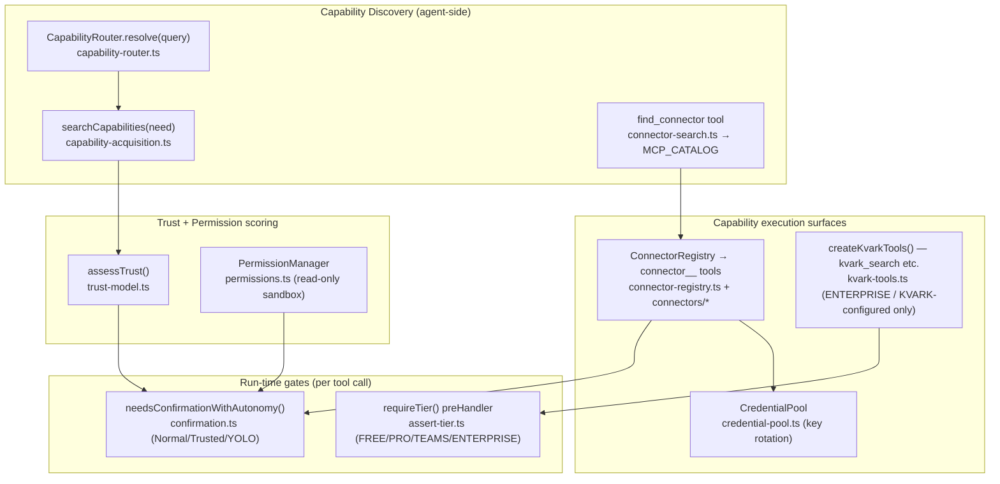
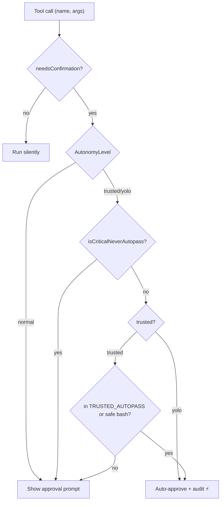

# 05f — Subsystem: Capabilities, Connectors, Trust & Tier Gating

**Purpose.** This section is the contract + mental model for everything an agent *can do* and *is allowed to do*: how it discovers a missing capability and proposes installing one, how integrations (connectors) become agent tools, the curated MCP server catalog the UI browses, and the two orthogonal gates that decide whether an action runs — the **trust/autonomy model** (Normal / Trusted / YOLO) and the **subscription tier** (FREE → PRO → TEAMS → ENTERPRISE, which alone unlocks the KVARK enterprise tools). If you are rebuilding the frontend, this tells you which lists to render, which POST/GET endpoints to call, what JSON each returns, and which buttons must show approval/upgrade gates.

All identifiers below are quoted verbatim from source. Files: `packages/agent/src/{capability-router.ts, capability-acquisition.ts, trust-model.ts, permissions.ts, confirmation.ts, credential-pool.ts, connector-registry.ts, connector-sdk.ts, kvark-tools.ts, connector-search.ts}`, `packages/agent/src/connectors/*`, `packages/shared/src/{mcp-catalog.ts, types.ts}`, `packages/server/src/local/routes/{connectors.ts, capabilities.ts}`, `packages/server/src/local/setup-connectors.ts`, `packages/server/src/middleware/assert-tier.ts`.

---

## 1. The Big Picture (mental model)



**Two independent axes gate every action:**

1. **Trust / autonomy** — *"is this action destructive enough to need a click?"* Computed per tool call from the tool name/args and the session's `AutonomyLevel`. Pure runtime, no subscription involved. (`confirmation.ts`)
2. **Tier** — *"does this user's plan include this feature at all?"* Enforced on HTTP routes (`requireTier()`) and on tool *registration* (KVARK tools only exist when KVARK is configured, which is an ENTERPRISE concern). (`assert-tier.ts`, `kvark-tools.ts`)

A capability can be **discovered** without being **available** (e.g. a connector that exists in the registry but has no credentials), and **available** without being **runnable** (e.g. a write action that still needs confirmation at Normal autonomy).

---

## 2. Capability Routing — `CapabilityRouter` (`capability-router.ts`)

A pure, in-memory resolver that answers *"where could capability X come from?"* It ranks candidate sources by confidence. It does **not** install anything — it's the read-side of discovery.

### 2.1 Types

`CapabilitySource` (union): `'native' | 'skill' | 'plugin' | 'mcp' | 'subagent' | 'connector' | 'missing'`

**`CapabilityRoute`** (one ranked match):

| Field | Type | Nullable | Meaning |
|---|---|---|---|
| `source` | `CapabilitySource` | no | Which kind of provider this route points to |
| `name` | `string` | no | Provider identifier (tool/skill/plugin/server/role name, or the original query if `missing`) |
| `confidence` | `number` | no | 0–1 ranking score (see table 2.3) |
| `description` | `string` | no | Human-readable explanation of the match |
| `available` | `boolean` | no | Whether it can be used right now |
| `suggestion` | `string` | yes | Next-step hint (e.g. connect credentials, search marketplace) |

**`ConnectorInfo`** (input describing a registered connector for routing): `id: string`, `name: string`, `service: string`, `connected: boolean`, `actions: string[]`.

**`CapabilityRouterDeps`** (constructor input): `toolNames: string[]`, `skills: {name, content}[]`, `plugins: {name, description, skills?, mcpServers?}[]`, `mcpServers: string[]`, `subAgentRoles: string[]`, `mcpRuntime?: { isServerHealthy(name): boolean }`, `connectors?: ConnectorInfo[]`.

### 2.2 Resolution order (`resolve(query)`)

Sources are scanned in this fixed order, all matches collected, then sorted by `confidence` descending. If nothing matches, a single `source: 'missing'` route is returned with a `suggestion`.

| Order | Source | Match rule | Confidence |
|---|---|---|---|
| 1 | `native` | tool name exact-equals query | `1.0` |
| 1 | `native` | tool name partial-includes query | `0.8` |
| 1.5 | `connector` | query mentions connector id/service/name, or an action (underscores→spaces) | `0.75` (`available = connector.connected`) |
| 2 | `skill` | skill name matches query | `0.7` |
| 2 | `skill` | skill content matches query | `0.5` |
| 3 | `plugin` | plugin description or listed skill matches | `0.6` |
| 4 | `mcp` | server name matches; `available` from `mcpRuntime.isServerHealthy()` (else assumed healthy) | `0.45` |
| 5 | `subagent` | query hits `ROLE_KEYWORDS` for a role | `0.4` |

`ROLE_KEYWORDS` (hardcoded): `researcher`, `writer`, `coder`, `analyst`, `reviewer`, `planner` — each maps to ~5 trigger words (e.g. `coder: ['code','implement','program','develop','build']`).

### 2.3 Frontend note
There is no dedicated HTTP route that exposes `CapabilityRouter.resolve()` directly; it is invoked inside the agent loop. The frontend observes its results indirectly through chat output and the **capability-request marker** (§4.3).

---

## 3. Capability Acquisition — `capability-acquisition.ts`

The write-side proposal engine behind the agent tool **`acquire_capability`**. It searches active skills, on-disk starter skills, native tools, and pre-fetched marketplace candidates, scores them by keyword overlap, attaches a **trust assessment** to each, and returns a single human-grade proposal with one recommendation.

### 3.1 Types

`CapabilitySourceType`: `'native' | 'skill' | 'plugin' | 'mcp' | 'connector' | 'marketplace'`

`CapabilityAvailability`: `'active' | 'installed_inactive' | 'installable' | 'unavailable'`

**`CapabilityCandidate`:**

| Field | Type | Meaning |
|---|---|---|
| `name` | `string` | Candidate identifier |
| `type` | `CapabilitySourceType` | Kind of capability |
| `availability` | `CapabilityAvailability` | Lifecycle state |
| `description` | `string` | Human description (first line of skill or hint) |
| `source` | `string` | Origin label: `"native-tools"`, `"installed"`, `"starter-pack"`, `"marketplace"` |
| `matchScore` | `number` | 0–1 internal ranking |
| `matchReason` | `string` | e.g. `"name matches: risk; content mentions: project"` |
| `installAction` | `string \| null` | `"install_capability"` for installable; `null` if native/active |
| `trust` | `TrustAssessment?` | Attached during search (see §5) |

**`AcquisitionProposal`** (return of `searchCapabilities`): `need`, `gapDetected: boolean`, `summary: string` (Markdown), `candidates: CapabilityCandidate[]` (capped at **8**), `recommendation: CapabilityCandidate | null`, `alreadyHandled: boolean`.

### 3.2 Scoring & thresholds (load-bearing constants)

- Keyword extraction drops a built-in `STOP_WORDS` set and tokens `< 3` chars.
- `scoreMatch`: **name hits = 2 points, content hits = 1 point**, normalized by keyword count, clamped to 1.0.
- Inclusion thresholds: native `>= 0.15`, installed skills `>= 0.1`, starter skills `>= 0.1`, marketplace `>= 0.1`.
- `alreadyHandled` requires a best active candidate with `matchScore >= 0.4`.
- `gapDetected = !alreadyHandled && some candidate is installable`.

`NATIVE_TOOL_HINTS` maps ~18 native tool names to hint keyword strings used for scoring (e.g. `web_search`, `read_file`, `spawn_agent`, `generate_docx`, `query_knowledge`).

### 3.3 Install validation — `validateInstallCandidate(name, source, starterSkillsDir, installedSkillNames)`
Returns `InstallValidation { valid, error?, candidateName, candidateType, source, starterPath? }`. **Only `source === 'starter-pack'` is installable via the tool path.** Rejects unknown sources, missing files, and already-installed skills. (Marketplace/MCP/connector installs go through the UI marker path, not this tool — see §4.3.)

---

## 4. Agent-facing capability tools (request shapes)

These are **LLM tools**, not HTTP routes. The frontend never calls them directly, but it must render their *effects* (proposals, install cards, approval prompts). Defined in `skill-tools.ts` and `connector-search.ts`.

| Tool | Params (required) | Effect / output |
|---|---|---|
| `acquire_capability` | `need: string` | Runs `searchCapabilities`; returns the proposal `summary` (Markdown). Records an audit event when a gap with a recommendation is found. |
| `install_capability` | `name: string`, `source: string` | Installs a **starter-pack** skill into the active set, hot-loads it, returns its content. **Always confirmation-gated** (in `ALWAYS_CONFIRM`). Rejects names containing `..`, `/`, `\`. |
| `find_connector` | `query: string` (opt: `limit` default 10/cap 30, `category`) | Searches `MCP_CATALOG`; returns JSON `{query, catalogSize, matchCount, matches:[{id,name,category,description,capabilities,installCmd,url,official,matchScore}]}`. `offlineCapable: true`. |
| `list_connector_categories` | — | Lists every `MCP_CATEGORIES` entry with server counts. |

### 4.1 KVARK tools (tier-gated) — see §9.
### 4.2 Persona allowlists
Some personas list `'acquire_capability'`, `'install_capability'`, `'find_connector'` in their tool allowlist (`persona-data.ts`); read-only personas (e.g. `planner`) explicitly *cannot* install.

### 4.3 The capability-request marker (UI contract)
For **non–starter-pack** sources (marketplace / MCP / connector), the agent does **not** call `install_capability`. Instead it emits, on its own line, verbatim:

```
<!--waggle:capability_request {"name":"<name>","source":"<source>","reason":"<one-line why>"}-->
```

The frontend parser (`capability-request-parser.ts` → `CapabilityRequestCard`) turns this into a one-click **Install** card. `reason` is sanitized (strips `{}<>`, collapses whitespace, ≤140 chars). **The new frontend must detect and render this marker.**

---

## 5. Trust Model (`trust-model.ts`)

Source trust (provenance) and execution risk (what the content does) are scored **independently**, then summed. This is what powers the risk badge on install cards.

### 5.1 Core types

| Type | Values |
|---|---|
| `RiskLevel` | `'low' \| 'medium' \| 'high'` |
| `TrustSource` | `'builtin' \| 'starter_pack' \| 'local_user' \| 'third_party_verified' \| 'third_party_unverified' \| 'unknown'` |
| `ApprovalClass` | `'standard' \| 'elevated' \| 'critical'` |
| `AssessmentMode` | `'declared' \| 'heuristic' \| 'mixed'` |
| `RiskFactor` | `local_code_execution, filesystem_access, network_access, external_service_access, secret_access, browser_automation, unknown_source, missing_metadata, unverified_publisher` |

**`PermissionSummary`** (all `boolean`): `fileSystem, network, codeExecution, externalServices, secrets, browserAutomation`.

**`TrustAssessment`** (return of `assessTrust`): `riskLevel`, `trustSource`, `permissions: PermissionSummary`, `approvalClass`, `assessmentMode`, `explanation: string`, `factors: RiskFactor[]`.

### 5.2 Scoring

- **Source risk points** (`SOURCE_RISK_POINTS`): builtin `0`, starter_pack `0`, local_user `1`, third_party_verified `2`, third_party_unverified `4`, unknown `5`.
- **Permission risk points** (`PERMISSION_RISK_POINTS`): fileSystem `1`, network `1`, codeExecution `2`, externalServices `1`, secrets `2`, browserAutomation `1`.
- Empty content (non-builtin) adds `+1` and a `missing_metadata` factor.
- **`classifyRisk(points)`**: `<=2 → low`, `<=4 → medium`, `5+ → high`.
- **`deriveApprovalClass`**: low→`standard`, medium→`elevated`, high→`critical`.

Permissions are detected **heuristically** by regex pattern sets (`FS_PATTERNS`, `NET_PATTERNS`, `EXEC_PATTERNS`, `EXT_SERVICE_PATTERNS`, `SECRET_PATTERNS`, `BROWSER_PATTERNS`) and merged (OR) with any `declaredPermissions`. `resolveTrustSource(type, source)` maps `'starter-pack'→starter_pack`, `'installed'/'user-created'→local_user`, native→`builtin`, etc.

`formatTrustSummary(assessment)` renders the compact block shown on install cards: `Risk: **High** (heuristic) | Source: ... | Approval: Critical` + active permissions list.

---

## 6. Permissions sandbox (`permissions.ts`)

A simple allow/deny tool filter used to put an agent into read-only mode.

- **`READONLY_TOOLS`** (frozen): `read_file, search_files, search_content, git_status, git_diff, git_log, web_search, web_fetch, show_plan, search_memory, get_identity, get_awareness, query_knowledge, query_audit, list_skills, search_skills, list_connectors, list_harnesses`.
- **`PermissionManager`**: `{ blacklist?, whitelist? }`. `isAllowed(name)` = not blacklisted **and** (no whitelist or whitelisted). `filterTools(tools)` returns the allowed subset. `PermissionManager.sandbox()` = whitelist of `READONLY_TOOLS`.

This is the static/persona-level allowlist; it is distinct from the per-call confirmation gate (§7).

---

## 7. Autonomy Tiers — confirmation gating (`confirmation.ts`)

This is the **Normal / Trusted / YOLO** model the task asks about. It decides, per tool call, whether the UI must show an approval prompt. It is a **UX lever, not a permission system** — a hardcoded critical blacklist always wins.

`AutonomyLevel = 'normal' | 'trusted' | 'yolo'`.

### 7.1 What always needs confirmation at Normal — `needsConfirmation(toolName, args)`

- **`ALWAYS_CONFIRM`** set: `write_file, edit_file, generate_docx, git_commit, git_push, git_pr, git_merge, install_capability, read_other_workspace, list_workspace_files, read_other_workspace_file`.
- **Connector tools** (`connector_*`): risk derived from the **tool name only** (never trust args — anti-injection). `send_email`/`send_template` are `CONNECTOR_HIGH_RISK_ACTIONS` (always confirm); otherwise confirm if name matches `_(create|update|delete|send|post|transition|remove|add|set|put)_`.
- **`bash`**: auto-approved only if it matches a `SAFE_BASH_PATTERNS` entry **and** contains no chain operator (`&& || ; |`); confirmed if it matches `DESTRUCTIVE_BASH_PATTERNS` (`rm -rf`, `del`, `format`, `dd if=`, `git push/reset/rebase`, `sudo`, `powershell`, exfil `curl -d`, etc.); unknown bash → confirm by default.

### 7.2 Approval class — `getApprovalClass(toolName, args)`
Connector high-risk → `critical`; connector write → `elevated`; `install_capability` reads `args._riskLevel` (`high`→critical, `medium`→elevated); everything else → `standard`.

### 7.3 The three levels — `needsConfirmationWithAutonomy(toolName, args, level)`

| Level | Behavior |
|---|---|
| `normal` | Exactly reproduces `needsConfirmation` — gate everything it flags. |
| `trusted` | Auto-pass `TRUSTED_AUTOPASS` = `{write_file, edit_file, generate_docx, read_other_workspace, read_other_workspace_file}` and non-critical `bash`. **Still gate** git push/commit/pr/merge, `install_capability`, connector writes, cross-workspace writes. |
| `yolo` | Auto-pass everything **except** `isCriticalNeverAutopass`. |

### 7.4 Critical blacklist — `isCriticalNeverAutopass()` (never auto-passes, even at YOLO)
- bash matching `CRITICAL_NEVER_AUTOPASS`: `rm -rf /` or `~`, `rm -rf $HOME`, `rm -rf /*`, any `sudo`, `format C:`, `mkfs`, `reg delete`, `dd if=… of=/dev`, forced `git push --force` to main/master/production, fork bomb.
- `install_capability` with `_riskLevel === 'high'`.
- `git_push` with `force` to `main`/`master`/`production`.

### 7.5 Frontend contract for autonomy
The chat request body carries an autonomy override (read in `chat.ts`):
```jsonc
{ "autonomy": { "level": "trusted" | "yolo", "expiresAt": <ms epoch> } }
```
If `expiresAt` is absent or in the past, the **server falls back to `normal`** (it owns the final say). When elevated autonomy pre-approves a tool that would normally gate, the stream emits a `step` event `⚡ <tool> auto-approved (<level>)` and an `approval_auto` audit row. The frontend should let users pick a level + a temporary expiry, and surface the auto-approved steps.



---

## 8. Connectors

### 8.1 Runtime SDK (`connector-sdk.ts`)

**`WaggleConnector`** interface (server-side executable). Key readonly fields: `id`, `name`, `description`, `service`, `authType: 'bearer'|'oauth2'|'api_key'|'basic'`, `actions: ConnectorAction[]`, `substrate: 'waggle'|'kvark'`, `logoUrl?`, `category?`, `setupGuide?`. Methods: `connect(vault)`, `healthCheck(): Promise<ConnectorHealth>`, `execute(action, params): Promise<ConnectorResult>`, `toDefinition(status): ConnectorDefinition`.

**`ConnectorAction`** (runtime): `name`, `description`, `inputSchema` (JSON Schema), `outputSchema?`, `riskLevel: 'low'|'medium'|'high'`.

**`ConnectorResult`**: `{ success: boolean, data?: unknown, error?: string }`.

`BaseConnector` (abstract) supplies `toDefinition()` and `deriveCapabilities()` — maps action risk to `read`/`write`/`search` capability tags (low→read, medium/high→write, name contains search/find/list→search) — plus `safeErrorText()` truncation defense.

### 8.2 Registry (`connector-registry.ts`)

`ConnectorRegistry(vault, auditLogger?)`:

| Method | Returns | Notes |
|---|---|---|
| `register(c)` / `unregister(id)` | — / `boolean` | Map keyed by `connector.id` |
| `getAll()` / `get(id)` | `WaggleConnector[]` / `WaggleConnector?` | |
| `getConnected()` | `WaggleConnector[]` | A connector is "connected" if vault holds a non-expired credential, **or** its id is in `ALWAYS_CONNECTED = {slack-mock, teams-mock, discord-mock}` |
| `getDefinitions()` | `ConnectorDefinition[]` | Serializable; status `connected`/`expired`/`disconnected` from vault |
| `healthCheck(id)` | `ConnectorHealth \| null` | |
| `generateTools()` | `ToolDefinition[]` | **One tool per action**, named `connector_<id>_<action>`; description `[<Name>] <action desc>`; every execution is audit-logged with `requiresApproval = action.riskLevel !== 'low'`; errors returned as `{success:false,error}` JSON |

### 8.3 Built-in connectors registered at startup (`setup-connectors.ts`)

`registerConnectors(vault)` registers **30** connectors:

GitHub, Slack, Jira, Email, Google Calendar, Discord, Linear, Asana, Trello, Monday, Notion, Confluence, Obsidian, HubSpot, Salesforce, Pipedrive, Airtable, GitLab, Bitbucket, Dropbox, Postgres, Gmail, Google Docs, Google Drive, Google Sheets, MS Teams, Outlook, OneDrive, OneNote, Composio.

(Connector implementation files live in `packages/agent/src/connectors/*-connector.ts`.)

### 8.4 Shared serializable types (`packages/shared/src/types.ts`)

`ConnectorStatus = 'connected' | 'disconnected' | 'expired' | 'error'`.

**`ConnectorActionMeta`**: `name`, `description`, `riskLevel: 'low'|'medium'|'high'`.

**`ConnectorDefinition`** (what the UI renders):

| Field | Type | Nullable | Meaning |
|---|---|---|---|
| `id` | `string` | no | Connector id |
| `name` | `string` | no | Display name |
| `description` | `string` | no | What it does |
| `service` | `string` | no | Underlying service |
| `authType` | `'api_key'\|'oauth2'\|'bearer'\|'basic'` | no | Credential type the connect form needs |
| `status` | `ConnectorStatus` | no | Live from vault |
| `capabilities` | `('read'\|'write'\|'search')[]` | no | Derived from action risk |
| `substrate` | `'waggle'\|'kvark'` | no | Which substrate manages it |
| `tools` | `string[]` | no | Tool names it provides when connected (`connector_<id>_<action>`) |
| `config` | `Record<string,unknown>` | yes | Connector-specific config |
| `actions` | `ConnectorActionMeta[]` | yes | Present when SDK connector loaded |
| `logoUrl` | `string` | yes | SVG logo CDN url |
| `category` | `'productivity'\|'development'\|'crm'\|'data'\|'communication'\|'storage'\|'integration'` | yes | |
| `setupGuide` | `string` | yes | 1–2 sentences: which credential and where to get it |

**`ConnectorHealth`**: `id`, `name`, `status: ConnectorStatus`, `lastChecked: string` (ISO), `error?`, `tokenExpiresAt?`.

### 8.5 Connector HTTP routes (`connectors.ts`)

| Method | Path | Request body | Response | Streaming |
|---|---|---|---|---|
| GET | `/api/connectors` | — | `{ connectors: ConnectorDefinition[] }` (`registry.getDefinitions()`; `{connectors:[]}` if no registry) | no |
| GET | `/api/connectors/:id/health` | — | `ConnectorHealth`; `404` if not found; `502` sanitized degraded `ConnectorHealth` on probe throw | no |
| POST | `/api/connectors/:id/connect` | `{ token?, apiKey?, refreshToken?, expiresAt?, scopes?, email? }` (one of `token`/`apiKey` required) | `{ connected: true, connectorId }`; `400` if no credential; `404` unknown id; `503` if vault unavailable. Stores via `vault.setConnectorCredential`; re-runs `connector.connect`; extra `email` → `connector:<id>:email` | no |
| POST | `/api/connectors/:id/disconnect` | — | `{ disconnected, connectorId, cleanedKeys }`. Deletes `connector:<id>` + all `connector:<id>:*` sub-keys | no |

---

## 9. KVARK enterprise tools (tier-gated) — `kvark-tools.ts`

KVARK is the sovereign enterprise substrate at the top of the funnel. These tools are the agent's interface to KVARK retrieval. **They are only registered when KVARK is configured** — `getKvarkConfig(vault)` reads `kvark:connection` from the vault and returns `null` when absent. The wiring guard (verified by `packages/server/tests/kvark/kvark-wiring.test.ts`) is effectively `if (getKvarkConfig(vault)) tools.push(...createKvarkTools({client}))` → **exactly 4 tools** when configured, **0** otherwise. FREE/PRO/TEAMS users with no KVARK connection never see them; KVARK connection is an ENTERPRISE concern.

`createKvarkTools({ client: KvarkClientLike })` returns:

| Tool | Params (required) | Output (formatted text) |
|---|---|---|
| `kvark_search` | `query: string` (opt `limit`, default 10) | Ranked enterprise docs with score + `[KVARK: <type>: <title>]` attribution + doc id |
| `kvark_feedback` | `document_id: number`, `query: string`, `useful: boolean` (opt `reason`) | Confirms feedback; "not supported" if client lacks `feedback` |
| `kvark_action` | `action_type, entity_type, entity_id, payload, reason` (all required) | **Governed write** (e.g. Jira comment, Slack post). Returns executed/denied/queued with `auditRef`. **Requires user approval.** |
| `kvark_ask_document` | `document_id: string`, `question: string` | Answer + source references for one document |

All calls route through `KvarkClient` only (no direct fetch). Errors map by `err.name` to friendly degradations: `KvarkUnavailableError`, `KvarkAuthError`, `KvarkNotImplementedError`, `KvarkNotFoundError`, `KvarkServerError`. `parseSearchResults()` produces `KvarkStructuredResult { content, documentId, title, score, documentType, attribution }` for combined retrieval.

> Per `CLAUDE.md §9`, only TEAMS/ENTERPRISE expose KVARK; the live gate here is the **KVARK-configured** guard plus the enterprise-pack route below.

---

## 10. Tier gating (subscription axis) — `assert-tier.ts`

`requireTier(minimumTier: Tier)` is a Fastify `preHandler`. It reads the effective tier from `config.json` (`getEffectiveTier(tier, trialStartedAt)` — TRIAL decays to FREE), then `assertTierCapability`. On failure returns **`403`**:

```json
{ "error": "TIER_INSUFFICIENT", "message": "This feature requires the PRO tier. You are on FREE.",
  "required": "PRO", "actual": "FREE", "upgradeUrl": "https://waggle-os.ai/upgrade" }
```

The frontend must catch `403 TIER_INSUFFICIENT` and show an upgrade prompt (use `required`/`upgradeUrl`). Default tier when unreadable is `FREE`.

**Tier-gated routes (verified `requireTier` usage):**

| Method | Path | Min tier |
|---|---|---|
| POST | `/api/marketplace/install` | PRO |
| POST | `/api/marketplace/publish` | PRO |
| GET | `/api/marketplace/enterprise-packs` | ENTERPRISE (also requires KVARK configured, else returns `{ kvarkRequired:true }`) |
| POST | `/api/personas` | PRO |
| POST | `/api/personas/generate` | PRO |
| GET | `/api/cost/by-workspace` | TEAMS |
| POST | `/api/cloud-sync/toggle` | TEAMS |
| GET | `/api/admin/overview` | TEAMS |
| POST | `/api/admin/audit-export` | TEAMS |
| POST | `/api/team/connect` | TEAMS |
| GET | `/api/team/governance/permissions` | ENTERPRISE |

---

## 11. Capability status dashboard — `capabilities.ts` routes

Read-only introspection over plugins, MCP servers, skills, tools, commands, hooks, and workflow templates. Powers a "what can this agent do" panel.

| Method | Path | Request | Response | Streaming |
|---|---|---|---|---|
| GET | `/api/capabilities/status` | — | `{ plugins:[{name,state,tools,skills}], mcpServers:[{name,state,healthy,tools}], skills:[{name,length}], tools:{count,native,plugin,mcp}, commands:[{name,description,usage}], hooks:{registered:10, recentActivity:[{event,timestamp,cancelled,reason}]}, workflows:[{name,description,steps}] }`; `500` on error | no |
| POST | `/api/capabilities/plugins/:name/enable` | — | `{ ok:true, name, state:'active' }`; `503` if no runtime; `400` on failure | no |
| POST | `/api/capabilities/plugins/:name/disable` | — | `{ ok:true, name, state:'disabled' }`; `503`/`400` | no |

---

## 12. MCP Server Catalog — `mcp-catalog.ts`

A curated, **static** catalog the ConnectorsApp MCP tab browses and `find_connector` searches. Not connected at runtime — it's a discovery/install-command directory.

**`McpServer`**: `id`, `name`, `description`, `author`, `category` (one of `MCP_CATEGORIES`), `url` (repo), `installCmd` (e.g. `npx @modelcontextprotocol/server-postgres`), `capabilities: string[]`, `official?: boolean`, `logo?: string`.

`MCP_CATEGORIES` (14): `Database, Files, Web, Code, Communication, Productivity, Analytics, Cloud, DevTools, Business, AI & ML, Security, Media, Utilities`. `CATEGORY_EMOJI` maps each to an emoji.

`MCP_CATALOG` holds the full server list (~140 entries spanning all categories; e.g. PostgreSQL, GitHub, Slack, Notion, Stripe, OpenAI, HashiCorp Vault, Figma, etc.). **Uniqueness is enforced at module load** by `assertCatalogUnique()` — it throws (failing the build) on a colliding normalized id or duplicate repo `url`. `normalizeMcpId(raw)` collapses npm scopes / `mcp-server-` / `server-mcp` affixes so `"GitHub"`, `"github-mcp"`, `"mcp-server-github"`, `"@modelcontextprotocol/server-github"` all normalize to `github`; reuse it when matching against external lists.

> There is no HTTP route in this section that serves the raw catalog; it is imported directly by the agent (`find_connector`) and bundled into the web app via `@waggle/shared`. The frontend can import `MCP_CATALOG`/`MCP_CATEGORIES` from shared.

---

## 13. Credential Pool — `credential-pool.ts`

Round-robin API-key rotation with automatic cooldown — the throughput/rate-limit layer behind provider keys (orthogonal to connector credentials, which live in vault).

**`CredentialEntry`**: `name` (vault key), `key`, `status: 'active'|'cooldown'|'disabled'`, `cooldownUntil: number|null`, `lastError: string|null`, `successCount`, `errorCount`.

**`PoolStatus`** (for monitoring UIs): `provider`, `totalKeys`, `activeKeys`, `cooldownKeys`, `disabledKeys`, `entries: [{name,status,cooldownUntil,lastError,successCount,errorCount}]`.

**`CredentialPool`** key methods: `addCredential(name,key)`, `getKey(): string|null` (round-robin, auto-recovers expired cooldowns), `getNameForKey(key)`, `reportSuccess(key)`, `reportError(key, statusCode, msg?): boolean` (returns whether other keys remain), `hasAvailableKeys()`, `getStatus()`, `size`.

**Cooldown policy (`reportError`):**

| HTTP code | Effect |
|---|---|
| `401` | Permanently `disabled` (invalid/revoked) |
| `402` | `cooldown` for `paymentCooldownMs` (default **24h**) |
| `429` | `cooldown` for `rateLimitCooldownMs` (default **1h**) |
| other (500/503/…) | `cooldown` for **5 min** |

`loadCredentialPool(vault, provider, maxKeys=10)` loads vault keys by convention `provider`, `provider-2`, `provider-3`, … (stops at first gap). `extractStatusCode(err)` pulls a status from `.status`/`.statusCode` or the error message.

---

## 14. How tier + trust gate together (worked examples)

| Scenario | Tier check | Trust/autonomy check | Net result |
|---|---|---|---|
| FREE user, agent calls `connector_github_create_issue` | none (connector run is not a `requireTier` route) | `needsConfirmation` → true (write) → Normal prompts; Trusted still gates; YOLO auto-passes | Runs after approval (or auto at YOLO) — **if** the connector is connected |
| FREE user clicks "Install marketplace pack" | `POST /api/marketplace/install` → `403 TIER_INSUFFICIENT` (needs PRO) | n/a (blocked before reaching the gate) | Blocked → upgrade prompt |
| ENTERPRISE user, KVARK configured, agent calls `kvark_action` | KVARK tools registered (config present) | `kvark_action` requires user approval | Governed action runs after approval, with audit ref |
| Any tier, agent runs `bash: ls` | none | matches `SAFE_BASH_PATTERNS`, no chain op → no confirmation | Runs silently |
| Any tier, YOLO, agent runs `bash: sudo rm -rf /` | none | `isCriticalNeverAutopass` → true | **Still prompts** even at YOLO |
| PRO user installs starter-pack skill via `install_capability` | none | in `ALWAYS_CONFIRM`; approval class from `_riskLevel` | Prompts (critical if high-risk) |

**Rule of thumb:** *Tier decides whether the door exists; trust/autonomy decides whether it needs a key turn each time you walk through.*
