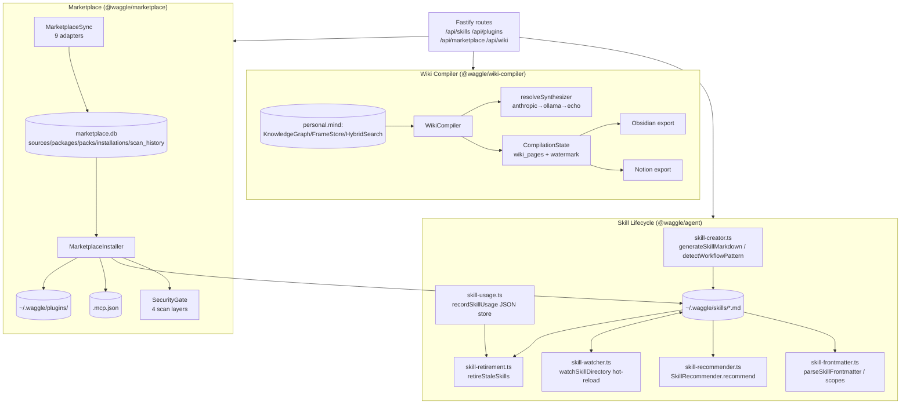

# Subsystem 05g — Skills Lifecycle · Marketplace · Wiki-Compiler

**Purpose.** This subsystem covers everything a user installs, authors, recommends, retires, browses-and-buys, and compiles-into-knowledge. It spans three packages — `@waggle/agent` (skill lifecycle helpers), `@waggle/marketplace` (the package catalog + installer + security gate), and `@waggle/wiki-compiler` (turns memory frames into an interlinked wiki) — all exposed to the frontend through Fastify routes under `/api/skills/*`, `/api/plugins/*`, `/api/marketplace/*`, and `/api/wiki/*`. **Strategically, skills + connectors are the paid-tier upgrade trigger:** custom skills and the marketplace are gated to PRO and above (`customSkills: false` on FREE, `requireTier('PRO')` on install/publish), while Memory + Harvest + the wiki stay free.

---

## 1. Mental Model

A **skill** is a Markdown file (`~/.waggle/skills/{name}.md`) with optional YAML frontmatter. Its content is injected into the agent's system prompt. Skills have a full lifecycle: authored/templated → recommended in context → usage-tracked → auto-retired when idle → hot-reloaded when the file changes on disk.

The **marketplace** is a local SQLite catalog (`~/.waggle/marketplace.db`) of three installable package kinds — `skill`, `plugin`, `mcp` — synced from ~30 external sources (GitHub, npm, ClawHub, SkillsMP, LobeHub, awesome-lists, web registries). Installing a package runs a multi-layer **SecurityGate** scan, then writes files to `~/.waggle/skills/`, `~/.waggle/plugins/`, or `.mcp.json`.

The **wiki-compiler** reads the personal memory substrate (FrameStore + KnowledgeGraph + HybridSearch) and produces five page types (entity / concept / synthesis / index / health) as Markdown, persisted to a `wiki_pages` SQLite table, with incremental compilation via a frame-ID watermark and exporters to Obsidian and Notion.



---

## 2. Skill Frontmatter & Scopes (`packages/agent/src/skill-frontmatter.ts`)

Skills may begin with a `---`-delimited YAML-ish block. The parser is hand-rolled (no YAML dependency): it handles top-level `key: value` pairs plus a nested `permissions:` block.

### `SkillFrontmatter`

| Field | Type | Nullable | Meaning |
|---|---|---|---|
| `name` | `string` | yes | Display name |
| `description` | `string` | yes | One-line description |
| `scope` | `SkillScope` | yes | Where the skill is available. Defaults to `'personal'` when omitted |
| `promoted_from` | `SkillScope[]` | yes | Audit trail of prior scopes; appended on each promotion, never rewritten |
| `permissions` | `Partial<{fileSystem, network, codeExecution, externalServices, secrets, browserAutomation: boolean}>` | yes | Declared permission flags |

### `SkillScope` & promotion chain

`type SkillScope = 'personal' | 'workspace' | 'team' | 'enterprise'`. The ordered constant `SKILL_SCOPE_ORDER` drives one-step-at-a-time promotion (demotion is NOT supported).

| Export | Signature | Behavior |
|---|---|---|
| `parseSkillFrontmatter` | `(content: string) => ParsedSkill` | Returns `{ frontmatter, body }`. If no leading `---` or no closing `\n---`, returns empty frontmatter + full content as body |
| `nextScope` | `(current: SkillScope) => SkillScope \| null` | Next scope up, or `null` at `enterprise` |
| `serializeFrontmatter` | `(fm: SkillFrontmatter, body: string) => string` | Rebuilds a `SKILL.md` string preserving scope + `promoted_from`; used by `promote_skill` to write the change to disk |

`ParsedSkill` = `{ frontmatter: SkillFrontmatter; body: string }`.

> Note: the **server-side** skill loader (`loadSkills` in `prompt-loader.ts`) does NOT parse frontmatter — it loads each `.md` file as `{ name, content }` (trimmed). Frontmatter parsing is used by promotion/validation paths, not by the prompt-injection path.

---

## 3. Skill Creation (`packages/agent/src/skill-creator.ts`)

### `SkillTemplate`

| Field | Type | Meaning |
|---|---|---|
| `name` | `string` | Human name (kebab-cased on output) |
| `description` | `string` | Description line |
| `triggerPatterns` | `string[]` | Phrases that should activate the skill |
| `steps` | `string[]` | Ordered procedure |
| `tools` | `string[]` | Tools the skill uses |
| `category` | `string` | Free-form category |

| Export | Signature | Behavior |
|---|---|---|
| `generateSkillMarkdown` | `(template: SkillTemplate) => string` | Emits a valid `SKILL.md` with `---name/description---` frontmatter, then `# Title`, optional `## Trigger Patterns`, `## Steps` (numbered), `## Tools Used`, `## Category`. Name is kebab-cased. Output is compatible with `validateSkillMd` (`@waggle/sdk`) and `parseSkillFrontmatter` |
| `detectWorkflowPattern` | `(messages: Array<{role, content, toolsUsed?}>) => SkillTemplate \| null` | Mines session history for a repeatable tool sequence. Requires ≥6 messages and ≥3 tools; finds a 3-5-tool window repeated ≥2×; infers name (`tool-then-tool-then-tool`), description, trigger patterns (first 3 user msgs truncated to 80 chars), and a category via `inferCategory` (keyword map → research/coding/knowledge/writing/planning/general) |

---

## 4. Skill Recommendation (`packages/agent/src/skill-recommender.ts`)

A keyword/synonym/bigram + TF-IDF scorer that suggests installed skills relevant to a conversation context. No embeddings — pure lexical.

### Types

```
SkillRecommendation = { skillName: string; reason: string; relevanceScore: number /* 0-1 */ }
SkillRecommenderDeps = { getSkills: () => Array<{name, content}>; activeSkills?: string[] }
```

`class SkillRecommender(deps)` → `recommend(context: string, topN = 3): SkillRecommendation[]`.

**Scoring weights** (multiplied by an IDF weight `log(totalDocs/df)+1`, rarer terms score higher):

| Signal | Weight |
|---|---|
| Exact keyword in skill name | `3×` |
| Synonym match in name | `2×` |
| Exact keyword in content (× small TF boost, capped) | `1×` |
| Synonym match in content | `0.7×` |
| Bigram (phrase) overlap in combined text | `+0.5` flat per bigram |

Score normalized against `keywords.length * 3`, capped at 1.0, rounded to 3 decimals; results `< 0.05` dropped. Active skills (`deps.activeSkills`) are excluded. There are 13 hardcoded `SYNONYM_CLUSTERS` (review/code/write/research/plan/decide/risk/meeting/brainstorm/task/team/explain/retrospective) and a STOP_WORDS set. The `reason` string is human-readable, e.g. `Skill name matches your topic: "review"`.

---

## 5. Skill Usage Tracking (`packages/agent/src/skill-usage.ts`)

A standalone JSON sidecar store at `~/.waggle/skill-usage.json` (NOT SQLite). Atomic writes (`.{pid}.tmp` + rename). Missing/corrupt file ⇒ `{}`.

**Schema:** `Record<skillStem, { lastUsedAt: ISOstring; count: number }>` (`SkillUsageIndex` / `SkillUsageEntry`).

| Export | Signature | Behavior |
|---|---|---|
| `getSkillUsagePath` | `(waggleHome) => string` | `{waggleHome}/skill-usage.json` |
| `loadSkillUsage` | `(waggleHome) => SkillUsageIndex` | `{}` on any FS/parse failure |
| `saveSkillUsage` | `(waggleHome, index) => void` | Atomic write; mkdirs home if absent |
| `recordSkillUsage` | `(waggleHome, skillName, nowFn?) => SkillUsageEntry` | Sets `lastUsedAt=now`, increments `count` |
| `forgetSkillUsage` | `(waggleHome, skillName) => void` | Deletes the entry (called after retirement) |

---

## 6. Skill Retirement / Decay (`packages/agent/src/skill-retirement.ts`)

Walks `~/.waggle/skills/` and **moves** (not deletes) skills idle longer than `maxIdleDays` (default **90**) into `~/.waggle/skills-archive/` with a timestamp-prefixed filename. Recoverable; clears the usage entry on success.

**Retirement rules:** only personal-scope skills auto-retire (team/enterprise are co-owned → admin-only; workspace skills are left alone). "Last activity" = `skill-usage.json` timestamp, falling back to the file's mtime (so a never-used skill's decay window starts at install time). On stat error, assumed fresh (no over-retirement).

```
RetireOptions = { maxIdleDays?=90; dryRun?=false; now?: ()=>Date; improvementSignals?: ImprovementSignalStore }
RetireReport = { scanned: number; retired: string[]; archived: string[]/*abs paths*/;
                 skipped: Array<{name, reason}>; dryRun: boolean }
```

`retireStaleSkills(waggleHome, opts?) => RetireReport`. Best-effort per file (never throws on one bad file). When `improvementSignals` is provided, emits a `workflow_pattern` signal `retire:{skillName}` for observability.

---

## 7. Skill Hot-Reload Watcher (`packages/agent/src/skill-watcher.ts`)

Uses Node's built-in `fs.watch()` (not chokidar — keeps the Tauri binary small) on a single directory, filtered to `.md` direct children, with a **150 ms debounce** (editors emit 2-3 events per save). Creates the dir if missing; silently no-ops if `fs.watch` throws on the platform.

```
SkillWatcherOptions = { onChange: (changedFiles: string[]) => void; debounceMs?=150 }
SkillWatcherHandle = { close(): void /* idempotent */ }
watchSkillDirectory(dir, opts) => SkillWatcherHandle
```

Callback errors are swallowed so they never kill the watcher.

---

## 8. Skills/Plugins/Hooks HTTP API (`packages/server/src/local/routes/skills.ts`)

Base dir: `server.localConfig.dataDir || ~/.waggle`. Skills live in `{home}/skills/`, plugins in `{home}/plugins/`. On first run with an empty skills dir, **starter skills auto-install** (marker file `.starter-installed`). Every skill mutation (`POST`/`PUT`/`DELETE`) reloads `server.agentState.skills` in place and writes through `redactSkillContent` (strips secrets + user-home paths) and `computeSkillHash` (change detection). Skill writes apply path-traversal guards (`name` may not contain `..`, `/`, `\`, or spaces).

### Skills

| Method | Full path | Request | Response | Stream? |
|---|---|---|---|---|
| `GET` | `/api/skills` | — | `{ skills: [{name, length, preview(200ch)}], count, directory }` | no |
| `GET` | `/api/skills/:name` | path param | `{ name, content }` · 404 if missing · 400 on traversal | no |
| `POST` | `/api/skills` | `{ name, content }` | `{ ok, name, path }` · 400 on bad name | no |
| `POST` | `/api/skills/create` | `{ name, description, steps[], tools?, category? }` | `{ success, path, registered, skill:{...} }`. Generates via `generateSkillMarkdown`, kebab-cases name, records audit | no |
| `PUT` | `/api/skills/:name` | `{ content }` | `{ ok, name }` · 404 if missing | no |
| `DELETE` | `/api/skills/:name` | path param | `{ ok, name }` · 404 if missing | no |
| `GET` | `/api/skills/suggestions` | `?context=&topN=` | `{ suggestions: SkillRecommendation[], count }` · 400 if no context. Uses `SkillRecommender` | no |
| `GET` | `/api/skills/hash-status` | — | `server.skillHashStore.checkAll(...)` — which skills changed on disk | no |
| `POST` | `/api/skills/test` | `{ skillName, testInput? }` | Sandbox/dry-run: `{ skill:{...metadata}, wouldInject, wouldInjectLength, testPreview? }`. Parses frontmatter, shows what would be injected into the prompt without executing | no |

### Starter Pack & Capability Packs (built-in, from `@waggle/sdk`)

| Method | Full path | Request | Response |
|---|---|---|---|
| `POST` | `/api/skills/starter-pack` | — | `{ ok, installed[], count }` — install ALL starter skills |
| `GET` | `/api/skills/starter-pack/catalog` | — | `{ skills:[{id,name,description,family,familyLabel,state,isWorkflow}], families:[{id,label}] }`. `state` ∈ `active`/`installed`/`available` |
| `POST` | `/api/skills/starter-pack/:id` | path param | `{ ok, skill:{id,name,state} }` · 404/409 on missing/exists. Assesses trust + records audit |
| `GET` | `/api/skills/capability-packs/catalog` | — | `{ packs:[{...pack, skillStates, packState(available/incomplete/complete), installedCount, totalCount}] }` |
| `POST` | `/api/skills/capability-packs/:id` | path param | `{ ok, pack:{id,name}, installed[], skipped[], errors? }` — installs every skill in the pack |

The 17 known starter skills map to 7 capability **families** (`SKILL_FAMILIES`): writing, research, decision, planning, communication, code, creative. Three are multi-agent workflow skills (`WORKFLOW_SKILLS`): `research-team`, `review-pair`, `plan-execute`.

### Install Audit

| Method | Full path | Request | Response |
|---|---|---|---|
| `GET` | `/api/audit/installs` | `?limit=` (≤100) | `{ entries:[{id,timestamp,capabilityName,capabilityType,source,riskLevel,trustSource,approvalClass,action,initiator,detail}] }` |

### Plugins (managed by `PluginManager`)

| Method | Full path | Request | Response |
|---|---|---|---|
| `GET` | `/api/plugins` | — | `{ plugins[], count, directory }` |
| `POST` | `/api/plugins/install` | `{ sourceDir }` or `{ path }` | `{ ok, source }`. Hot-reloads via `pluginRuntimeManager.register/enable`. Called by `MarketplaceInstaller.notifyServer()` |
| `DELETE` | `/api/plugins/:name` | path param | `{ ok, name }` |
| `GET` | `/api/plugins/:name/tools` | path param | `{ pluginName, tools:[{name,description,parameters,hasImplementation,implPath,content}], toolsDir }` |
| `GET` | `/api/plugins/:name/tools/:toolName` | path | `{ exists, content, path }` — returns a generated template if no impl exists |
| `PUT` | `/api/plugins/:name/tools/:toolName` | `{ content }` | `{ ok, path, toolName }` — must `export` an `execute()` function; hot-reloads |
| `POST` | `/api/plugins/:name/tools` | `{ name, description, parameters? }` | `{ ok, tool, totalTools }` — appends tool decl to `plugin.json` · 409 if exists |
| `DELETE` | `/api/plugins/:name/tools/:toolName` | path | `{ ok, deleted }` · 404 if missing |

### Hooks (deny-rules at `~/.waggle/hooks.json`)

| Method | Full path | Request | Response |
|---|---|---|---|
| `GET` | `/api/hooks` | — | `{ rules:[{type,tools[],pattern}], total }` |
| `POST` | `/api/hooks` | `{ type:'deny', tools[], pattern }` | `{ ok, rules }` · 400 on bad shape |
| `DELETE` | `/api/hooks/:index` | path index | `{ ok, rules }` · 404 if out of range |

---

## 9. Marketplace Data Model (`packages/marketplace/src/types.ts`, `db.ts`)

SQLite DB at `~/.waggle/marketplace.db` via better-sqlite3 (WAL, `foreign_keys=ON`). FTS5 full-text index `packages_fts` joined on `packages.id = fts.rowid`. Auto-migrations on construct add `is_custom` and `sync_state` columns to `sources`. The `MarketplaceDB` constructor seeds the MCP registry **only** on non-empty DBs.

### Table: `sources` → `MarketplaceSource`

| Column | Type | Null | Meaning |
|---|---|---|---|
| `id` | number | no | PK |
| `name` | string | no | Internal key (e.g. `clawhub`) |
| `display_name` | string | no | UI label |
| `url` | string | no | Source URL |
| `source_type` | enum | no | `marketplace`/`registry`/`github_org`/`community_repo`/`curated_list`/`aggregator`/`npm_registry`/`official_marketplace`/`commercial_marketplace`/`tool`/`specification` |
| `platform` | string | no | e.g. `waggle` |
| `total_packages` | number | no | Cached count |
| `install_method` | enum | no | `npm`/`git_clone`/`download`/`api_fetch`/`cli`/`manual` |
| `api_endpoint` | string | yes | Sync endpoint |
| `description` | string | no | — |
| `last_synced_at` | string | yes | ISO |
| `is_custom` | boolean | no | User-added (vs built-in seed). Only `is_custom` sources are deletable |
| `sync_state` | TEXT(JSON) | yes | Resumable-pagination cursor (migration column) |

### Table: `packages` → `MarketplacePackage`

| Column | Type | Null | Meaning |
|---|---|---|---|
| `id` | number | no | PK |
| `source_id` | number | no | FK → sources |
| `name` | string | no | Unique within source (`UNIQUE(name, source_id)`) |
| `display_name` | string | no | UI name |
| `description` | string | no | — |
| `author` | string | no | — |
| `package_type` | enum | no | `skill`/`plugin`/`mcp_server`/`template`/`pack` |
| `waggle_install_type` | enum | no | `skill`/`plugin`/`mcp` — drives installer dispatch |
| `waggle_install_path` | string | no | e.g. `skills/x.md`, `plugins/x/`, `.mcp.json` |
| `version` | string | no | semver |
| `license` | string | yes | SPDX |
| `repository_url` | string | yes | — |
| `homepage_url` | string | yes | — |
| `downloads` | number | no | popularity sort |
| `stars` | number | no | popularity sort |
| `rating` | number | no | — |
| `rating_count` | number | no | — |
| `category` | string | no | one of `PACKAGE_CATEGORIES` ids |
| `subcategory` | string | yes | — |
| `install_manifest` | JSON | yes | `InstallManifest` (see below) — parsed on read |
| `platforms` | JSON string[] | no | — |
| `min_waggle_version` | string | yes | — |
| `dependencies` | JSON string[] | no | — |
| `packs` | JSON string[] | no | — |
| `created_at` / `updated_at` | string | no | ISO |

**Security columns** (added by the installer's `recordScanResult()`, optional; type `PackageSecurityColumns`): `security_status` (`unscanned`/`clean`/`low`/`medium`/`high`/`critical`), `security_score` (number), `last_scanned_at`, `content_hash`, `scan_engines` (JSON), `scan_findings` (JSON), `scan_blocked` (0/1). A package augmented with these is `ScannedPackage`.

### Table: `packs` + `pack_packages` → `MarketplacePack`

| Column | Type | Null | Meaning |
|---|---|---|---|
| `id` | number | no | PK |
| `slug` | string | no | Stable key (used by `/packs/:slug`) |
| `display_name` | string | no | — |
| `description` | string | no | — |
| `target_roles` | string | no | comma-sep role hints |
| `icon` | string | no | emoji |
| `priority` | enum | no | `core`/`recommended`/`optional` |
| `connectors_needed` | JSON string[] | no | — |
| `created_at` | string | no | — |

`pack_packages` is the many-to-many join (`pack_id`, `package_id`, `is_core`); `package_tags` exists for tag dedup.

### Table: `installations` → `Installation`

| Column | Type | Null | Meaning |
|---|---|---|---|
| `id` | number | no | PK |
| `package_id` | number | no | FK → packages |
| `installed_version` | string | no | — |
| `installed_at` | string | no | `datetime('now')` |
| `install_path` | string | no | where it landed |
| `status` | enum | no | `installed`/`updating`/`failed`/`uninstalled` |
| `config` | JSON | no | user settings — parsed on read |

`listInstallations()` returns the flat `InstalledPackageRow` (installation columns + `pkg_name`, `pkg_display_name`, `waggle_install_type`, `category`) — NOT a nested object.

### Table: `scan_history`

One row per scan (`package_id`, `scanned_at`, `overall_severity`, `security_score`, `content_hash`, `engines_used`, `findings`, `blocked`, `scan_duration_ms`, `triggered_by`).

### `InstallManifest` (stored as JSON on `packages.install_manifest`)

| Field | For | Meaning |
|---|---|---|
| `skill_url` / `skill_content` | skill | fetch URL or inline content |
| `plugin_manifest` (`PluginManifest`) / `git_url` | plugin | manifest to write / repo to clone |
| `mcp_config` (`McpServerConfig`) | mcp | `{ name, command, args[], env? }` |
| `npm_package` / `npm_args` | mcp/plugin | npm install target |
| `post_install` (`PostInstallHook[]`) | any | `run_command`/`create_file`/`append_config` |

`PluginManifest = { name, version, description, skills?[], mcpServers?[], settingsSchema?: Record<string, SettingField> }`; `SettingField = { type:'string'|'number'|'boolean', description, required?, default? }`.

### Search contract (`SearchOptions` → `SearchResult`)

`SearchOptions = { query?, type?, category?, pack?, source?, sort?: 'relevance'|'popular'|'recent'|'name', limit?=50, offset?=0 }`. Raw query is relaxed by `toFtsMatchQuery()` into an OR-of-prefix FTS5 expression (≥2-char tokens, capped at 24, `token*`); null ⇒ unfiltered listing fallback (never throws).

`SearchResult = { packages: MarketplacePackage[]; total; facets: { types, categories, sources: Record<string,number> }; installedCount }`.

---

## 10. Marketplace Installer (`packages/marketplace/src/installer.ts`)

`class MarketplaceInstaller(db, securityConfig?)`. Ensures `~/.waggle/skills/`, `~/.waggle/plugins/`, and `plugins/registry.json` exist on construct. Install flow:

1. Resolve package by id (404-style failure result if missing).
2. Skip if already installed and not `force`.
3. **SecurityGate pre-scan** of resolved content; record result to DB. If `scanResult.blocked` and not `forceInsecure` → return `success:false` with findings.
4. Dispatch on `waggle_install_type`:
   - **skill** → write to `~/.waggle/skills/{name}.md` (inline content, `skill_url`, repo `SKILL.md`, or a generated stub), then `PUT /api/skills/{name}` to notify the server.
   - **plugin** → `git clone` or `npm install` into `~/.waggle/plugins/{name}/`, write `plugin.json`, install bundled skills, update `registry.json`, run post-install hooks, then `POST /api/plugins/install`.
   - **mcp** → optional global npm install, inject user settings into env vars, write into `.mcp.json` (`mcpServers[name]`).
5. On success, `recordInstallation(...)` and attach the scan result.

`InstallRequest = { packageId, installPath?, settings?, force?, forceInsecure? }`; `InstallResult = { success, packageId, packageName, installType, installPath, message, errors?, scanResult? }`. Pack install (`installPack(slug, {force?})`) loops package install and returns `PackInstallResult = { packSlug, packName, totalPackages, installed[], skipped[], failed[] }`. Also: `uninstall(id)`, `scanOnly(id) => ScanResult|null`, `getSecurityReport(id) => string`.

`MarketplaceInstaller.notifyServer()` posts to `WAGGLE_API_URL || http://localhost:3000`; failures are swallowed (files already on disk).

---

## 11. SecurityGate (`packages/marketplace/src/security.ts`) — the install gate

Four scan layers, run before any file is written. `block_threshold` defaults to **HIGH** (CRITICAL + HIGH block by default).

| Layer | Engine id | What |
|---|---|---|
| 1 | `gen_trust_hub` | Cloud URL pre-check (POST `https://ai.gendigital.com/api/scan/lookup`, 15s timeout, fail-open) |
| 2 | `cisco_skill_scanner` | Local deep scan of skill content via optional `skill-scanner` CLI / `cisco-scanner.ts` adapter |
| 3 | `mcp_guardian` | Pattern scan of MCP tool descriptions (optional `mcp-guardian` npm dep, else built-in `mcpPatternScan` fallback) |
| 4 | `waggle_heuristics` | Always-on regex rules `WAG-001..013` on content |

**Severity → score:** CRITICAL=0, HIGH=25, MEDIUM=60, LOW=85, CLEAN=100. Results SHA-256-hashed + cached for 24 h under `~/.waggle/security-cache/`.

`ScanResult = { package_name, package_type, scanned_at, overall_severity: Severity, security_score(0-100), findings: SecurityFinding[], engines_used: SecurityEngine[], content_hash, blocked, scan_duration_ms, ciscoScanResult? }`. `SecurityFinding = { rule_id, severity, category, title, description, location?, engine }`. `SecurityCategory` ∈ prompt_injection / data_exfiltration / malicious_code / privilege_escalation / suspicious_network / obfuscation / sensitive_path_access / tool_poisoning / cross_origin_escalation / rug_pull / untrusted_source. Built-in heuristics catch system-prompt manipulation, exfil commands, sensitive-path access (incl. `~/.waggle/*.mind`), code-exec patterns, credential harvesting, network beaconing, tool poisoning, hidden/zero-width content, supply-chain and cross-origin skill modification. `formatReport(result)` renders a human-readable text report.

---

## 12. Marketplace Sync (`packages/marketplace/src/sync.ts`)

`class MarketplaceSync(db, vaultLookup?)` → `syncAll(opts?: SyncOptions) => SyncResult[]`. Nine adapters, tried in priority order (first `canSync()` wins): `clawhub`, `skillsmp`, `lobehub`, `awesome-list`, `github-repo-content`, `npm-search`, `web-registry`, `github` (orgs/official), `generic`. Resumable pagination via `sources.sync_state` (429 → save cursor, return gracefully). After a full sync, `deduplicatePackages(db)` collapses normalized-name dupes (keeps highest `stars+downloads`). Vault keys for premium sources: `marketplace:source:{name}:api_key`.

`SyncOptions = { sources?, fullRefresh?, dryRun?, scanDuringSync?=false }`; `SyncResult = { source, added, updated, removed, errors[] }`. Exported helpers: `parseAwesomeListMarkdown`, `parseNpmSearchResults`, `normalizeName`, `deduplicatePackages`.

### Categories & MCP registry & enterprise packs

- `categories.ts`: 21 `PACKAGE_CATEGORIES` (`{id,name,icon,description}`) + `categorizePackage(name, desc)` keyword classifier + `recategorizeAll(db)`.
- `mcp-registry.ts`: `MCP_SERVERS: McpServerEntry[]` + `seedMcpServers(db)` (seeds curated MCP packages with real install manifests).
- `enterprise-packs.ts`: `ENTERPRISE_PACKS: EnterprisePack[]` (3 KVARK-conditional packs: enterprise-document-qa, compliance-workflow, knowledge-graph-enrichment) — only surfaced when KVARK is connected. `EnterprisePack = { slug, display_name, description, target_roles, icon, skills[], kvarkRequirements[] }`.

---

## 13. Marketplace HTTP API (`packages/server/src/local/routes/marketplace.ts`)

DB handle from `fastify.marketplace` (503 `Marketplace not available` if absent). **Tier gating** marks the upgrade triggers.

| Method | Full path | Request | Response | Tier gate | Stream? |
|---|---|---|---|---|---|
| `GET` | `/api/marketplace/search` | `?query=&type=&category=&pack=&source=&sort=&limit=&offset=` | `SearchResult` + each pkg annotated with `installed`, `scanStatus`(passed/failed/not_scanned/unavailable), `scanScore`; plus `categories` | — | no |
| `GET` | `/api/marketplace/packs` | — | `{ packs, total }` | — | no |
| `GET` | `/api/marketplace/packs/:slug` | path | `{ pack, packages[] }` · 404 | — | no |
| `GET` | `/api/marketplace/enterprise-packs` | — | `{ packs, total, kvarkRequired }` (empty + hint if KVARK not configured) | **ENTERPRISE** | no |
| `POST` | `/api/marketplace/install` | `{ packageId, installPath?, settings?, force?, forceInsecure? }` | `InstallResult` + `security:{severity,score,findingsCount,findings,warnings?}`; CRITICAL→403, HIGH→403 unless `force`, MEDIUM/LOW→proceeds-with-audit. 200 on success / 422 on failure | **PRO** | no |
| `POST` | `/api/marketplace/uninstall` | `{ packageId }` | `InstallResult` (200/422) | — | no |
| `GET` | `/api/marketplace/installed` | — | `{ installations: InstalledPackageRow[], total }` | — | no |
| `POST` | `/api/marketplace/security-check` | `{ packageId }` | `{ packageId, severity, score, blocked, enginesUsed, findingsCount, findings, durationMs, contentHash }` · 404 | — | no |
| `GET` | `/api/marketplace/sources` | — | `{ sources: (MarketplaceSource & {package_count})[], total }` | — | no |
| `POST` | `/api/marketplace/sources` | `{ name, url, displayName? }` | `201 { source, syncResult }`; auto-detects `source_type`, triggers an immediate sync · 400/409 | — | no |
| `DELETE` | `/api/marketplace/sources/:id` | path | `{ deleted, sourceId, name }` · 403 if built-in · 404 | — | no |
| `GET` | `/api/marketplace/categories` | — | `{ categories: PACKAGE_CATEGORIES, total }` | — | no |
| `POST` | `/api/marketplace/sync` | `{ sources? }` | `{ sourcesChecked, packagesAdded, packagesUpdated, errors[], details: SyncResult[] }`; emits a notification on new packages | — | no |
| `GET` | `/api/marketplace/security-status` | — | `{ ciscoScannerAvailable, jsSecurityGateVersion, totalScanned, totalPassed, totalFailed, hint? }` | — | no |
| `POST` | `/api/marketplace/publish` | `{ skillName }` | `201 { success, packageId, skillName, metadata, security }`; reads `~/.waggle/skills/{name}.md`, validates frontmatter (`validateSkillMd`), SecurityGate scan (403 if blocked), upserts under a `user-published` source | **PRO** | no |

The install/check routes construct a heuristics-only `SecurityGate` (cloud/cisco/guardian layers disabled at the route level for speed).

---

## 14. Wiki-Compiler Data Model (`packages/wiki-compiler/src/types.ts`, `state.ts`)

State lives in the **personal mind** SQLite DB (`@waggle/core` `MindDB`) — same DB as memory, not a separate file. `class CompilationState(db)` ensures two tables on construct.

### Table: `wiki_pages` → `PageRecord`

| Column | Type | Null | Meaning |
|---|---|---|---|
| `slug` | TEXT | no | PK (URL-safe) |
| `page_type` | TEXT | no | `entity`/`concept`/`synthesis`/`index`/`health` |
| `name` | TEXT | no | Display name |
| `content_hash` | TEXT | no | SHA-256(16-char) — change detection |
| `markdown` | TEXT | no | Full page body (migration-added column) |
| `frame_ids` | TEXT | no | JSON `number[]` of source frame IDs |
| `compiled_at` | TEXT | no | `datetime('now')` |
| `source_count` | INTEGER | no | distinct sources |
| `notion_page_id` | TEXT | yes | M-13 Notion export delta tracking (migration column) |

`upsertPage(...)` returns `{ action: 'created' | 'updated' | 'unchanged' }` — `unchanged` when `content_hash` matches (the incremental-compile no-op).

### Table: `wiki_watermark` → `CompilationWatermark`

Single-row (`id=1 CHECK`): `last_frame_id`, `last_compiled_at`, `pages_compiled`. `getMaxFrameId()` reads `MAX(id)` from `memory_frames`; `getFramesSince(id, limit)` pulls newer frames for the incremental "does this entity get mentioned in new frames?" check.

### Page frontmatter (`WikiPageFrontmatter`)

`{ type, name, entity_type?, confidence: number, sources: number, last_compiled: ISO, frame_ids: number[], related_entities: string[] }`. A `WikiPage` = `{ slug, frontmatter, markdown, contentHash }`.

---

## 15. Wiki Compilation (`packages/wiki-compiler/src/compiler.ts`)

`class WikiCompiler(kg, frames, search, state, config)` where `CompilerConfig = { synthesize: (prompt)=>Promise<string>; outputDir?='wiki'; minFramesPerPage?=2; maxFramesPerCall?=30; minConfidence?=0.3 }`.

| Method | Page type | How it builds |
|---|---|---|
| `compileEntityPage(entity)` | entity | HybridSearch on `entity.name`, gather frames + KG in/out relations; LLM via `entityPagePrompt`. Returns `null` if `< minFramesPerPage`. Confidence: >5 frames→0.9, >2→0.7, else 0.5 |
| `compileConceptPage(name)` | concept | Search on concept + `kg.searchEntities`; `conceptPagePrompt`. Confidence 0.85/0.6 |
| `compileSynthesisPage(topic)` | synthesis | Search 2× frames, group by `frame.source`; **needs ≥2 sources** else `null`. `synthesisPagePrompt` finds cross-source patterns/contradictions. slug = `synthesis-{topic}`. Confidence 0.85/0.65 |
| `compileIndex()` | index | Navigable catalog of all pages grouped by type with `[[wikilinks]]` |
| `compileHealth()` | (report) | See §16 |
| `compile({incremental?=true, concepts?})` | all | Orchestrates: entity pages (≤200 entities, skipping ones with no new frame mentions when incremental) → concept pages (`detectConcepts` or supplied) → synthesis pages → index → update watermark → health check |

`compile()` returns `CompilationResult = { pagesCreated, pagesUpdated, pagesUnchanged, entityPages[], conceptPages[], synthesisPages[], healthIssues, watermark, durationMs }`. Export helpers: `exportToMarkdown(): Map<slug,markdown>` and `exportToDirectory(dir)`. The three prompt builders live in `prompts.ts` and each instruct the LLM to cite frame IDs and output ONLY the body (frontmatter is added by `buildFrontmatter`).

---

## 16. Wiki Health Report (`compileHealth()` → `HealthReport`)

| Field | Type | Meaning |
|---|---|---|
| `totalEntities` | number | KG entity count |
| `totalFrames` | number | `frames.getStats().total` |
| `totalPages` | number | wiki_pages rows |
| `coverage` | number (0-1) | entity pages / compilable entities (entity with ≥1 relation OR type person/project); UI renders as % |
| `stalePageCount` | number | pages flagged `stale_page` |
| `issues` | `HealthIssue[]` | see below |
| `dataQualityScore` | number (0-100) | heuristic: entities(20) + frames(20/10) + pages(20/10) + 40 − 10×high-severity-issues |
| `compiledAt` | ISO | — |

`HealthIssue = { type: HealthIssueType, severity:'high'|'medium'|'low', description, entity?, frameIds?, suggestion? }`. `HealthIssueType` ∈ `contradiction` / `gap` / `orphan_entity` / `weak_confidence` / `stale_page` / `missing_page`. Detection: missing-page (KG entity with no page that has relations or is person/project), weak_confidence (<2 sources), orphan_entity (no relations at all), stale_page (compiled >30 days ago AND newer frames exist overall).

---

## 17. Wiki Synthesizer Resolution (`synthesizer.ts`)

`resolveSynthesizer(config?) => { synthesize: LLMSynthesizeFn; provider: 'anthropic'|'ollama'|'echo'; model }`. Priority chain:

1. **Anthropic** Haiku (`claude-haiku-4-5-20251001`) — if `ANTHROPIC_API_KEY` / `WAGGLE_ANTHROPIC_API_KEY` present and SDK importable.
2. **Ollama** — if `WAGGLE_OLLAMA_URL` reachable (`/api/tags` health check); model `WAGGLE_OLLAMA_MODEL || llama3.2`.
3. **Echo** fallback — no LLM; returns a structured stub summarizing frame content (so the wiki still renders without a key).

`SynthesizerConfig = { anthropicApiKey?, ollamaUrl?, ollamaModel?, maxTokens?=1500 }`.

---

## 18. Wiki HTTP API (`packages/server/src/local/routes/wiki.ts`)

All routes operate on `server.multiMind.personal` (the personal mind DB). **Critical UX gate:** `/compile` and `/health` return **503 `no_real_embedder`** when `embeddingProvider.getActiveProvider() === 'mock'` — a mock embedder produces zero-vector relevance, so the wiki refuses to compile rather than silently producing broken pages.

| Method | Full path | Request | Response | Stream? |
|---|---|---|---|---|
| `GET` | `/api/wiki/pages` | — | `PageRecord[]` (all pages) | no |
| `GET` | `/api/wiki/pages/:slug` | path | `PageRecord` · 404 | no |
| `GET` | `/api/wiki/pages/:slug/content` | path | `{ slug, markdown }` · 404 | no |
| `POST` | `/api/wiki/compile` | `{ mode?: 'incremental'\|'full', concepts?: string[] }` | `CompilationResult` + `{ llmProvider, llmModel }` · **503** if mock embedder | no |
| `GET` | `/api/wiki/health` | — | `HealthReport` · **503** if mock embedder | no |
| `GET` | `/api/wiki/watermark` | — | `CompilationWatermark` | no |
| `POST` | `/api/wiki/export/obsidian` | `{ outDir }` (absolute) | `ObsidianExportResult { outDir, filesWritten, indexPath, byType }` · 400/409/500 | no |
| `POST` | `/api/wiki/export/notion` | `{ rootPageUrl }` | `NotionExportStats { byType, pagesCreated, pagesUpdated, pagesUnchanged, pagesFailed, errors[] }` · 400/503/409/500. Needs `notion-wiki-token` in Vault | no |

**Obsidian export** (`adapters/obsidian.ts`) writes `{outDir}/_index.md` + `{outDir}/{entity|concept|synthesis}/{slug}.md`, rewriting `[[Display Name]]` → `[[slug|Display Name]]`; no LLM, no state mutation, idempotent. **Notion export** (`adapters/notion.ts`) creates child pages under a root page id (delta-tracked via `notion_page_id` + `content_hash` through `NotionStateHelpers`), converting Markdown to Notion blocks. None of the wiki routes stream.

---

## 19. The Paid-Tier Upgrade Trigger (`packages/shared/src/tiers.ts`)

`TierCapabilities.customSkills` and `connectorLimit` are the levers. Memory, Harvest, and the wiki remain free.

| Tier | `customSkills` | `connectorLimit` | `teamSkillLibrary` | Marketplace install/publish |
|---|---|---|---|---|
| TRIAL | true | -1 (unlimited) | true | allowed (all unlocked 15 days) |
| FREE | **false** | 5 | false | blocked (built-in skills only) |
| PRO | true | -1 | false | allowed (`requireTier('PRO')`) |
| TEAMS | true | -1 | true | allowed |
| ENTERPRISE | true | -1 | true | allowed + enterprise packs |

The marketplace routes enforce this directly: `POST /api/marketplace/install` and `POST /api/marketplace/publish` carry `preHandler: [requireTier('PRO')]`; `GET /api/marketplace/enterprise-packs` carries `requireTier('ENTERPRISE')`. Header copy in `tiers.ts`: *"Skills/connectors are the upgrade trigger."*

---

## 20. Frontend Integration Cheat-Sheet

- **Install Center / Skills UI** → drive from `GET /api/skills/starter-pack/catalog` (state per skill) + `GET /api/skills/capability-packs/catalog`; install via the `POST .../:id` variants; live skills via `GET /api/skills`; preview-without-install via `POST /api/skills/test`; in-context suggestions via `GET /api/skills/suggestions?context=`.
- **Marketplace browser** → `GET /api/marketplace/search` returns packages already annotated with `installed` + `scanStatus` + `scanScore` and the full category list; faceted filters map 1:1 to query params; `GET /api/marketplace/categories` and `/sources` populate filter chips. Show an upgrade modal on `403`/tier errors from `/install`.
- **Security UI** → `scanStatus` per package + `GET /api/marketplace/security-status` for the global banner; `POST /api/marketplace/security-check` for an on-demand scan; findings carry `severity`/`category`/`title`/`description`/`location`.
- **Wiki app** → list with `GET /api/wiki/pages`, body with `/pages/:slug/content`, build with `POST /api/wiki/compile`, quality dashboard with `GET /api/wiki/health` (handle the `503 no_real_embedder` state with an "add an embedding key" prompt), freshness with `GET /api/wiki/watermark`, and the two export buttons.
