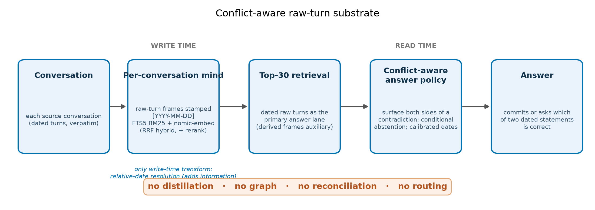
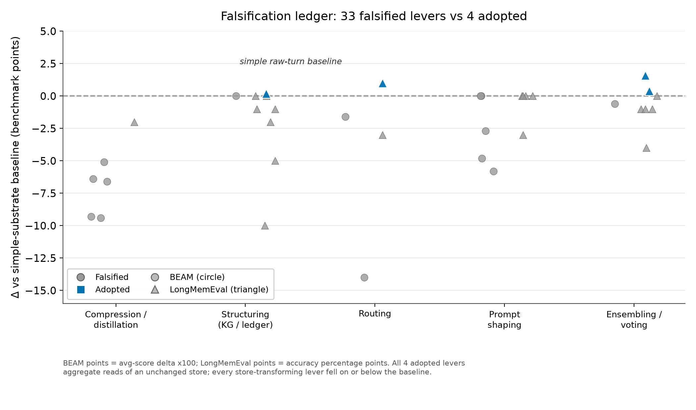

# Clever Memory Loses: A Single Simple Substrate Is State of the Art on LoCoMo, LongMemEval, and BEAM

**Author:** Marko Marković, KORRO / hive-mind
**Date:** 2026-07-09
**Status:** arXiv preprint, markdown master (LaTeX conversion later). Phase B-1 draft: core evidence sections only.

> Concept name threaded through the paper: **conflict-aware raw-turn memory**.

---

## 1. Abstract

Long-term conversational memory, answering questions over weeks of prior dialogue, is the load-bearing capability for durable AI assistants, and three benchmarks (LoCoMo, LongMemEval, and BEAM) are the field's rulers. Every published leader adds structure to the memory path: atomic-fact distillation, temporal knowledge graphs, write-time entity reconciliation, and learned routing. Our insight is that these transforms are lossy in exactly the way the benchmarks penalize, because distillation strips the dates and specifics the rubrics score and write-time reconciliation silently resolves the contradictions the rubrics want surfaced. We show that one simple substrate, conflict-aware raw-turn memory (per-conversation minds, verbatim dated raw-turn retrieval, and a conflict-preserving answer policy), is state of the art on all three under each incumbent's own published protocol: LoCoMo 86.49 against 81.95, LongMemEval 95.01 macro against 94.87, and BEAM 0.6482 average and 74.0 percent pass against 0.6409 and 70.1 percent. We then measured 37 constructive interventions that tried to make the substrate cleverer; 33 lost, and we report them as a first-class falsification ledger. The single differentiator is conflict-awareness, worth 23 points on BEAM's contradiction ability. Because the leaderboards mix macro and micro metrics and gpt-5 and gpt-4o judges, we reproduce each incumbent's pipeline before comparing and report against the most conservative protocol on the board. All protocols, per-question artifacts, and the empty-answer-heal disclosure are released.

## 2. Introduction

An assistant that cannot recall what its user said three weeks ago cannot be a durable collaborator, and the field has converged on a single strategy for fixing this: make the memory cleverer. Three benchmarks now operationalize long-term conversational memory and anchor a public leaderboard race. LoCoMo, LongMemEval, and BEAM each ask a model to answer questions over weeks or months of prior dialogue, and each has a published state-of-the-art system built on the same premise. That premise, rarely stated but visible in every design, is that better memory means cleverer memory: richer structure imposed on the memory path, learned routing into it, and test-time recombination layered on top. The frontier, on this view, is engineering more intelligence into the store.

The leaders differ in representation but agree on that premise completely. Mem0 distills dialogue into atomic facts and retrieves the closest matches; Zep and its Graphiti engine build a temporal knowledge graph with validity intervals; Memori stores timestamped subject-predicate-object triples; and the mem0 memory platform reconciles facts against the existing store at write time and renders them chronologically. Each system spends its engineering budget on the same two moves: transform the raw conversation into a smaller derived representation, and resolve contradictions before the answerer ever runs. The shared assumption is that a cleaner, smaller, reconciled store is a better store.

Yet each incumbent's own weakest ability traces directly back to its own cleverness. The mem0 platform's write-time reconciler, the mechanism that lets it update a follower count in place and score well on knowledge update, is the same mechanism that makes contradiction resolution its worst BEAM ability at 0.357: it has already deleted one side of the very conflict the benchmark asks it to surface. Fact distillation, which compresses the store, is also what strips the verbatim spans that fine-grained recall questions score. The cleverness and the weakness are not independent; the second is a direct cost of the first. This pattern raises a question the leaderboard race has not asked: what if the cleverness is the problem, and the memory path should stay dumb?

We answer that question by evaluating a deliberately dumb substrate against all three benchmarks under each incumbent's own published protocol, and it is state of the art on every one (Table 1). The substrate keeps the original dated conversation turns per conversation, retrieves them verbatim, and preserves contradictions instead of reconciling them; it distills nothing into a primary layer, builds no graph, and learns no router. More useful to practitioners than the three wins themselves, we then measured 37 constructive interventions that each tried to make this substrate cleverer, and we publish every result. The practical payoff is that the community can stop paying the distillation, graph, and routing tax that our measurements show is self-inflicted.

**Table 1. Headline: one substrate, three benchmarks, three state-of-the-art results, each under the incumbent's own protocol.**

| Benchmark | Best published incumbent | Ours | Delta |
|---|---|---|---|
| LoCoMo (1,540 Q) | Memori 81.95% | 86.49% | +4.54pp (z=4.64, p<0.00001) |
| LongMemEval-S (500 Q) | Mastra 94.87 macro | 95.01 macro / 93.60 micro | +0.14 macro |
| BEAM 1M (700 Q) | mem0 0.6409 avg / 70.1% pass | 0.6482 avg / 74.0% pass | +3.9pp pass (McNemar z=2.14, p≈0.03); +0.0073 avg (tie) |

This paper makes four contributions. First, three same-protocol state-of-the-art results from one memory substrate: LoCoMo 86.49 against 81.95, LongMemEval 95.01 macro against 94.87, and BEAM 0.6482 average and 74.0 percent pass against 0.6409 and 70.1 percent. Second, conflict-aware raw-turn memory as the named mechanism behind them, whose single differentiator, retaining both sides of a contradiction rather than reconciling at write time, delivers 23 points on BEAM's hardest ability. Third, the falsification ledger, a first-class negative-results artifact recording 37 interventions across two independent programs, of which 33 lost to the simple substrate. Fourth, an evaluation-protocol-fidelity methodology that reproduces each incumbent before comparing and that exposed the leaderboard-metric chaos, macro versus micro aggregation, gpt-5 versus gpt-4o judges, and README versus shipped protocols, against which every number in this paper is reported.

The enabling shift is that answerers can now read raw turns directly. Long-context models such as gpt-5 consume dozens of verbatim dated turns per question without the context pressure that once made distillation a practical necessity, which turns throwing the raw data away from a reasonable compression into an unforced error. In hindsight the result is almost obvious: you should not delete the data before the model reads it, and you should not resolve a contradiction the user is about to ask you about. Conflict-aware raw-turn memory is the Bitter Lesson applied to agent memory, where hand-engineered structure loses to a simple method that leverages the raw signal and the answerer's compute.

Section 4 specifies the substrate, Section 5 the protocol-fidelity methodology that makes the comparisons defensible, and Section 6 the three results. Section 7 presents the falsification ledger, Section 8 analyzes why the simple substrate wins and where it loses, and Sections 9 and 10 give limitations and conclusions.

## 3. Related Work

Memory-augmented agents on LoCoMo (Maharana et al., 2024) pursue distinct representations of past dialogue. Mem0 (Chhikara et al., 2025) extracts atomic facts and retrieves the top matches; Zep and its Graphiti engine (Rasmussen et al., 2025) build a temporal knowledge graph with validity intervals; LangMem (LangChain, 2025) maintains per-user profile summaries; and Memori (GibsonAI, 2025) stores timestamped subject-predicate-object triples, the prior state of the art at 81.95 percent. MemR3 (see References) is an agentic multi-round retrieval pipeline rather than a fixed memory store, so we class it separately and report it only for reference. Every one of these systems answers from a representation it derived from the conversation, not from the conversation itself.

On LongMemEval (Wu et al., 2024) the leaders are observation-based and reconciled-fact stores. Mastra's observational memory (Mastra, 2026) reports 94.87 macro under the official gpt-4o judge; the mem0 platform reports 93.4 but under a gpt-5 judge rather than the official one; Hindsight (2025, arXiv:2512.12818) reports 91.4 with a Gemini-3 Pro answerer; Supermemory (Supermemory, 2026) reports 85.4; and Letta, the descendant of MemGPT (Packer et al., 2023), roughly 83.2. The judge model varies across these entries and moves the headline by points, a divergence we take up in Section 5 and neutralize by holding the official judge fixed.

On BEAM (Tavakoli et al., 2026), the ICLR 2026 benchmark for very long horizons, the reference system is the mem0 memory platform. It ingests each conversation in two-turn chunks, reconciles every new fact against the existing store at write time with explicit ADD, UPDATE, and DELETE events, retrieves the top-200 dated facts, and renders them chronologically for the answerer, scoring 0.6409 average and 70.1 percent pass at one million tokens of history. This is the most aggressively engineered memory path of the three incumbents, and its write-time reconciliation is precisely the mechanism we decline to use.

These systems span graphs, profiles, triples, and reconciled facts, but they share two commitments. Every one makes a derived representation the primary answer substrate, and every one resolves contradictions at write time, collapsing conflicting statements into a single surviving value before any question is asked. None of them retains the raw dated turns as the primary substrate the answerer reads, and none preserves both sides of a contradiction for the answerer to surface. That shared pair of commitments is exactly what our substrate breaks.

Reporting what did not work has precedent in ablation studies and reproducibility efforts, and Sutton's Bitter Lesson (Sutton, 2019) is the conceptual precedent for the result itself: hand-engineered structure repeatedly loses to simple methods that leverage raw data and compute. Memory-systems papers, however, typically report only the surviving configuration, and no prior work evaluates a single substrate across LoCoMo, LongMemEval, and BEAM under each benchmark's own incumbent protocol. We do both: one substrate measured on all three, and a ledger of 37 interventions that failed to improve it.

---

## 4. The Substrate: Conflict-Aware Raw-Turn Memory

We store memory as a set of per-conversation minds, and each mind keeps the source dialogue as verbatim dated raw-turn frames next to a small set of optional typed derived frames. A mind is the memory of one conversation, nothing more; there is no global graph and no cross-conversation entity table. The typed frames follow a three-way I/P/B model: Information frames record what was stated, Preference frames record standing directives, and Belief frames record claims that can later be contradicted. Retrieval is hybrid and fully local: dense vectors from a local Ollama `nomic-embed-text` embedder fuse with FTS5 BM25 lexical search through reciprocal rank fusion, and an optional in-process cross-encoder reranks the top candidates. No memory content leaves the machine on the write path or the read path.

The answer context is built from dated verbatim raw turns retrieved per conversation, and this is where the substrate departs from every incumbent it beats. Mem0 answers from atomic facts, Zep from a temporal knowledge graph, Memori from timestamped triples, and mem0-platform from write-time-reconciled facts; each makes a derived representation the primary answer substrate. We instead render the retrieved raw turns as the primary lane, each turn stamped `[YYYY-MM-DD]` from the source anchor, and treat any derived frames as auxiliary rather than as the substrate. The model reads what the user actually said, in order, with the dates attached, before it reads anything the pipeline inferred.

We resolve relative dates at write time, and this is the one transform the substrate applies to stored content. A turn that says "I went hiking yesterday" inside a session dated 8 May 2023 is stored as an event on 7 May 2023, not on the session date, so a later "when did X happen" question reads the true event date rather than the discussion date. We keep this transform precisely because it adds information (the resolved absolute date the user implied) rather than removing it; every transform we tested that removes or restructures content lost, as Section 7 documents. On BEAM the date stamp comes from a `chat.json` sidecar map at a 100 percent hit rate, so every raw turn carries a correct calendar date without a distillation pass.

The substrate retains both sides of a contradiction rather than reconciling them, and this single decision is the mechanism behind the BEAM contradiction result. When a user states a follower count of 10 in one session and 15 in another, mem0's write-time reconciler emits an UPDATE or DELETE and one number survives in the fact store; the contradiction the benchmark asks about has already been erased before the answerer sees it. Our substrate stores both dated statements and leaves them both retrievable, and the answer policy states the contradiction, presents both statements with their dates, and asks which is correct. That behavior is exactly what BEAM's contradiction rubric rewards, and it is unavailable to any system that resolves conflicts at write time.

The substrate deliberately omits four mechanisms the field treats as progress, and the omissions are the design rather than an incomplete implementation. It does not distill raw turns into a dominant fact or observation layer, because distillation strips the dates, numbers, and verbatim spans the rubrics score. It does not build a knowledge graph as the answer substrate, because the graph reconciles and abstracts the same signal the answerer needs raw. It does not reconcile contradictions at write time, because write-time resolution silently deletes one side of exactly the conflicts benchmarks probe. It does not learn a router over the memory path, because retrieval abilities are not reliably identifiable from question text, as our falsified 40 percent classifier shows. Each omission is a place the incumbents spend engineering and lose accuracy.

The answer policy adds a few rules tuned to what the rubrics reward, not to prose quality, and two of them are the load-bearing differentiators. Rule one is conditional abstention: the model commits to a factual span whenever a supporting anchor exists and abstains only when the anchor is genuinely absent, which removes the wrongful abstentions that forfeit answerable questions. Rule two, the surface-contradiction rule, instructs the model to present both sides of a conflict with dates instead of silently preferring the more recent statement. A third rule, the anti-wrongful-IDK rule, treats explicit "never happened" or "not completed" statements as real information rather than as missing data. The policy also calibrates date granularity (an exact day only when one was stated) and commits to one option on either-or questions. On BEAM this is prompt v2, which is mem0's own answer prompt with only rules three and four changed.

The same substrate produces all three state-of-the-art results, and we obtain them by swapping only the protocol harness, never the memory engineering. LoCoMo runs a seven-lane assembler over the frame store under a gpt-4.1-mini answerer and judge; LongMemEval runs a routed dated-observation-plus-raw-turn store under a gpt-5-mini answerer and the official gpt-4o judge; BEAM runs the raw-turn lane at top-30 under a gpt-5 answerer and judge. The lanes activated differ with the protocol, but the core is fixed: per-conversation minds, dated raw turns as the primary substrate, contradictions retained, dates resolved at write time. Figure 1 shows this pipeline.

**Figure 1.** The conflict-aware raw-turn substrate, left to right. **Write time:** each source conversation becomes one per-conversation mind; every turn is stored verbatim as a dated raw-turn frame, its `[YYYY-MM-DD]` resolved from the session anchor (including relative references such as "yesterday"), and local LLM passes optionally add typed I/P/B frames without discarding the raw turns and without reconciling contradictions. **Read time:** hybrid retrieval (dense `nomic-embed` vectors fused with FTS5 BM25 by reciprocal rank fusion, optional cross-encoder rerank) draws the top-k dated raw turns as the primary answer lane, with derived frames as auxiliary lanes. **Answer policy:** retrieved turns render oldest-first, and the model applies the two rules the incumbents do not (surface both sides on contradiction, treat explicit "never happened" statements as information) plus conditional abstention and granularity-calibrated dates. The single write-time transform is relative-date resolution, which adds information; the substrate performs no distillation-as-primary, no graph construction, no write-time reconciliation, and no learned routing on the memory path.

---

## 5. Evaluation Protocol Fidelity

Cross-lab long-term-memory numbers are noise, so we reproduce each incumbent's pipeline before we compare, and we treat this reproduction as a contribution in its own right. LoCoMo, LongMemEval, and BEAM are all scored by an LLM judge whose model, prompt, and aggregation choices move the headline by several points, and the published leaderboards mix these choices without disclosing them. The only defensible claim is a same-judge, same-protocol comparison in which we first reproduce the incumbent's own number, then run our substrate through the identical harness. Table 2 records, for every benchmark, what the leaderboard reported and what protocol the shipped result files actually used.

We reproduced Memori's own LoCoMo pipeline to 81.98 percent against their published 81.95 percent before running our substrate through the same harness. The reproduction validated the harness end to end and exposed a protocol detail that matters: Memori's published ingest prepends image-caption text to every image-sharing turn, and our earlier ingest had used the bare turn text, so we had been benchmarking against a handicapped corpus. Restoring caption parity is protocol compliance, not an architecture change, and we report it as such. With the harness reproduced and input parity restored, the LoCoMo comparison is same-answerer and same-judge (gpt-4.1-mini for both) rather than cross-paper.

The LongMemEval leaderboard mixes two aggregation metrics and three judge protocols, and reading it as one number is a category error. Mastra's headline 94.87 is a macro score, the unweighted mean of six category accuracies, under the official gpt-4o judge; mem0's 93.4 uses gpt-5 as both answerer and judge, not the official Wu et al. gpt-4o judge, with a self-declared plus-or-minus one point interval. We report both metrics under the most conservative protocol on the board, the verbatim official gpt-4o judge with a gpt-5-mini answerer: 95.01 macro and 93.60 micro. Under Mastra's own headline metric we score 95.01 against their 94.87, and per question we tie their reconstructed 468 of 500. Because macro up-weights small categories (one preference question is worth 0.56 points of macro against 0.125 for a multi-session question), we disclose the micro number rather than let the metric flatter us.

The BEAM incumbent number carries the same hidden judge swap, and we neutralize it by matching models rather than assuming them. The mem0 result file behind the published 0.641 records `answerer_model: gpt-5` and `judge_model: gpt-5`, even though the repository README's CLI defaults imply gpt-4o for both, so a reader who trusts the README compares against the wrong protocol. Because the BEAM paper itself shows the answerer dominates the score (its light-answerer baseline at 1M scores near 0.336), an unmatched comparison would confound memory architecture with answerer model. We therefore run our best configuration at gpt-5 answerer and gpt-5 judge, mem0's actual protocol, and we report both a pass rate (our headline claim) and an average score (which sits inside judge noise).

We disclose every correction and every noise band rather than report only the favorable cell. The initial full-700 BEAM run scored 0.6050 because 56 answers were empty strings that all scored zero, an artifact of our client capping completion tokens at 4096 so that gpt-5 exhausted the budget on hidden reasoning for long-form questions (29 of 70 summarization prompts). We re-answered all 56 under the identical configuration (mean 0.000 healing to 0.528) with a 16K floor and retry-on-empty, and we preserve the pre-heal snapshot as a disclosed artifact; mem0 is unaffected by this class of bug because its contexts run near 7K tokens. We also report the judge-noise band directly (standard error near 0.014 on the BEAM average score), we canonicalize by first-occurrence deduplication on `instance_id` (700 unique rows from 1020 raw), and we archive per-question answers and judgments for every run. These disclosures are the anti-cherry-pick posture the metric audit demands.

**Table 2. Protocol-fidelity matrix: what the leaderboard reported versus the protocol we ran.** Best-known incumbent per benchmark shown; "README vs actual" flags a shipped protocol that differs from the documented default.

| Benchmark | System | Answerer | Judge | Metric reported | Retrieval budget |
|---|---|---|---|---|---|
| LoCoMo (1,540 Q) | Ours | gpt-4.1-mini | gpt-4.1-mini | micro accuracy | 7-lane assembler (~3,747 tok) |
| LoCoMo | Memori (reproduced 81.98 vs 81.95) | gpt-4.1-mini | gpt-4.1-mini | micro accuracy | timestamped triples (~1,294 tok) |
| LongMemEval-S (500 Q) | Ours | gpt-5-mini | official gpt-4o | macro 95.01 and micro 93.60 | routed observation + raw-turn store |
| LongMemEval-S | Mastra (94.87) | gpt-5-mini | official gpt-4o | macro only | observation store |
| LongMemEval-S | mem0 (93.4) | gpt-5 | gpt-5 (not official gpt-4o) | undisclosed aggregation | fact store |
| BEAM 1M (700 Q) | Ours | gpt-5 | gpt-5 | avg score 0.6482 and pass 74.0% | top-30 raw turns |
| BEAM 1M | mem0 (0.6409 / 70.1%) | gpt-5 (README says gpt-4o) | gpt-5 (README says gpt-4o) | avg score only | top-200 facts |

---

## 6. Results

### 6.1 LoCoMo

Our substrate scores 86.49 percent (1332 of 1540) on LoCoMo under Memori's exact published protocol, 4.54 points above the best previously published memory system. The one-sample test against Memori's 81.95 percent gives z equal to 4.64 at p below 10 to the minus 5, the substrate leads or ties every question category among memory systems, and its open-domain accuracy is statistically indistinguishable from the full-context ceiling. The result is verified drift-free: a fresh regeneration on the current repository HEAD reproduced 86.49 percent exactly, and an earlier 87.66 percent figure that did not reproduce was traced to a stale-verdict-replay bug in the judge harness, disclosed and superseded.

We also correct a column-scrambling error that has propagated through the LoCoMo literature, and we re-run Mem0 under our own judge. The Memori paper's baseline table transplanted MemR3's column order under mismatched headers, which turned LangMem's single-hop score of 86.92 into a widely cited "temporal 86.92"; LangMem's true temporal score is 61.06. Table 3 gives the corrected landscape. Re-running Mem0 on our shared answerer and judge (substrate against substrate) we lead every category, with temporal accuracy 30.8 points ahead of Mem0's 50.78.

The category structure of Table 3 carries the design thesis, which is that no single representation wins long-term conversational memory. Profile cards win open-domain synthesis at the full-context ceiling, write-time-dated episodic timelines win temporal anchoring, and the verbatim raw-detail lane wins fine-grained single-hop recall where distillation abstracts the answer away (the gold "a painting of a sunset with a pink sky" survives only in the raw turn, not in the distilled fact "an abstract painting"). A substrate that serves all three simultaneously beats any single-representation incumbent, and the headline statistical claim rests on the reproduced same-judge Memori row rather than on the cross-sourced ones.

**Table 3. Corrected LoCoMo landscape (gpt-4.1-mini protocol, accuracy %).** Baselines corrected per Du et al.; only the Memori and Mem0 rows are same-harness with ours. MemR3 is an agentic retrieval pipeline, shown for reference. Best memory-system score per column in bold.

| Method | single | multi | temporal | open | overall |
|---|---|---|---|---|---|
| **Ours (conflict-aware raw-turn)** | **92.27** | **80.50** | **81.62** | **69.79** | **86.49** |
| Memori (same-judge) | 87.87 | 72.70 | 80.37 | 63.54 | 81.95 |
| Mem0 (same-judge, ours) | 83.59 | 74.82 | 50.78 | 64.58 | 73.96 |
| Zep | 83.49 | 72.34 | 77.26 | 64.58 | n/a |
| LangMem | 86.92 | 74.47 | 61.06 | 67.71 | 78.05 |
| Mem0 (literature) | 66.47 | 62.41 | 57.32 | 44.79 | 62.47 |
| MemR3 (agentic; ref.) | 92.17 | 81.20 | 82.14 | 71.53 | n/a |
| Full-context ceiling | 93.73 | 86.43 | 86.82 | 71.88 | n/a |

### 6.2 LongMemEval

Our substrate scores 95.01 macro and 93.60 micro (468 of 500) on LongMemEval-S under the official gpt-4o judge, above Mastra's 94.87 under Mastra's own macro metric. The result is state-of-the-art on the leader's headline metric and holds the most conservative judge protocol on the board, as Section 5 established. The arc from a 75.9 percent gpt-4o baseline to 95.01 macro was won by four answer-side survivors, not by richer memory, and Table 4 traces every rung.

The two levers that moved the number most were an information-adding fix and an aggregation of reads, neither of which restructures stored content. Recovering the dropped `question_date` field, the reference date that "how long ago" questions anchor to, lifted temporal accuracy from 61 to 84 percent on its own, because no retrieval or reasoning tuning can supply a reference point that is absent from the data. Full-log self-consistency voting then attacked the residual counting errors directly: multi-session counts carry a plus-or-minus-one enumeration variance, and voting the mode of five reads over the same complete log recovered them where static prompt tuning failed. Both fixes preserve the store and read it better rather than transforming what is stored.

The four adopted levers (self-consistency voting, a guarded split-vote counting override, a preference grounding critic, and a routing-matrix completion) are all answer-side, and the nineteen we falsified are catalogued in Section 7. Each survivor aggregates multiple reads of the preserved store: it votes, it counts a guarded subset, it runs best-of-five on ungrounded answers, or it selects which complete context to read. None of them adds a derived representation or reconciles a conflict. This is the same verdict BEAM reaches by a different route.

**Table 4. LongMemEval intervention arc (official gpt-4o judge).** Overall is micro accuracy unless noted; the four adopted levers are answer-side.

| Configuration | Answerer | Overall | Note |
|---|---|---|---|
| base lanes (raw turns) | gpt-4o | 66.2% | no write-time distillation |
| + profile cards | gpt-4o | 75.9% | best gpt-4o config |
| + observation extraction + question_date + preference (qd) | gpt-5-mini | 88.2% | two root-cause fixes (adds information) |
| + per-category type routing | gpt-5-mini | 91.2% | temporal/preference to full-log |
| + qd-vote on counting questions | gpt-5-mini | 92.2% | 5x varied-K self-consistency |
| + full-log self-consistency vote (vh5) | gpt-5-mini | 92.8% | adopted |
| + KG-ledger split-vote guard (klc) | gpt-5-mini | 93.0% | adopted |
| + preference grounding critic (pfc) | gpt-5-mini | 93.4% | adopted (mem0 tied) |
| + ssu routing completion (h3u, final) | gpt-5-mini | **93.60 micro / 95.01 macro** | adopted |

### 6.3 BEAM

Our substrate scores 0.6482 average and 74.0 percent pass (518 of 700) on BEAM 1M under mem0's exact gpt-5 answerer and gpt-5 judge protocol, against mem0's 0.6409 average and 70.1 percent pass. The pass rate is the headline claim, and a McNemar paired test on the 700 shared questions confirms it: among the discordant pairs, we pass 93 questions where mem0 fails against 66 where the reverse holds, which gives z = 2.14 (2.06 with continuity correction) at p ≈ 0.03. An unpaired two-proportion test on the same two rates returns only z = 1.61, but the paired test is the correct one here, because both systems answer the identical 700 questions, so the shared question-level difficulty variance cancels and only the discordant pairs carry signal. The average-score margin of plus 0.0073 sits inside the judge-noise band (standard error near 0.014), so we report it as parity-or-better rather than as a win, and we state both numbers rather than the flattering one alone. The configuration is the plain raw-turn lane at top-30 with prompt v2, chosen after 14 falsified alternatives.

The single differentiator is contradiction resolution, where the substrate scores 0.588 (87.1 percent pass) against mem0's 0.357 (48.6 percent pass), a gap of 0.231, or 23 points, on the benchmark's hardest ability. This is a direct consequence of retaining both sides of a conflict rather than reconciling at write time: mem0's write-time reconciler makes contradiction resolution its own floor because it has already deleted one side before the answerer runs, while our substrate surfaces both dated statements and asks which is correct. Two other retained-signal abilities also favor the substrate, abstention by 6.8 points (0.593 versus 0.525) and information extraction by 4.0 points (0.740 versus 0.700), and Table 5 gives the full profile. The losses concentrate in coverage-shaped abilities, summarization by 6.5 points and temporal reasoning by 6.1 points, where a compact enumerative fact store harvests more compound-nugget clauses than a raw-turn context (the mechanism is analyzed in Section 8).

Depth of distillation is not mem0's lever, and compactness of raw beats it. mem0's own ablation quadruples retrieval from top-50 to top-200 facts and gains only 0.037 average score, so their advantage is not in stuffing more memories into the prompt. Our result uses 7 times fewer retrieved items than theirs (30 raw turns against 200 facts) and still leads on pass rate and ties on average, and the entire BEAM program cost roughly 160 dollars. The compact raw context wins the abilities that reward verbatim detail and conflict preservation, and it loses only the abilities that reward enumerative breadth.

**Table 5. BEAM 1M per-ability, ours versus mem0 (both gpt-5 answerer and judge, full 700).** Average score per ability; overall average and pass rate at the foot. Positive delta favors ours.

| Ability | Ours | mem0 | Δ |
|---|---|---|---|
| contradiction_resolution | **0.588** (87.1% pass) | 0.357 (48.6%) | **+0.231** |
| abstention | **0.593** | 0.525 | **+0.068** |
| information_extraction | **0.740** | 0.700 | **+0.040** |
| instruction_following | 0.834 | 0.852 | −0.018 |
| preference_following | 0.859 | 0.883 | −0.024 |
| multi_session_reasoning | 0.644 | 0.652 | −0.008 |
| knowledge_update | 0.604 | 0.650 | −0.046 |
| temporal_reasoning | 0.557 | 0.618 | −0.061 |
| event_ordering | 0.494 | 0.536 | −0.042 |
| summarization | 0.570 | 0.635 | −0.065 |
| **Overall Avg Score** | **0.6482** | 0.6409 | **+0.0073** |
| **Pass Rate (≥0.5)** | **74.0%** (518/700) | 70.1% (491/700) | **+3.9pp** |

---

## 7. The Falsification Ledger

We treat negative results as the product, and we report 37 constructive interventions across two independent programs, of which 33 lost to the simple substrate. The two programs are 23 LongMemEval levers (4 adopted, 19 falsified) and 14 BEAM levers (all 14 falsified), so roughly 90 percent of everything we tried made the substrate worse or no better. Table 6 unifies them by family: lever, program, result, and why it lost. Every family tells the same story, and the four survivors share a property we make precise at the end.

Compression and distillation lost on both programs, because they strip the dates, numbers, and verbatim spans the rubrics score. On BEAM, distilled-fact retrieval scored 0.354 at k equal to 100 and 0.382 at k equal to 200 against 0.448 for raw turns, and every raw-plus-fact hybrid landed between 0.498 and 0.540 against 0.591 for raw alone; facts are net-harmful at any mixing ratio. A session-outline preamble diluted summarization from 0.38 to 0.16, and on LongMemEval an exhaustive re-distiller with five times the observation density scored 2 net worse than the tuned cache, because near-duplicate observations drop reranker precision.

Structuring the store as a knowledge graph or a ledger lost almost everywhere it removed the raw signal, with one guarded exception. Overriding LongMemEval votes with a KG-ledger count cost 10 net when applied to unanimous votes, because a unanimous five-voter consensus is a stronger correctness signal than the ledger, and injecting a reconciled ledger as trusted context in the voting path cost 5 net, because an imperfect structured input corrupts more voters than it clarifies. A write-time incremental ledger failed its gate outright (0 recoveries on 26), because counting is question-scope-dependent in a way question-blind determinism cannot capture. The single structuring survivor, klc, adds only 0.2 points, and it fires only on split votes where the deterministic count has clean provenance; it aggregates uncertain reads rather than restructuring the store.

Routing lost when it classified content and survived only when it selected among complete contexts by question type. On BEAM, gold-blind ability routing hit a 40 percent classifier ceiling and scored 0.584 below the 0.600 baseline, because abilities are not identifiable from question text, and coverage-shaped stratified retrieval fell to similarity-dense clusters (summarization 0.38 to 0.24). On LongMemEval, by contrast, deterministic routing by question type (full-log for temporal and preference, retrieval for the rest) was adopted for plus 3 points, and completing that routing matrix for single-session-user (h3u) added the final point. The surviving router transforms nothing in storage; it chooses which already-complete context the answerer reads.

Prompt shaping plateaued: no prompt beat the plain conflict-aware v2 prompt on BEAM, and none beat the tuned answer policy on LongMemEval. A strict-abstention prompt scored 0.542 on BEAM and cost 3 net on LongMemEval, because over-conservatism spreads to answerable questions; an exhaustive-enumeration prompt cost 0.048 overall and 0.119 on summarization, because "do not omit minor items" dilutes clause density with trivia; a temporal-commit prompt moved plus 0.023, below re-roll variance. Raising reasoning effort netted zero and over-abstained, because the bottleneck is enumeration variance and retrieval availability, not reasoning depth.

Ensembling lost when it merged different answers and won only when it voted the same store, which is the cleanest statement of the whole pattern. Answer-merge self-ensemble on BEAM scored 0.668 against 0.674 for a single answer at twice the cost, because the union dilutes as much as it harvests, and a ten-voter cross-path ensemble on LongMemEval cost 1 net, because duration canonicals are incompatible across paths. Swapping in a stronger gpt-5 answerer failed its gate (109 against 114 multi-session), because the stronger model over-abstains on answerable questions. The two ensembling survivors, self-consistency voting (vh5, plus 1.6 points) and the preference grounding critic (pfc, plus 0.4 points), both read the preserved store multiple times and aggregate; neither adds structure.

Two programs on three benchmarks reach one verdict: the local optimum is plain dated raw-turn retrieval plus a conflict-aware prompt, and cleverness on the memory path is measured self-harm. The pattern is exact. Every lever that transforms stored content, whether it distills it, graphs it, reconciles it, or restructures it, lost. The only survivors aggregate multiple reads of an untransformed store: they vote over it, count a guarded subset of it, run best-of-five grounding on it, or route among complete views of it. The load-bearing moves are to keep the raw data, resolve dates at write time because that adds information, and preserve contradictions; everything else the field is building is optional at best and harmful in the measured cases.

**Table 6. The falsification ledger.** Principal levers grouped by family (37 total across both programs, 33 falsified, 4 adopted). Full per-run records live in the cited result files. "F" = falsified, "A" = adopted.

| Family | Lever | Program | Result | Why it lost / survived | Verdict |
|---|---|---|---|---|---|
| Compression / distillation | Distilled-fact retrieval k=100 | BEAM | 0.354 vs 0.448 raw | strips dates and numbers | F |
| Compression / distillation | Distilled-fact retrieval k=200 | BEAM | 0.382 | recall recovered, lossy abilities stayed dead | F |
| Compression / distillation | Hybrid 15 raw + 60 facts | BEAM | 0.540 vs 0.591 | cutting raw turns loses detail | F |
| Compression / distillation | Additive hybrid 30 raw + 60 facts | BEAM | 0.498 | facts net-harmful at any mix | F |
| Compression / distillation | Session-outline preamble | BEAM | 0.536 vs 0.600; summ 0.38→0.16 | lossy summary dilutes | F |
| Compression / distillation | Exhaustive re-distiller (5x density) | LongMemEval | −2 vs tuned cache | near-duplicate distractors drop reranker precision | F |
| Structuring (KG / ledger) | ipb answer-accumulation cell | BEAM | 0.591 ≈ v2 | order-dependent, no gain over dated turns | F |
| Structuring (KG / ledger) | KG-ledger override of unanimous votes (kla) | LongMemEval | −10 | unanimous consensus beats the ledger | F |
| Structuring (KG / ledger) | KG-ledger, gpt-5-mini extractor (klc2) | LongMemEval | −1 | stronger extractor gives different, not better, ledgers | F |
| Structuring (KG / ledger) | Date-ledger override for durations | LongMemEval | ~−2 | duration errors are anchor-selection | F |
| Structuring (KG / ledger) | Write-time incremental ledger (D1) | LongMemEval | gate 0/26, aborted | counting is question-scope-dependent | F |
| Structuring (KG / ledger) | Reconciled-ledger-as-context in voting | LongMemEval | −5 | imperfect structure corrupts voters | F |
| Structuring (KG / ledger) | KG-ledger split-vote guard (klc) | LongMemEval | +0.2pp | deterministic count only on split votes | A |
| Routing | Full gold-blind ability routing | BEAM | 0.584 < 0.600 | 40% classifier ceiling; abilities not text-identifiable | F |
| Routing | Coverage-shaped stratified retrieval | BEAM | summ 0.38→0.24 | similarity-dense cluster beats stratified coverage | F |
| Routing | ssu routing-matrix completion (h3u) | LongMemEval | +1 (final) | selects a complete context by question type, no transform | A |
| Prompt shaping | Prompt v3 strict abstention | BEAM | 0.542 | over-conservatism spreads to all abilities | F |
| Prompt shaping | Prompt v1 (mem0 verbatim on our substrate) | BEAM | 0.573 | loses contradiction and wrongful-IDK points | F |
| Prompt shaping | Prompt v4 exhaustive enumeration | BEAM | −0.048; summ −0.119 | trivia dilutes clause density | F |
| Prompt shaping | Prompt v5 temporal commit | BEAM | +0.023 (~0.5 SE) | below re-roll variance | F |
| Prompt shaping | Standing-directives preamble | BEAM | flat (0.557) | preferences already in raw turns | F |
| Prompt shaping | Strict abstention + answer hygiene | LongMemEval | −3 | over-abstains on answerable questions | F |
| Prompt shaping | reasoning_effort = high | LongMemEval | ~0, over-abstains | bottleneck is variance, not reasoning | F |
| Prompt shaping | IDK-escalation raw sweep | LongMemEval | 0 | quote-level guard suppresses everything | F |
| Prompt shaping | Count-hint (blanket K48 / phrasing) | LongMemEval | +3 (12 up, 9 down) | fixes and breaks equal numbers | F |
| Ensembling / voting | Answer-merge self-ensemble | BEAM | 0.668 vs 0.674 (2x cost) | union dilutes as much as it harvests | F |
| Ensembling / voting | 10-voter cross-path ensemble | LongMemEval | −1 | duration canonicals incompatible across paths | F |
| Ensembling / voting | gpt-5 (full) answerer swap | LongMemEval | gate FAIL (109 vs 114 ms) | stronger model over-abstains | F |
| Ensembling / voting | P/B-frame consolidation answerer swap | LongMemEval | −1 | whole-path swap pays the noise floor | F |
| Ensembling / voting | KU recency-critic best-of-5 | LongMemEval | −1 | KU errors are not recency-mechanical | F |
| Ensembling / voting | ssu supportedness-critic best-of-5 | LongMemEval | 0 (0 fires) | failures are absent from context | F |
| Ensembling / voting | Full-log self-consistency vote (vh5) | LongMemEval | +1.6pp | votes over the same complete log | A |
| Ensembling / voting | Preference grounding critic (pfc) | LongMemEval | +0.4pp | gold-blind best-of-5 on ungrounded answers | A |

**Figure 2.** Falsification strip plot: lever family on the x-axis against change in benchmark score on the y-axis, one point per lever in Table 6, BEAM and LongMemEval markers distinguished. The horizontal zero line is the simple raw-turn baseline; roughly 90 percent of points fall on or below it, and the four points above it are all answer-side aggregation levers (vh5, klc, pfc, h3u), never memory-structure levers. The visual message without the caption: complexity buys nothing above the raw-turn line.

---

## 8. Analysis

Every transform on the memory path is lossy, and the benchmarks reward exactly what the transforms remove. Distillation collapses a verbatim turn into a fact and discards the surrounding numbers, dates, and phrasing; a knowledge graph abstracts a statement into typed edges; write-time reconciliation deletes the superseded side of a conflict. BEAM's rubric, by contrast, scores compound nuggets that demand specific clauses ("should contain X and Y with detail Z"), and its contradiction ability scores the presence of both conflicting statements. Detail removed by a transform cannot be recovered downstream, so the only question that matters is whether the answerer had the material and failed to use it or never received it at all.

The retrieval-headroom audit answers that question decisively: the losses are answer-side, not retrieval-side. For each failed nugget on the three lossy abilities we retrieved the question's top-150 raw turns and found the first rank at which the supporting content appears. It appears at rank 30 or better for 88 percent of failed summarization nuggets, 90 percent of event-ordering nuggets, and 93 percent of multi-session-reasoning nuggets; the median first-hit rank is between 1.5 and 4, and the content is absent from the top-150 entirely for only 2 to 3 percent. Widening retrieval from 30 to 100 turns moves only about 8 percent of failed nuggets, at two to three times the input cost. The material the answerer needs is already in front of it at top-30, so deeper retrieval and richer structure cannot help, and distillation would only remove what the answerer already holds.

The contradiction result is the clearest demonstration that write-time cleverness is a liability. The mem0 platform reconciles at ingest, so when a user's follower count changes the old fact is updated in place, which is why knowledge update is one of its stronger abilities at 0.650. The very same reconciler is why contradiction resolution is its weakest at 0.357, because it has already collapsed the two dated statements into one before the answerer runs, and BEAM's rubric wants both surfaced with a request for clarification. Our substrate makes the opposite trade: it retains both dated statements and the answer policy states the conflict, so it scores 0.588 and passes 87.1 percent of contradiction questions against mem0's 48.6 percent, a gap of 23 points of average score on the benchmark's hardest ability. The trade is intrinsic to when a conflict is resolved, not a tuning gap a better reconciler could close. A write-time reconciler must pick one side to store; a read-time policy can keep both and decide per question. Resolving early optimizes the wrong moment.

Where the substrate loses, the cause is answer breadth and answer disposition, not memory quality. On summarization the final gap is 6.5 points (0.570 against 0.635), and the peer-to-peer nugget forensics, run at 100 percent question and nugget alignment, locate it in verbosity: mem0's answers average 1067 words and 48 bullets against our 600 words and 29 bullets, and because BEAM nuggets are compound, more enumerated surface mechanically harvests more clauses. Most of mem0's winning summarization nuggets are upgrades from our 0.5 to their 1.0, cases where we hit the topic but drop one clause of a "should contain X and Y" nugget. Event ordering shows the same shape and, tellingly, zero true ordering errors: BEAM scores event ordering as coverage of the listed events rather than sequence correctness, so the loss there is again clause density, not a reasoning failure.

The temporal gap is dispositional. BEAM temporal questions are 94 percent duration arithmetic between two dated events whose anchors both live in the dialogue, and 74 percent of our loss is over-abstention plus wrong-anchor selection: on five questions we answered "insufficient information" where mem0 committed to the right date pair and won, and on three we selected the wrong dates. mem0 emits a single terse declarative every time, while we hedge on 16 of 70. That the temporal-commit prompt (v5) recovered only half the over-abstention at plus 0.023, below re-roll variance, is direct evidence the gap is a disposition of the answerer under this judge, not a deficit of the stored memory: the anchors are present at top-30, and the substrate simply under-commits.

One pattern unifies the four survivors across both programs: they all aggregate multiple reads of an unchanged store, and none transforms stored content. Self-consistency voting (vh5) takes the mode of five reads of the same complete log; the guarded counting override (klc) recounts a subset deterministically only on split votes; the preference grounding critic (pfc) runs best-of-five on ungrounded answers; and the routing completion (h3u) selects which complete context the answerer reads. Every falsified lever, by contrast, transforms the store, whether it distills, graphs, reconciles, or restructures it. The load-bearing conclusion is that the productive place to spend cleverness is read time, not write time. The survivors are the memory analog of test-time-compute scaling: hold the store fixed and buy accuracy by reading it more times or more carefully, exactly as reasoning models buy accuracy by sampling more chains over a fixed prompt. Cleverness on the memory path, which mutates the store, loses; cleverness on the read path, which aggregates over it, wins.

## 9. Limitations

Our BEAM average-score margin is inside the noise. The plus 0.0073 average sits within a judge-noise standard error near 0.014, so we rest the BEAM claim on the pass rate (plus 3.9 points; McNemar paired z = 2.14, p ≈ 0.03) and report the average only as parity-or-better. A reader who weights average score above pass rate should read the BEAM average as a statistical tie, and the honest headline is the pass rate alone.

The substrate pays for its detail in tokens. Our BEAM context runs approximately 27,000 tokens at top-30 raw turns (the mean answer-prompt token count recorded in the final run summary) against mem0's roughly 7,000 tokens of distilled facts, and on LoCoMo our seven-lane assembler uses 3,747 tokens against Memori's 1,294. Raw-turn retrieval is cheap at small k but scales super-linearly: at top-100 the context reaches about 88,000 tokens per question. Distillation's genuine advantage is inference cost, not answer quality, so we win the quality axis and concede the efficiency axis, and we point readers to the per-question cost figures rather than bury them.

We remain behind on coverage-shaped abilities. Summarization stays below mem0 (0.570 against 0.635), and whether a raw substrate can close that gap without the answer-verbosity tax, which backfired every time we forced enumeration, is open. The scope is also narrow in two ways. We evaluate a single substrate, and each benchmark uses one answerer family per its protocol (gpt-4.1-mini on LoCoMo, gpt-5-mini on LongMemEval, gpt-5 on BEAM), so the generality of the raw-turn design across weaker or cheaper answerers is untested.

Finally, all scores are LLM-as-judge, and two risks remain after our mitigations. The BEAM protocol has gpt-5 judging a gpt-5 answerer, which invites self-preference; we mitigate with fixed judges, archived per-question judgments, reproduced baselines, and reported noise bands, but some deltas still sit inside that variance. And all three benchmarks are English synthetic dialogues, so the result speaks to the benchmarks the field currently races on rather than to production memory over real users. We also disclose an empty-answer bug (56 rows healed under the identical configuration, with the pre-heal snapshot preserved) so that the post-heal numbers are the honest comparison.

## 10. Conclusion

One deliberately dumb substrate, the original dated conversation turns kept per conversation with contradictions preserved rather than reconciled, is state of the art on LoCoMo, LongMemEval, and BEAM, each under the incumbent's own published protocol. Thirty-seven measured interventions say the field is over-engineering the memory path: distillation, graphs, write-time reconciliation, and learned routing lost, and the only transform that helped, resolving relative dates at write time, adds information rather than removing it. This is the Bitter Lesson for agent memory.

The actionable lesson is a division of labor: keep the store dumb and spend cleverness on reads. Preserve the raw dated turns, resolve dates at write time, and keep both sides of a contradiction; then, when you want more accuracy, aggregate multiple reads of that store rather than transform it, because voting, guarded recounting, grounding critics, and routing among complete contexts were the only interventions that survived measurement. We release all protocols, per-question artifacts, the falsification ledger, and the harness, so the community can stop re-deriving the distillation and routing tax and can audit its own leaderboard metrics.

Three questions stay open. Can conflict preservation be made cheap enough to also win the coverage abilities, or is there a write-time transform other than date resolution that adds information rather than removing it? Does the raw-turn result hold under weaker and cheaper answerers, or is long-context capacity the true enabler? And what is the right rubric for a memory that surfaces a contradiction and asks, as against one that commits and happens to be right? The substrate is simple on purpose, and the remaining work is to keep it simple while teaching it to summarize without forgetting.

## Ethics and Broader Impact

All three benchmarks in this work use synthetically generated dialogues, so the experiments involve no human subjects and no personal data. Long-term memory systems nonetheless carry real retention and erasure obligations once they run over actual users, and our choice to retain verbatim raw turns rather than distilled abstractions raises the stakes of deletion: the substrate holds more of what a user actually said, so a user's right to erasure must reach every stored turn. The codebase addresses this directly with an erasure cascade that removes a source turn together with every frame and index entry derived from it, so deletion is total rather than cosmetic. Our scores also rest on LLM-as-judge evaluation, and LLM judges carry documented biases, including self-preference when a model grades its own family; we disclose the judge model for every number, hold the official judge fixed where one exists, and archive per-question judgments so third parties can re-audit. We encourage deployments of raw-turn memory to pair the accuracy benefits with explicit retention limits and auditable deletion.

## References

Author-year style. Entries were reconstructed offline and verified against arXiv, Semantic Scholar, and primary product pages before submission.

- Chhikara, P., Khant, D., Aryan, S., Singh, T., & Yadav, D. (2025). *Mem0: Building Production-Ready AI Agents with Scalable Long-Term Memory.* arXiv:2504.19413. Benchmark harness: `mem0ai/memory-benchmarks` (GitHub).
- Du, X., Li, L., Zhang, D., & Song, L. (2025). *MemR³: Memory Retrieval via Reflective Reasoning for LLM Agents.* arXiv:2512.20237. Source of the corrected LoCoMo baseline numbers used in Section 6.1 (Table 3); this is the same work as the MemR3 entry below.
- GibsonAI (2025). *Memori: an open-source SQL-native memory engine for LLM agents.* `github.com/GibsonAI/memori`.
- Latimer, C., Boschi, N., Neeser, A., Bartholomew, C., Srivastava, G., Wang, X., & Ramakrishnan, N. (2025). *Hindsight is 20/20: Building Agent Memory that Retains, Recalls, and Reflects.* arXiv:2512.12818. LongMemEval result (91.4%) reported with a Gemini-3 Pro answerer over a GPT-OSS-120B memory stack.
- LangChain (2025). *LangMem.* `github.com/langchain-ai/langmem`.
- Maharana, A., Lee, D.-H., Tulyakov, S., Bansal, M., Barbieri, F., & Fang, Y. (2024). *Evaluating Very Long-Term Conversational Memory of LLM Agents (LoCoMo).* arXiv:2402.17753.
- Mastra / Barnes, T. (2026). *Observational Memory: 95% on LongMemEval.* `mastra.ai/research/observational-memory`.
- MemR3 — see Du, X., et al. (2025), *MemR³: Memory Retrieval via Reflective Reasoning for LLM Agents,* arXiv:2512.20237 (entry above). Agentic multi-round retrieval pipeline, shown for reference on LoCoMo (Table 3).
- Packer, C., Wooders, S., Lin, K., Fang, V., Patil, S. G., Stoica, I., & Gonzalez, J. E. (2023). *MemGPT: Towards LLMs as Operating Systems.* arXiv:2310.08560. Letta is the successor project (`letta.com`).
- Rasmussen, P., Paliychuk, P., Beauvais, T., Ryan, J., & Chalef, D. (2025). *Zep: A Temporal Knowledge Graph Architecture for Agent Memory.* arXiv:2501.13956.
- Supermemory (2025). *LongMemEval result (~85.9% overall).* `supermemory.ai/research`.
- Sutton, R. S. (2019). *The Bitter Lesson.* `incompleteideas.net/IncIdeas/BitterLesson.html`.
- Tavakoli, M., Salemi, A., Ye, C., Abdalla, M., Zamani, H., & Mitchell, J. R. (2026). *Beyond a Million Tokens: Benchmarking and Enhancing Long-Term Memory in LLMs.* ICLR 2026 (introduces the BEAM benchmark). arXiv:2510.27246.
- Wu, D., Wang, H., Yu, W., Zhang, Y., Chang, K.-W., & Yu, D. (2024). *LongMemEval: Benchmarking Chat Assistants on Long-Term Interactive Memory.* arXiv:2410.10813.

## Appendix A: Complete falsification ledger (LongMemEval)

Table 6 lists principal levers grouped by family; the four adopted LongMemEval survivors are self-consistency voting (vh5), the guarded split-vote KG-ledger count (klc), the preference grounding critic (pfc), and the routing-matrix completion (h3u). This appendix enumerates all 19 falsified LongMemEval levers individually. Eighteen of them appear as rows in the negative-results table of the released LongMemEval results file; the nineteenth (blanket full-log routing) is documented in that file's routing finding, where applying the full-log path to knowledge-update and multi-session lost 3 and 2 to 4 points respectively, which is why routing is selective rather than universal. Net effects reported in percentage points (or instances, where noted) against the tuned baseline under the official gpt-4o judge. Combined with the 14 falsified BEAM levers, the two programs falsified 33 of 37 measured interventions.

| # | Falsified lever | Net effect | Why it lost |
|---|---|---|---|
| 1 | Exhaustive re-distiller (v2, ~1,500 obs/instance, 5x density) | −2 vs tuned cache | near-duplicate observations drop reranker precision |
| 2 | Count-hint, blanket K48 | +3 instances (12 up, 9 down), within noise | fixes and breaks counting questions in equal number; variance, not bias |
| 3 | Count-hint, targeted by phrasing | +3 (same) | recoveries and regressions are both counting-phrased |
| 4 | reasoning_effort = high | ~0, over-abstains | bottleneck is enumeration variance and availability, not reasoning depth |
| 5 | Strict abstention + answer hygiene | −3 | over-abstains on answerable questions |
| 6 | P/B-frame consolidation as answerer swap (KU) | −1 (fixed stale value, regressed 2) | whole-path swap pays the noise floor |
| 7 | IDK-escalation raw sweep (guarded) | 0 (0 up, 0 down) | quote-level guard suppresses everything; floor holds |
| 8 | KG-ledger override of unanimous votes (kla) | −10 (5 up, 15 down) | unanimous five-voter consensus beats the ledger |
| 9 | KG-ledger with gpt-5-mini extractor (klc2) | −1 | a stronger extractor gives different, not better, ledgers |
| 10 | P-frame current-value KU override (guarded) | −1 (1 up, 2 down) | chain detection mis-resolves countable attributes |
| 11 | vh5 x qd-vote 10-voter ensemble | −1 (analytical) | duration canonicals are incompatible across paths; real disagreements favor vh5 2:1 |
| 12 | Date-ledger override for temporal durations | ~−2 (gold-visible) | duration errors are anchor-selection; the extractor mis-grounds the same anchors the answerer does |
| 13 | Dual-extractor consensus vs unanimous votes | 0 up, 19 at risk (analytical) | independent extractors share blind spots and cannot crack the unanimous-wrong pool |
| 14 | Option D1: write-time incremental ledger | gate 0/26, aborted | counting is question-scope-dependent; question-blind determinism fails on scope |
| 15 | KU recency-critic best-of-5 | −1 (1 up, 2 down) | attribute-matching ambiguity flags correct answers as stale; KU errors are not recency-mechanical |
| 16 | ssu supportedness-critic best-of-5 | 0 (0 fires on 70) | the failing answers are absent from context (retrieval-availability); regeneration cannot help |
| 17 | Reconciled-ledger-as-context in the voting path | −5 (2 up, 7 down) | an imperfect ledger injected as trusted context corrupts more voters than it clarifies |
| 18 | gpt-5 (full) answerer, same vh5 pipeline | gate FAIL (multi-session 109 vs 114) | the stronger model over-abstains on answerable questions; gpt-5-mini is better calibrated for this judge |
| 19 | Blanket full-log routing on knowledge-update and multi-session | KU −3; multi-session −4 to −2 (across 4 variants) | full-log dilutes attention on non-temporal, non-preference categories; motivates selective routing |

Sources: rows 1 to 18 are the negative-results table of `benchmarks/results/longmemeval/RESULTS.md`; row 19 is the routing finding in the same file. The 14 falsified BEAM levers are enumerated in Table 6 and backed by the per-run files under `benchmarks/results/beam/`.
